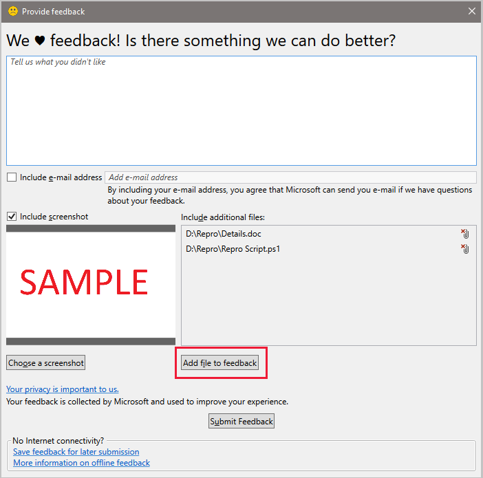

## Attach files to feedback

<!--3555011-->
You can now choose to attach log and diagnostic files when you use [Send a Frown](../../../../understand/product-feedback.md) in the Configuration Manager console to send feedback to Microsoft. This additional information can help us more quickly determine the cause of the problem. Files included with feedback are transmitted and stored using Microsoft Error Reporting (also known as Windows Error Reporting).

Microsoft uses the reported information to improve Microsoft software and services. For more information about how the information is used, see the [Privacy Statement for the Microsoft Error Reporting Service](https://privacy.microsoft.com/microsoft-error-reporting-privacy-statement) and [Additional information about privacy for Configuration Manager](../../../../plan-design/security/additional-privacy.md).

### Prerequisites

- The device running the Configuration Manager console, must be able to reach the Microsoft Error Reporting Service endpoint: `https://watson.microsoft.com/`
- [Enable Windows Error Reporting](/powershell/module/windowserrorreporting).

### To attach files to feedback

1. In the upper right corner of the console, click on the smiley face.
1. In the drop-down menu, select **Send a frown**.
1. Use the text box to explain what you didn't like.
1. Choose if you would like to share your e-mail address and a screenshot.
1. Click **Add file to feedback**, then choose a file to submit.
   - Attach up to 100 files
   - 1 GB maximum size for the upload

1. Click **Submit Feedback**

