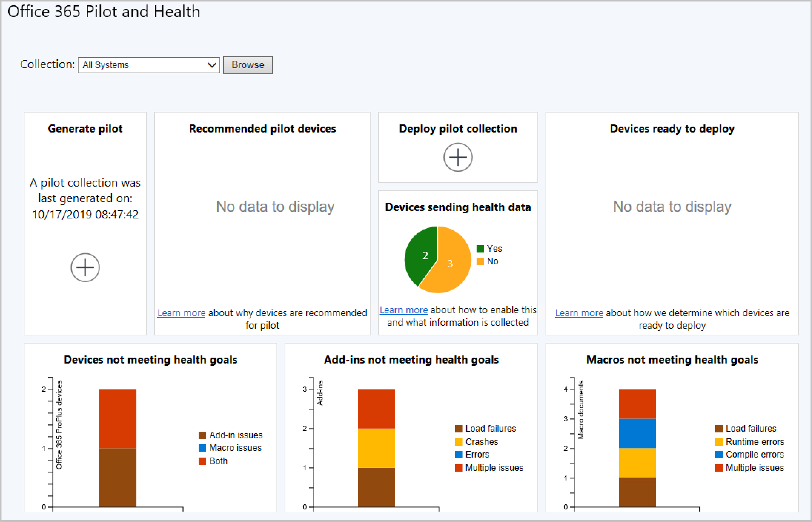

## Office 365 ProPlus Pilot and Health Dashboard
<!--4488272-->
There's a new experience to help admins create pilot collections for getting started with Microsoft 365 Apps for enterprise deployments. We know from customer feedback that many enterprises don't immediately deploy Microsoft 365 Apps for enterprise. Instead, they prefer to run a pilot on a small set of devices before completing their rollout. The **Office 365 ProPlus Pilot and Health Dashboard** provides a recommendation for pilot devices based on add-in inventory. The following tiles are in the dashboard:

- Generate pilot
- Recommended pilot devices
- Deploy pilot
- Devices sending health data
- Devices not meeting health goals
- Add-ins not meeting health goals
- Macros not meeting health goals

To access the dashboard, go to **Software Library** > **Office 365 Client Management** > **Office 365 Pilot and Health**.

### Generate pilot

Generate a pilot recommendation from a limiting collection at the click of a button. As soon as the action is launched, a background task starts calculating your pilot collection. Your limiting collection must contain at least one device with an Office version that isn't ProPlus.

### Recommended pilot devices

**Recommended pilot devices** are a minimal set of devices representing all installed add-ins across the limiting collection you used when generating the pilot. Drill down to get a list of these devices. Then use the details to exclude any devices from the pilot if needed. If all of your add-ins are already on Microsoft 365 Apps for enterprise devices, then devices with those add-ins won't be included in the calculation. This also means it's possible that you won't get any results in your pilot collection since all of your add-ins have been seen on devices where Microsoft 365 Apps for enterprise is installed.

### Deploy pilot

Once you accept your pilot devices, deploy Microsoft 365 Apps for enterprise to the pilot collection using the phased deployment wizard. Admins can define the pilot and limiting collection in the wizard to manage deployments.

### Health data

Once Microsoft 365 Apps for enterprise is installed, enable health data on your pilot devices. The health data gives you insight into which add-ins and macros don't meet health goals. The **Devices ready to deploy** chart identifies non-pilot devices that are ready for deployment by using the health insights. Get a count of devices that are sending health data from the **Devices sending health data** chart.

### Devices not meeting health goals

This tile summarizes devices that have issues with add-ins, macros, or both.

### Add-ins not meeting health goals

- Load failures: The add-in failed to start.
- Crashes: The add-in failed while it was running.
- Error: The add-in reported an error.
- Multiple issues: The add-in has more than one of the above issues.

### Macros not meeting health goals

- Load failures: The document failed to load.
- Runtime errors: An error happened while the macro was running. These errors can be dependent on the inputs so may not always occur.
- Compile errors: The macro didn't compile correctly so it won't attempt to run.
- Multiple issues: The macro has more than one of the above issues.

### Known issues
<!--5526292-->
If a standard prefix is used in naming Office files, it may be difficult to tell files apart when troubleshooting a problem, such as a macro issue. Configuration Manager obfuscates the file names, meaning files named `2019_Q3_Results.xlsm` and `2019_Q4_Results.xlsm` will both be identified as `20*.xlsm`.
