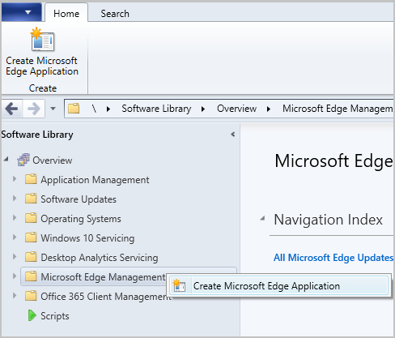
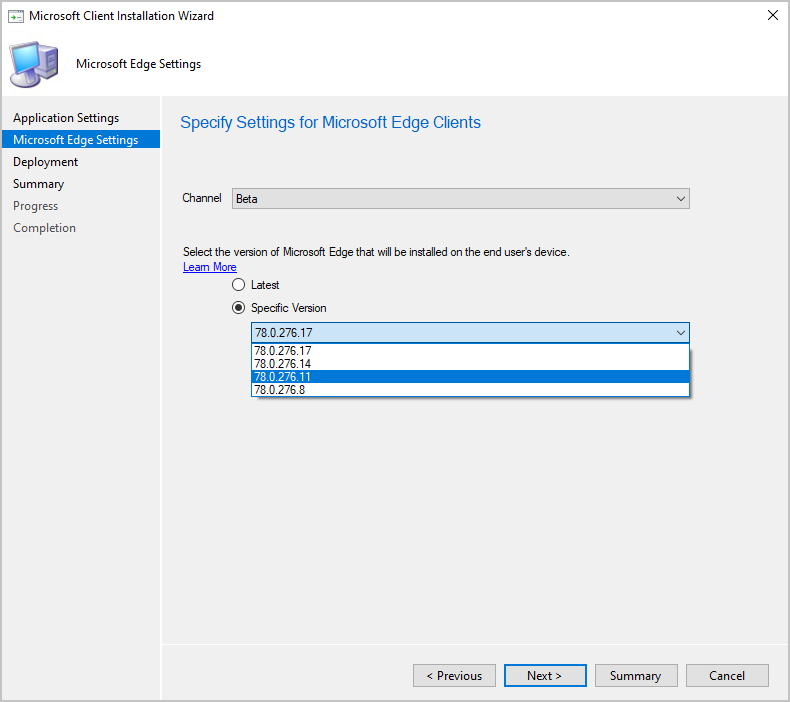
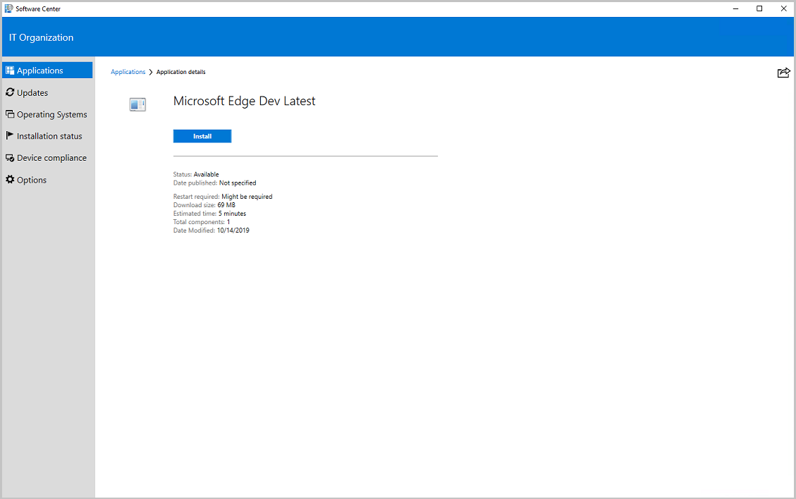

##  Deploy Microsoft Edge, version 77 and later
<!--4561024-->
The all-new Microsoft Edge is ready for business. You can now deploy [Microsoft Edge, version 77 and later](/deployedge/) to your users. Admins can pick the Beta or Dev channel, along with a version of the Microsoft Edge client to deploy. Each release incorporates learnings and improvements from our customers and community.

### Prerequisites

The device running the Configuration Manager console needs access to the following endpoints:

|Location|Use|
|---|---|
|`https://edgeupdates.azurewebsites.net/api/products?view=enterprise`|Information about releases of Microsoft Edge version 77 and later|
|`http://dl.delivery.mp.microsoft.com`|Content for Microsoft Edge releases, version 77 and later|

Clients targeted with a Microsoft Edge, version 77 and later deployment:

- PowerShell [Execution Policy](/powershell/module/microsoft.powershell.core/about/about_execution_policies) can't be set to Restricted.
  - PowerShell is executed to perform the installation.

### Log files

|Location|Log|Use|
|---|---|---|
| Site server|SMSProv.log|Shows details if the creation of the app or deployment fails.|
| [Varies](../../../../plan-design/hierarchy/log-files.md)|PatchDownloader.log| Shows details if the content download fails|
| Client|  AppEnforce.log|Shows installation information|

### Try it out!

Try to complete the tasks. Then send [Feedback](../../../../understand/product-feedback.md) with your thoughts on the feature.

Create a Microsoft Edge, version 77 and later application using the built-in application experience, which makes Microsoft Edge easier to manage:

1. In the console, under **Software Library**, there's a new node called **Microsoft Edge Management**.
1. Select **Create Microsoft Edge Application** from either the ribbon, or by right-clicking on the **Microsoft Edge Management** node.

   

1. On the **Application Settings** page of the wizard, specify a name, description, and location for the content for the app.
1. On the **Microsoft Edge Settings** page, you select a channel and version to deploy. The Learn More link takes you to the [Microsoft Edge Insiders page](https://www.microsoftedgeinsider.com/).

   

1. On the **Deployment** page, decide if you want to deploy the application. If you select **Yes**, you can specify your deployment settings for the application.
1. In **Software Center** on the client device, the user can see and install the application.

   