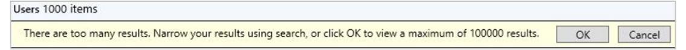

##  Improvements to console search

This release includes the following improvements to search in the Configuration Manager console based on your feedback:

- You can now use the **All Subfolders** search option from the **Driver Packages** and **Queries** nodes.<!--2841181,5424892-->

- When a search returns more than 1,000 results, now select the **OK** button on the notice bar to view more results.<!--4640570-->

    

    > [!TIP]
    > The default limit on search results is 1,000. You can change this default value. In the Configuration Manager console, go to the **Search** tab of the ribbon. In the **Options** group, select **Search Settings**. Change the **Search Results** value. A larger number of search results might take longer to display.
    >
    > By default, the upper maximum limit is 100,000. To change this limit, set the DWORD value **QueryResultCountMaximum** in the following registry key:
    >
    > `HKEY_CURRENT_USER\Software\Microsoft\ConfigMgr10\AdminUI`
    >
    > The in-console setting corresponds to the **QueryResultCountLimit** value in the same key. An administrator can configure these values in the HKLM hive for all users of the device. The HKCU value overrides the HKLM setting.
