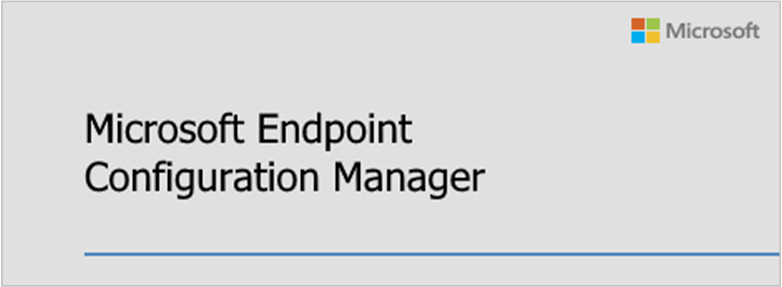

##  Microsoft Configuration Manager

<!--4960084-->

Configuration Manager is now part of the Microsoft Intune family of products.

Microsoft Intune family of products is an integrated solution for managing all of your devices. Microsoft brings together Configuration Manager and Intune, without a complex migration, and with simplified licensing. Continue to leverage your existing Configuration Manager investments, while taking advantage of the power of the Microsoft cloud at your own pace.

The following Microsoft management solutions are all now part of the **Microsoft Intune** brand:

- [Configuration Manager](/configmgr)
- [Intune](/intune)
- [Desktop Analytics](../../../../../desktop-analytics/overview.md)
- [Autopilot](/intune/enrollment/enrollment-autopilot)
- Other features in the [Device Management Admin Console](https://techcommunity.microsoft.com/t5/enterprise-mobility-security/microsoft-intune-rolls-out-an-improved-streamlined-endpoint/ba-p/937760)

For more information, see the following posts from Brad Anderson, Microsoft corporate vice president for Microsoft 365:

- [Announcement blog post](https://aka.ms/cmannounce)
- [Vision paper](https://aka.ms/MEMVisionPaper)
- [Announcement summary video](https://youtu.be/GS7oNPInFuw)