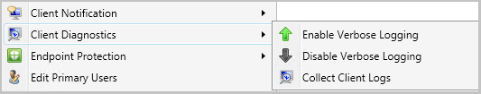

## Client Log Collection
<!--4226618-->
You can now trigger a client device to upload its client logs to the site server by sending a client notification action from the Configuration Manager console.

### Permissions for client log collection

To collect client logs, your administrative user needs:

- **Notify resource** permission on the **Collection**
  - The Full Administrator and Operations Administrator built-in roles have this permission by default. 

### Log files

- Diagnostics.log

### Try it out!

Try to complete the tasks. Then send [Feedback](../../../../understand/product-feedback.md) with your thoughts on the feature.

#### Collect client logs

1. In the **Assets and Compliance** workspace, go to either the **Devices** or **Device Collections** node. 
1. Right-click on a device, or a device collection.
1. Select **Client Diagnostics**, then select **Collect Client Logs**.

   

A client notification message is sent to the selected clients to gather the CCM logs. The logs are returned using software inventory file collection. You can also select **Collect Client Logs**  under **Client Diagnostics** from either the **Device Collections** or **Devices** node using the ribbon.

#### View client logs

1. From the **Devices** node, right-click on the device you want to view logs for.
1. Select **Start**, then **Resource Explorer**.
1. From **Resource Explorer**, click on **Diagnostic Files**.
1. In the **Diagnostic Files** list, you can see the collection date for the files. The name format of the client logs is `Support_<guid>.zip`.
1. Right-click on the zip file and select one of the following options:
    - **Open Support Center**: Launches [Support Center](../../../../support/support-center.md).
    - **Copy**: Copies the row information from Resource Explorer.
    - **View file**: Opens the folder where the zip file is located with File Explorer.
    - **Save**: Opens a Save File dialog for the selected file.
    - **Export**: Saves the Resource Explorer columns shown in **Diagnostic Files**.
    - **Refresh**: Refreshes the file list.
    - **Properties**: Returns the properties on the selected file. 

