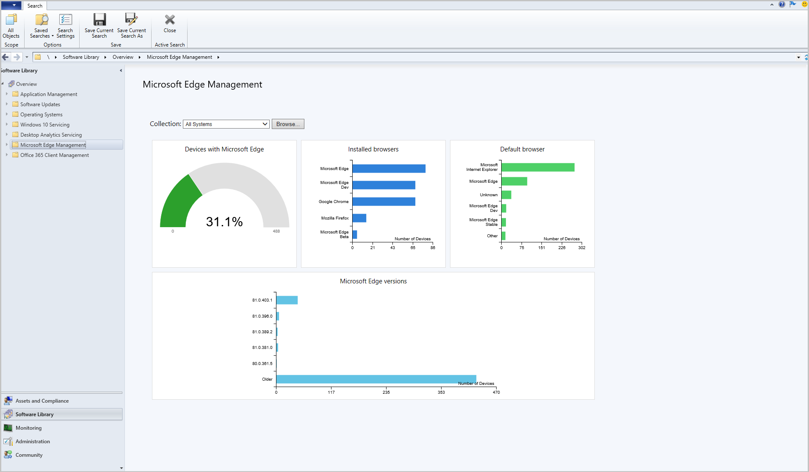

##  Improvements to Microsoft Edge Management dashboard
<!--3871913-->
We've added a graph for **Default browser** to the Microsoft Edge Management dashboard. From the **Software Library** workspace, click **Microsoft Edge Management** to see the updated dashboard. Change the collection for the graph data by clicking **Browse** and choosing another collection.

