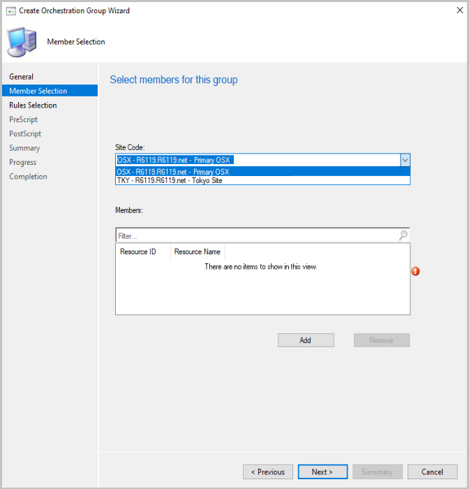

##  Improvements to Orchestration Groups
<!--3098816-->

Orchestration Groups are the evolution of the "Server Groups" feature. They were first introduced in the [technical preview for Configuration Manager, version 1909](../../../2019/technical-preview-1909.md). In this technical preview, we've added the following improvements to Orchestration Groups:

- You can now specify custom timeout values for:
  - The Orchestration Group
    - Time limit for all group members to complete update installation
   - Orchestration Group members
     - Time limit for a single device in the group to complete the update installation

- When selecting group members, you now have a drop-down list to select the site code.

   

- When selecting resources for the group, only valid clients are shown. Checks are made to verify the site code, that the client is installed, and that resources aren't duplicated.

- You can now set values for the following items in the **Create Orchestration Group Wizard**:
    - Number of machines to be updated at the same time in the **Rules Selection** page
    - Script timeout in the **PreScript** page
    - Script timeout in the **PostScript** page

