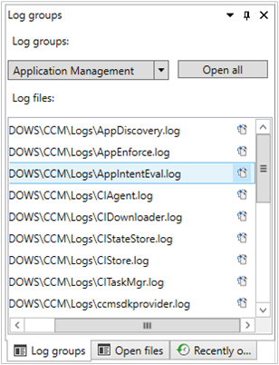

## <a name="bkmk_onetrace"></a> OneTrace log groups

<!--5559993-->

[OneTrace](../../../../support/support-center-onetrace.md) now supports customizable log groups, similar to the feature in Support Center. Log groups allow you to open all log files for a single scenario. OneTrace currently includes groups for the following scenarios:

- Application management
- Compliance settings (also referred to as Desired Configuration Management)
- Software updates



### Customize OneTrace log groups

You can customize these groups by modifying the configuration XML, which by default is in the following path: `C:\Program Files (x86)\Configuration Manager Support Center\LogGroups.xml`.

The following example is one portion of the default configuration file:

``` XML
<LogGroups>
  <LogGroup Name="Desired Configuration Management" GroupType="1" GroupFilePath="">
    <LogFile>CIAgent.log</LogFile>
    <LogFile>CIDownloader.log</LogFile>
    <LogFile>CIStateStore.log</LogFile>
    <LogFile>CIStore.log</LogFile>
    <LogFile>CITaskMgr.log</LogFile>
    <LogFile>ccmsdkprovider.log</LogFile>
    <LogFile>DCMAgent.log</LogFile>
    <LogFile>DCMReporting.log</LogFile>
    <LogFile>DcmWmiProvider.log</LogFile>
  </LogGroup>
</LogGroups>
```

The `GroupType` property accepts the following values:

- `0`: Unknown or other
- `1`: Configuration Manager client logs
- `2`: Configuration Manager server logs

The `GroupFilePath` property can include an explicit path for the log files. If it's blank, OneTrace relies upon the registry configuration for the group type. For example, if you set `GroupType=1`, by default OneTrace will automatically look in `C:\Windows\CCM\Logs` for the logs in the group. In this example, you don't need to specify `GroupFilePath`.
