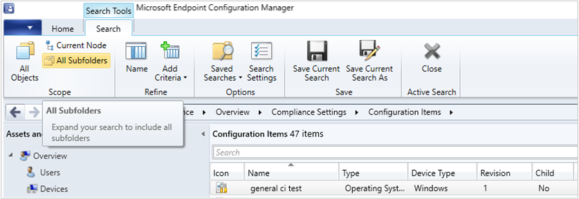

##  Search all subfolders for configuration items and configuration baselines

<!--5891241-->

Similar to improvements in previous releases, you can now use the **All Subfolders** search option from the **Configuration Items** and **Configuration Baselines** nodes.

