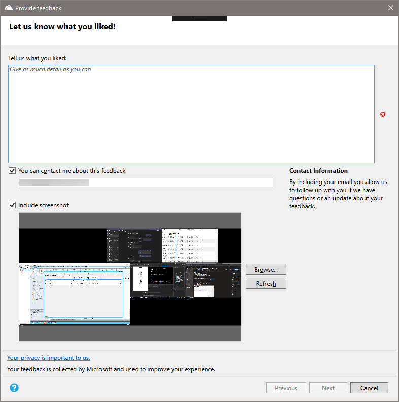
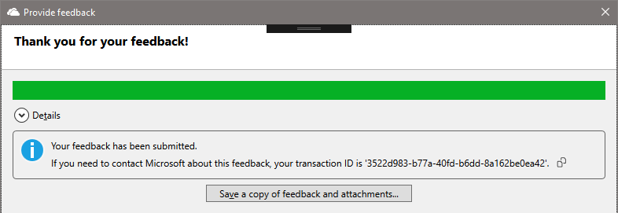
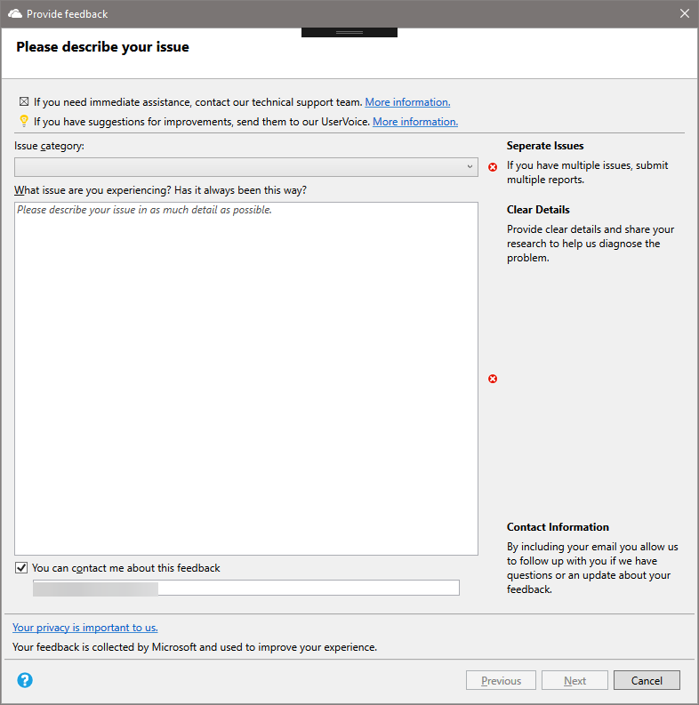
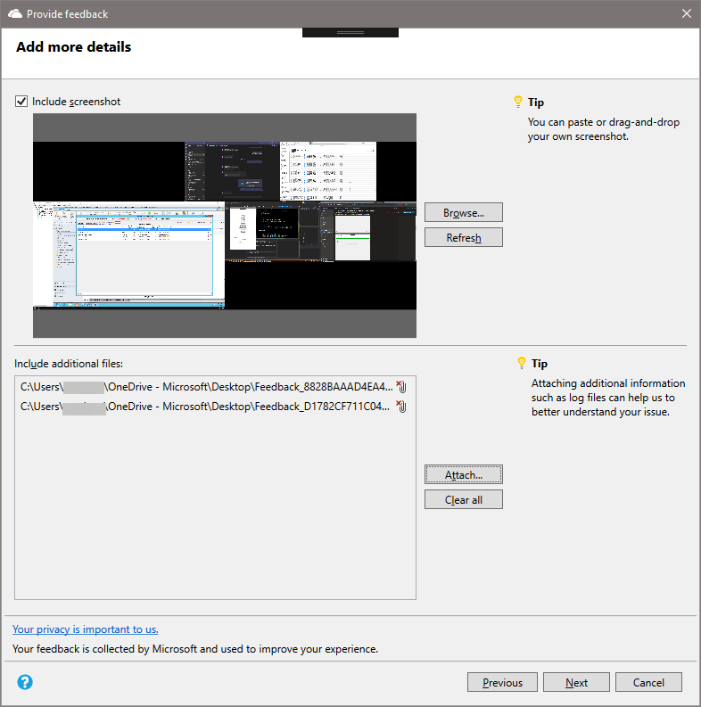

##  New feedback wizard

<!--3180826-->

The Configuration Manager console now has a new wizard for sending feedback. The redesigned wizard improves the workflow with better guidance about how to submit good feedback. It includes the following changes:

- It requires a description of the feedback
- Select from a list of issue categories
- It includes tips for how to write useful feedback
- It adds a new page to attach files
- The summary page displays your transaction ID, which also includes any error messages with suggestions to resolve them.

> [!NOTE]
> This new wizard is only in the Configuration Manager console. [Support Center](../../../../support/support-center.md) has a similar feedback experience, which doesn't change in this release.

### Prerequisites

- Update the Configuration Manager console to the latest version

- On the computer where you run the console, allow it to access the following internet endpoints to send diagnostic data to Microsoft:

  - `https://*.events.data.microsoft.com/`
  - `https://*.blob.core.windows.net/`

### How to send a smile

To send feedback on something that you like about Configuration Manager:

1. In the upper-right corner of the Configuration Manager console, select the smiley face icon. Choose **Send a smile**.

1. On the first page of the **Provide feedback** wizard:

    - **Tell us what you liked**: Enter a detailed description of why you're filing this feedback.

    - **You can contact me about this feedback**: To allow Microsoft to contact you about this feedback if necessary, select this option and specify a valid email address.

    - **Include screenshot**: Select this option to add a screenshot. By default it uses the full screen, select **Refresh** to capture the latest image. Select **Browse** to select a different image file.

    

1. Select **Next** to send the feedback. You may see a progress bar as it packages the content to send.

1. When the progress is complete, select **Details** to see the transaction ID or any errors that occurred.

    

### How to send a frown

Before you file a frown, prepare your information:

- If you have multiple issues, send a separate report for each issue. Don't include multiple issues in a single report.

- Provide clear details on the issue. Share any research that you've gathered so far. More detailed information is better to help Microsoft investigate and diagnose the issue.

- Do you need immediate assistance? If so, contact Microsoft support for urgent issues. For more information, see [Support options and community resources](../../../../understand/find-help.md#support-options-and-community-resources).

- Is this feedback a suggestion to improve the product? If so, share a new idea. For more information, see [Send a suggestion](../../../../understand/product-feedback.md#send-a-suggestion).

- Is the issue with the product documentation? You can file feedback directly on the documentation. For more information, see [Doc feedback](../../../../../../use-docs.md#about-feedback).

To send feedback on something that you didn't like about the Configuration Manager product:

1. In the upper-right corner of the Configuration Manager console, select the smiley face icon. Choose **Send a frown**.

1. On the first page of the **Provide feedback** wizard:

    - **Issue category**: Select a category that's most appropriate for your issue.

    - Describe your issue with as much detail as possible.

    - **You can contact me about this feedback**: To allow Microsoft to contact you about this feedback if necessary, select this option and specify a valid email address.

    

1. On the **Add more details** page of the wizard:

    - **Include screenshot**: Select this option to add a screenshot. By default it uses the full screen, select **Refresh** to capture the latest image. Select **Browse** to select a different image file.

    - **Include additional files**: Select **Attach** and add log files, which can help Microsoft better understand the issue. To remove all attached files from your feedback, select **Clear all**. To remove individual files, select the delete icon to the right of the file name.

    

1. Select **Next** to send the feedback. You may see a progress bar as it packages the content to send.

1. When the progress is complete, select **Details** to see the transaction ID or any errors that occurred.

If you don't have internet connectivity:

- The **Provide feedback** wizard still packages your feedback and files.

- The final summary page shows an error that it couldn't send the feedback.

- Select the option to **Save a copy of feedback and attachments**. For more information on how to send it to Microsoft, see [Send feedback that you saved for later submission](../../../../understand/product-feedback.md#send-feedback-that-you-saved-for-later-submission).

If the **Provide feedback** wizard successfully submits your feedback, but fails to send the attached files, use the same instructions for no internet connectivity.
