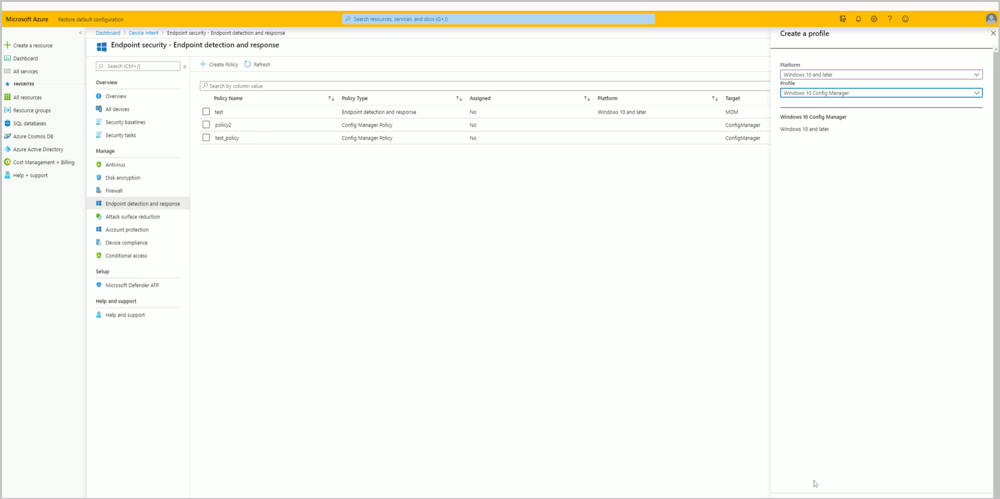
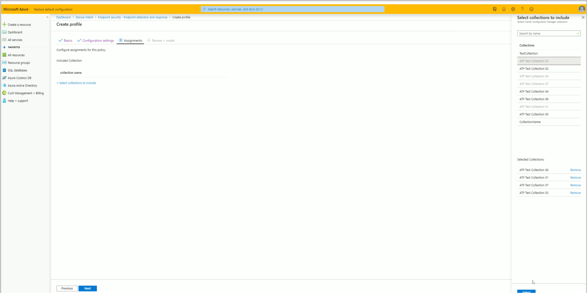

##  Onboard Configuration Manager clients to Microsoft Defender for Endpoint via the Microsoft Intune admin center
<!--5691658-->
You can now deploy Microsoft Defender ATP Endpoint Detection and Response (EDR) onboarding policies to Configuration Manager managed clients. These clients don't require Microsoft Entra ID or MDM enrollment, and the policy is targeted at ConfigMgr collections rather than Microsoft Entra groups.

This capability allows customers to manage both Intune MDM and Configuration Manager client EDR/ATP onboarding from a single management experience - the Microsoft Intune admin center.

### Prerequisites

- Access to the [Microsoft Intune admin center](https://go.microsoft.com/fwlink/?linkid=2109431).
- An E5 license for [Microsoft Defender for Endpoint](/windows/security/threat-protection/microsoft-defender-atp/minimum-requirements#licensing-requirements).
- A [Microsoft Intune tenant attached](/configmgr/core/get-started/2020/technical-preview-2002-2#bkmk_attach) hierarchy.

### Try it out!

Try to complete the tasks. Then send [Feedback](../../technical-preview-2003.md#bkmk_feedback) with your thoughts on the feature.

### Make Configuration Manager collections available to assign Microsoft Defender for Endpoint policies

1. From a Configuration Manger console connected to your top-level site, right-click on a device collection and select **Properties**.
1. On the **Cloud Sync** tab, enable the option to **Make this collection available to assign Microsoft Defender ATP policies in Intune**.
   - The option is disabled if your hierarchy isn't tenant attached.

### Create Microsoft Defender for Endpoint policy for Configuration Manager collections

1. Open a web browser and go to `https://aka.ms/ATPTenantAttachPreview`.
1. Select **Endpoint detection and response** then select **Create Policy**.
1. Use the following settings for the profile, then click **Create** when done:
   - **Platform**: Windows 10 and later
   - **Profile**: *Windows 10 Config Manager

   
1. Supply a **Name** and **Description** then click **Next**.
1. Choose your **Configuration settings** then click **Next**.
1. Under **Assignments**, click **Select collections to include**. You'll see a list of your available Configuration Manager collections. Select your collections and click **Next** when done.
   
1. Click **Create** once you have finished reviewing your settings under **Review + create**.
