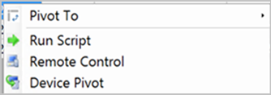

##  Improvements to CMPivot
<!--6518631-->
Configuration Manager has had the ability to run CMPivot feature from a device collection and do real-time querying on devices. We've now added the ability to run CMPivot from an individual device. This change makes it easier for people such as help desk technicians to create CMPivot queries for an individual device.  

### Try it out!

Try to complete the tasks. Then send [Feedback](../../technical-preview-2003.md#bkmk_feedback) with your thoughts on the feature.

You can start CMPivot for an individual device in two ways. The device name is at the top of the CMPivot window so you can differentiate it from others. To start CMPivot for a device:

1. Select an individual device in a device collection and click **Start CMPivot**. There's no need to select the entire device collection.
1. Within an existing CMPivot operation, right-click a device in the device output and pivot using the **Device Pivot** option.
   - This action launches a separate CMPivot instance on that individually selected device.

   
