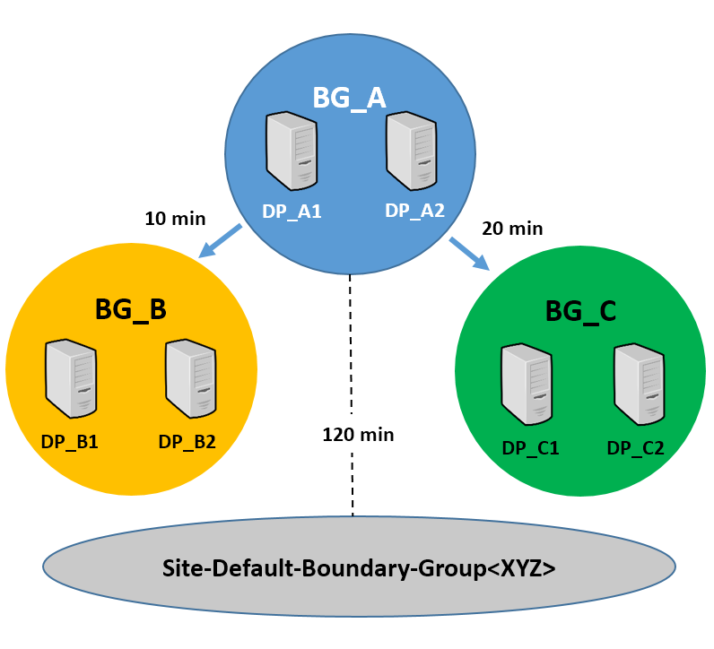
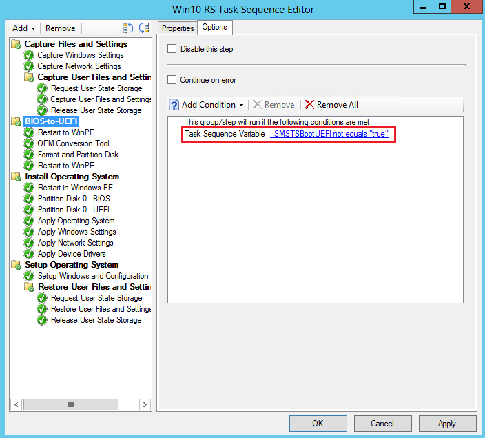

# Capabilities in Technical Preview 1609 for Configuration Manager

*Applies to: Configuration Manager (technical preview branch)*

This article introduces the features that are available in the Technical Preview for Configuration Manager, version 1609. You can install this version to update and add new capabilities to your Configuration Manager technical preview site.      Before installing this version of the technical preview, review the introductory topic, [Technical Preview for Configuration Manager](../../core/get-started/technical-preview.md), to become familiar with general requirements and limitations for using a technical preview, how to update between versions, and how to provide feedback about the features in a technical preview.    

**Known Issues in this Technical Preview:**  
*  When you update to the Configuration Manager 1609 Technical Preview, any edition upgrade policies you have deployed will be deleted. To continue to use these policies, you must recreate and deploy them.

**The following are new features you can try out with this version.**  

## Improvements to Endpoint Protection
Improvement to Endpoint Protection antimalware policy settings - You can now specify the level at which the Endpoint Protection Cloud Protection Service will block suspicious files. A new setting enables administrators to specify "risky" computers based on the high amounts of malware they encounter.

## Increased number of enrolled devices
Administrators can now enable users to enroll up to 15 devices in hybrid mobile device management with Intune. The limit was 5 devices per user previously.

## Additional Apple DEP settings

Administrators can now configure the following Apple Device Enrollment Program (DEP) settings in the DEP profile for iOS and Mac devices:
- **Touch ID**
- **Zoom**
- **Siri**

If enabled, Apple's Setup Assistant prompts for this service during device activation.

## Integration with Upgrade Analytics

Upgrade analytics enables you to assess and analyze device readiness and compatibility with Windows 10, to allow easier and smoother upgrades. With the integration of Upgrade Analytics with Configuration Manager, you can access the upgrade compatibility data in the Configuration Manager admin console, and then, from the device list, target devices for upgrade or remediation.

## Native Connection Types for Windows 10 VPN Hybrid Profiles

When using Configuration Manager with Intune, you can now create Windows 10 VPN profiles with Microsoft Automatic, IKEv2, PPTP, and L2TP connection types in the Configuration Manager console without using OMA-URI.

## Enhancements to Windows Store for Business integration with Configuration Manager

In this release, we've updated [Windows Store for Business integration](../../apps/deploy-use/manage-apps-from-the-windows-store-for-business.md) with these new features:

**Update:** In the current technical preview release, the immediate synchronization feature is not functional.

- Previously, you could only deploy free apps from the Windows Store for Business. Configuration Manager now additionally supports deploying paid online licensed apps (for Intune enrolled devices only).
- You can now initiate an immediate synchronization between the Windows Store for Business and Configuration Manager.
- You can now modify the client secret key that you obtained from Azure Active Directory

### Try it out!

#### Purchase and sync a paid online licensed app

1. Purchase a paid online licensed app from the Windows Store for Business.
2. In the **Administration** workspace of the Configuration Manager console, click **Cloud Services** > **Updates and Servicing** > **Windows Store for Business**.
3. On the **Home** tab, in the **Sync** group, click **Sync Now**.
4. Soon afterwards, the app you purchased will appear in the **License Information for Store Apps** node of the **Application Management** workspace.

#### Create and deploy a Configuration Manager application from the synchronized app data

The procedure to create and deploy a Configuration Manager application from a paid store app is the same as for creating an application from a free app. See the section **Create and deploy a Configuration Manager application from a Windows Store for Business app** in [Manage apps from the Windows Store for Business with Configuration Manager](../../apps/deploy-use/manage-apps-from-the-windows-store-for-business.md).

#### Modify the client secret key from Azure Active Directory

1. In the **Administration** workspace of the Configuration Manager console, click **Cloud Services** > **Updates and Servicing** > **Windows Store for Business**.
2. Select your Windows Store for Business account, and then click **Properties**.
3. In the **Windows Store for Business Account Properties** dialog box, enter a new key in the **Client secret key** field, and then click **Verify**. Once verified, click **Apply**, then close the dialog box.

## New compliance settings for configuration items

We've added many new settings you can use in your configuration items for various device platforms.
These are settings that previously existed in Microsoft Intune in a standalone configuration, and are now available when you use Intune with Configuration Manager.
If you need help with any of these settings, open [Manage settings and features on your devices with Microsoft Intune policies](../../../intune/configuration/device-profiles.md) and then select the settings subtopic for the platform you want.

### New settings for Android devices

#### Password settings

- **Remember password history**
- **Allow fingerprint unlock**

#### Security settings

- **Require encryption on storage cards**
- **Allow screen capture**
- **Allow diagnostic data submission**

#### Browser settings

- **Allow web browser**
- **Allow autofill**
- **Allow pop-up blocker**
- **Allow cookies**
- **Allow active scripting**

#### App settings

- **Allow Google Play store**

#### Device capability settings

- **Allow removable storage**
- **Allow Wi-Fi tethering**
- **Allow geolocation**
- **Allow NFC**
- **Allow Bluetooth**
- **Allow voice roaming**
- **Allow data roaming**
- **Allow SMS/MMS messaging**
- **Allow voice assistant**
- **Allow voice dialing**
- **Allow copy and paste**

### New settings for iOS devices

#### Password settings

- **Number of complex characters required in password**
- **Allow simple passwords**
- **Minutes of inactivity before password is required**
- **Remember password history**

### New settings for macOS X devices

#### Password settings

- **Number of complex characters required in password**
- **Allow simple passwords**
- **Remember password history**
- **Minutes of inactivity before screensaver activates**

### New settings for Windows 10 Desktop and Mobile devices

#### Password settings

- **Minimum number of character sets**
- **Remember password history**
- **Require a password when the device returns from an idle state**

#### Security settings

- **Require encryption on mobile device**
- **Allow manual unenrollment**

#### Device capability settings

- **Allow VPN over cellular**
- **Allow VPN roaming over cellular**
- **Allow phone reset**
- **Allow USB connection**
- **Allow Cortana**
- **Allow action center notifications**

### New settings for Windows 10 Team devices

#### Device settings

- **Enable Azure Operational Insights**
- **Enable Miracast wireless projection**
- **Choose the meeting information displayed on the welcome screen**
- **Lockscreen background image URL**

### New settings for Windows 8.1 devices

#### Applicability settings

- **Apply all configurations to Windows 10**

#### Password settings

- **Required password type**
- **Minimum number of character sets**
- **Minimum password length**
- **Number of repeated sign-in failures to allow before the device is wiped**
- **Minutes of inactivity before screen turns off**
- **Password expiration (days)**
- **Remember password history**
- **Prevent reuse of previous passwords**
- **Allow picture password and PIN**

#### Browser settings

- **Allow automatic detection of intranet network**

### New settings for Windows Phone 8.1 devices

#### Applicability settings

- **Apply all configurations to Windows 10**

#### Password settings

- **Minimum number of character sets**
- **Allow simple passwords**
- **Remember password history**

#### Device capability settings

- **Allow automatic connection to free Wi-Fi hotspots**

## Improvements for boundary groups
This preview introduces important changes to boundary groups and how they work with distribution points. These changes will help simplify the design of your content infrastructure while giving you more control over how and when clients fallback to search additional distribution points as content source locations. This includes both on-premises and cloud-based distribution points.

These improvements replace concepts and behaviors you might be familiar with today (like configuring distribution points to be fast or slow) and replaces them with a new model that should be easier to setup and maintain. These changes are also groundwork for future changes that will improve other site system roles you associate to boundary groups.  

During upgrade to 1609, the upgrade converts your current boundary group configurations to fit the new model so that these changes do not disturb your content distribution configurations (see [Update existing boundary groups to the new model](capabilities-in-technical-preview-1609.md#bkmk_update)).

The following sections detail the changes introduced with this preview, how the new model works, and what you can expect when upgrading a site that already has boundary groups configured.

### Changes in UI and behavior for boundary groups and content locations
The following are key changes to boundary groups and how clients find content. Many of these changes and concepts work together.
- **Configurations for Fast or Slow are removed:** You no longer configure individual distribution points to be fast or slow.  Instead, each site system associated with a boundary group is treated the same. Because of this change, the **References** tab of the boundary group properties no longer supports the configuration of Fast or Slow.
- **New default boundary group at each site:**  Each primary site has a new default boundary group named ***Default-Site-Boundary-Group\<sitecode>***.  When a client is not on a network location that is assigned to a boundary group, that client will use the site systems associated with the default group from its assigned site. Plan to use this boundary group as a replacement to the concept of fallback content location.    
  -  **'Allow fallback source locations for content'** is removed: You no longer explicitly configure a distribution point to be used for fallback, and the options to set this are removed from the UI.

  Additionally, the result of setting **Allow clients to use a fallback source location for content** on a deployment type for applications has changed. This setting on a deployment type now enables a client to use the default site boundary group as a content source location.

  -  **Boundary groups relationships:** Each boundary group can be linked to one or more additional boundary groups. These links form relationships that are configured on the new boundary group properties tab named **Relationships**:
  -   Each boundary group that a client is directly associated with is called a **current** boundary group.  
  -   Any boundary group a client can use due to an association between that client's *current* boundary group and another group is called a **neighbor** boundary group.
  -  It is on the **Relationships** tab that you add boundary groups that can be used as a *neighbor* boundary group. You can also configure a time in minutes that determines when a client that fails to find content from a distribution point in the *current* group will begin to search content locations from those *neighbor* boundary groups.

      When you add or change a boundary group configuration, you will have the option to block fallback to that specific boundary group from the current group you are configuring.

  To use the new configuration, you define explicit associations (links) from one boundary group to another, and configure all distribution points in that associated group with the same time in minutes. The time you configure determines when a client that fails to find a content source from its *current* boundary group can begin to search for content sources from that neighbor boundary group.

  In addition to boundary groups you explicitly configure, each boundary group has an implied link to the default site boundary group. This link becomes active after 120 minutes at which time the default site boundary group becomes a neighbor boundary group which allows the clients to use the distribution points associated with that boundary group as content source locations.

  This behavior replaces what was previously referred to as fallback for content.  You can override this default behavior of 120 minutes by explicitly associating the default site boundary group to a *current* group, and setting a specific time in minutes, or blocking fallback entirely to prevent its use.

- **Clients attempt to get content from each distribution point for up to 2 minutes:** When a client searches for a content source location, it attempts to access each distribution point for 2 minutes before then trying another distribution point. This is a change from previous versions where clients attempted to connect to a distribution point for up to 2 hours.

  - The first distribution point that a client attempts to use is randomly selected from the pool of available distribution points in the client's *current* boundary group (or groups).

  - After two minutes, if the client has not found the content, it switches to a new distribution point and attempts to get content from that server. This process repeats every two minutes until the client finds the content or reaches the last server in its pool.

  - If a client cannot find a valid content source location from its *current* pool before the period for fallback to a *neighbor* boundary group is reached, the client then adds the distribution points from that *neighbor* group to the end of its current list, and will then search the expanded group of source locations that includes the distribution points from both boundary groups.

      > [!TIP]  
      > When you create an explicit link from the current boundary group to the default site boundary group and define a fallback time that is less than the fallback time for a link to a neighbor boundary group, clients will begin searching source locations from the default site boundary group before including the neighbor group.

  - When the client fails to get content from the last server in the pool, it begins the process again.

### How the new model works
When you configure boundary groups, you associate  boundaries (network locations) and site system roles, like distribution points, to the boundary group. This helps link clients to site system servers like distribution points that are located near the clients on the network.   
- You can assign the same boundary to multiple boundary groups
- Site system servers, like distribution points, can be associated to multiple boundary groups, making them available to a wider range of network locations
- If a distribution point is not associated to a boundary group, clients will not be able to use that distribution point as a content source location.

Beginning with this technical preview, you define boundary group relationships to configure fallback behavior for content source locations. This new behavior is configured on the new **Relationships** tab of the boundary group properties and replaces configuring site systems to be slow or fast, and configuring a boundary group to allow fallback source location for content.

On the Relationships tab you add other boundary groups to configure a relationship to those groups. Each relationship is a one-way link from the **current** boundary group to the boundary group you add, which is called a **neighbor**. For each link you create, you can configure distribution points with a   fallback time in minutes. This time is used to determine after how long clients in the *current* boundary group can begin using distribution points in the *neighbor* boundary group if they are unable to find a valid content source location from their current boundary group.

When a client can't find content and begins to search locations from neighbor boundary groups, it increases the pool of available distribution points for that client in a controlled manner.  

- A boundary group can have more than one Relationship. This lets you configure fallback to different neighbors to occur after different periods of time.
- Clients will only fallback to a boundary group that is a direct neighbor of their current boundary group.
- When a client is a member of multiple boundary groups, the current boundary group is defined as a union of all that client's boundary groups.  That client can then fallback to a neighbor of any of those original boundary groups.

In addition to the links you define, there is an implied link that is created automatically between the boundary groups you create and the default boundary group that is automatically created for each site. This automatic link:
- Is used by clients that are not on a boundary associated with any boundary group in your hierarchy automatically use the default boundary group from their assigned site to identify valid content source locations.   
-  Is a default fallback option from the current boundary group to the sites default boundary group that is used after 120 minutes.

**Example of using the new model:** 
You create three boundary groups that do not share boundaries or site system servers:
- Group BG_A with distribution points DP_A1 and DP_A2 associated to the group
- Group BG_B with distribution points DP_B1 and DP_B2 associated to the group
- Group BG_C with distribution points DP_C1 and DP_C2 associated to the group

You add the network locations of your clients as boundaries to only the BG_A boundary group, and you then configure relationships from that boundary group to the other two boundary groups:
- You configure distribution points for the first *neighbor* group (BG_B) to be used after 10 minutes. This group contains distribution points DP_B1 and DP_B2. Both are well connected to the first groups boundary locations.
- You configure the second *neighbor* group (BG_C) to be used after 20 minutes. This group contains distribution points DP_C1 and DP_C2. Both are across a WAN from the other two boundary groups.
- You also add an additional distribution point that is located on the site server to the sites default site boundary group. This is your least preferred content source location, but it is centrally located to all your boundary groups.

  Example of boundary groups and fallback times:

  

With this configuration:
- The client begins searching for content from distribution points in its *current* boundary group (BG_A), searching each distribution point for two minutes before switching to the next distribution point in the boundary group. The clients pool of valid content source locations includes DP_A1 and DP_A2.
- If the client fails to find content from its *current* boundary group after searching for 10 minutes, it then adds the distribution points from the BG_B boundary group to its search. It then continues to search for content from a distribution point in its combined pool of distribution points that now includes those from both the BG_A and BG_B boundary groups. The client continues to contact each distribution point for two minutes before switching to the next distribution point from its pool. The clients pool of valid content source locations includes DP_A1, DP_A2, DP_B1, and DP_B2.
- After an additional 10 minutes (20 minutes total) if the client still has not found a distribution point with content, it expands its pool of available distribution points to include those from the second *neighbor* group, boundary group BG_C. The client now has 6 distribution points to search (DP_A1, DP_A2, DP_B2, DP_B2, DP_C1, and DP_C2) and continues changing to a new distribution point every two minutes until content is found.
- If the client has not found content after a total of 120 minutes, it falls back to include the *default site boundary group* as part of its continued search. Now the pool of distribution points includes all the distribution points from the three configured boundary groups and the final distribution point located on the site server computer.  The client then continues its search for content, changing distribution points every two minutes until content is found.

By configuring the different neighbor groups to be available at different times you control when specific distribution points are added as a content source location, and when, or if, the client uses fallback to the default site boundary group as a safety net for content that is not available from any other location.

### Update existing boundary groups to the new model
When you install version 1609 and update your site, the following configurations are automatically made. These are intended to ensure your current fallback behavior remains available, until you configure new boundary groups and relationships.  
- Unprotected distribution points at a site are added to the *Default-Site-Boundary-Group\<sitecode>* boundary group of that site.
- A copy is made of each existing boundary group that includes a site server configured with a slow connection. The name of the new group is ***\<original boundary group name>-Slow-Tmp***:  
  -   Site systems that have a fast connection are left in the original boundary group.
  -   A copy of site systems that have a slow connection are added to the copy of the boundary group. The original site systems configured as slow remain in the original boundary group for backward compatibility, but are not used from that boundary group.
  -   This boundary group copy does not have boundaries associated with it. However, A fallback link is created between the original group and the new boundary group copy that has the fallback time set to zero.

  The following table identifies the new fallback behavior you can expect from the combination the original deployment settings and distribution point configurations:

Original deployment configuration for "Do not run program" in slow network  |Original distribution point configuration for "Allow client to use a fallback source location for content"  |New fallback behavior  
---------|---------|---------
Selected     |  Selected    |  **No fallback** - Only use the distribution points in current boundary group       
Selected     |  Not selected|  **No fallback** - Only use the distribution points in current boundary group       
Not selected |  Not selected|  **Fallback to neighbor** - Use the distribution points in current boundary group, and then add the distribution points from the neighbor boundary group. Unless an explicit link to the default site boundary group is configured, clients will not fallback to that group.    
Not selected | Selected |   **Normal fallback** - Use distribution points in current boundary group, then those from the neighbor and site default boundary groups

 All other deployment configurations result in **Normal fallback**.  

## Office 365 Client Management dashboard  
The Configuration Manager 1609 Technical Preview introduces a new dashboard. To view the dashboard, in the Configuration Manager console go to **Software Library** > **Overview** > **Office 365 Client Management**.
>[!NOTE]
>In the **What's New** workspace in the Configuration Manager console, the new dashboard is incorrectly named **Office 365 Servicing dashboard**.

The dashboard displays charts for the following:

- Number of Office 365 clients
- Office 365 client versions
- Office 365 client languages
- Office 365 client channels     
For more information, see [Overview of update channels for Microsoft 365 Apps](/deployoffice/overview-update-channels).
- Automatic deployment rules that have Office 365 Client selected in the set of available products.

You can take the following actions on the dashboard:
- At the top of the dashboard, use the **Collection** drop-down setting to filter the dashboard data by members of a specific collection.
- On the upper-right side of the dashboard, click **Office 365 Installer** to start the Office 365 Client Installation Wizard to deploy Microsoft 365 apps to clients. For details, see [Deploy Microsoft 365 apps to clients](#deploy-microsoft-365-apps-to-clients).
- On the middle-right side of the dashboard, click **Create an ADR** to open the Automatic Deployment Rule Wizard to create a new automatic deployment rule (ADR). To create an ADR for Microsoft 365 apps, select **Office 365 Client** when you choose the product. For more information, see [Automatically deploy software updates](../../sum/deploy-use/automatically-deploy-software-updates.md).
- On the lower-right side of the dashboard, click **Create Client Agent Settings** to open Client Agent settings. For more information, see [About client settings](../clients/deploy/about-client-settings.md).

For more information about Microsoft 365 Apps for enterprise updates, see [Manage Microsoft 365 Apps updates with Configuration Manager](../../sum/deploy-use/manage-office-365-proplus-updates.md).

## Deploy Microsoft 365 apps to clients
In this release, from the Office 365 Client Management dashboard, you can start the Office 365 Installer that lets you configure Microsoft 365 installation settings, download files from Office Content Delivery Networks (CDNs), and deploy the files as an application in Configuration Manager.

### Limitations of Microsoft 365 deployment
- You might have issues when you try to import existing client settings (XML) in the Office 365 App Install wizard. You can manually configure the client settings without an issue.

#### To deploy Microsoft 365 apps to clients
1. In the Configuration Manager console, navigate to **Software Library** > **Overview** > **Office 365 Client Management**.
2. Click **Office 365 Installer** in the upper-right pane. The Office 365 Client Installation Wizard opens.
3. On the **Application Settings** page, provide a name and description for the app, enter the download location for the files, and then click **Next**. Note that the location must be specified in the form &#92;&#92;*server*&#92;*share*.
4. On the **Import Client Settings** page, choose whether to import the Microsoft 365 client settings from an existing XML configuration file or to manually specify the settings, and then click **Next**.
When you have an existing configuration file, enter the location for the file and skip to step 7. Note that the location must be specified in the form &#92;&#92;*server*&#92;*share*&#92;*filename*.XML.

    > [!IMPORTANT]
    >You might have issues when you try to import existing client settings (XML) in this technical preview.

5. On the **Client Products** page, select the Microsoft 365 suite that you use, select the applications that you want to include, select any additional Office products that should be included, and then click **Next**.
6. On the **Client Settings** page, choose the settings to include, and then click **Next**.
7. On the **Deployment** page, choose whether to deploy the application, and then click **Next**.
If you choose not to deploy the package in the wizard, skip to step 9.
8. Configure the remainder of the wizard pages as you would for a typical application deployment. For more information, see [Create and deploy an application](../../apps/get-started/create-and-deploy-an-application.md).
9. Complete the wizard.
10. You can deploy or edit the application just as you would with any other application in Configuration Manager from **Software Library** > **Overview** > **Application Management** > **Applications**.

>[!NOTE]
>After you deploy Microsoft 365 apps, you can create automatic deployment rules to maintain the apps. To create an ADR for Microsoft 365 apps, click **Create an ADR**, and select **Office 365 Client** when you choose the product. For more information, see [Automatically deploy software updates](../../sum/deploy-use/automatically-deploy-software-updates.md).

## Improvements for BIOS to UEFI conversion
You can now customize an operating system deployment task sequence with a new variable, TSUEFIDrive, so that the Restart Computer step will prepare a FAT32 partition on the hard drive for transition to UEFI. The following procedure provides an example of how you can create task sequence steps to prepare the hard drive for the BIOS to UEFI conversion.

#### To prepare the FAT32 partition for the conversion to UEFI:
In an existing task sequence to install an operating system, you will add a new group with steps to do the BIOS to UEFI conversion.

1. Create a new task sequence group after the steps to capture files and settings, and before the steps to install the operating system. For example, create a group after the **Capture Files and Settings** group named **BIOS-to-UEFI**.
2. On the **Options** tab of the new group, add a new task sequence variable as a condition where **_SMSTSBootUEFI** is **not equal** to **true**. This prevents the steps in the group from running when a computer is already in UEFI mode.

3. Under the new group, add the **Restart Computer** task sequence step. In **Specify what to run after restart**, select **The boot image assigned to this task sequence is selected** to start the computer in Windows PE.  
4. On the **Options** tab, add a task sequence variable as a condition where **_SMSTSInWinPE equals false**. This prevents this step from running if the computer is already in Windows PE.

    
5. Add a step to start the OEM tool that will convert the firmware from BIOS to UEFI. This will typically be a **Run Command Line** task sequence step with a command line to start the OEM tool.
5. Add the Format and Partition Disk task sequence step that will partition and format the hard drive. In the step, do the following:
    1. Create the FAT32 partition that will be converted to UEFI before the operating system is installed. Choose **GPT** for **Disk type**.
    
    2. Go to the properties for the FAT32 partition. Enter **TSUEFIDrive** in the **Variable** field. When the task sequence detects this variable, it will prepare for the UEFI transition before restarting the computer.
    
    3. Create an NTFS partition that the task sequence engine uses to save its state and to store log files.
6. Add the **Restart Computer** task sequence step. In **Specify what to run after restart**, select **The boot image assigned to this task sequence is selected** to start the computer in Windows PE.  

## Intune compliance charts
In this release, you can get a quick view of overall compliance for devices and the top reasons for non-compliance by using new charts under **Monitoring workspace** in the Configuration Manager console.

#### To view the Intune compliance charts
1. In the Configuration Manager console, go to **Monitoring** > **Overview** > **Compliance Settings**.
2. The **Overall Device Compliance** chart is displayed.
3. Click the **Compliance Policies** node to view the **Overall Device Compliance** and **Top Non-Compliance Reasons** charts.

### Limitations of Intune compliance charts in TP 1609
- The drill-down for the **Overall Device Compliance** chart currently produces an error.
- The **Top Non-compliance Reasons** chart lists the policy name and not the individual non-compliance reasons. You can click the policy to drill-down and see the devices that are non-compliant for that policy.

### Try it out
Complete the following sections in order:

#### Check Overall Compliance chart
1. Add at two iOS compliance policies in Configuration Manager. One policy should have one set of settings for devices (for example, set PIN length to 6). The other policy should have another set of settings (for example, PIN complexity). The policy settings should not overlap or be in conflict.
2. Deploy the two policies to a set of users.
3. Enroll two iOS devices in Intune using the same user account, and an account that received the policies in the previous step. The devices should not meet the criteria of the compliance policy.
4. In Configuration Manager, check the **Overall Device Compliance** chart. Both devices should report as non-compliant.
<!-- 5. Click the **Non-compliant** section of the chart. Both devices should appear in the filtered view under **Assets and Compliance** > **Overview** > **Device**. -->

#### Check the Top Non-compliance Reasons chart
5. Check the **Top Non-compliance Reasons** chart. This chart lists the top 5 reasons for non-compliance, but when only two compliance settings have been set across policies only the top 2 non-compliance reasons are displayed.
6. Click one of the sections in the chart. Both devices should appear in the filtered view under **Assets and Compliance** > **Overview** > **Device**.

#### Make devices compliant and check the charts
7. Make one of the devices compliant with one of the policies. Check the **Overall Device Compliance** chart again. The chart should display one compliant device and one non-compliant device.
8. Make the other device compliant with the same policy. This will make one device compliant with both policies and one device compliant with only one of the policies.
9. Check the **Top Non-compliance Reasons** chart. There should only be one non-compliance reason listed.
<!--7. Click the **Compliant** section of the chart. Only the compliant device should appear in the filtered view. -->

## See Also
[Technical Preview for Configuration Manager](../../core/get-started/technical-preview.md)