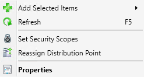
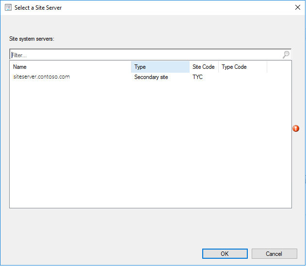

# Capabilities in Technical Preview 1801 for Configuration Manager

*Applies to: Configuration Manager (technical preview branch)*

This article introduces the features that are available in the Technical Preview for Configuration Manager, version 1801. You can install this version to update and add new capabilities to your Configuration Manager technical preview site. 

Review [Technical Preview for Configuration Manager](technical-preview.md) before installing this version of the technical preview. That article familiarizes you with the general requirements and limitations for using a technical preview, how to update between versions, and how to provide feedback.     

<!--  Known Issues Template   
**Known Issues in this Technical Preview:**
-   **Issue Name**. Details
    Workaround details.
**Known Issues in this Technical Preview:**
-->
**Known Issues in this Technical Preview:**
- **Update to a new preview version fails when you have a site server in passive mode**. If you have a [primary site server in passive mode](capabilities-in-technical-preview-1706.md#site-server-role-high-availability), then you must uninstall the passive mode site server before updating to this new preview version. You can reinstall the passive mode site server after your site completes the update.

  To uninstall the passive mode site server:
  1. In the Configuration Manager console, go to **Administration** > **Overview** > **Site Configuration** > **Servers and Site System Roles**, and then select the passive mode site server.
  2. In the **Site System Roles** pane, right-click on the **Site server** role, and then choose **Remove Role**.
  3. Right-click on the passive mode site server, and then choose **Delete**.
  4. After the site server uninstalls, on the active primary site server restart the service **CONFIGURATION_MANAGER_UPDATE**.
  <!--sms 489412-->

**The following are new features you can try out with this version.**  

<!--  Section Template
##  FEATURE
<-- TFS ID - need to fix comment md here
### Procedure 1
### Try it out!  
 Try to complete the tasks. Then send **Feedback** from the **Home** tab of the ribbon letting us know how it worked.
 -  Task 1
 -  Task 2              
-->

## Create phased deployments
<!-- 1357405 -->
Phased deployments automate a coordinated, sequenced rollout of software without creating multiple deployments. In this Technical Preview version, the phased deployment wizard can be completed for task sequences in the admin console. However, deployments are not created. 

### Try it out!  
  Try to complete the tasks. Then send **Feedback** from the **Home** tab of the ribbon letting us know how it worked.
 
**Create a phased deployment for a task sequence**  
1. In the **Software Library** workspace, expand **Operating Systems**, and select **Task Sequences**.
2. Right-click on an existing task sequence and select **Create Phased Deployment**. 
3. On the **General** tab, give the phased deployment a name, description (optional), and select **Automatically create default pilot and production phases**. 
4. Populate the **Pilot collection** and **Production Collection** fields. Select **Next**.
5. On the **Settings** tab, choose one option for each of the scheduling settings and select **Next** when complete. 
6. On the **Phases** tab, edit any of the phases if needed then click **Next**.
7. Confirm your selections on the **Summary** tab then click **Next** to proceed.

## Co-management reporting
<!-- 1356648 -->
If you are using the [co-management](../../comanage/overview.md) capabilities, you can now view a dashboard with information about co-management in your environment. In the Configuration Manager console, navigate to the **Monitoring** workspace, expand **Upgrade Readiness**, and select the **Co-management** dashboard. The dashboard includes the following tiles:
- **Co-managed devices**: the percentage of devices in your environment that you enabled for co-management
- **OS distribution**: the breakdown of operating systems (OS) by version. This chart uses the following groupings:
  - Windows 7 & 8.x
  - Windows 10 lower than 1709
  - Windows 10 1709 and above
    > [!NOTE] 
    > Windows 10, version 1709 and later, is a prerequisite for co-management
- **Co-management status**: the breakdown of device success or failure in the following categories:
   - Success, Microsoft Entra hybrid joined
   - Success, Microsoft Entra joined
   - Failure: Auto-enrollment failed
- **Workload transition**: a bar chart showing the number of devices that you transitioned to Microsoft Intune for the three available workloads: 
   - Compliance Policies
   - Resource Access
   - Windows Update for Business

### Prerequisites
- The computer that runs the Configuration Manager console requires Internet Explorer 9 or later.

## Improvements to automatic deployment rule evaluation schedule
<!-- 1357133 -->
Based upon your feedback, you can now schedule automatic deployment rule (ADR) evaluation to be offset from a base day. For example, an offset of two days after the second Tuesday of the month evaluates the rule on Thursday. 

### Try it out!  
 Try to complete the tasks. Then send **Feedback** from the **Home** tab of the ribbon letting us know how it worked.  

**Create a custom schedule that evaluates and ADR offset from a base day**  
1.  In the **Software Library** workspace, expand **Software Updates**, and select **Automatic Deployment Rules**.
2. Right-click on **Automatic Deployment Rules** and choose **Create Automatic Deployment Rule**. 
3. Follow the prompts to complete the **General**, **Deployment Settings**, and **Software Updates** tabs. 
4. On the **Evaluation Schedule** tab, select **Run the rule on a schedule** and **Customize**.
5. For the custom schedule, select **Monthly** and put in a base day such as the second Tuesday. 
6. Check **Offset (days)** and the number of days for the offset then **OK** when finished.  
7. Complete the rest of the **Create Automatic Deployment Rule Wizard**. 

## Reassign distribution point
<!-- 1306937 -->
Many customers have large Configuration Manager infrastructures, and are reducing primary or secondary sites to simplify their environment. They still need to retain distribution points at branch office locations to serve content to managed clients. These distribution points often contain multiple terabytes or more of content. This content is costly in terms of time and network bandwidth to distribute to these remote servers. 

This feature lets you reassign a distribution point to another primary site without redistributing the content. This action updates the site system assignment while persisting all of the content on the server. If you need to reassign multiple distribution points, first perform this action on a single distribution point, and then proceed with additional servers one at a time.

> [!IMPORTANT]
> The site system server can only host the distribution point role. If the site system server hosts another Configuration Manager server role, such as the state migration point, you cannot reassign the distribution point. You cannot reassign a cloud distribution point. 

This option is not functional with this release due to the Technical Preview limit of a single primary site. Consider the scenario, and then send **Feedback** from the **Home** tab of the ribbon, regarding the capabilities of this action.
1. In the Configuration Manager console, go to the **Administration** workspace, and select the **Distribution Points** node.
2. Right-click the target distribution point, and select **Reassign Distribution Point**. 
  
3. Select the site server and site code to which you want to reassign this distribution point. 
  

## Improvements to hardware inventory
<!-- 1357389 -->
For newly added classes, string lengths greater than 255 characters can be specified for hardware inventory properties that are not keys.

### Try it out!  
Try to complete the tasks. Then send **Feedback** from the **Home** tab of the ribbon letting us know how it worked. 

1. In the **Administration** workspace, click on **Client Settings** highlight a client device setting to edit, right-click then select **Properties**. 
2. Select **Hardware Inventory**, then **Set Classes**, and **Add**.
3. Click the **Connect** button.
4. Fill in **Computer Name**, **WMI namespace**, select **recursive** if needed. Provide credentials if necessary to connect. Click **Connect** to view the namespace classes.
5. Select a new class then click **Edit**.
6. Change the **Length** of at least one property that is a string, other than the key, to be greater than 255. Click **OK**. 
7. Ensure that the edited property is selected for **Add Hardware Inventory Class** and click **OK**. 
8. Collect hardware inventory with the newly added class containing a property greater than 255 characters in length. 

## Improvements to client settings for Software Center
<!-- 1351224 & 1355146 -->
In this version of the Technical Preview, improvements have been made for Software Center customization under the client settings. 

1. The client settings for Software Center now have a **Customize** button.
2. A preview has been added to show what the Software Center banner looks like.<!--1351224-->
    - If a logo is not selected, the preview shows the company name text and color.
    - If a logo is selected, the preview shows the logo and company name text.  
3.  **Hide unapproved applications in Software Center** is a new  setting for Software Center. When this option is enabled, user available applications that require approval are hidden in Software Center.<!--1355146-->

### Try it out!  
 Try to complete the tasks. Then send **Feedback** from the **Home** tab of the ribbon letting us know how it worked.

1. In the **Administration** workspace, click on **Client Settings**. Select a client device setting to edit. Right-click on it then select **Properties** then **Software Center**.
2.  Click on the **Customize** button. Try out the different customization settings including the preview.
3. Enable the setting **Hide unapproved applications in Software Center**. Observe the changes in Software Center. 

## New settings for Windows Defender Application Guard
<!-- 1356256 -->
For Windows 10 version 1709 and later devices, there are two new host interaction settings for [Windows Defender Application Guard](../../protect/deploy-use/create-deploy-application-guard-policy.md). 
1. Websites can be given access to the host's virtual graphics processor. 
2. Files downloaded inside the container can be persisted on the host.  

## Improvements to Run Scripts
<!-- 1236459 -->
The [**Run Scripts** feature](../../apps/deploy-use/create-deploy-scripts.md) now allows you to import and run signed PowerShell scripts. 
- To keep the script integrity, signed scripts must be imported rather than using copy/paste. 
- Imported signed scripts cannot be edited after import.
    
>[!IMPORTANT]
>In this Technical Preview, there are two temporary limitations.
>- Scripts can only be imported in the Run Scripts feature and can't be edited directly from the console.
>- Scripts imported with a non-Unicode encoding may display in the console incorrectly. The script will still execute as originally written.

## Next steps
For information about installing or updating the technical preview branch, see [Technical Preview for Configuration Manager](technical-preview.md).    
