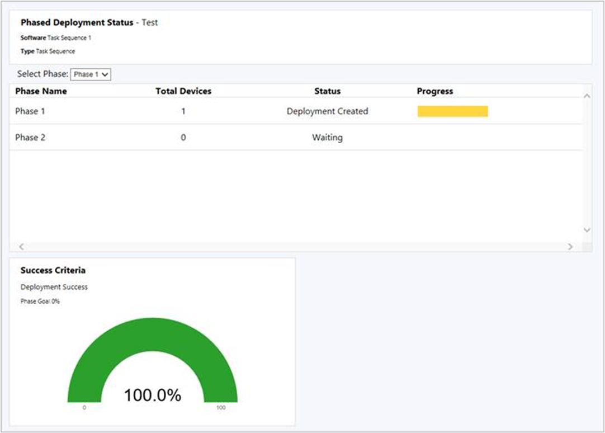

# Capabilities in Technical Preview 1806.2 for Configuration Manager

*Applies to: Configuration Manager (technical preview branch)*

This article introduces the features that are available in the Technical Preview for Configuration Manager, version 1806.2. You can install this version to update and add new capabilities to your technical preview site. 

Review the [Technical Preview](technical-preview.md) article before installing this update. That article familiarizes you with the general requirements and limitations for using a technical preview, how to update between versions, and how to provide feedback.     

<!--  Known Issues Template
## Known Issues in this Technical Preview

###  Known issue title
<!--bugID--
Issue description and cause.

#### Workaround
Steps to workaround, if any.  
-->

## Known Issues in this Technical Preview

###  Clients don't automatically update
<!--518760-->
When updating to version 1806.2, the site also updates the SQL Server Native Client, which may cause a pending restart on the site server. This delay causes certain files to not update, which impacts automatic client upgrade.

#### Workarounds
Avoid this issue by manually upgrading the SQL Server Native Client *before updating* Configuration Manager to version 1806.2. For more information, see the [latest servicing update for SQL Server 2012 Native Client](https://www.microsoft.com/download/details.aspx?id=50402).

If you already updated your site, automatic client upgrade and client push won't work. You need to update clients to fully test most new features. Manually update your technical preview clients using the following process:  

1. Locate the client source files in the **CMUClient** folder of the Configuration Manager installation directory on the site server. For example, `C:\Program Files\Configuration Manager\CMUClient`  

2. Copy the entire CMUClient folder to the client device. For example, `C:\Temp\CMUClient`  

    This location can be a network share that's accessible from the clients.  

3. Run the following command line from an elevated command prompt: `C:\Temp\CMUClient\ccmsetup.exe /source:C:\Temp\CMUClient`  

If you're installing a new client in your technical preview version 1806.2 site, use this same process. 

> [!Important]  
> Don't use the `/MP` command-line parameter in this scenario. This parameter takes priority over `/source` and causes ccmsetup to download client content from the management point or distribution point.
> 
> Command-line properties, such as SMSSITECODE or CCMLOGLEVEL, are ok to use, but shouldn't be necessary when upgrading an existing client. 

###  Version 1806.2 shows Version 1806 in About Configuration Manager
<!--518148-->
After upgrading to technical preview version 1806.2, if you open the **About Configuration Manager** window from the upper left corner of the console, it still shows **Version 1806**. 

#### Workaround
Use the **Site version** property to determine the difference between 1806 and 1806.2:

| Site version  | Version
|---------|---------|
| 5.0.**8672**.1000 | 1806 |
| 5.0.**8685**.1000 | 1806.2 |
 

 

**The following are new features you can try out with this version.**  

##  Improvements to phased deployments

This release includes the following improvements to [phased deployments](../../osd/deploy-use/create-phased-deployment-for-task-sequence.md):
- [Phased deployment status](#bkmk_pod-monitor)
- [Phased deployment of applications](#bkmk_pod-app)
- [Gradual rollout during phased deployments](#bkmk_pod-throttle)

###  Phased deployment status
<!--1358577-->
Phased deployments now have a native monitoring experience. From the **Deployments** node in the **Monitoring** workspace, select a phased deployment, and then click **Phased Deployment Status** in the ribbon.

This dashboard shows the following information for each phase in the deployment:  

- **Total devices**: How many devices are targeted by this phase.  

- **Status**: The current status of this phase. Each phase can be in one of the following states:  

    - **Deployment created**: The phased deployment created a deployment of the software to the collection for this phase. Clients are actively targeted with this software.  

    - **Waiting**: The previous phase hasn't yet reached the success criteria for the deployment to continue to this phase.  

    - **Suspended**: An administrator suspended the deployment.  

- **Progress**: The color-coded deployment states from clients. For example: Success, In Progress, Error, Requirements Not Met, and Unknown. 

#### Known issue
The phased deployment status dashboard may show multiple rows for the same phase.<!--518510-->

###  Phased deployment of applications
<!--1358147-->
Create phased deployments for applications. Phased deployments allow you to orchestrate a coordinated, sequenced rollout of software based on customizable criteria and groups.

In the Configuration Manager console, go to the **Software Library**, expand **Application Management**, and select **Applications**. Select an application, and then click **Create Phased Deployment** in the ribbon. 

The behavior of an application phased deployment is the same as for task sequences. For more information, see [Create phased deployments for a task sequence](../../osd/deploy-use/create-phased-deployment-for-task-sequence.md).

#### Prerequisite
Distribute the content for the application to a distribution point before creating the phased deployment.<!--518293-->

#### Known issue
You can't manually create phases for an application. The wizard automatically creates two phases for application deployments.

###  Gradual rollout during phased deployments
<!--1358578-->
During a phased deployment, the rollout in each phase can now happen gradually. This behavior helps mitigate the risk of deployment issues, and decreases the load on the network caused by the distribution of content to clients. The site can gradually make the software available depending on the configuration for each phase. Every client in a phase has a deadline relative to the time the software is made available. The time window between the available time and deadline is the same for all clients in a phase. 

When you create a phased deployment and manually configure a phase, on the **Phase Settings** page of the Add Phase Wizard, or on the **Settings** page of the Create Phased Deployment wizard, configure the option: **Gradually make this software available over this period of time (in days)**. The default value of this setting is **0**, so by default the deployment isn't throttled.

> [!Note]  
> This option is currently only available for phased deployments of task sequences.  

##  Support for new Windows app package formats
<!--1357427-->
Configuration Manager now supports the deployment of new Windows 10 app package (.msix) and app bundle (.msixbundle) formats. The latest [Windows Insider Preview](https://insider.windows.com/) builds currently support these new formats.

For an overview of MSIX, see [A closer look at MSIX](/archive/blogs/sgern/a-closer-look-at-msix).

For how to create a new MSIX app, see [MSIX support introduced in Insider Build 17682](https://techcommunity.microsoft.com/t5/MSIX-Blog/MSIX-support-introduced-in-Insider-Build-17682/ba-p/202376).

### Prerequisites
- A Windows 10 client running at least Windows Insider Preview build 17682
- A Windows app package in the MSIX format

### Try it out!
Try to complete the tasks. Then send [Feedback](capabilities-in-technical-preview-1804.md#bkmk_feedback) letting us know how it worked.

1. In the Configuration Manager console, [create an application](../../apps/deploy-use/create-applications.md). 
2. Select the application installation file **Type** as **Windows app package (\*.appx, \*.appxbundle, \*.msix, \*.msixbundle)**.
3. [Deploy the application](../../apps/deploy-use/deploy-applications.md) to the client running the latest Windows Insider Preview build.

##  Improvement to client push security
<!--1358204-->
When using the [client push](../clients/deploy/plan/client-installation-methods.md#client-push-installation) method of installing the Configuration Manager client, the site server creates a remote connection to the client to start the install. Starting in this release, the site can require Kerberos mutual authentication by not allowing fallback to NTLM before establishing the connection. This enhancement helps to secure the communication between the server and the client. 

Depending on your security policies, your environment may already prefer or require Kerberos over older NTLM authentication. For more information on the security considerations of these authentication protocols, see the [Windows security policy setting to restrict NTLM](/windows/security/threat-protection/security-policy-settings/network-security-restrict-ntlm-outgoing-ntlm-traffic-to-remote-servers#security-considerations).

### Prerequisite

To use this feature, clients must be in a trusted Active Directory forest. Kerberos in Windows relies upon Active Directory for mutual authentication. 

### Try it out!

Try to complete the tasks. Then send [Feedback](capabilities-in-technical-preview-1804.md#bkmk_feedback) letting us know how it worked.

When you upgrade the site, the existing behavior persists. Once you *open* the client push installation properties, the site automatically enables the Kerberos check. If necessary, you can allow the connection to fallback to use a less secure NTLM connection, which isn't recommended. 

1. In the Configuration Manager console, go to the **Administration** workspace, expand **Site Configuration**, and select **Sites**. Select the target site. In the ribbon, click **Client Installation Settings** and select **Client Push Installation**.  

2. The site has now enabled the Kerberos check for client push. Click **OK** to close the window.  

3. If necessary for your environment, in the Client Push Installation Properties window, on the **General** tab, see the option to **Allow connection fallback to NTLM**. This option is disabled by default. 

##  Management insights for proactive maintenance
<!--1352184,et al-->
Additional management insights are available in this release to highlight potential configuration issues. Review the following rules in the new **Proactive Maintenance** group:  

- **Unused configuration items**: Configuration items that aren't part of a configuration baseline and are older than 30 days.  

- **Unused boot images**: Boot images not referenced for PXE boot or task sequence use.  

- **Boundary groups with no assigned site systems**: Without assigned site systems, boundary groups can only be used for site assignment.  

- **Boundary groups with no members**: Boundary groups aren't applicable for site assignment or content lookup if they don't have any members.  

- **Distribution points not serving content to clients**: Distribution points that haven't served content to clients in the past 30 days. This data is based on reports from clients of their download history.  

- **Expired updates found**: Expired updates aren't applicable for deployment.   

##  Transition mobile apps workload for co-managed devices
<!--1357892-->
Manage mobile apps with Microsoft Intune while continuing to use Configuration Manager to deploy Windows desktop applications. To transition the modern apps workload, go to the co-management properties page. Move the slider bar from Configuration Manager to Pilot or All. 

After you transition this workload, any available apps deployed from Intune are available in the Company Portal. Apps that you deploy from Configuration Manager are available in Software Center. 

For more information, see the following articles:  

- [Co-management for Windows 10 devices](../../comanage/overview.md)  

- [What is Microsoft Intune app management?](/mem/intune-service/apps/app-management)  

##  Boundary group options for peer downloads
<!--1356193-->
Boundary groups now include additional settings to give you more control over content distribution in your environment. This release adds the following options:  

- **Allow peer downloads in this boundary group**: This setting is enabled by default. The management point provides clients a list of content locations that includes peer sources. <!--This setting also affects applying Group IDs for Delivery Optimization.518268-->  

    There are two common scenarios in which you should consider disabling this option:  

    - If you have a boundary group that includes boundaries from geographically dispersed locations such as a VPN. Two clients may be in the same boundary group because they're connected through VPN, but in vastly different locations that are inappropriate for peer sharing of content.  

    - If you use a single, large boundary group for site assignment that doesn't reference any distribution points.  

- **During peer downloads, only use peers within the same subnet**: This setting is dependent upon the one above. If you enable this option, the management point only includes in the content location list peer sources that are in the same subnet as the client.

    Common scenarios for enabling this option:

    - Your boundary group design for content distribution includes one large boundary group that overlaps other smaller boundary groups. With this new setting, the list of content sources that the management point provides to clients only includes peer sources from the same subnet.

    - You have a single large boundary group for all remote office locations. Enable this option and clients only share content within the subnet at the remote office location, instead of risking sharing content between locations.

### Known issue
If the peer source client has more than one IP address (IPv4, IPv6, or both), then peer caching doesn't work. The new option, **During peer downloads, only use peers within the same subnet**, has no effect if the peer source has more than one IP address.<!--518661-->   

##  Third-party software updates support for custom catalogs
<!--1358714-->
This release further iterates on support for third-party software updates as a result of your feedback. [Technical preview version 1806](capabilities-in-technical-preview-1806.md#bkmk-3pupdate) provided support for *partner catalogs*, which are registered catalogs from software vendors. Catalogs that you provide, which aren't registered with Microsoft, are called *custom catalogs*. Add custom catalogs in the Configuration Manager console.  

### Prerequisites 

- Set up [third-party software updates](capabilities-in-technical-preview-1806.md#bkmk-3pupdate). Complete Phase 1: Enable and set up the feature.   

- A digitally signed custom catalog that contains digitally signed software updates.  

- The administrator requires the following permissions:  

    - Site: Create, Modify  

### Try it out!

Try to complete the tasks. Then send [Feedback](capabilities-in-technical-preview-1804.md#bkmk_feedback) letting us know how it worked.

1. In the Configuration Manager console, go to the **Software Library** workspace, expand **Software Updates**, and select the **Third-Party Software Update Catalogs** node. Click **Add Custom Catalog** in the ribbon.  

2. On the **General** page, specify the following details:  

    - **Download URL**: A valid HTTPS address of the custom catalog.  

    - **Publisher**: The name of the organization that publishes the catalog.  

    - **Name**: The name of the catalog to display in the Configuration Manager console.  

    - **Description**: A description of the catalog.  

    - **Support URL** (Optional): A valid HTTPS address of a website to get help with the catalog.  

    - **Support Contact** (Optional): Contact information to get help with the catalog.  

3. Complete the wizard. The wizard adds the new catalog in an unsubscribed state.  

4. Subscribe to the custom catalog using the existing **Subscribe to Catalog** action. For more information, see [Phase 2: Subscribe to a third-party catalog and sync updates](capabilities-in-technical-preview-1806.md#phase-2-subscribe-to-a-third-party-catalog-and-sync-updates).  

> [!Note]  
> You can't add catalogs with the same download URL, and you can't edit catalog properties. If you specify incorrect properties for a custom catalog, delete the catalog before you add it again.  

#### Unsubscribe from a catalog
To unsubscribe from a catalog, select the desired catalog in the list, and click **Unsubscribe Catalog** in the ribbon. If you unsubscribe from a catalog, the following actions and behaviors occur: 
- The site stops synchronization of new updates 
- The site blocks the associated certificates for catalog signing and update content. 
- Existing updates aren't removed, but you may not be able to publish or deploy them.

#### Delete a custom catalog
Delete custom catalogs from the same node of the console. Select a custom catalog in an *unsubscribed* state, and click **Delete Custom Catalog**. If you already subscribed to the catalog, first unsubscribe before you delete it. You can't delete partner catalogs. Deleting a custom catalog removes it from the list of catalogs. This action doesn't affect any software updates you've published to your software update point.

### Known issue
The delete action on custom catalogs is grayed out, thus you can't delete custom catalogs from the console. To workaround this issue, use the **wbemtest** tool on the site server. Query for the instance you want to delete with the name or download URL, for example: `select * from SMS_ISVCatalog where DownloadURL="http://www.contoso.com/catalog.cab"`. In the query result window, select the object, and click **Delete**.<!--518676-->  

##  Improvements to cloud management features

This release includes the following improvements:  

- The following features now support use of the Azure U.S. Government Cloud:<!--511980-->  

    - Onboarding the site for **Cloud Management** through [Azure Services](../servers/deploy/configure/azure-services-wizard.md)  

    - Deploying a [cloud management gateway with Azure Resource Manager](../clients/manage/cmg/plan-cloud-management-gateway.md#azure-resource-manager)  

    - Deploying a [cloud distribution point with Azure Resource Manager](capabilities-in-technical-preview-1805.md#cloud-distribution-point-support-for-azure-resource-manager)  

- Customers are using Windows Autopilot to provision Windows 10 on Microsoft Entra joined devices that are connected to the on-premises network. To install or upgrade the Configuration Manager client on these devices, now you don't need a cloud distribution point or on-premises distribution point configured to **Allow clients to connect anonymously**. Instead, enable the site option to **Use Configuration Manager-generated certificates for HTTP site systems**, which allows a cloud domain-joined client to communicate with an on-premises HTTP-enabled distribution point. For more information, see [Improved secure client communications](/sccm/core/get-started/capabilities-in-technical-preview-1805#improved-secure-client-communications).<!--515854-->  

##  New software updates compliance report
<!--1357775-->
Viewing reports for software updates compliance traditionally includes data from clients that haven't recently contacted the site. A new report lets you filter compliance results for a specific software update group by "healthy" clients. This report shows the more realistic compliance state of the active clients in your environment. 
 
To view the report, go to the **Monitoring** workspace, expand **Reporting**, expand **Reports**, expand **Software Updates - A Compliance**, and select **Compliance 9 - Overall health and compliance**. Specify the **Update Group**, **Collection Name**, and **Client Health** state.

The report includes the following parts:
- **Healthy Clients vs Total Clients**: This bar chart compares the "healthy" clients that have communicated with the site in the specified time period against the total number of clients in the specified collection.
- **Compliance Overview**: This pie chart shows overall compliance state for the specific software update group on active clients in the specified collection.
- **Top 5 Non-Compliant by Article ID**: This bar chart displays the top five software updates in the specified group that are non-compliant on active clients in the specified collection.
- The bottom of the report is a table with further details, which lists the software updates in the specified group.

## Next steps
For information about installing or updating the technical preview branch, see [Technical Preview for Configuration Manager](technical-preview.md).
