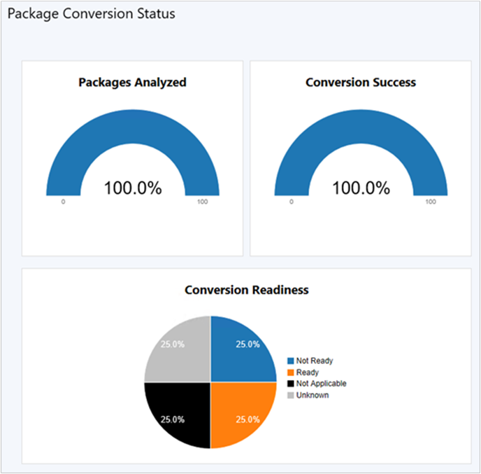

# Capabilities in Technical Preview 1806 for Configuration Manager

*Applies to: Configuration Manager (technical preview branch)*

This article introduces the features that are available in the Technical Preview for Configuration Manager, version 1806. You can install this version to update and add new capabilities to your technical preview site. 

Review the [Technical Preview](technical-preview.md) article before installing this update. That article familiarizes you with the general requirements and limitations for using a technical preview, how to update between versions, and how to provide feedback.     


<!--  Known Issues Template
## Known Issues in this Technical Preview

### <a name="ki_ANCHOR"></a> Known issue title
<!--bugID--
Issue description and cause.

#### Workaround
Steps to workaround, if any.  
-->
## Known Issues in this Technical Preview

### <a name="ki_contentlib"></a> Site fails to upgrade with remote content library
<!--514642-->
The site fails to upgrade with the following errors in **cmupdate.log**:  

``` Log
Failed to find any valid drives  
GetContentLibraryParameters failed; 0x80070057  
ERROR: Failed to process configuration manager update.  
```  

This issue occurs in this release when the content library is in a remote location.

#### Workaround
Move the content library to a drive local to the site server. For more information, see [Configure a remote content library for the site server](capabilities-in-technical-preview-1804.md#configure-a-remote-content-library-for-the-site-server). 


</br>

**The following are new features you can try out with this version.**  


## <a name="bkmk-3pupdate"></a> Third-party software updates
<!--1352101-->
This release further iterates on support for third-party software updates as a result of your feedback. You no longer require the use of System Center Updates Publisher (SCUP) for some common scenarios. The new **Third-Party Software Update Catalogs** node in the Configuration Manager console allows you to subscribe to third-party catalogs, publish their updates to your software update point, and then deploy them to clients. 

The following third-party software update catalogs are available in this release:

 | Publisher | Catalog Name |
 |--------|---------------------|
 | HP | HP Client Updates Catalog |

SCUP continues to support other catalogs and scenarios. The list of catalogs in the Third-Party Software Update Catalogs node of the Configuration Manager console is dynamic, and will be updated as additional catalogs are available and supported.


### Prerequisites
- Set up software updates management, with an HTTPS-enabled software update point. For more information, see [Prepare for software updates management](../../sum/get-started/prepare-for-software-updates-management.md).  
  - The software update point must be on the site server for this feature in this release. <!--515810--> 

    > [!Tip]  
    > The software update point requires HTTPS because it's a requirement for the WSUS APIs used to handle signing certificates. Clients don't need to be HTTPS-enabled as well. For more information on enabling HTTPS on WSUS, see the following articles for assistance:  
    > - [Secure WSUS with the Secure Sockets Layer Protocol](/windows-server/administration/windows-server-update-services/deploy/2-configure-wsus#25-secure-wsus-with-the-secure-sockets-layer-protocol) 
    > - [WSUS Support blog post](/archive/blogs/sus/how-to-create-an-internet-facing-wsus-server-that-uses-different-internal-and-external-names)

- Sufficient disk space on the software update point, WSUSContent folder, to store the source binary content for third-party software updates. The amount of required storage varies based on the vendor, types of updates, and specific updates that you publish for deployment. If you need to move the WSUSContent folder to another drive with more free space, see the WSUS support team blog post [How to change the location where WSUS stores updates locally](/archive/blogs/sus/wsus-how-to-change-the-location-where-wsus-stores-updates-locally).  

- Enable and deploy the client setting [Enable third party software updates](../clients/deploy/about-client-settings.md#enable-third-party-software-updates) in the **Software Updates** group.  

- The site server requires internet access to download.microsoft.com over HTTPS port 443. The third-party software update synchronization service currently runs on the site server. This service updates the list of available third-party catalogs, downloads the catalogs when you subscribe, and downloads the updates when published. Configure internet proxy settings, if necessary, on the **Proxy** tab of the Site System role properties of the site server computer.  


### Try it out!
 Try to complete the tasks. Then send [Feedback](capabilities-in-technical-preview-1804.md#bkmk_feedback) letting us know how it worked.


#### Phase 1: Enable and set up the feature
Perform the following steps *once per hierarchy* to enable and set up the feature for use:  

1. In the Configuration Manager console, go to the **Administration** workspace. Expand **Site Configuration**, and select the **Sites** node.  

2. Select the top-level site in the hierarchy. In the ribbon, click **Configure Site Components**, and select **Software Update Point**.  

3. Switch to the **Third Party Updates** tab. Select the option to **Enable third-party software updates**. For more information on the certificate options, see [Improvements for enabling third-party software update support](capabilities-in-technical-preview-1805.md#improvements-for-enabling-third-party-software-update-support).  

   > [!Note]  
   > If you use the default option for Configuration Manager to manage this certificate, a new certificate of type **Third-party WSUS Signing** is created in the **Certificates** node under **Security** in the **Administration** workspace.  


#### Phase 2: Subscribe to a third-party catalog and sync updates
Perform the following steps for *each third-party catalog* to which you want to subscribe:  

1. In the Configuration Manager console, go to the **Software Library** workspace. Expand **Software Updates** and select the **Third-Party Software Update Catalogs** node.  

2. Select the catalog to subscribe, and click **Subscribe to Catalog** in the ribbon.   

3. Review and approve the catalog certificate.  

   > [!Note]  
   > When you subscribe to a third-party software update catalog, the certificate that you review and approve in the wizard is added to the site. This certificate is of type **Third-party Software Updates Catalog**. You can manage it from the **Certificates** node under **Security** in the **Administration** workspace.  

4. Complete the wizard.  

   > [!Tip]  
   > After initial subscription, the catalog should start to download immediately. It then resyncs every 24 hours in this release. If you don't want to wait for the catalog to automatically download, click **Sync now** in the ribbon.  
   > 
   > After the catalog is downloaded, the product metadata must be synchronized to the software update point. For more information on this process as well as how to manually initiate, see [Synchronize software updates](../../sum/get-started/synchronize-software-updates.md). At this point, you can see the third-party updates in the **All Updates** node. 

5. Next, configure the software update point **Products** for the third-party catalog to which you subscribed. For more information, see [Configure classifications and products to synchronize](../../sum/get-started/configure-classifications-and-products.md). After the product criteria changes, software update synchronization must occur again.

Before you can see compliance results from clients, they need to scan and evaluate updates. You can manually trigger this cycle from the Configuration Manager control panel on a client by running the **Software Updates Scan Cycle** action. For more information on the process, see [Software updates introduction](../../sum/understand/software-updates-introduction.md).


#### Phase 3: Deploy third-party software updates
Perform the following steps for *any third-party software updates* you want to deploy to clients:  

1. In the Configuration Manager console, go to the **Software Library** workspace. Expand **Software Updates** and select the **All Software Updates** node.  

   > [!Tip]  
   > Click **Add Criteria** to filter the list of updates. For example, add **Vendor** for **Adobe Systems, Inc.** to view all updates from Adobe.  

2. Select the updates that are required by clients. Click **Publish Third-Party Software Update Content** and review progress in the SMS_ISVUPDATES_SYNCAGENT.log. This action downloads the update binaries from the vendor, and stores them in the WSUSContent folder on the software update point. It also changes the state of the update from metadata-only to with content and deployable.  

   > [!Note]  
   > When you publish third-party software update content, any certificates used to sign the content are added to the site. These certificates are of type **Third-party Software Updates Content**. You can manage them from the **Certificates** node under **Security** in the **Administration** workspace.  

3. Deploy the updates using the existing software updates management process. For more information, see [Deploy software updates](../../sum/deploy-use/deploy-software-updates.md). On the **Download Locations** page of the Deploy Software Updates Wizard, select the default option to **Download software updates from the internet**. In this scenario, the content is already published to the software update point, which is used to download the content for the deployment package.


### Monitoring progress of third-party software updates
Synchronization of third-party software updates is handled by the SMS_ISVUPDATES_SYNCAGENT component on the site server. You can view status messages from this component, or see more detailed status in the SMS_ISVUPDATES_SYNCAGENT.log. This log is on the site server in the **Logs** subfolder of the site installation directory. By default this path is `C:\Program Files\Microsoft Configuration Manager\Logs`. For more information on monitoring the general software update management process, see [Monitor software updates](../../sum/deploy-use/monitor-software-updates.md).


### Known issues
- The third-party software update synchronization service doesn't support the software update point configured to use a **WSUS Server Connection Account**. If this account is configured on the **Proxy and Account Settings** tab of the Software update point Properties page, you'll see the following error in the SMS_ISVUPDATES_SYNCAGENT.log:  
`WSUS access account appears to be configured, it is not yet supported for third party updates sync.`  
For more information on this account, see [Software Update Point Connection Account](../plan-design/hierarchy/accounts.md#software-update-point-connection-account).<!--515492-->  

- Don't mix the use of other tools such as SCUP with this new integrated third-party software update feature. The third-party software update synchronization service can't publish content to metadata-only updates that were added to WSUS by another application, tool, or script, such as SCUP. The **Publish third-party software update content** action fails on these updates. If you need to deploy third-party updates that this feature doesn't yet support, use your existing process in full for deploying those updates.<!--515497-->  


## Configure Windows Defender SmartScreen settings for Microsoft Edge
<!--1353701-->
This release adds three settings for [Windows Defender SmartScreen](/windows/security/threat-protection/microsoft-defender-smartscreen/microsoft-defender-smartscreen-overview) to the [Microsoft Edge browser compliance settings policy](../../compliance/deploy-use/browser-profiles.md). The policy now includes the following additional settings on the **SmartScreen Settings** page:
- **Allow SmartScreen**: Specifies whether Windows Defender SmartScreen is allowed. For more information, see the [AllowSmartScreen browser policy](/windows/client-management/mdm/policy-csp-browser#browser-allowsmartscreen).
- **Users can override SmartScreen prompt for sites**: Specifies whether users can override the Windows Defender SmartScreen Filter warnings about potentially malicious websites. For more information, see the [PreventSmartScreenPromptOverride browser policy](/windows/client-management/mdm/policy-csp-browser#browser-preventsmartscreenpromptoverride).
- **Users can override SmartScreen prompt for files**: Specifies whether users can override the Windows Defender SmartScreen Filter warnings about downloading unverified files. For more information, see the [PreventSmartScreenPromptOverrideForFiles browser policy](/windows/client-management/mdm/policy-csp-browser#browser-preventsmartscreenpromptoverrideforfiles).


## Sync MDM policy from Microsoft Intune for a co-managed device
<!--1357377-->
Starting in this release when you [switch a co-management workload](../../comanage/how-to-switch-workloads.md), the co-managed devices automatically synchronize MDM policy from Microsoft Intune. This sync also happens when you initiate the **Download Computer Policy** action from Client Notifications in the Configuration Manager console. For more information, see [Initiate client policy retrieval using client notification](../clients/manage/manage-clients.md#start-policy-retrieval).


## Transition Microsoft 365 workload to Intune using co-management
<!--1357841-->
You can now transition the Microsoft 365 workload from Configuration Manager to Microsoft Intune after enabling co-management. To transition this workload, go to the co-management properties page and move the slider bar from Configuration Manager to Pilot or All. For more information, see [Co-management for Windows 10 devices](../../comanage/overview.md).

There is also a new global condition, **Are Office 365 applications managed by Intune on the device**. This condition is added by default as a requirement to new Microsoft 365 applications. When you transition this workload, co-managed clients don't meet the requirement on the application, thus don't install Microsoft 365 deployed via Configuration Manager.

### Known issue

- This workload transition currently only applies to Microsoft 365 deployments. Configuration Manager continues to manage Microsoft 365 updates.<!--510876--> For more information including a possible workaround, see the Configuration Manager version 1802 release note [Changing Microsoft 365 client setting doesn't apply](../servers/deploy/install/release-notes.md).


## Package Conversion Manager 
<!--1357861-->
Package Conversion Manager is now an integrated tool that allows you to convert legacy Configuration Manager 2007 packages into Configuration Manager current branch applications. Then you can use features of applications such as dependencies, requirement rules, and user device affinity.

### Try it out!
 Try to complete the tasks. Then send [Feedback](capabilities-in-technical-preview-1804.md#bkmk_feedback) letting us know how it worked.

> [!Important]  
> If you previously installed an older version of Package Conversion Manager, first uninstall it before upgrading your site. The new integrated version doesn't require installation, but may conflict with existing versions.  

1. In the Configuration Manager console, go to the **Software Library** workspace. Expand **Application Management** and select **Packages**.  
2. Select a package. The following three options are available in the **Package Conversion** group of the ribbon:  
     - **Analyze Package**: Start the conversion process by analyzing the package.
     - **Convert Package**: Some packages can easily be converted into applications with this action.
     - **Fix and Convert**: Some packages require issues to be fixed before converting into applications.  


3. Go to the **Monitoring** workspace and select **Package Conversion Status**. This new dashboard shows the overall analysis and conversion state of packages in the site. A new background task automatically summarizes the analysis data.  

   > [!Tip]  
   > Package Conversion Manager doesn't require you to schedule analysis of packages. This action is now handled by the integrated summarization task.  




## Deploy software updates without content
<!--1357933-->
You can now deploy software updates to devices without first downloading and distributing software update content to distribution points. This feature is beneficial when dealing with extremely large update content, or when you always want clients to get content from the Microsoft Update cloud service. Clients in this scenario can also download content from peers that already have the necessary content. The Configuration Manager client continues to manage the content download, thus can utilize the Configuration Manager peer cache feature, or other technologies such as Delivery Optimization. This feature supports any update type supported by Configuration Manager software updates management, including Windows and Office updates. 

### Try it out!
 Try to complete the tasks. Then send [Feedback](capabilities-in-technical-preview-1804.md#bkmk_feedback) letting us know how it worked.

1. Start a software update deployment per normal. For more information, see [Deploy software updates](../../sum/deploy-use/deploy-software-updates.md).
2. In the Deploy Software Updates Wizard, on the **Deployment Package** page, select the new option for **No deployment package**.

### Known issues
- The icon for an update deployed with this setting incorrectly displays with a red X as if the update is invalid. For more information, see [Icons used for software updates](../../sum/understand/software-updates-icons.md). <!--515556-->  
- This setting is only integrated with the Deploy Software Updates Wizard. It isn't currently available with automatic deployment rules. <!--515558-->  


## Office Customization Tool integration with the Office 365 Installer
<!--1358149-->
The Office Customization Tool is now integrated with the Office 365 Installer in the Configuration Manager console. When creating a deployment for Office 365, you can now dynamically configure the latest Office manageability settings. The Office Customization Tool is updated at the same time as the release of new builds of Office 365. You can now take advantage of new manageability settings in Office 365 as soon as they are available. 

### Prerequisites
- The computer running the Configuration Manager console needs internet access via HTTPS port 443. The Office 365 Client Installation Wizard uses a Windows standard web browser API to open https://config.office.com. If an internet proxy is used, the user must be able to access this URL.

### Try it out!
 Try to complete the tasks. Then send [Feedback](capabilities-in-technical-preview-1804.md#bkmk_feedback) letting us know how it worked.

1. In the Configuration Manager console, go to the **Software Library** workspace, and select the **Office 365 Client Management** node.
2. Click the **Office 365 Installer** tile in the dashboard to launch the Office 365 Client Installation Wizard. For more information, see [Deploy Microsoft 365 apps](../../sum/deploy-use/manage-office-365-proplus-updates.md).
3. On the **Office Setting** page, click **Go To Office Web Page**. Use the online Office Customization Tool to specify settings for this deployment. 
4. Click **Submit** in the upper right corner when complete. Finish the Office 365 Client Installation Wizard.


## Improvements to cloud management gateway
This release includes the following improvements to the cloud management gateway (CMG):

### Simplified client bootstrap command line
<!--1358215-->
When installing the Configuration Manager client on the internet via a CMG, fewer command-line properties are now required. For more information on one example of this scenario, see the [Command line to install Configuration Manager client](../../comanage/how-to-prepare-Win10.md#install-the-configuration-manager-client) when preparing for co-management. 

The following command-line properties are required in all scenarios:
- CCMHOSTNAME  
- SMSSITECODE  

The following properties are required when using Microsoft Entra ID for client authentication instead of PKI-based client authentication certificates:
- AADCLIENTAPPID  
- AADRESOURCEURI  

The following property is required if the client will roam back to the intranet:
- SMSMP  

The following example includes all of the above properties:   
`ccmsetup.exe CCMHOSTNAME=CONTOSO.CLOUDAPP.NET/CCM_Proxy_MutualAuth/72186325152220500 SMSSiteCode=ABC AADCLIENTAPPID=7506ee10-f7ec-415a-b415-cd3d58790d97 AADRESOURCEURI=https://contososerver SMSMP=https://mp1.contoso.com`

For more information, see [Client installation properties](../clients/deploy/about-client-installation-properties.md).

### Download content from a CMG
<!--1358651-->
Previously, you had to deploy a cloud distribution point and CMG as separate roles. Now in this release, a CMG can also serve content to clients. This functionality reduces the required certificates and cost of Azure VMs. To enable this feature, enable the new option to **Allow CMG to function as a cloud distribution point and serve content from Azure storage** on the **Settings** tab of the CMG properties. 

<a name='trusted-root-certificate-isnt-required-with-azure-ad'></a>

### Trusted root certificate isn't required with Microsoft Entra ID
<!--503899-->
When you create a CMG, you're no longer required to provide a [trusted root certificate](../clients/manage/cmg/server-auth-cert.md) on the Settings page. This certificate isn't required when using Microsoft Entra ID for client authentication, but used to be required in the wizard.

> [!Important]  
> If you're using PKI client authentication certificates, then you still must add a trusted root certificate to the CMG.


## Improvements to secure client communications
<!--1358278,1358279-->
This release continues to iterate on [improved secure client communications](capabilities-in-technical-preview-1805.md#improved-secure-client-communications) by removing additional dependencies on the network access account. When you enable the new site option to **Use Configuration Manager-generated certificates for HTTP site systems**, the following scenarios don't require a network access account to download content from a distribution point:  

- Task sequences running from boot media or PXE
- Task sequences running from Software Center  

These task sequences can be for OS deployment or custom. It is also supported for workgroup computers.


## Software Center infrastructure improvements
<!--1358309-->
Application catalog roles are no longer required to display user-available applications in Software Center. This change helps you reduce the server infrastructure required to deliver applications to users. Software Center now relies upon the management point to obtain this information, which helps larger environments scale better by assigning them to [boundary groups](../servers/deploy/configure/boundary-groups-management-points.md).

### Try it out!
 Try to complete the tasks. Then send [Feedback](capabilities-in-technical-preview-1804.md#bkmk_feedback) letting us know how it worked.

1. Remove all application catalog roles from the site. These roles include the application catalog web service point and the application catalog website point.
2. Deploy an application as available to a user collection.
3. Use Software Center as a targeted user to browse for, request, and install the application.

### Known issue
- If you use a Microsoft Entra joined client with this feature, don't configure the site to **Use Configuration Manager-generated certificates for HTTP site systems**. It currently conflicts with this feature.<!--515846--> For more information on this setting, see [improved secure client communications](capabilities-in-technical-preview-1805.md#improved-secure-client-communications).


## Provision Windows app packages for all users on a device
<!--1358310-->
You can now provision an application with a Windows app package for all users on the device. One common example of this scenario is provisioning an app from the Microsoft Store for Business and Education, like Minecraft: Education Edition, to all devices used by students in a school. Previously, Configuration Manager only supported installing these applications per user. After signing in to a new device, a student would have to wait to access an app. Now when the app is provisioned to the device for all users, they can be productive more quickly.

> [!Important]  
> Be careful with installing, provisioning, and updating different versions of the same Windows app package on a device, which may cause unexpected results. This behavior may occur when using Configuration Manager to provision the app, but then allowing users to update the app from the Microsoft Store. For more information, see the next step guidance when you [Manage apps from the Microsoft Store for Business](../../apps/deploy-use/manage-apps-from-the-windows-store-for-business.md#next-steps).  

When provisioning an offline licensed app, Configuration Manager doesn't allow Windows to automatically update it from the Microsoft Store.  

### Try it out!
 Try to complete the tasks. Then send [Feedback](capabilities-in-technical-preview-1804.md#bkmk_feedback) letting us know how it worked.

1. Create a new application. This app must be from a Windows app package, or an offline-licensed app, which you've synchronized from the Microsoft Store for Business and Education.  

2. On the **General Information** page of the Create Application Wizard, enable the option to **Provision this application for all users on the device**.  

   > [!Tip]  
   > If you are modifying an existing application, this setting is on the **User Experience** tab of the application properties.  

3. Deploy the application to a device collection.  

4. Sign in to a targeted device with different user accounts and launch the application.  

> [!Note]  
> If you need to uninstall a provisioned application from devices to which users have already signed on, you need to create two uninstall deployments. Target the first uninstall deployment to a device collection that contains the devices. Target the second uninstall deployment to a user collection that contains the users who have already signed on to devices with the provisioned application. When uninstalling a provisioned app on a device, Windows currently doesn't uninstall that app for users as well. 


## Improvements to the Surface dashboard
<!--1358654-->
This release includes the following improvements to the [Surface dashboard](../clients/manage/surface-device-dashboard.md):
- The Surface dashboard now displays a list of relevant devices when graph sections are selected.
   - Clicking on the **Percent of Surface Devices** tile opens a list of Surface devices.
   - Clicking on a bar in the **Top Five Firmware Versions** tile opens a list of Surface devices with that specific firmware version.
- When viewing these device lists from the Surface dashboard, you can right-click a device and perform common actions.


## Hardware inventory default unit revision
<!--514442-->
In [Configuration Manager version 1710](../plan-design/changes/whats-new-in-version-1710.md#site-infrastructure), the default unit used in many reporting views changed from megabytes (MB) to gigabytes (GB). Due to [improvements to hardware inventory for large integer values](capabilities-in-technical-preview-1805.md#improvement-to-hardware-inventory-for-large-integer-values), and based on customer feedback, this default unit is now MB again.


## Next steps
For information about installing or updating the technical preview branch, see [Technical Preview for Configuration Manager](technical-preview.md).
