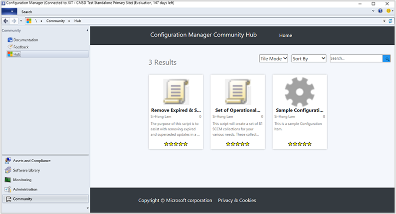
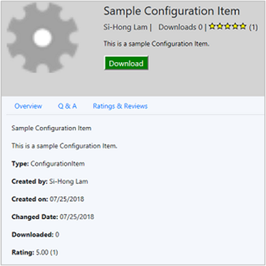
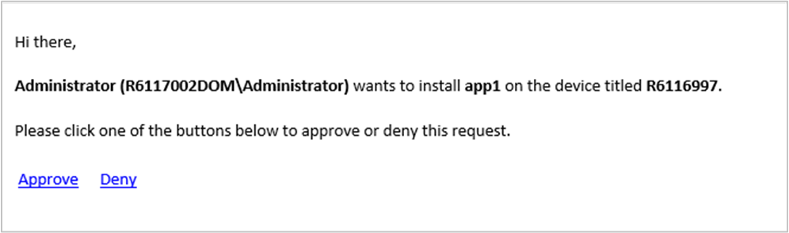

# Capabilities in Configuration Manager technical preview version 1807 

*Applies to: Configuration Manager (technical preview branch)*

This article introduces the features that are available in the technical preview for Configuration Manager, version 1807. Install this version to update and add new features to your technical preview site. 

Review the [technical preview](technical-preview.md) article before installing this update. That article familiarizes you with the general requirements and limitations for using a technical preview, how to update between versions, and how to provide feedback.     


<!--  Known Issues Template
## Known issues 

### <a name="ki_ANCHOR"></a> Known issue title
<!--bugID--
Issue description and cause.

#### Workaround
Steps to workaround, if any.  
-->


## Known issues 

### <a name="ki_o365"></a> Issues with Microsoft 365 software updates
<!--521365-->
If you manage Microsoft 365 updates using technical preview branch versions 1806 and 1806.2, they may fail to install on clients. 

#### Workaround
- Delete existing deployment packages and software update groups for Microsoft 365.  

- Starting on July 31, 2018, sync Microsoft 365 software updates and deploy only the latest updates.  


</br>

**The following sections describe the new features to try out in this version:**  


## <a name="bkmk_hub"></a> Community Hub
<!--1357766-->

The Community Hub is a centralized location for sharing useful Configuration Manager objects with others. See the new **Community** workspace in the Configuration Manager console, and select the **Hub** node. Use the Community Hub to download the following types of Configuration Manager objects: 
- Scripts
- Configuration items



To see more details about an available item, click it in the hub. From the details page, click **Download** to acquire the item. When you download an item from the hub, it's automatically added to your site. 



The **Community** workspace also includes the following nodes:

- **Documentation**: Displays the Configuration Manager [documentation library](/sccm/)  

- **Feedback**: Displays the Configuration Manager product feedback site


### Prerequisites

- Use the Configuration Manager console on a client OS.  

    - Alternatively but not recommended: on a server OS, disable [Internet Explorer: Enhanced Security Configuration](/previous-versions/windows/it-pro/windows-server-2008-R2-and-2008/dd883248(v=ws.10)).

- The computer with the console requires internet access, and connectivity to the following sites:  
    - `https://aka.ms`  
    - `https://comfigmgr-hub.azurewebsites.net`  
    - `https://configmgronline.visualstudio.com`  


### Known issue

Contributing items to the hub isn't currently available in this version. 


## <a name="bkmk_osd"></a> Specify the drive for offline OS image servicing  
<!--1358924-->

Based on your feedback, now specify the drive that Configuration Manager uses during offline servicing of OS images. This process can consume a large amount of disk space with temporary files, so this option gives you flexibility to select the drive to use.


### Try it out!

Try to complete the tasks. Then send [Feedback](capabilities-in-technical-preview-1804.md#bkmk_feedback) with your thoughts on the feature.

1. In the Configuration Manager console, go to the **Administration** workspace, expand **Site Configuration**, and select the **Sites** node. In the ribbon, click **Configure Site Components** and select **Software Update Point**.  

2. Switch to the **Offline Servicing** tab, and specify the option for **A local drive to be used by offline servicing of images**.  

By default, this setting is **Automatic**. With this value, Configuration Manager selects the drive on which it's installed. 

During offline servicing, Configuration Manager stores temporary files in the folder, `<drive>:\ConfigMgr_OfflineImageServicing`. It also mounts the OS images in this folder. 

Review the **OfflineServicingMgr.log** log file. 


## <a name="bkmk_comgmt"></a> Co-managed device sync activity from Intune
<!--1358565-->

Display in the Configuration Manager console whether a co-managed device is active with Microsoft Intune. This state is based on data from the [Intune Data Warehouse](/mem/intune-service/developer/reports-nav-create-intune-reports). The **Client Status** dashboard in the Configuration Manager console shows **Inactive clients using Intune**. This new category is for co-managed devices that are inactive with Configuration Manager, but have synchronized with the Intune service in the past week.


### Try it out!

Try to complete the tasks. Then send [Feedback](capabilities-in-technical-preview-1804.md#bkmk_feedback) with your thoughts on the feature.

If you've already set up your site for co-management: 

1. In the Configuration Manager console, go to the **Administration** workspace, expand **Cloud Services**, and select the **Co-management** node. Click **Properties** in the ribbon.  

2. Switch to the **Reporting** tab. Click **Sign In** and authenticate. Then click **Update** to enable read permissions for the Intune Data Warehouse.  

3. After the site syncs with Intune, go to the **Monitoring** workspace, and select the **Client Status** node. In the **Overall Client Status** section, see the row for **Inactive clients using Intune**.  

For more information about enabling co-management, see [Co-management for Windows 10 devices](../../comanage/overview.md).


## <a name="bkmk_app-repair"></a> Repair applications
<!--1357866-->

Based on your feedback, now specify a repair command line for Windows Installer and Script Installer deployment types.


### Try it out!

Try to complete the tasks. Then send [Feedback](capabilities-in-technical-preview-1804.md#bkmk_feedback) with your thoughts on the feature.

1. In the Configuration Manager console, open the properties of a Windows Installer or Script Installer deployment type.  

2. Switch to the **Programs** tab. Specify the **Repair program** command.  

3. Deploy the app. On the **Deployment Settings** tab of the deployment, enable the option to **Allow end users to attempt to repair this application**.  


### Known issue

The new button in Software Center for users to **Repair** the app isn't visible in this version.  


## <a name="bkmk_email-approve"></a> Approve application requests via email
<!--1321550-->

Configure email notifications for application approval requests. When a user requests an application, you receive an email. Click links in the email to approve or deny the request, without requiring the Configuration Manager console.


### Prerequisites

#### To send email notifications
- Enable the [optional feature](../servers/manage/optional-features.md) **Approve application requests for users per device**.  

- Configure [email notification for alerts](../servers/manage/configure-alerts.md#configure-email-notification-for-alerts).  

#### To approve or deny requests from email
If you don't configure these prerequisites, the site sends email notification for application requests without links to approve or deny the request.  

- In the site properties, **Enable REST endpoint for all providers roles on this site and allow Configuration Manager cloud management gateway traffic**. For more information, see [OData endpoint data access](capabilities-in-technical-preview-1612.md#odata-endpoint-data-access).  

    - Restart the SMS_EXEC service after enabling the REST endpoint

- [Cloud management gateway](../clients/manage/cmg/overview.md)  

- Onboard the site to [Azure services](../servers/deploy/configure/azure-services-wizard.md) for **Cloud Management**  

    - Enable [Microsoft Entra user Discovery](../servers/deploy/configure/configure-discovery-methods.md#azureaadisc)  

    - Manually configure the following settings for this native app in Microsoft Entra ID:  

        - **Redirect URI**: `https://<CMG FQDN>/CCM_Proxy_ServerAuth/ImplicitAuth`. Use the fully qualified domain name (FQDN) of the cloud management gateway (CMG) service, for example, GraniteFalls.Contoso.com.   

        - **Manifest**: set **oauth2AllowImplicitFlow** to true: `"oauth2AllowImplicitFlow": true,`  


### Try it out!

Try to complete the tasks. Then send [Feedback](capabilities-in-technical-preview-1804.md#bkmk_feedback) with your thoughts on the feature.

1. In the Configuration Manager console, deploy an application as available to a user collection. On the **Deployment Settings** page, enable it for approval. Then enter a *single* email address to receive notification.  

     > [!Note]  
     > Anyone in your Microsoft Entra organization who receives the email can approve the request. Don't forward the email to others unless you want them to take action.  

2. As a user, request the application in Software Center.  

3. You receive an email notification similar to the following example:  



> [!Note]  
> The link to approve or deny is for one-time use. For example, you configure a group alias to receive notifications. Meg approves the request. Now Bruce can't deny the request.  


## <a name="bkmk_script"></a> Improvement to script output
<!--1236459-->

You can now view detailed script output in raw or structured JSON format. This formatting makes the output easier to read and analyze. If the script returns valid JSON-formatted text, then view the detailed output as either **JSON Output** or **Raw Output**. Otherwise the only option is **Script Output**. 

#### Example: Script output is valid JSON
Command: `$PSVersionTable.PSVersion`  

``` Output
Major  Minor  Build  Revision
-----  -----  -----  --------
5      1      16299  551
```

#### Example: Script output isn't valid JSON
Command: `Write-Output (Get-WmiObject -Class Win32_OperatingSystem).Caption`  

``` Output
Microsoft Windows 10 Enterprise
```


### Try it out!

Try to complete the tasks. Then send [Feedback](capabilities-in-technical-preview-1804.md#bkmk_feedback) with your thoughts on the feature.

1. In the Configuration Manager console, go to the **Assets and Compliance** workspace, and select the **Device Collections** node. Right-click a collection, and select **Run Script**. For more information on creating and running scripts, see [Create and run PowerShell scripts from the Configuration Manager console](../../apps/deploy-use/create-deploy-scripts.md).  

2. Run a script on the target collection.  

3. On the **Script Status Monitoring** page of the Run Script wizard, select the **Summary** tab at the bottom. Change the two drop-down lists at the top to **Script Output** and **Data Table**. Then double-click the results row to open the **Detailed Output** dialog box.  

4. On the **Script Status Monitoring** page of the Run Script wizard, select the **Run Details** tab at the bottom. Double-click a results row to open the Detailed Output dialog box for that device.  


## <a name="bkmk_3pupdate"></a> Improvement to third-party software updates
<!--1358714-->

You can now modify the properties of custom catalogs.

For more information, see [Third-party software updates support for custom catalogs](capabilities-in-technical-preview-1806-2.md#bkmk_3pupdate).


## Next steps

For more information about installing or updating the technical preview branch, see [Technical preview](technical-preview.md).    

For more information about the different branches of Configuration Manager, see [Which branch of Configuration Manager should I use?](../understand/which-branch-should-i-use.md)
