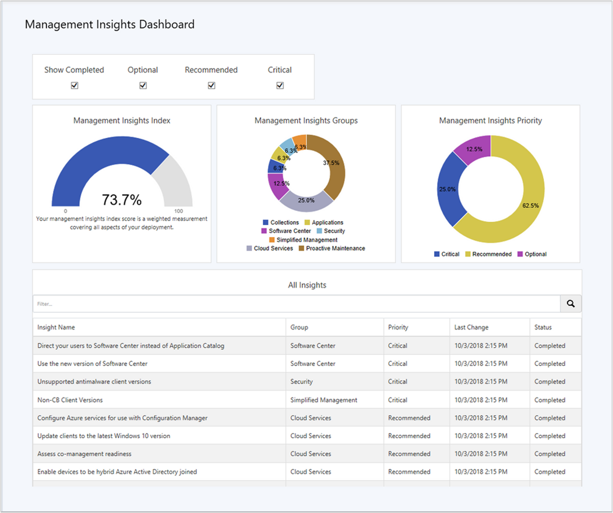

##  Management insights dashboard
<!--1357979-->

The **Management Insights** node now includes a graphical dashboard. This dashboard displays an overview of the rule states, which makes it easier for you to show your progress. For more general information, see [Management insights](../../../servers/manage/management-insights.md).

Use the following filters at the top of the dashboard to refine the view:
- Show Completed
- Optional
- Recommended
- Critical

The dashboard includes the following tiles:
- **Management insights index**: Tracks overall progress on management insights rules. The index is a weighted average. Critical rules are worth the most. This index gives the least weight to optional rules.  

- **Management insights groups**: Shows percent of rules in each group, honoring the filters. Select a group to drill down to the specific rules in this group.  

- **Management insights priority**: Shows percent of rules by priority, honoring the filters. Select a priority to drill down to the specific rules with this priority.  

- **All insights**: A table of insights including priority and state.  

