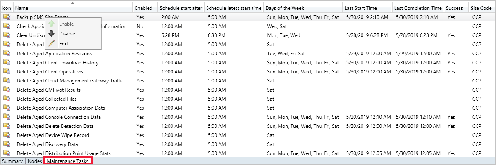
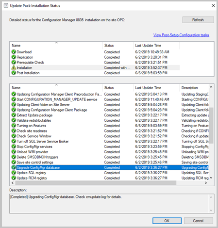
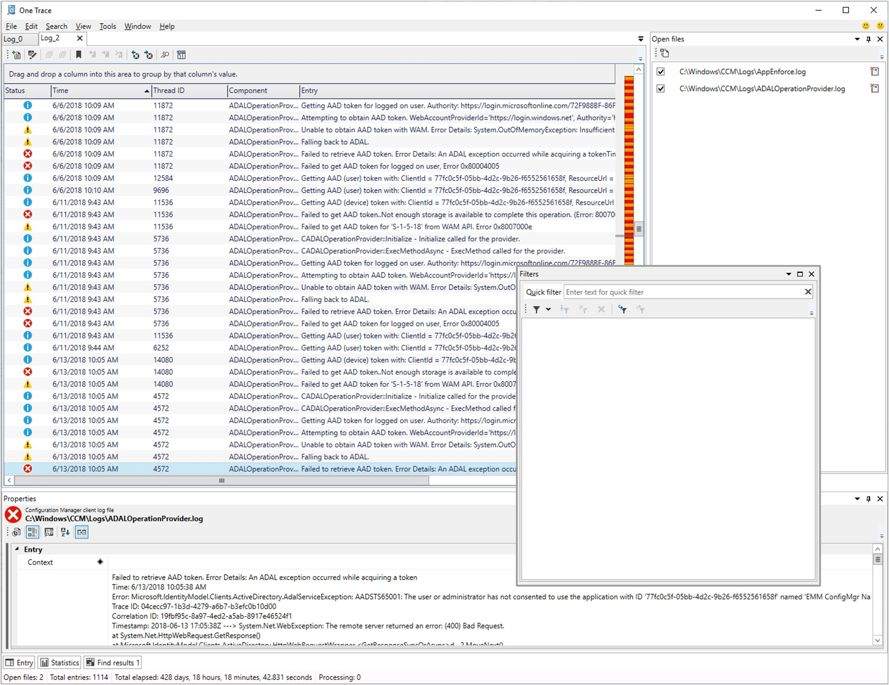
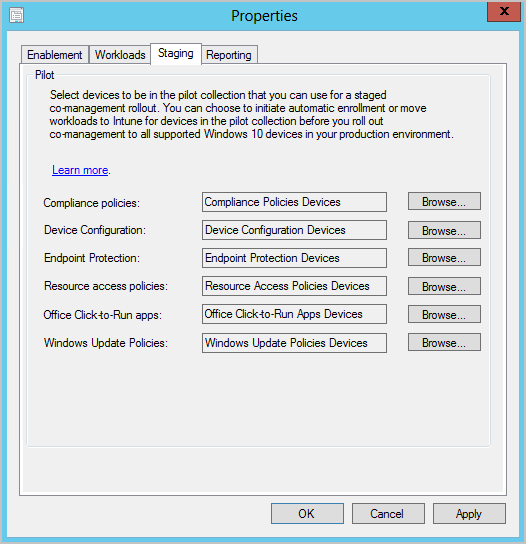
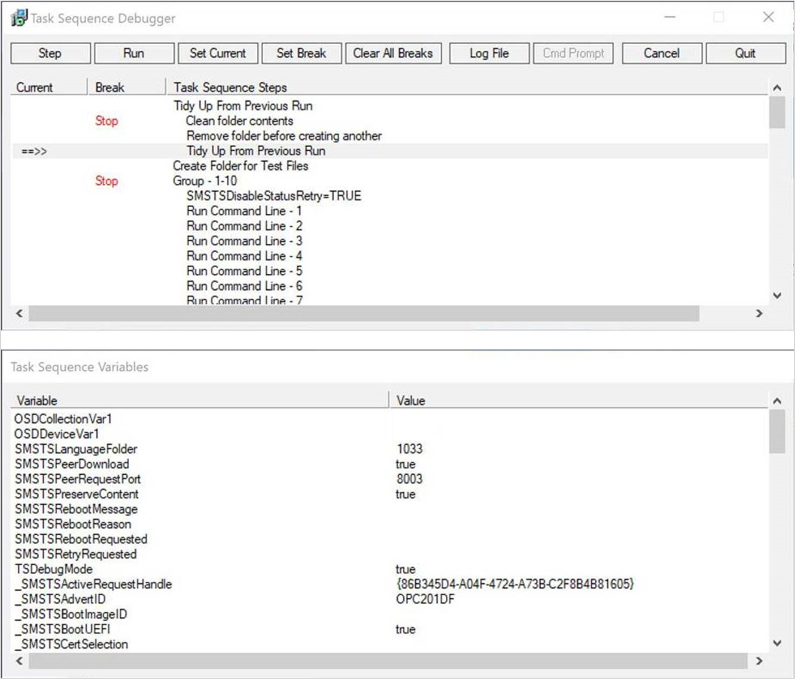

# What's new in version 1906 of Configuration Manager current branch

*Applies to: Configuration Manager (current branch)*

Update 1906 for Configuration Manager current branch is available as an in-console update. Apply this update on sites that run version 1802 or later. <!-- baseline only statement:When installing a new site, it's also available as a baseline version.--> This article summarizes the changes and new features in Configuration Manager, version 1906.  

Always review the latest checklist for installing this update. For more information, see [Checklist for installing update 1906](../../servers/manage/checklist-for-installing-update-1906.md). After you update a site, also review the [Post-update checklist](../../servers/manage/checklist-for-installing-update-1906.md#post-update-checklist).

To take full advantage of new Configuration Manager features, after you update the site, also update clients to the latest version. While new functionality appears in the Configuration Manager console when you update the site and console, the complete scenario isn't functional until the client version is also the latest.

## Requirement changes

### Version 1906 client requires SHA-2 code signing support

<!--SCCMDocs-pr#3404-->
Because of weaknesses in the SHA-1 algorithm and to align to industry standards, Microsoft now only signs Configuration Manager binaries using the more secure SHA-2 algorithm. The following Windows OS versions require an update for SHA-2 code signing support:

- Windows 7 SP1
- Windows Server 2008 R2 SP1
- Windows Server 2008 SP2

For more information, see [Prerequisites for Windows clients](../../clients/deploy/prerequisites-for-deploying-clients-to-windows-computers.md#sha-2-code-signing-support).

##  Site infrastructure

### Site server maintenance task improvements

<!--3555894-->
Site server maintenance tasks can now be viewed and edited from their own tab on the details view of a site server. The new **Maintenance Tasks** tab gives you information such as:

- If the task is enabled
- The task schedule
- Last start time
- Last completion time
- If the task completed successfully

For more information, see [Maintenance tasks](../../servers/manage/maintenance-tasks.md#bkmk_MTs1906).

### Configuration Manager update database upgrade monitoring

<!--4200581-->
When applying a Configuration Manager update, you can now see the state of the **Upgrade ConfigMgr database** task in the  installation status window.

- If the database upgrade is blocked, then you'll be given the warning, **In progress, needs attention**.
   - The cmupdate.log will log the program name and sessionid from SQL Server that is blocking the database upgrade.
- When the database upgrade is no longer blocked, the status will be reset to **In progress** or **Complete**.
   - When the database upgrade is blocked, a check is done every 5 minutes to see if it's still blocked.

   

For more information, see [Install in-console updates](../../servers/manage/install-in-console-updates.md#3-monitor-the-progress-of-updates-as-they-install).

### Management insights rule for NTLM fallback

<!--4572953-->
Management insights includes a new rule that detects if you enabled the less secure NTLM authentication fallback method for the site: **NTLM fallback is enabled**.

For more information, see [Management insights](../../servers/manage/management-insights.md#security).

### Improvements to support for SQL Server Always On availability groups

- Add a new synchronous replica from setup<!--3127336-->: You can now add a new secondary replica node to an existing availability group. Instead of a manual process, use Configuration Manager setup to make this change. For more information, see [Configure an availability group](../../servers/deploy/configure/configure-aoag.md#bkmk_sync).

- Multi-subnet failover<!-- SCCMDocs-pr#3734 -->: You can now enable the [MultiSubnetFailover connection string keyword](/sql/database-engine/availability-groups/windows/create-or-configure-an-availability-group-listener-sql-server#MultiSubnetFailover) in SQL Server. You also need to manually configure the site server. For more information, see the [Multi-subnet failover](../../servers/deploy/configure/sql-server-alwayson-for-a-highly-available-site-database.md#multi-subnet-failover) prerequisite.

- Support for distributed views<!-- SCCMDocs-pr#3792 -->: The site database can be hosted on an availability group, and you can enable database replication links to use [distributed views](../hierarchy/data-transfers-between-sites.md#bkmk_dbrep).

    > [!NOTE]
    > This change doesn't apply to SQL Server Always On failover cluster instances.

- Site Recovery can recreate the database on an availability group. This process works with both manual and automatic seeding.<!-- SCCMDocs-pr#3846 -->

- New setup prerequisite checks:<!-- SCCMDocs-pr#3899 -->  

  - Availability group replicas must all have the same seeding mode

  - Availability group replicas must be healthy

##  Cloud-attached management

### Azure Active Directory user group discovery

<!--3611956-->

You can now discover user groups and members of those groups from Azure Active Directory (Azure AD). Users found in Azure AD groups that the site hasn't previously discovered are added as user resources in Configuration Manager. A user group resource record is created when the group is a security group. This feature is a [pre-release feature](../../servers/manage/pre-release-features.md) and needs to be enabled.

For more information, see [Configure discovery methods](../../servers/deploy/configure/configure-discovery-methods.md#bkmk_azuregroupdisco).

### Synchronize collection membership results to Azure Active Directory groups

<!--3607475-->

You can now enable the synchronization of collection memberships to an Azure Active Directory (Azure AD) group. This synchronization is a pre-release feature. To enable it, see [Pre-release features](../../servers/manage/pre-release-features.md).

The synchronization allows you to use your existing on-premises grouping rules in the cloud by creating Azure AD group memberships based on collection membership results. Only devices with an Azure Active Directory record are reflected in the Azure AD Group. Both Hybrid Azure AD Joined and Azure Active Directory joined devices are supported.

For more information, see [Create collections](../../clients/manage/collections/create-collections.md#bkmk_aadcollsync).

##  Desktop Analytics

### Readiness insights for desktop apps

<!-- 4021225 -->

You can now get more detailed insights for your desktop applications including line-of-business apps. The former App Health Analyzer toolkit is now integrated with the Configuration Manager client. This integration simplifies deployment and manageability of app readiness insights in the Desktop Analytics portal.

For more information, see [Compatibility assessment in Desktop Analytics](../../../desktop-analytics/compat-assessment.md#advanced-insights).

### DALogsCollector tool

<!--4622989-->
Use the DesktopAnalyticsLogsCollector.ps1 tool from the Configuration Manager install directory to help troubleshoot Desktop Analytics. It runs some basic troubleshooting steps and collects the relevant logs into a single working directory.

For more information, see [Logs collector](../../../desktop-analytics/log-collector.md).

##  Real-time management

### Add joins, additional operators, and aggregators in CMPivot

<!--4054074-->

For CMPivot, you now have additional arithmetic operators, aggregators, and the ability to add query joins such as using Registry and File together.

For more information, see [CMPivot](../../servers/manage/cmpivot-changes.md#bkmk_cmpivot1906).

### CMPivot standalone

<!--3555890, 4619340, 4692885 -->

You can now use CMPivot as a standalone app. CMPivot standalone is a **pre-release feature** and is only available in English. Run CMPivot outside of the Configuration Manager console to view the real-time state of devices in your environment. This change enables you to use CMPivot on a device without first installing the console.

You can share the power of CMPivot with other personas, such as helpdesk or security admins, who don’t have the console installed on their computer. These other personas can use CMPivot to query Configuration Manager alongside the other tools that they traditionally use. By sharing this rich management data, you can work together to proactively solve business problems that cross roles.

For more information, see [CMPivot](../../servers/manage/cmpivot.md#bkmk_standalone) and [Pre-release features](../../servers/manage/pre-release-features.md#list-of-pre-release-features).

### Added permissions to the Security Administrator role

<!--4683130-->

The following permissions have been added to Configuration Manager's built-in [**Security Administrator**](../../understand/fundamentals-of-role-based-administration.md#security-roles) role:

- Read on SMS Script
- Run CMPivot on Collection
- Read on Inventory Report

For more information, see [CMPivot](../../servers/manage/cmpivot-changes.md#bkmk_cmpivot_secadmin1906).

##  Content management

### Delivery Optimization download data in client data sources dashboard

<!--3555759-->
The client data sources dashboard now includes [Delivery Optimization](../hierarchy/fundamental-concepts-for-content-management.md#delivery-optimization) data. This dashboard helps you understand from where clients are getting content in your environment.

For more information, see [Client Data Sources dashboard](../../servers/deploy/configure/monitor-content-you-have-distributed.md#client-data-sources-dashboard).

### Use your distribution point as an in-network cache server for Delivery Optimization

<!--3555764-->
You can now install Delivery Optimization In-Network Cache server on your distribution points. By caching this content on-premises, your clients can benefit from the Delivery Optimization feature, but you can help to protect WAN links.

This cache server acts as an on-demand transparent cache for content downloaded by Delivery Optimization. Use client settings to make sure this server is offered only to the members of the local Configuration Manager boundary group.

For more information, see [Delivery Optimization In-Network Cache in Configuration Manager](../hierarchy/microsoft-connected-cache.md).

##  Client management

### Support for Windows Virtual Desktop

<!--3556025-->
[Windows Virtual Desktop](/azure/virtual-desktop/) is a preview feature of Microsoft Azure and Microsoft 365. You can now use Configuration Manager to manage these virtual devices running Windows in Azure.

Similar to a terminal server, these virtual devices allow multiple concurrent active user sessions. To help with client performance, Configuration Manager now disables user policies on any device that allows these multiple user sessions. Even if you enable user policies, the client disables them by default on these devices, which include Windows Virtual Desktop and terminal servers.

For more information, see [Supported OS versions for clients and devices](../configs/supported-operating-systems-for-clients-and-devices.md#windows-computers).

### Support Center OneTrace (Preview)

<!--3555962-->
OneTrace is a new log viewer with Support Center. It works similarly to CMTrace, with the following improvements:

- A tabbed view
- Dockable windows
- Improved search capabilities
- Ability to enable filters without leaving the log view
- Scrollbar hints to quickly identify clusters of errors
- Fast log opening for large files

For more information, see [Support Center OneTrace](../../support/support-center-onetrace.md).

### Configure client cache minimum retention period

<!--4485509-->
You can now specify the minimum time for the Configuration Manager client to keep cached content. This client setting defines the minimum amount of time Configuration Manager agent should wait before it can remove content from the cache in case more space is needed. In the **Client cache settings** group of client settings, configure the following setting: **Minimum duration before cached content can be removed (minutes)**.

> [!Note]  
> In the same client setting group, the existing setting to **Enable Configuration Manager client in full OS to share content** is now renamed to **Enable as peer cache source**. The behavior of the setting doesn't change.  

For more information, see [Client cache settings](../../clients/deploy/about-client-settings.md#client-cache-settings).

##  Co-management

### Improvements to co-management auto-enrollment

- A new co-managed device now automatically enrolls to the Microsoft Intune service based on its Azure Active Directory (Azure AD) *device* token. It doesn't need to wait for a user to sign in to the device for auto-enrollment to start. This change helps to reduce the number of devices with the [enrollment status](../../../comanage/how-to-monitor.md#co-management-enrollment-status) *Pending user sign in*.<!-- 4454491 -->

- For customers that already have devices enrolled to co-management, new devices now enroll immediately once they meet the prerequisites. For example, once the device is joined to Azure AD and the Configuration Manager client is installed.<!--4321130-->

For more information, see [Enable co-management](../../../comanage/how-to-enable.md).

### Multiple pilot groups for co-management workloads

<!--3555750-->
You can now configure different pilot collections for each of the co-management workloads. Using different pilot collections allows you to take a more granular approach when shifting workloads.

- In the **Enablement** tab, you can now specify an **Intune Auto Enrollment** collection.
    - The **Intune Auto Enrollment** collection should contain all of the clients you want to onboard into co-management. It's essentially a superset of all the other staging collections.

- In the **Staging** tab, instead of using one pilot collection for all workloads, you can now choose an individual collection for each workload.

    

These options are also available when you first enable co-management.

For more information, see [Enable co-management](../../../comanage/how-to-enable.md).

### Co-management support for government cloud

<!--4075452-->
U.S. government customers can now use co-management with the Azure U.S. Government Cloud (portal.azure.us). For more information, see [Enable co-management](../../../comanage/how-to-enable.md).

##  Application management

### Filter applications deployed to devices

<!--4451056-->
User categories for device-targeted application deployments now show as filters in Software Center. Specify a **user category** for an application on the **Software Center** page of its properties. Then open the app in Software Center and look at the available filters.

For more information, see [Manually specify application information](../../../apps/deploy-use/create-applications.md#bkmk_manual-app).

### Application groups

<!--3555907-->
Create a group of applications that you can send to a user or device collection as a single deployment. The metadata you specify about the app group is seen in Software Center as a single entity. You can order the apps in the group so that the client installs them in a specific order.

This feature is pre-release. To enable it, see [Pre-release features](../../servers/manage/pre-release-features.md).

For more information, see [Create application groups](../../../apps/deploy-use/create-app-groups.md).

### Retry the install of pre-approved applications

<!--4336307-->
You can now retry the installation of an app that you previously approved for a user or device. The approval option is only for available deployments. If the user uninstalls the app, or if the initial install process fails, Configuration Manager doesn't reevaluate its state and reinstall it. This feature allows a support technician to quickly retry the app install for a user that calls for help.

For more information, see [Approve applications](../../../apps/deploy-use/app-approval.md).

### Install an application for a device

<!--4402180-->
From the Configuration Manager console, you can now install applications to a device in real time. This feature can help reduce the need for separate collections for every application.

For more information, see [Install applications for a device](../../../apps/deploy-use/install-app-for-device.md).

### Improvements to app approvals

<!--4224910-->
This release includes the following improvements to app approvals:

- If you approve an app request in the console, and then deny it, you can now approve it again. The app is reinstalled on the client after you approve it.  

- In the Configuration Manager console, **Software Library** workspace, under **Application Management**, the **Approval Requests** node is renamed **Application Requests**.<!-- SCCMDocs-pr#4028 -->

- There's a new WMI method, **DeleteInstance** to remove an app approval request. This action doesn't uninstall the app on the device. If it's not already installed, the user can't install the app from Software Center.

- Call the **CreateApprovedRequest** API to create a pre-approved request for an app on a device. To prevent automatically installing the app on the client, set the **AutoInstall** parameter to `FALSE`. The user sees the app in Software Center, but it's not automatically installed.

For more information, see [Approve applications](../../../apps/deploy-use/app-approval.md).

##  OS deployment

### Task sequence debugger

<!--3612274-->
The task sequence debugger is a new troubleshooting tool. You deploy a task sequence in debug mode to a collection of one device. It lets you step through the task sequence in a controlled manner to aid troubleshooting and investigation.

This feature is pre-release. To enable it, see [Pre-release features](../../servers/manage/pre-release-features.md).

For more information, see [Debug a task sequence](../../../osd/deploy-use/debug-task-sequence.md).

### Clear app content from client cache during task sequence

<!--4485675-->
In the **Install Application** task sequence step, you can now delete the app content from the client cache after the step runs.

For more information, see [About task sequence steps](../../../osd/understand/task-sequence-steps.md#BKMK_InstallApplication).

> [!Important]  
> Update the target client to the latest version to support this new feature.

### Reclaim SEDO lock for task sequences

<!--3699337-->
If the Configuration Manager console stops responding, you can be locked out of making further changes to a task sequence. Now when you attempt to access a locked task sequence, you can now **Discard Changes**, and continue editing the object.

For more information, see [Use the task sequence editor](../../../osd/understand/task-sequence-editor.md#bkmk_sedo).

### Pre-cache driver packages and OS images

<!--4224642-->
Task sequence pre-cache now includes additional content types. Pre-cache content previously only applied to OS upgrade packages. Now you can use pre-caching to reduce bandwidth consumption of:

- OS images
- Driver packages
- Packages

For more information, see [Configure pre-cache content](../../../osd/deploy-use/configure-precache-content.md).

### Improvements to OS deployment

This release includes the following improvements to OS deployment:

- Use the following two PowerShell cmdlets to create and edit the [Run Task Sequence](../../../osd/understand/task-sequence-steps.md#child-task-sequence) step:<!--2839943-->

    - **New-CMTSStepRunTaskSequence**

    - **Set-CMTSStepRunTaskSequence**

- It's now easier to edit variables when you run a task sequence. After you select a task sequence in the Task Sequence Wizard window, the page to edit task sequence variables includes an **Edit** button.<!-- 4668846 --> For more information, see [How to use task sequence variables](../../../osd/understand/using-task-sequence-variables.md#bkmk_set-tswiz).

- The **Disable BitLocker** task sequence step has a new restart counter. Use this option to specify the number of restarts to keep BitLocker disabled. This change helps you simplify your task sequence. You can use a single step, instead of adding multiple instances of this step. <!--4512937--> For more information, see [Disable BitLocker](../../../osd/understand/task-sequence-steps.md#BKMK_DisableBitLocker).

- Use the new task sequence variable **SMSTSRebootDelayNext** with the existing [SMSTSRebootDelay](../../../osd/understand/task-sequence-variables.md#SMSTSRebootDelay) variable. If you want any later reboots to happen with a different timeout than the first, set this new variable to a different value in seconds. <!--4447680--> For more information, see [SMSTSRebootDelayNext](../../../osd/understand/task-sequence-variables.md#SMSTSRebootDelayNext).

- The task sequence sets a new read-only variable **_SMSTSLastContentDownloadLocation**. This variable contains the last location where the task sequence downloaded or attempted to download content. Inspect this variable instead of parsing the client logs.<!-- 2840337 -->

- When you create task sequence media, Configuration Manager doesn't add an autorun.inf file. This file is commonly blocked by antimalware products. You can still include the file if necessary for your scenario.<!-- 4090666 -->

### Improvements to PXE

Option 82 during the PXE DHCP handshake is now supported with the PXE responder without WDS. Option 82 is not supported with WDS.

##  Software Center

### Improvements to Software Center tab customizations

<!--4063773-->
You can now add up to five custom tabs in Software Center. You can also edit the order in which these tabs appear in Software Center.

For more information, see [Software Center client settings](../../clients/deploy/about-client-settings.md#software-center).

### Software Center infrastructure improvements

<!--3555950-->

This release includes the following infrastructure improvements to Software Center:

- Software Center now communicates with a management point for apps targeted to users as available. It doesn't use the application catalog anymore. This change makes it easier for you to remove the application catalog from the site.

- Previously, Software Center picked the first management point from the list of available servers. Starting in this release, it uses the same management point that the client uses. This change allows Software Center to use the same management point from the assigned primary site as the client.

> [!Important]  
> These iterative improvements to Software Center and the management point are to retire the application catalog roles.
>
> - The Silverlight user experience isn't supported as of current branch version 1806.
> - Starting in version 1906, updated clients automatically use the management point for user-available application deployments. You also can't install new application catalog roles.
> - Support ends for the application catalog roles with version 1910.  

For more information, see [Remove the application catalog](../../../apps/plan-design/plan-for-and-configure-application-management.md#remove-the-application-catalog) and [Plan for Software Center](../../../apps/plan-design/plan-for-software-center.md).

### Redesigned notification for newly available software

<!--3555904-->
The **New Software is Available** notification will only show once for a user for a given application and revision. The user will no longer see the notification each time they sign in. They'll only see another notification for an application if it has changed or was redeployed.

For more information, see [Create and deploy an application](../../../apps/get-started/create-and-deploy-an-application.md#user-experience).

### More frequent countdown notifications for restarts

<!--3976435-->

End users will now be reminded more frequently of a pending restart with intermittent countdown notifications. You can define the interval for the intermittent notifications in **Client Settings** on the **Computer Restart** page. Change the value for **Specify the snooze duration for computer restart countdown notifications (minutes)** to configure how often a user is reminded about a pending restart until the final countdown notification occurs.

Additionally, the maximum value for **Display a temporary notification to the user that indicates the interval before the user is logged off or the computer restarts (minutes)** increased from 1440 minutes (24 hours) to 20160 minutes (two weeks).

For more information, see [Device restart notifications](../../clients/deploy/device-restart-notifications.md) and [About client settings](../../clients/deploy/about-client-settings.md#computer-restart).

### Direct link to custom tabs in Software Center

<!--4655176-->

You can now provide users with a direct link to a [custom tab](../../clients/deploy/about-client-settings.md#software-center-customization---tabs) in Software Center.

Use the following URL format to open Software Center to a particular tab:

`softwarecenter:page=CustomTab1`

The string `CustomTab1` is the first custom tab in order.

For example, type this URL in the Windows **Run** window.

You can also use this syntax to open default tabs in Software Center:

|Command line  |Tab  |
|---------|---------|
|`AvailableSoftware`|Applications|
|`Updates`|Updates|
|`OSD`|Operating Systems|
|`InstallationStatus`|Installation status|
|`Compliance`|Device compliance|
|`Options`|Options|

For more information, see [Software Center tab visibility](../../clients/deploy/about-client-settings.md#software-center-customization---tabs).

##  Software updates

### Additional options for WSUS maintenance

<!--4110109-->
You now have additional WSUS maintenance tasks that Configuration Manager can run to maintain healthy software update points. The WSUS maintenance occurs after every synchronization. In addition to declining expired updates in WSUS, Configuration Manager can now:

- Remove obsolete updates from the WSUS database.
- Add non-clustered indexes to the WSUS database to improve WSUS cleanup performance.

For more information, see [Software updates maintenance](../../../sum/deploy-use/software-updates-maintenance.md#wsus-cleanup-starting-in-version-1906).

### Configure the default maximum run time for software updates

<!--3734426-->

You can now specify the maximum amount of time a software update installation has to complete. You can specify the following items in the **Maximum Run Time** tab on the Software Update Point:

- **Maximum run time for Windows feature updates (minutes)**
- **Maximum run time for Office 365 updates and non-feature updates for Windows (minutes)**

For more information, see [Plan for software updates](../../../sum/plan-design/plan-for-software-updates.md#bkmk_maxruntime).

### Configure dynamic update during feature updates

<!--4062619-->

Use a new client setting to configure [Dynamic Update](https://techcommunity.microsoft.com/t5/Windows-IT-Pro-Blog/The-benefits-of-Windows-10-Dynamic-Update/ba-p/467847) during Windows 10 feature update installs. Dynamic Update installs language packs, features on demand, drivers, and cumulative updates during Windows setup by directing the client to download these updates from the internet.

For more information, see [Software update client settings](../../clients/deploy/about-client-settings.md#software-updates) and [Manage Windows as a service](../../../osd/deploy-use/manage-windows-as-a-service.md).

### New Windows 10, version 1903 and later product category

<!--4682946-->

**Windows 10, version 1903 and later** was added to Microsoft Update as its own product rather than being part of the **Windows 10**  product like earlier versions. This change caused you to do a number of manual steps to ensure that your clients see these updates. We've helped reduce the number of manual steps you have to take for the new product.

When you update to Configuration Manager version 1906 and have the **Windows 10** product selected for synchronization, the following actions occur automatically:

- The **Windows 10, version 1903 and later** product is added for synchronization.
- Automatic Deployment Rules containing the **Windows 10** product will be updated to include **Windows 10, version 1903 and later**.
- Servicing plans are updated to include the **Windows 10, version 1903 and later** product.

For more information, see [Configure classifications and products to synchronize](../../../sum/get-started/configure-classifications-and-products.md), [Servicing plans](../../../osd/deploy-use/manage-windows-as-a-service.md#servicing-plan-workflow), and [Automatic deployment rules](../../../sum/deploy-use/automatically-deploy-software-updates.md#bkmk_adr-process).

### Drill through required updates

<!--4224414-->
You can now drill through compliance statistics to see which devices require a specific software update. To view the device list, you need permission to view updates and the collections the devices belong to. To drill down into the device list, select the **View Required** hyperlink next to the pie chart in the **Summary** tab for an update. Clicking the hyperlink takes you to a temporary node under **Devices** where you can see the devices requiring the update.

The **View Required** hyperlink is available in the following locations:

   - **Software Library** > **Software Updates** > **All Software Updates**
   - **Software Library** > **Windows 10 Servicing** > **All Windows 10 Updates**
   - **Software Library** > **Office 365 Client Management** > **Office 365 Updates**

For more information, see [Monitor software updates](../../../sum/deploy-use/monitor-software-updates.md#drill-through-required-updates), [Manage Windows as a service](../../../osd/deploy-use/manage-windows-as-a-service.md#drill-through-required-updates), and [Manage Microsoft 365 Apps updates](../../../sum/deploy-use/manage-office-365-proplus-updates.md).

##  Office management

### Office 365 ProPlus upgrade readiness dashboard

<!--4021125-->

To help you determine which devices are ready to upgrade to Microsoft 365 Apps for enterprise, there's a new readiness dashboard. It includes the **Office 365 ProPlus upgrade readiness** tile that released in Configuration Manager current branch version 1902. In the Configuration Manager console, go to the **Software Library** workspace, expand **Office 365 Client Management**, and select the **Office 365 ProPlus Upgrade Readiness** node.

For more information on the dashboard, prerequisites, and using this data, see [Integration for Office 365 ProPlus readiness](../../../sum/deploy-use/office-365-dashboard.md#bkmk_readiness-dash).

##  Protection

### Windows Defender Application Guard file trust criteria
_Applies to version 2203 or earlier_
<!--3555858-->

There's a new policy setting that enables users to trust files that normally open in Windows Defender Application Guard (WDAG). Upon successful completion, the files will open on the host device instead of in WDAG.

For more information, see [Create and deploy Windows Defender Application Guard policy](../../../protect/deploy-use/create-deploy-application-guard-policy.md#bkmk_ABS).

##  Configuration Manager console

### Role-based access for folders

<!--3600867-->

You can now set security scopes on folders. If you have access to an object in the folder but don't have access to the folder, you'll be unable to see the object. Similarly, if you have access to a folder but not an object within it, you won't see that object. Right-click a folder, choose **Set Security Scopes**, then choose the security scopes you want to apply.

For more information, see [Configuration Manager console tips](../../servers/manage/admin-console-tips.md) and [Configure role-based administration](../../servers/deploy/configure/configure-role-based-administration.md#how-to-configure-security-scopes-for-an-object).

### Add SMBIOS GUID column to device and device collection nodes

<!--4526580-->
In both the **Devices** and **Device Collections** nodes, you can now add a new column for **SMBIOS GUID**. This value is the same as the **BIOS GUID** property of the System Resource class. It's a unique identifier for the device hardware.

### Administration service support for security nodes

<!--4223683-->
You can now enable some nodes of the Configuration Manager console to use the administration service. This change allows the console to communicate with the SMS Provider over HTTPS instead of via WMI.

For more information, see [Administration service](../hierarchy/plan-for-the-sms-provider.md#administration-service).

> [!Note]
> Starting in version 1906, the **Client Computer Communication** tab on the site properties is now called **Communication Security**.<!-- SCCMDocs#1645 -->  

### Collections tab in devices node

<!--4616810-->
In the **Assets and Compliance** workspace, go to the **Devices** node, and select a device. In the details pane, switch to the new **Collections** tab. This tab lists the collections that include this device.

> [!Note]  
> - This tab currently isn't available from a devices subnode under the **Device Collections** node. For example, when you select the option to **Show Members** on a collection.
> - This tab may not populate as expected for some users. To see the complete list of collections a device belongs to, you must have the **Full Administrator** security role. This is a known issue. <!--5107309-->

### Task sequences tab in applications node

<!--4616810-->
In the **Software Library** workspace, expand **Application Management**, go to the **Applications** node, and select an application. In the details pane, switch to the new **Task sequences** tab. This tab lists the task sequences that reference this application.

### Show collection name for scripts

<!--4616810-->
In the **Monitoring** workspace, select the **Script Status** node. It now lists the **Collection Name** in addition to the ID.

### Real-time actions from device lists

<!--4616810-->
There are various ways to display a list of devices under the **Devices** node in the **Assets and Compliance** workspace.

- In the **Assets and Compliance** workspace, select the **Device Collections** node. Select a device collection, and choose the action to **Show members**. This action opens a subnode of the **Devices** node with a device list for that collection.  

  - When you select the collection subnode, you can now start **CMPivot** from the Collection group of the ribbon.  

- In the **Monitoring** workspace, select the **Deployments** node. Select a deployment, and choose the **View Status** action in the ribbon. In the deployment status pane, double-click the total assets to drill-through to a device list.  

  - When you select a device in this list, you can now start **CMPivot** and **Run Scripts** from the Device group of the ribbon.  

### Order by program name in task sequence

<!--4616810-->
In the **Software Library** workspace, expand **Operating Systems**, and select the **Task Sequences** node. Edit a task sequence, and select or add the [Install Package](../../../osd/understand/task-sequence-steps.md#BKMK_InstallPackage) step. If a package has more than one program, the drop-down list now sorts the programs alphabetically.

### Correct names for client operations

<!--4616810-->
In the **Monitoring** workspace, select **Client Operations**. The operation to **Switch to next Software Update Point** is now properly named.

##  Deprecated features and operating systems

Learn about support changes before they're implemented in [removed and deprecated items](deprecated/removed-and-deprecated.md).

Version 1906 drops support for the following features:  

- You can't install new application catalog roles. Updated clients automatically use the management point for user-available application deployments. For more information, see [Plan for Software Center](../../../apps/plan-design/plan-for-software-center.md#configure-software-center).

Version 1906 deprecates support for the following products:  

- Windows CE 7.0
- Windows 10 Mobile
- Windows 10 Mobile Enterprise

## Other updates

As of this version, the following features are no longer pre-release:

- [SMS Provider administration service](../hierarchy/plan-for-the-sms-provider.md#administration-service)
- [Windows Defender Application Control management](../../../protect/deploy-use/use-device-guard-with-configuration-manager.md)

Aside from new features, this release also includes additional changes such as bug fixes. For more information, see [Summary of changes in Configuration Manager current branch, version 1906](https://support.microsoft.com/help/4514258).

For more information on changes to the Windows PowerShell cmdlets for Configuration Manager, see [PowerShell version 1906 release notes](/powershell/sccm/1906-release-notes).

The following update rollup (4517869) is available in the console starting on October 1, 2019: [Update rollup for Configuration Manager current branch, version 1906](https://support.microsoft.com/help/4517869).

<!--
### Hotfixes

The following additional hotfixes are available to address specific issues:

| ID | Title | Date | In-console |
|---------|---------|---------|---------|
| [4487960](https://support.microsoft.com/help/4487960) | Microsoft Intune connector certificate does not renew in Configuration Manager | 18 January 2019 | Yes |

> [!Note]  
> Starting in version 1902, in-console hotfixes now have supersedence relationships. For more information, see [Supersedence for in-console hotfixes](../../servers/manage/updates.md#bkmk_supersede).
-->

## Next steps

<!--At this time, version 1906 is released for the early update ring. To install this update, you need to opt in. For more information, see [Early update ring](../../servers/manage/checklist-for-installing-update-1906.md#early-update-ring). -->
As of August 16, 2019, version 1906 is globally available for all customers to install.

When you're ready to install this version, see [Installing updates for Configuration Manager](../../servers/manage/updates.md) and [Checklist for installing update 1906](../../servers/manage/checklist-for-installing-update-1906.md).

> [!TIP]  
> To install a new site, use a baseline version of Configuration Manager.  
>
> Learn more about:
>
> - [Installing new sites](../../servers/deploy/install/installing-sites.md)  
> - [Baseline and update versions](../../servers/manage/updates.md#bkmk_Baselines)  

For known, significant issues, see the [Release notes](../../servers/deploy/install/release-notes.md).

After you update a site, also review the [Post-update checklist](../../servers/manage/checklist-for-installing-update-1906.md#post-update-checklist).
