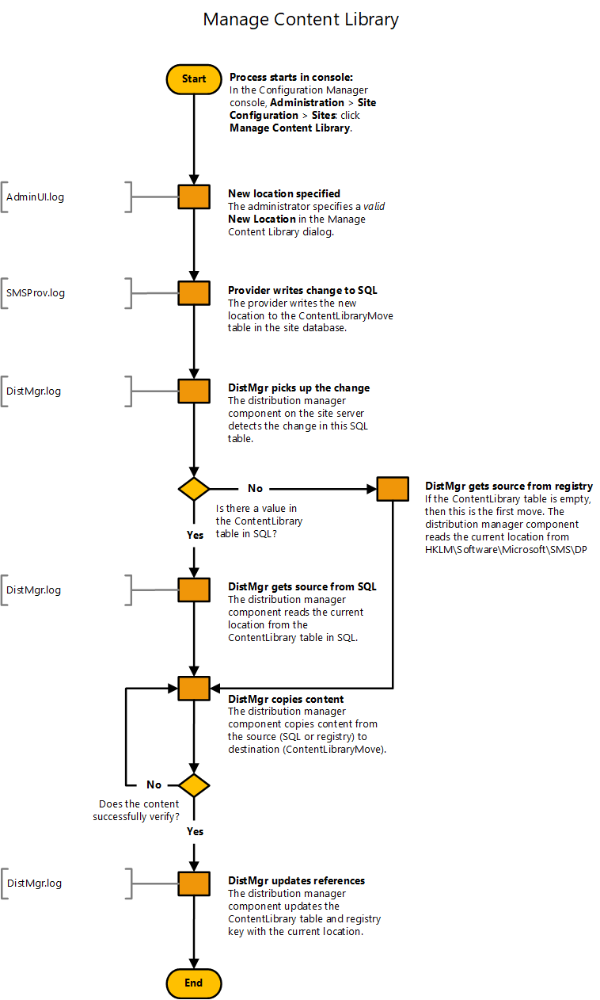

# Flowchart - Manage content library

*Applies to: Configuration Manager (current branch)*

This flowchart diagram shows the process by which the site moves the content library to a remote location. For more information, see the following articles:  
- [The content library](the-content-library.md)  
- [Site server high availability](../../servers/deploy/configure/site-server-high-availability.md)

