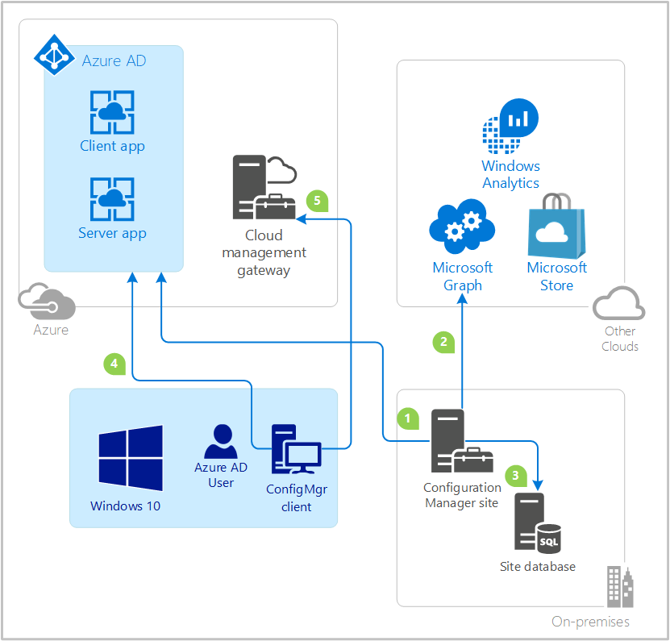

# Configure Azure services for use with Configuration Manager

*Applies to: Configuration Manager (current branch)*

Use the **Azure Services Wizard** to simplify the process of configuring the Azure cloud services you use with Configuration Manager. This wizard provides a common configuration experience by using Microsoft Entra web app registrations. These apps provide subscription and configuration details, and authenticate communications with Microsoft Entra ID. The app replaces entering this same information each time you set up a new Configuration Manager component or service with Azure.

## Available services

Configure the following Azure services using this wizard:  

- **Cloud Management**: This service enables the site and clients to authenticate by using Microsoft Entra ID. This authentication enables other scenarios, such as:  

  - [Install and assign Configuration Manager clients using Microsoft Entra ID for authentication](../../../clients/deploy/deploy-clients-cmg-azure.md)  

  - [Configure Microsoft Entra user Discovery](configure-discovery-methods.md#azureaadisc)  

  - [Configure Microsoft Entra user Group Discovery](configure-discovery-methods.md#bkmk_azuregroupdisco)

  - Support certain [cloud management gateway scenarios](../../../clients/manage/cmg/overview.md)  

    > [!TIP]
    > For more information specific to cloud management, see [Configure Microsoft Entra ID for cloud management gateway](../../../clients/manage/cmg/configure-azure-ad.md).

  - [App approval email notifications](../../../../apps/deploy-use/app-approval.md#bkmk_email-approve)

- **Log Analytics Connector**: [Connect to Azure Log Analytics](/azure/azure-monitor/platform/collect-sccm). Sync collection data to Log Analytics.  

    > [!IMPORTANT]
    > This article refers to the *Log Analytics Connector*, which was formerly called the *OMS Connector*. This feature was deprecated in November 2020. It's removed from Configuration Manager in version 2107. For more information, see [Removed and deprecated features](../../../plan-design/changes/deprecated/removed-and-deprecated-cmfeatures.md#unsupported-and-removed-features).<!-- 9649296 -->

- **Microsoft Store for Business**: Connect to the [Microsoft Store for Business](../../../../apps/deploy-use/manage-apps-from-the-windows-store-for-business.md). Get store apps for your organization that you can deploy with Configuration Manager.  

- **Administration Service Management**: When configuring Azure Services, for enhanced security you can select Administration Service Management option. Selecting this option allows administrators to segment their admin privileges between [cloud management](../../../clients/manage/cmg/overview.md) and [administration service](../../../../develop/adminservice/overview.md). By enabling this option, access is restricted to only administration service endpoints. Configuration Management clients will authenticate to the site using Microsoft Entra ID. *(version 2207 or later)*
    > [!NOTE]
    > Only CMG VMSS customers can enable administrative service management option. This option is not applicable for classic CMG customers. 

### Service details

The following table lists details about each of the services.  

- **Tenants**: The number of service instances you can configure. Each instance must be a distinct Microsoft Entra tenant.  

- **Clouds**: All services support the global Azure cloud, but not all services support private clouds, such as the Azure US Government cloud.  

- **Web app**: Whether the service uses a Microsoft Entra app of type *Web app / API*, also referred to as a server app in Configuration Manager.  

- **Native app**: Whether the service uses a Microsoft Entra app of type *Native*, also referred to as a client app in Configuration Manager.  

- **Actions**: Whether you can import or create these apps in the Configuration Manager Azure Services Wizard.  

|Service  |Tenants  |Clouds  |Web app  |Native app  |Actions  |
|---------|---------|---------|---------|---------|---------|
|Cloud management with Microsoft Entra discovery | Multiple | Public, Private |  |  | Import, Create |
|Log Analytics Connector | One | Public, Private |  |  | Import |
|Microsoft Store for Business | One | Public |  |  | Import, Create |

### About Microsoft Entra apps

Different Azure services require distinct configurations, which you make in the Azure portal. Additionally, the apps for each service can require separate permissions to Azure resources.  

You can use a single app for more than one service. There's only one object to manage in Configuration Manager and Microsoft Entra ID. When the security key on the app expires, you only have to refresh one key.

When you create additional Azure services in the wizard, Configuration Manager is designed to reuse information that's common between services. This behavior helps you from needing to input the same information more than once.

For more information about the required app permissions and configurations for each service, see the relevant Configuration Manager article in [Available services](#available-services).

For more information about Azure apps, start with the following articles:

- [Authentication and authorization in Azure App Service](/azure/app-service/app-service-authentication-overview)
- [Web Apps overview](/azure/app-service-web/app-service-web-overview)
- [Basics of Registering an Application in Microsoft Entra ID](/azure/active-directory/develop/authentication-scenarios)  
- [Register your application with your Microsoft Entra tenant](/azure/active-directory/active-directory-app-registration)

## Before you begin

After you decide the service to which you want to connect, refer to the table in [Service details](#service-details). This table provides information you need to complete the Azure Service Wizard. Have a discussion in advance with your Microsoft Entra administrator. Decide which of the following actions to take:

- Manually create the apps in advance in the Azure portal. Then import the app details into Configuration Manager.  

    > [!TIP]
    > For more information specific to cloud management, see [Manually register Microsoft Entra apps for the cloud management gateway](../../../clients/manage/cmg/manually-register-azure-ad-apps.md).

- Use Configuration Manager to directly create the apps in Microsoft Entra ID. To collect the necessary data from Microsoft Entra ID, review the information in the other sections of this article.  

Some services require the Microsoft Entra apps to have specific permissions. Review the information for each service to determine any required permissions. For example, before you can import a web app, an Azure administrator must first create it in the [Azure portal](https://portal.azure.com).

When configuring the Log Analytics Connector, give your newly registered web app *contributor* permission on the resource group that contains the relevant workspace. This permission allows Configuration Manager to access that workspace. When assigning the permission, search for the name of the app registration in the **Add users** area of the Azure portal. This process is the same as when [providing Configuration Manager with permissions to Log Analytics](/azure/log-analytics/log-analytics-sccm#grant-configuration-manager-with-permissions-to-log-analytics). An Azure administrator must assign these permissions before you import the app into Configuration Manager.

## Start the Azure Services wizard

1. In the Configuration Manager console, go to the **Administration** workspace, expand **Cloud Services**, and select the **Azure Services** node.  

2. On the **Home** tab of the ribbon, in the **Azure Services** group, select **Configure Azure Services**.  

3. On the **Azure Services** page of the Azure Services Wizard:  

    1. Specify a **Name** for the object in Configuration Manager.  

    2. Specify an optional **Description** to help you identify the service.  

    3. Select the Azure service that you want to connect with Configuration Manager.  

4. Select **Next** to continue to the [Azure app properties](#azure-app-properties) page of the Azure Services Wizard.  

## Azure app properties

On the **App** page of the Azure Services Wizard, first select the **Azure environment** from the list. Refer to the table in [Service details](#service-details) for which environment is currently available to the service.

The rest of the App page varies depending upon the specific service. Refer to the table in [Service details](#service-details) for which type of app the service uses, and which action you can use.

- If the app supports both import and creates actions, select **Browse**. This action opens the [Server app dialog](#server-app-dialog) or the [Client App dialog](#client-app-dialog).  

- If the app only supports the import action, select **Import**. This action opens the [Import Apps dialog (server)](#import-apps-dialog-server) or the [Import Apps dialog (client)](#import-apps-dialog-client).

After you specify the apps on this page, select **Next** to continue to the [Configuration or Discovery](#configuration-or-discovery) page of the Azure Services Wizard.

### Web app

This app is the Microsoft Entra ID type *Web app / API*, also referred to as a server app in Configuration Manager.

#### Server app dialog

When you select **Browse** for the **Web app** on the App page of the Azure Services Wizard, it opens the Server app dialog. It displays a list that shows the following properties of any existing web apps:

- Tenant friendly name
- App friendly name
- Service Type

There are three actions you can take from the Server app dialog:

- To reuse an existing web app, select it from the list.
- Select **Import** to open the [Import apps dialog](#import-apps-dialog-server).
- Select **Create** to open the [Create Server Application dialog](#create-server-application-dialog).

After you select, import or create a web app, select **OK** to close the Server app dialog. This action returns to the [App page](#azure-app-properties) of the Azure Services Wizard.

#### Import apps dialog (server)

When you select **Import** from the Server app dialog or the App page of the Azure Services Wizard, it opens the Import apps dialog. This page lets you enter information about a Microsoft Entra web app that is already created in the Azure portal. It imports metadata about that web app into Configuration Manager. Specify the following information:

- **Microsoft Entra tenant Name**: The name of your Microsoft Entra tenant.
- **Microsoft Entra tenant ID**: The GUID of your Microsoft Entra tenant.
- **Application Name**: A friendly name for the app, the display name in the app registration.
- **Client ID**: The **Application (client) ID** value of the app registration. The format is a standard GUID.
- **Secret Key**: You have to copy the secret key when you register the app in Microsoft Entra ID.
- **Secret Key Expiry**: Select a future date from the calendar.
- **App ID URI**: This value needs to be unique in your Microsoft Entra tenant. It's in the access token used by the Configuration Manager client to request access to the service. The value is the **Application ID URI** of the app registration entry in the Microsoft Entra admin center.

After entering the information, select **Verify**. Then select **OK** to close the Import apps dialog. This action returns to either the [App page](#azure-app-properties) of the Azure Services Wizard, or the [Server app dialog](#server-app-dialog).

> [!IMPORTANT]
> When you use an imported Microsoft Entra app, you aren't notified of an upcoming expiration date from [console notifications](../../manage/admin-console-notifications.md). <!--10568158-->

#### Create Server Application dialog

When you select **Create** from the Server app dialog, it opens the Create Server Application dialog. This page automates the creation of a web app in Microsoft Entra ID. Specify the following information:

- **Application Name**: A friendly name for the app.
- **HomePage URL**: This value isn't used by Configuration Manager, but required by Microsoft Entra ID. By default this value is `https://ConfigMgrService`.  
- **App ID URI**: This value needs to be unique in your Microsoft Entra tenant. It's in the access token used by the Configuration Manager client to request access to the service. By default this value is `https://ConfigMgrService`. Change the default to one of the following recommended formats:<!-- 10617402 -->

  - `api://{tenantId}/{string}`, for example, `api://5e97358c-d99c-4558-af0c-de7774091dda/ConfigMgrService`
  - `https://{verifiedCustomerDomain}/{string}`, for example, `https://contoso.onmicrosoft.com/ConfigMgrService`

- **Secret Key validity period**: choose either **1 year** or **2 years** from the drop-down list. One year is the default value.

    > [!NOTE]
    > You may see an option for **Never**, but Microsoft Entra no longer supports it. If you previously selected this option, the expiration date is now set for 99 years from the date you created it.<!-- MEMDocs#1530 -->

Select **Sign in** to authenticate to Azure as an administrative user. These credentials aren't saved by Configuration Manager. This persona doesn't require permissions in Configuration Manager, and doesn't need to be the same account that runs the Azure Services Wizard. After successfully authenticating to Azure, the page shows the **Microsoft Entra tenant Name** for reference.

Select **OK** to create the web app in Microsoft Entra ID and close the Create Server Application dialog. This action returns to the [Server app dialog](#server-app-dialog).

> [!NOTE]
> If you have a Microsoft Entra Conditional Access policy defined and applies to **All Cloud apps** - you must exclude the created Server Application from this policy. For more information on how to exclude specific apps, see [Microsoft Entra Conditional Access Documentation](/azure/active-directory/conditional-access/).

### Native Client app

This app is the Microsoft Entra ID type *Native*, also referred to as a client app in Configuration Manager.

#### Client App dialog

When you select **Browse** for the **Native Client app** on the App page of the Azure Services Wizard, it opens the Client App dialog. It displays a list that shows the following properties of any existing native apps:

- Tenant friendly name
- App friendly name
- Service Type

There are three actions you can take from the Client App dialog:

- To reuse an existing native app, select it from the list.
- Select **Import** to open the [Import apps dialog](#import-apps-dialog-client).
- Select **Create** to open the [Create Client Application dialog](#create-client-application-dialog).

After you select, import or create a native app, choose **OK** to close the Client App dialog. This action returns to the [App page](#azure-app-properties) of the Azure Services Wizard.

#### Import apps dialog (client)

When you select **Import** from the Client App dialog, it opens the Import apps dialog. This page lets you enter information about a Microsoft Entra native app that is already created in the Azure portal. It imports metadata about that native app into Configuration Manager. Specify the following information:

- **Application Name**: A friendly name for the app.
- **Client ID**: The **Application (client) ID** value of the app registration. The format is a standard GUID.

After entering the information, select **Verify**. Then select **OK** to close the Import apps dialog. This action returns to the [Client App dialog](#client-app-dialog).

> [!TIP]
> When you register the app in Microsoft Entra ID, you may need to manually specify the following **Redirect URI**: `ms-appx-web://Microsoft.AAD.BrokerPlugin/<ClientID>`. Specify the app's client ID GUID, for example: `ms-appx-web://Microsoft.AAD.BrokerPlugin/a26a653e-17aa-43eb-ab36-0e36c7d29f49`.<!-- SCCMDocs#1135 -->

#### Create Client Application dialog

When you select **Create** from the Client App dialog, it opens the Create Client Application dialog. This page automates the creation of a native app in Microsoft Entra ID. Specify the following information:

- **Application Name**: A friendly name for the app.
- **Reply URL**: This value isn't used by Configuration Manager, but required by Microsoft Entra ID. By default this value is `https://ConfigMgrService`.

Select **Sign in** to authenticate to Azure as an administrative user. These credentials aren't saved by Configuration Manager. This persona doesn't require permissions in Configuration Manager, and doesn't need to be the same account that runs the Azure Services Wizard. After successfully authenticating to Azure, the page shows the **Microsoft Entra tenant Name** for reference.

Select **OK** to create the native app in Microsoft Entra ID and close the Create Client Application dialog. This action returns to the [Client App dialog](#client-app-dialog).

## Configuration or Discovery

After specifying the web and native apps on the **Apps** page, the Azure Services Wizard proceeds to either a **Configuration** or **Discovery** page, depending upon the service to which you're connecting. The details of this page vary from service to service. For more information, see one of the following articles:  

- **Cloud Management** service, **Discovery** page: [Configure Microsoft Entra user Discovery](configure-discovery-methods.md#azureaadisc)  

- **Log Analytics Connector** service, **Configuration** page: [Configure the connection to Log Analytics](/azure/azure-monitor/platform/collect-sccm)  

- **Microsoft Store for Business** service, **Configurations** page: [Configure Microsoft Store for Business synchronization](../../../../apps/deploy-use/manage-apps-from-the-windows-store-for-business.md#supplemental-information-and-configuration)  

Finally, complete the Azure Services Wizard through the Summary, Progress, and Completion pages. You've completed the configuration of an Azure service in Configuration Manager. Repeat this process to configure other Azure services.

## Update application settings

To allow your Configuration Manager clients to request an **Microsoft Entra device token** and to enable the **Reading directory data** permissions, you need to update the web server application settings.

1. In the Configuration Manager console, go to the **Administration** workspace, expand **Cloud Services**, and select the **Microsoft Entra tenants** node.
1. Select the Microsoft Entra tenant for the application you want to update.
1. In the **Applications** section, select your Microsoft Entra web server application, then select **Update Application Settings** from the ribbon.
1. When prompted for confirmation, select **Yes** to confirm you want to update the application with the latest settings.

##  Renew secret key

You need to renew the Microsoft Entra app's secret key before the end of its validity period. If you let the key expire, Configuration Manager can't authenticate with Microsoft Entra ID, which will cause your connected Azure services to stop working.

Starting in version 2006, the Configuration Manager console displays notifications for the following circumstances:<!--6386392-->

- One or more Microsoft Entra app secret keys will expire soon
- One or more Microsoft Entra app secret keys have expired

To mitigate both cases, renew the secret key.

For more information on how to interact with these notifications, see [Configuration Manager console notifications](../../manage/admin-console-notifications.md).

> [!NOTE]
> You need to have at least the "Cloud Application Administrator" Microsoft Entra role assigned to be able to renew the key.

### Renew key for created app

1. In the Configuration Manager console, go to the **Administration** workspace, expand **Cloud Services**, and select the **Microsoft Entra tenants** node.

1. On the Details pane, select the Microsoft Entra tenant for the app.

1. In the ribbon, select **Renew Secret Key**. Enter the credentials of either the app owner or a Microsoft Entra administrator.

### Renew key for imported app

If you imported the Azure app in Configuration Manager, use the Azure portal to renew. Note the new secret key and expiry date. Add this information on the **Renew Secret Key** wizard.  

> [!NOTE]
> Save the secret key before closing the Azure application properties **Key** page. This information is removed when you close the page.

## Disable authentication

<!--8537319-->

Starting in version 2010, you can disable Microsoft Entra authentication for tenants not associated with users and devices. When you onboard Configuration Manager to Microsoft Entra ID, it allows the site and clients to use modern authentication. Currently, Microsoft Entra device authentication is enabled for all onboarded tenants, whether or not it has devices. For example, you have a separate tenant with a subscription that you use for compute resources to support a cloud management gateway. If there aren't users or devices associated with the tenant, disable Microsoft Entra authentication.

1. In the Configuration Manager console, go to the **Administration** workspace.

1. Expand **Cloud Services** and select the **Azure Services** node.

1. Select the target connection of type **Cloud Management**. In the ribbon, select **Properties**.

1. Switch to the **Applications** tab.

1. Select the option to **Disable Microsoft Entra authentication for this tenant**.

1. Select **OK** to save and close the connection properties.

> [!TIP]
> It can take up to 25 hours for this change to take effect on clients.<!-- 8717813 --> For purposes of testing to speed up this change in behavior, use the following steps:
>
> 1. Restart the **sms_executive** service on the site server.
> 1. Restart the **ccmexec** service on the client.
> 1. Trigger the client schedule to refresh the default management point. For example, use the [send schedule tool](../../../support/send-schedule-tool.md): `SendSchedule {00000000-0000-0000-0000-000000000023}`

## View the configuration of an Azure service

View the properties of an Azure service you've configured for use. In the Configuration Manager console, go to the **Administration** workspace, expand **Cloud Services**, and select **Azure Services**. Select the service you want to view or edit, and then select **Properties**.

If you select a service and then choose **Delete** in the ribbon, this action deletes the connection in Configuration Manager. It doesn't remove the app in Microsoft Entra ID. Ask your Azure administrator to delete the app when it's no longer needed. Or run the Azure Service Wizard to import the app.<!--483440-->

## Cloud management data flow

The following diagram is a conceptual data flow for the interaction between Configuration Manager, Microsoft Entra ID, and connected cloud services. This specific example uses the **Cloud Management** service, which includes a Windows 10 client, and both server and client apps. The flows for other services are similar.

1. The Configuration Manager administrator imports or creates the client and server apps in Microsoft Entra ID.  

2. Configuration Manager Microsoft Entra user discovery method runs. The site uses the Microsoft Entra server app token to query Microsoft Graph for user objects.  

3. The site stores data about the user objects. For more information, see [Microsoft Entra user Discovery](about-discovery-methods.md#azureaddisc).  

4. The Configuration Manager client requests the Microsoft Entra user token. The client makes the claim using the application ID of the Microsoft Entra client app, and the server app as the audience. For more information, see [Claims in Microsoft Entra Security Tokens](/azure/active-directory/develop/authentication-scenarios#security-tokens).  

5. The client authenticates with the site by presenting the Microsoft Entra token to the cloud management gateway and on-premises HTTPS-enabled management point.  

For more detailed information, see [Microsoft Entra authentication workflow](../../../clients/manage/azure-ccmsetup.md).
