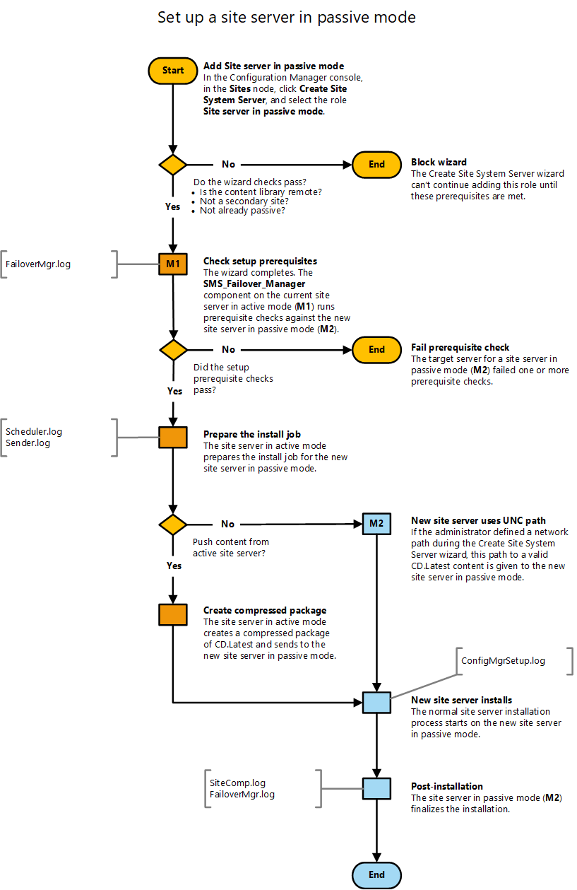

# Flowchart - Set up a site server in passive mode

*Applies to: Configuration Manager (current branch)*

This flowchart diagram shows the process by which the site sets up a site server in passive mode. For more information, see the following articles:  
- [Site server high availability](site-server-high-availability.md)
- [Flowchart - Promote site server (planned)](promote-site-server-flowchart.md)
- [The content library](../../../plan-design/hierarchy/the-content-library.md)
- [Flowchart - Manage content library](../../../plan-design/hierarchy/manage-content-library-flowchart.md)

