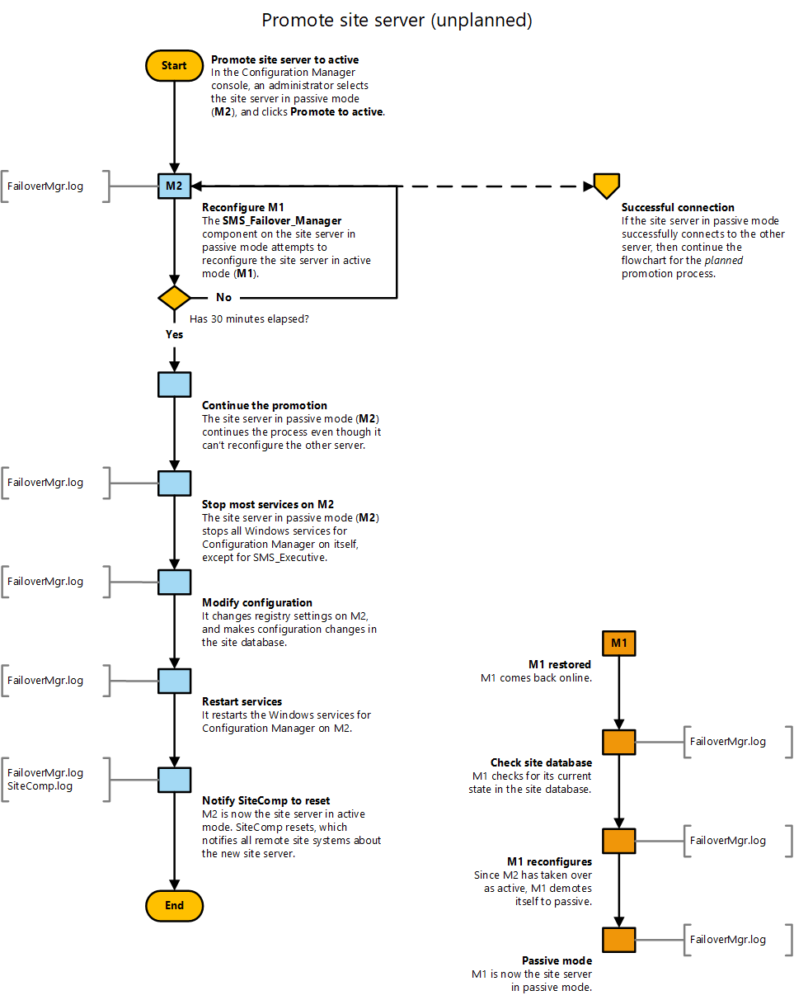

# Flowchart - Promote site server (unplanned)

*Applies to: Configuration Manager (current branch)*

This flowchart diagram shows the process by which a site server in passive mode is promoted to the site server in active mode when the current site server in active mode is offline. In this example, the current site server in active mode isn't fully operational, for example it is disconnected from the network or powered off. For more information, see the following articles:  
- [Site server high availability](site-server-high-availability.md)  
- [Flowchart - Promote site server (planned)](promote-site-server-flowchart.md)  
- [Flowchart - Set up a site server in passive mode](passive-site-server-flowchart.md)  

