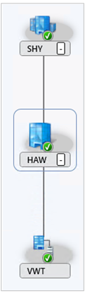
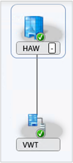

# Remove the central administration site

*Applies to: Configuration Manager (current branch)*

<!-- 3607277 -->

If the hierarchy consists of the central administration site (CAS) and a single child primary site, you can remove the CAS. This action simplifies your Configuration Manager infrastructure to a single, standalone primary site. It removes the complexities of site-to-site replication, and focuses your management tasks to the single site.

> [!NOTE]
> This feature was first introduced in version 2002 as a [pre-release feature](../../manage/pre-release-features.md). Starting in version 2103, it's no longer a pre-release feature.
>
> Configuration Manager doesn't enable this optional feature by default. You must enable this feature before using it. For more information, see [Enable optional features from updates](../../manage/optional-features.md).

## Plan

- The hierarchy needs to consist of the CAS and a single child primary site. The primary site can have secondary sites. To remove other child primary sites from the hierarchy, review the planning steps and prerequisites to [Uninstall a primary site](uninstall-sites-and-hierarchies.md#bkmk_primary).

- Make sure your child primary site meets the size and scale requirements for a [stand-alone primary site](../../../plan-design/configs/size-and-scale-numbers.md#bkmk_pri).

- Make sure to upgrade all sites to the [latest released version of Configuration Manager current branch](../../manage/updates.md#version-details).

- Move or retire any site roles at the CAS, except the service connection point and the software update point. Configuration Manager setup handles these two roles when you remove the CAS.

  The following roles are most common at the CAS, which you need to retire or move to the primary site:

  - Asset Intelligence sync point
  - Endpoint Protection point
  - Reporting services point
  - Data warehouse service point

- Turn off distributed views

- Configuration Manager automatically handles package source locations for built-in packages, like the Configuration Manager client. Review all other content source locations to make sure they aren't using a share on the CAS.

- Stop any active migration jobs and remove all configurations for migration. For more information, see [Stop active migration from another hierarchy](prerequisites-for-installing-sites.md#stop-active-migration-from-another-hierarchy).

- If you have any custom [status filter rules](../../manage/use-status-system.md#manage-status-filter-rules) or [alerts and subscriptions](../../manage/configure-alerts.md), recreate them on the child primary site. Starting in version 2107, also recreate any subscriptions for [external notifications](../../manage/external-notifications.md).

- If you use automatic deployment rules for software updates, recreate them on the child primary site.

- If you use Configuration Manager or System Center Updates Publisher to manage [third-party software updates](../../../../sum/deploy-use/third-party-software-updates.md), export the WSUS signing certificate from the software update point on the CAS.

  - Before you remove the CAS, wait for the deadlines of any required deployments of third-party software updates. Clients pre-download content for required deployments, and when you change the software update point, the content hash changes with *local publishing* of software updates. (This behavior doesn't impact other content types, only local publishing of third-party software updates.) If you remove the CAS with these required deployments still in-progress, they'll fail on clients with a hash mismatch error.

- Review any third-party software that might have a dependency on the CAS.

## Prerequisites

- Configuration Manager version 2103 or later.

- The administrative user that runs Configuration Manager setup needs the following security rights:

  - Local **Administrator** rights on the CAS server

  - If the CAS database server is remote from the site server, local **Administrator** rights on the remote site database server for the CAS.

  - **Sysadmin** rights on the CAS site database

  - Local **Administrator** rights on the primary site server

  - If the primary site database server is remote from the primary site server, local **Administrator** rights on the remote site database server for the primary site.

  - **Sysadmin** rights on the primary site database

  - **Infrastructure Administrator** or **Full Administrator** security role on the CAS and primary site

- Only one child primary site in the hierarchy. For more information, see [Uninstall a primary site](uninstall-sites-and-hierarchies.md#bkmk_primary).

## Process

1. Start Configuration Manager setup on the CAS server by using one of the following methods:

    - On the **Start** menu, select **Configuration Manager Setup**.

    - In the directory for the Configuration Manager *installation media*, open `\SMSSETUP\BIN\X64\setup.exe`. Make sure this version is the same as the site version.

    - In the directory where Configuration Manager is *installed*, open `\BIN\X64\setup.exe`.

1. Review the information on the **Before You Begin** page.

1. On the **Getting Started** page, select **Perform site maintenance or reset this site**.

1. On the **Site Maintenance** page, select **Remove central administration site**. <!-- or is it still "delete"? -->

1. On the **Reconfiguring Existing Site System Roles** page:

    - **Service Connection Point**: Enter the fully qualified domain name of the site system in the primary site to host this required role. For more information, see [About the service connection point](../configure/about-the-service-connection-point.md).

    - **Software Update Point**: Select an existing software update point in the primary site. Setup configures this software update point to synchronize the same as the CAS configuration.

    Setup checks that the specified servers meet the prerequisites. Select **Begin Install** when you're ready to continue.

If setup comes across an issue, use the wizard to retry the process.

When setup is complete, it resets the primary site. For more information, see [Run a site reset](../../manage/modify-your-infrastructure.md#bkmk_reset).

## Monitor and verify

Review the following logs during the setup process:

- `C:\ConfigMgrSetup.log` on the CAS server

- **hman.log** in the Configuration Manager logs directory on the primary site server

Use the **Site Hierarchy** node in the **Monitoring** workspace to visualize the changes to the hierarchy. For example, the following graphic shows the before and after comparison of the **SHY** CAS, **HAW** primary site, and **VWT** secondary site:

| Before  | After   |
|---------|---------|
|||

## Post-setup tasks

After you remove the CAS, review the following steps as they apply to your environment.

- Manually remove the CAS server computer account from the primary site local groups.

- The trusted root key changed, which can require additional actions:

  - Update OS deployment boot images to include the latest Configuration Manager binaries.

  - Recreate [OS deployment media](../../../../osd/deploy-use/create-task-sequence-media.md).

- If you enable Endpoint Analytics for devices uploaded to Microsoft Endpoint Manager, in version 2107, re-enable this option.<!-- 10362047 -->

- If you connect Configuration Manager with [Azure Monitor](/azure/azure-monitor/platform/collect-sccm?context=/mem/configmgr/core/context/core-context), you need to reset the connection. The first step to resolve any issues is to [renew the secret key](../configure/azure-services-wizard.md#bkmk_renew). If that doesn't resolve the issue, recreate the connection.<!-- 5584635 -->

    > [!IMPORTANT]
    > The *Log Analytics Connector* was deprecated in November 2020. It's removed from Configuration Manager in version 2107. For more information, see [Removed and deprecated features](../../../plan-design/changes/deprecated/removed-and-deprecated-cmfeatures.md#unsupported-and-removed-features).<!-- 9649296 -->

- If you enable synchronization of Surface drivers, reconfigure this feature after you remove the CAS. For more information, see [Microsoft Surface drivers and firmware updates](../../../../sum/deploy-use/surface-drivers.md).<!-- 5728727 -->

- If you manage third-party software updates:

  1. Export the WSUS signing certificate from the software update point on the CAS, if you haven't already.

  1. Before you create any new deployments, remove the update from any existing deployments and software update packages.

  1. To recover software update metadata into a usable state, resynchronize subscribed catalogs. You can also wait for Configuration Manager to automatically resynchronize.

  1. Start or wait for a normal software update sync process to update Configuration Manager with the current status from WSUS. Optionally, use SCUP or WSUS PowerShell cmdlets to delete and readd updates.

  1. Republish content for updates that you need to deploy.
