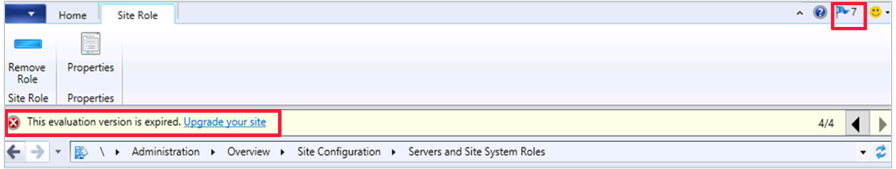

# Configuration Manager console notifications

*Applies to: Configuration Manager (current branch)*

<!--3556016, fka 1318035-->
The Configuration Manager console notifies you for specific events that occur. You can configure some of the event notifications for your Configuration Manager sites.

- Non-configurable event notifications:
   - When an update is available for Configuration Manager itself
   - When lifecycle and maintenance events occur in the environment
- Configurable event notifications:
   - [Non-critical site health changes](#bkmk_noncrit)
   - [Messages from Microsoft](#bkmk_msft)

This notification is a bar at the top of the console window below the ribbon. It replaces the previous experience when Configuration Manager updates are available. These in-console notifications still display critical information, but don't interfere with your work in the console. You can't dismiss critical notifications. The console displays all notifications in a new notification area of the title bar.

## About console notifications

Notifications follow the permissions of role-based administration. For example, if a user doesn't have permissions to see Configuration Manager updates, they won't see those notifications.

Some notifications have a related action. For example, if the console version doesn't match the site version, select **Install the new console version**. This action launches the console installer.

The following notifications reevaluate every five minutes:
- Site is in maintenance mode  
- Site is in recovery mode  
- Site is in upgrade mode  

The following notifications are most applicable to the technical preview branch:  
- Evaluation version is within 30 days of expiration (Warning): the current date is within 30 days of the expiration date of the evaluation version  
- Evaluation version is expired (Critical): the current date is past the expiration date of the evaluation version  
- Console version mismatch (Critical): the console version doesn't match the site version  
- Site upgrade is available (Warning): there's a new update package available  

Most console notifications are per session. The console evaluates queries when a user launches it. To see changes in the notifications, restart the console. If a user dismisses a non-critical notification, it notifies again when the console restarts if it's still applicable.
   - Dismissing or snoozing a notification is persistent for your user across consoles starting in version 2010.

## Console notification improvements

###  Improvements starting in version 2010

Starting in Configuration Manager 2010, you have an updated look and feel for in-console notifications. Notifications are more readable and the action link is easier to find. The age of the notification is displayed to help you find the latest information. If you dismiss or snooze a notification, that action is now persistent for your user across consoles.

 Right-click or select `...` on the notification to take one of the following actions:
- **Translate text**: Launches [Bing Translator](https://www.bing.com/translator/) for the text.
- **Copy text**: Copies the notification text to the clipboard.
- **Snooze**: Snoozes the notification for the specified duration:
   - One hour
   - One day
   - One week
   - One month
- **Dismiss**: Dismisses the notification.

To see these improvements for notifications, update the Configuration Manager console to the latest version.

#### New notifications in version 2010
<!--7410221-->
To help you manage security risk in your environment, you'll be notified in-console about devices with operating systems that are past the end of support date and that are no longer eligible to receive security updates.

:::image type="content" source="./media/7520646-notification.png" alt-text="Screenshot of in-console notifications for operating systems past the end of support date":::

Environments with the following operating systems installed on client devices receive a notification:

- [Windows 7](/lifecycle/products/windows-7), [Windows Server 2008 (non-Azure)](/lifecycle/products/windows-server-2008), and [Windows Server 2008 R2 (non-Azure)](/lifecycle/products/windows-server-2008-r2) without ESU.
   - Selecting **More info** takes you to the [Management insights](../../servers/manage/management-insights.md#security) **Security** group to review the **Update clients running Windows 7 and Windows Server 2008** rule.

- Versions of Windows 10 Semi-Annual Channel that are past the end-of-support date for [Enterprise and Education](/lifecycle/products/windows-10-enterprise-and-education) and [Home and Pro](/lifecycle/products/windows-10-home-and-pro) editions.
   - Selecting **More info** takes you to the [Management insights](../../servers/manage/management-insights.md#simplified-management) **Simplified Management** group to review the **Update clients to a supported Windows 10 version** rule.

You can also view the [Product Lifecycle Dashboard](../../clients/manage/asset-intelligence/product-lifecycle-dashboard.md) to see information about which operating systems are out of support. This information (such as the support lifecycle for Windows 10 versions) is provided for your convenience and only for use internally within your company. You should not solely rely on this information to confirm update compliance. Be sure to verify the accuracy of the information provided to you.

###  Improvements starting in version 2006

- You have an option to receive [Messages from Microsoft](#bkmk_msft)
- If you configure Azure services to cloud-attach your site, you'll see notifications with an action to [renew the secret key](../deploy/configure/azure-services-wizard.md#bkmk_renew).<!--6386392--> The site evaluates the state of the following alerts once per hour:
   - One or more Azure AD app secret keys will expire soon
   - One or more Azure AD app secret keys have expired

> [!Important]
> When you use an [imported Azure AD app](../deploy/configure/azure-services-wizard.md#import-apps-dialog-server), you aren't notified of an upcoming expiration date from console notifications. <!--10568158-->

##  Configure a site to show non-critical notifications

You can configure each site to show non-critical notifications in the properties of the site.

1. In the **Administration** workspace, expand **Site Configuration**, then select the **Sites** node.
1. Select the site you want to configure for non-critical notifications.
1. In the ribbon, select **Properties**.
1. On the **Alerts** tab, select the option to **Enable console notifications for non-critical site health changes**.
   - If you enable this setting, all console users see critical, warning, and information notifications. This setting is enabled by default.  
   - If you disable this setting, console users only see critical notifications.  

##  Configure a site to receive messages from Microsoft
 <!--3953121-->

Starting in version 2006, you can choose to receive notifications from Microsoft in the Configuration Manager console. These notifications help you stay informed about new or updated features, changes to Configuration Manager and attached services, and issues that require action to remediate.

> [!NOTE]
> For push notifications from Microsoft to show in the console, the service connection point needs access to `configmgrbits.azureedge.net`. It also needs access to this endpoint for [updates and servicing](../../plan-design/network/internet-endpoints.md#updates-and-servicing), so you may have already allowed it.

### Configure notification settings for Microsoft messages

1. Navigate to **Administration** > **Site Configuration** > **Sites**.

1. Select a site, and then in the ribbon, select **Properties**.

1. In the **Alerts** tab, enable the notifications by selecting **Receive messages from Microsoft**. You can deselect any of the following notifications if you prefer not to receive them:  

   - **Prevent/fix**: Known issues affecting your organization that may require you to take action.

   - **Plan for change**: Changes to Configuration Manager that may require you to take action.

   - **Stay informed**: Informs you of new or updated features that are available.

:::image type="content" source="media/3953121-microsoft-notifications.png" alt-text="Notification from Microsoft options in site properties" lightbox="media/3953121-microsoft-notifications.png":::

##  Console extension installation notifications
<!--3555909-->
(*Introduced in version 2103*)

[!INCLUDE [Console extensions notifications](includes/console-extensions-notifications.md)]

For more information, see [Manage console extensions](admin-console-extensions.md).
## Log files

For more information and troubleshooting assistance, see the **SmsAdminUI.log** file on the console computer. By default, this log file is at the following path: `C:\Program Files (x86)\Microsoft Endpoint Manager\AdminConsole\AdminUILog\SmsAdminUI.log`.

## Next steps

- [Use the console](admin-console.md)

- [Console tips](admin-console-tips.md)

- [Accessibility features](../../understand/accessibility-features.md)
