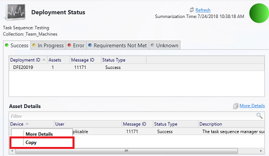

# Configuration Manager console changes and tips

*Applies to: Configuration Manager (current branch)*

Use the information below to find out about changes to the Configuration Manager console and tips for using the console:

## General tips

###  Console improvements in version 2207

*(Introduced in version 2207)*

The following improvements were made to the console and user experience:

- When using the search bar, the **Path** criteria is added whenever subfolders are included in the search. <!--14908615-->
   :::image type="content" source="./media/14908615-search-path.png" alt-text="Screenshot of search bar with the path criteria.":::

###  Console improvements in version 2203
<!--12726153-->
*(Introduced in version 2203)*

The following improvements were made to the console and user experience:

- When using temporary device nodes, device actions like **Run Scripts** are now available to make the experience in the console consistent.
- Additional Management Insights rules now have click-through actions
- Copy/paste is available for more objects from details panes.
   - Added the **Name** property in the details pane for configuration items, configuration item related policies, and applications.
- Software update search results and the search criteria are now cached when you navigate to another node. When you navigate back to the **All Software Updates** node, your search criteria and results are preserved from your last query. Closing the console will clear the cached query.
- Added a search filter to the **Products** and **Classifications** tabs in the **Software Update Point Component Properties**. <!--10998089, 9575773-->
- You can now exclude subcontainers when doing **Active Directory System Discovery** and **Active Directory User Discovery** in untrusted domains. <!--4655840, 9575773-->
- Added a **Cloud Sync** column to collections to indicate if the collection is synchronizing with Azure Active Directory. <!--12433024, 9575773-->
- Added the **Collection ID** to the collection summary details tab <!--12630582, 9575773-->
- Increased the size of the **Membership Rules** pane in the **Properties** page for collections. <!--12947295, 9575773 -->
- Added a **View Script** option for **Run PowerShell Script** steps when using the **View** action for a task sequence. <!--12498818, 9575773 -->
- The console now offers a dark theme. For more information, see [How to use the console](admin-console.md#bkmk_dark).

###  Export to CSV
<!--9663857-->
*(Introduced in version 2111)*

Starting in Configuration Manager 2111, you can export the contents of a grid view in the console along with the column headers to a comma-separated values (CSV) file that can be used to import to Excel or other applications. While you could previously cut and paste from a grid view, exporting to CSV makes extracting a large number of rows faster and easier. You can export either all or selected items from the following nodes:

- Device Collections
- User Collections
- Devices
- Users

To export the information, select **Export to CSV file** from either the ribbon or the right-click menu. Choose **Export selected items** to only export items you've already selected, or you can choose to **Export all items**.

:::image type="content" source="./media/9663857-export-csv.png" alt-text="Screenshot of the export to csv option in the ribbon of the device collections node.":::

###  Enhanced code editor
<!--8495588-->
*(Introduced in version 2107)*

Starting in Configuration Manager 2107, you can edit scripts in an enhanced editor. The new editor supports syntax highlighting, code folding, word wrap, line numbers, and find and replace. The new editor is available in the console wherever scripts and queries can be viewed or edited. The enhanced editor improves the [syntax highlighting and code folding](#bkmk_syntax) that was first introduced in version 2010.

:::image type="content" source="./media/8495588-code-editor.png" alt-text="Screenshot of the new code editor in Configuration Manager":::

Open the new code editor to view or edit scripts and queries from the following locations:

- Configuration item
   - Scripts
   - SQL and WQL queries
   - Detection methods
- Application detection scripts
- Query statement properties
- Create script wizard
- Script properties
- Orchestration group
   - pre-installation scripts
   - post-installation scripts
- Task sequence
   - PowerShell scripts
   - Query WMI option

The new code editor supports the following features:

- Editor mode with syntax highlighting and plain text toggle
- Toggle word wrap and line numbers
- Code folding
- Language selection
- *Find*, *Find and Replace*, and *Go To* line number
- Font type and size selection
- Zoom using buttons or with Ctrl + mouse wheel.
- The information bar at the bottom displays:
   - Number of lines and characters in the script
   - Cursor position
   - If the script is read-only
- Persistent settings across instances for the code window, such as code folding, word wrap, and window size.

###  Syntax highlighting for scripting languages
<!--7964912-->
*(Introduced in version 2010)*

To assist you when creating scripts and queries in the Configuration Manager console, you'll now see syntax highlighting and code folding, where available.

:::image type="content" source="./media/7964912-syntax-highlighting.png" alt-text="Syntax highlighting in console" lightbox="./media/7964912-syntax-highlighting.png":::

#### Supported scripting languages for syntax highlighting

Supported languages for syntax highlighting include PowerShell, JavaScript/JScript, VBScript, and SQL/WQL. The below chart shows which languages are supported for syntax highlighting in each area of the console:

|Console area|PowerShell|VBScript|JavaScript/JScript|SQL/WQL|
|---|---|---|---|---|
|Application scripts| Yes| Yes|Yes|-|
|Collection query|-|-|-|Yes|
|Configuration item scripts|Yes|Yes|Yes|Yes|
|Task sequence scripts|Yes|-|-|-|
|Create scripts|Yes| -| -| -|

### Fixed-width font now used in some console areas

<!--7632637-->
*(Introduced in version 2010)*

Various areas in the Configuration Manager console now use the fixed-width font Consolas. This font provides consistent spacing and makes it easier to read. You'll see the Consolas font in the following places:

- Application scripts
- Configuration item scripts
- WMI-based collection membership queries
- CMPivot queries
- Scripts
- Run PowerShell Script
- Run Command Line

:::image type="content" source="media/7632637-script-editor.png" alt-text="Script editor example with fixed-width Consolas font" lightbox="media/7632637-script-editor.png":::

### Shortcuts to status messages

<!--8232705-->
*(Introduced in version 2010)*

You now have an easier way to view status messages for the following objects:

- Devices
- Users
- Content
- Deployments
  - Monitoring workspace
    - Phased deployments (select **Show Deployments** from the Phased Deployments node)
  - Deployments tab in the details pane for:
    - Packages
    - Task sequences

Select one of these objects in the Configuration Manager console, and then select **Show Status Messages** from the ribbon. Set the viewing period, and then the status message viewer opens. The viewer filters the results to the object you selected.

Your user account needs at least **Read** permission to these objects.

For more information, see [Use the status system](use-status-system.md).

### Improvements to console search

**Note:** The path criteria are not editable and they just show the search criteria.

<!--11702416-->
*(Introduced in version 2203)*
- The default search will now include all subfolders. That is when you navigate to any node in the console, by default, search results will include items from that node as well as from all subfolders.
- If you want to search only current node, select the **Current Node** button in the ribbon. The search results will then include items from current node only.
- If you want to search all subfolders, select the **All Subfolders** button in the ribbon. The search results will then include items from current node as well as from all subfolders.

<!--4640570-->
*(Introduced in version 1910)*

- You can use the **All Subfolders** search option from the **Driver Packages** and **Queries** nodes.<!--2841181,5424892--> Starting in version 2002, also use this option from the **Configuration Items** and **Configuration Baselines** nodes.<!--5891241-->

- When a search returns more than 1,000 results, select the **OK** button on the notice bar to view more results.<!--4640570-->

    

    > [!TIP]
    > The default limit on search results is 1,000. You can change this default value. In the Configuration Manager console, go to the **Search** tab of the ribbon. In the **Options** group, select **Search Settings**. Change the **Search Results** value. A larger number of search results might take longer to display.
    >
    > By default, the upper maximum limit is 100,000. To change this limit, set the DWORD value **QueryResultCountMaximum** in the following registry key:
    >
    > `HKEY_CURRENT_USER\Software\Microsoft\ConfigMgr10\AdminUI`
    >
    > The in-console setting corresponds to the **QueryResultCountLimit** value in the same key. An administrator can configure these values in the HKLM hive for all users of the device. The HKCU value overrides the HKLM setting.

### Role-based administration for folders
<!--3600867-->
*(Introduced in version 1906)*

You can set security scopes on folders. If you have access to an object in the folder but don't have access to the folder, you'll be unable to see the object. Similarly, if you have access to a folder but not an object within it, you won't see that object. Right-click a folder, choose **Set Security Scopes**, then choose the security scopes you want to apply.

### Views sort by integer values

We've made improvements to how various views sort data. For example, in the **Deployments** node of the **Monitoring** workspace, the following columns now sort as numbers instead of string values:  

- Number Errors
- Number In Progress
- Number Other
- Number Success
- Number Unknown

### Move the warning for a large number of results

When you select a node in the console that returns more than 1,000 results, Configuration Manager displays the following warning:

> Configuration Manager returned a large number of results. You can narrow your results by using search. Or, click here to view a maximum of 100000 results.

There's now additional blank space in between this warning and the search field. This move helps to prevent inadvertently selecting the warning to display more results.

### Send feedback

<!--1357542-->

Submit product feedback from the console.

- **Send a smile**: Send feedback on what you liked

- **Send a frown**: Send feedback on what you didn't like

- **Send a suggestion**: Takes you to the product feedback site to share your idea

For more information, see [Product Feedback](../../understand/product-feedback.md).

## Assets and Compliance workspace

### Co-management Eligible Devices collection
<!--12377291-->
*(Introduced in version 2111)* 

There's a new built-in device collection for **Co-management Eligible Devices**. The **Co-management Eligible Devices** collection uses incremental updates and a daily full update to keep the collection up to date.

### Collections tab
<!--9575773, 10480635-->
*(Introduced in version 2111)*

When you show the members of a device collection, and select a device in the list, switch to the **Collections** tab in the details pane. This new view shows the list of collections of which the selected device is a member. It makes it easier for you to see this information.<!-- 10480635 -->

:::image type="content" source="./media/10480635-collections-tab.png" alt-text="Collections tab in the details pane of the list of collection members.":::

### Navigate to collection
<!--9502958-->
*(Introduced in version 2107)*

You can now navigate to a collection from the **Collections** tab in the **Devices** node. Select **View Collection** from either the ribbon or the right-click menu in the tab. 

:::image type="content" source="./media/9502958-collection.png" alt-text="Screenshot of the Collections tab in the Devices node.":::

### Added maintenance window column
<!--9708594-->
*(Introduced in version 2107)*

A **Maintenance window** column was added to the **Collections** tab in the **Devices** node.

:::image type="content" source="./media/9708594-maintenance-window.png" alt-text="Screenshot of the Maintenance window column for the Collections tab in the Devices node.":::

### Display assigned users
<!--9709014-->
*(Introduced in version 2107)*

If a collection deletion fails due to scope assignment, the assigned users are displayed.

:::image type="content" source="./media/9709014-assigned-users.png" alt-text="Screenshot of assigned user list when collection fails to delete due to scope assignment.":::
### Copy discovery data from the console

<!--6890051-->
*(Introduced in version 2010)*

Copy discovery data from devices and users in the console. Copy the details to the clipboard, or export them all to a file. These actions make it easier for you to quickly get this data from the console. For example, copy the MAC address of a device before you reimage it.

1. In the Configuration Manager console, go to the **Assets and Compliance** workspace. Open the properties for a user or device.

1. On the **General** tab, in the **Discovery data** list, select one or more properties.

1. Right-click the selection, and choose one of the following actions:

    - **Copy value**: Copies just the value. You can also use the keyboard shortcut **Ctrl** + **C**.

    - **Copy property and value**: Copies both the property name and the corresponding value. You can also use the keyboard shortcut **Ctrl** + **Shift** + **C**.

    - **Select all**: Selects all properties and values. You can also use the keyboard shortcut **Ctrl** + **A**.

    - **Save results as**: Saves all properties and values to a comma-separated values (CSV) file that you specify.

:::image type="content" source="media/6890051-copy-discovery-data.png" alt-text="Screenshot of device properties to copy discovery data" lightbox="media/6890051-copy-discovery-data.png":::

### Real-time actions from device lists
<!--4616810-->
*(Introduced in version 1906)*

There are various ways to display a list of devices under the **Devices** node in the **Assets and Compliance** workspace.

- In the **Assets and Compliance** workspace, select the **Device Collections** node. Select a device collection, and choose the action to **Show members**. This action opens a subnode of the **Devices** node with a device list for that collection.  

  - When you select the collection subnode, you can now start **CMPivot** from the Collection group of the ribbon.  

- In the **Monitoring** workspace, select the **Deployments** node. Select a deployment, and choose the **View Status** action in the ribbon. In the deployment status pane, double-click the total assets to drill-through to a device list.  

  - When you select a device in this list, you can now start **CMPivot** and **Run Scripts** from the Device group of the ribbon.  

### Collections tab in devices node
<!--4616810-->
*(Introduced in version 1906)*

In the **Assets and Compliance** workspace, go to the **Devices** node, and select a device. In the details pane, switch to the new **Collections** tab. This tab lists the collections that include this device.

> [!NOTE]
> This tab currently isn't available from a devices subnode under the **Device Collections** node. For example, when you select the option to **Show Members** on a collection.
>
> This tab may not populate as expected for some users. To see the complete list of collections a device belongs to, you must have the **Full Administrator** security role. This is a known issue. <!--5107309--> <!--5107309-->

### Add SMBIOS GUID column to device and device collection nodes

*(Introduced in version 1906)*

<!--4526580-->
In both the **Devices** and **Device Collections** nodes, you can now add a new column for **SMBIOS GUID**. This value is the same as the **BIOS GUID** property of the System Resource class. It's a unique identifier for the device hardware.

### Search device views using MAC address

<!--3600878-->

You can search for a MAC address in a device view of the Configuration Manager console. This property is useful for OS deployment administrators while troubleshooting PXE-based deployments. When you view a list of devices, add the **MAC Address** column to the view. Use the search field to add the **MAC Address** search criteria.

### View users for a device

The following columns are available in the **Devices** node:  

- **Primary user(s)** <!--1357280-->  

- **Currently logged on user** <!--1358202-->  

    > [!NOTE]  
    > Viewing the currently logged on user requires [user discovery](../deploy/configure/configure-discovery-methods.md#bkmk_config-adud) and [user device affinity](../../../apps/deploy-use/link-users-and-devices-with-user-device-affinity.md).  

For more information on how to show a non-default column, see [How to use the admin console](admin-console.md#columns).

### Improvement to device search performance

<!-- 3614690 -->
When searching in a device collection, it doesn't search the keyword against all object properties. When you're not specific about what to search, it searches across the following four properties:

- Name
- Primary user(s)
- Currently logged on user
- Last logon user name

This behavior significantly improves the time it takes to search by name, especially in a large environment. Custom searches by specific criteria are unaffected by this change.

## Software Library workspace

### Folder support for software update nodes
<!--3601129-->

*(Introduced in version 2203)*

You can organize software update groups and packages by using folders. This change allows for better categorization and management of software updates. For more information, see [Deploy software updates](../../../sum/deploy-use/deploy-software-updates.md#bkmk_folder).

### Improvements to console search
<!--8325332, 9506942, 9506938, 9506934-->
*(Introduced in version 2107)*

You can use the **All Subfolders** search option for the following nodes: 
- **Boot Images** node
- **Operating System Upgrade Packages** node
- **Operating System Images** node

### Run software updates evaluation from deployment status
<!--9012080 -->
*(Introduced in version 2107)*

You can right-click and notify devices to run a software updates evaluation cycle from the [software update deployment status](../../../sum/deploy-use/monitor-software-updates.md#BKMK_SUDeployStatus). You can target a single device under the **Asset Details** pane or select a group of devices based on their deployment status.

:::image type="content" source="./media/9012080-run-software-update-deployment-evaluation.png" alt-text="Screenshot of the right-click action for software updates deployment evaluation from the software update deployment status":::

1. In the Configuration Manager console, navigate to **Monitoring** > **Overview** > **Deployments**.
1. Select the software update group or software update for which you want to monitor the deployment status.
1. On the Home tab, in the Deployment group, select **View Status**.
1. Right-click on either a specific deployment status for the devices, or on a single device under **Asset Details** pane.
1. Select **Evaluate Software Update Deployments** to send a notification to the selected devices to run an evaluation cycle for software update deployments.

### Import objects to current folder

<!--6601203-->
*(Introduced in version 2010)*

When you import an object in the Configuration Manager console, it now imports to the current folder. Previously, Configuration Manager always put imported objects in the root node. This new behavior applies to [applications](../../../apps/deploy-use/import-export-applications.md), [packages](../../../apps/deploy-use/packages-and-programs.md), [driver packages](../../../osd/get-started/manage-drivers.md#driver-packages), and [task sequences](../../../osd/deploy-use/export-import-task-sequences.md).

### See task sequence size in the console

<!--7645732-->
*(Introduced in version 2010)*

When you view the list of task sequences in the Configuration Manager console, add the **Size (KB)** column. Use this column to identify large task sequences that can cause problems. For more information, see [Reduce the size of task sequence policy](../../../osd/deploy-use/reduce-task-sequence-policy-size.md).

### Order by program name in task sequence
<!--4616810-->
*(Introduced in version 1906)*

In the **Software Library** workspace, expand **Operating Systems**, and select the **Task Sequences** node. Edit a task sequence, and select or add the [Install Package](../../../osd/understand/task-sequence-steps.md#BKMK_InstallPackage) step. If a package has more than one program, the drop-down list now sorts the programs alphabetically.

### Task sequences tab in applications node
<!--4616810-->
*(Introduced in version 1906)*

In the **Software Library** workspace, expand **Application Management**, go to the **Applications** node, and select an application. In the details pane, switch to the new **Task sequences** tab. This tab lists the task sequences that reference this application.

### Drill through required updates
<!--4224414-->
*(Introduced in version 1906)*

1. Go to one of the following places in the Configuration Manager console:

   - **Software Library** > **Software Updates** > **All Software Updates**
   - **Software Library** > **Windows Servicing** > **All Windows Updates**
   - **Software Library** > **Office 365 Client Management** > **Office 365 Updates**

1. Select any update that is required by at least one device.
1. Look at the **Summary** tab and find the pie chart under  **Statistics**.
1. Select the **View Required** hyperlink next to the pie chart to drill down into the device list.
1. This action takes you to a temporary node under **Devices** where you can see the devices requiring the update. You can also take actions for the node such as creating a new collection from the list.

> [!NOTE]
> Starting on April 21, 2020, Office 365 ProPlus is being renamed to **Microsoft 365 Apps for enterprise**. For more information, see [Name change for Office 365 ProPlus](/deployoffice/name-change). You may still see references to the old name in the Configuration Manager console and supporting documentation while the console is being updated.

### Maximize the browse registry window

<!--3594151 includes all MMS 1902 console changes-->

1. In the **Software Library** workspace, expand **Application Management**, and select the **Applications** node.
1. Select an application that has a deployment type with a detection method. For example, a Windows Installer detection method.
1. In the details pane, switch to the **Deployment Types** tab.
1. Open the properties of a deployment type, and switch to the **Detection Method** tab. Select **Add Clause**.
1. Change the **Setting Type** to **Registry** and select **Browse** to open the **Browse Registry** window. You can now maximize this window.  

### Edit a task sequence by default

In the **Software Library** workspace, expand **Operating Systems**, and select the **Task Sequences** node. **Edit** is now the default action when opening a task sequence. Previously the default action was **Properties**.  

### Go to the collection from an application deployment

1. In the **Software Library** workspace, expand **Application Management**, and select the **Applications** node.
1. Select an application. In the details pane, switch to the **Deployments** tab.
1. Select a deployment, and then choose the new **Collection** option in the ribbon on the Deployment tab. This action switches the view to the collection that's the target of the deployment.
   - This action is also available from the right-click context menu on the deployment in this view.

## Monitoring workspace

### Collection evaluation time
<!--9575773, 9648622-->
*(Introduced in version 2111)*

When viewing a collection, you could previously see the amount of time the site took to evaluate the collection membership. This data is now also available in the **Monitoring** workspace.<!-- 9648622 --> When you select a collection in either subnode of the **Collection Evaluation** node, the details pane displays this collection evaluation time data.

:::image type="content" source="./media/9648622-collection-evaluation-data.png" alt-text="Full Evaluation Status node in the Monitoring workspace of the Configuration Manager console, showing collection evaluation times.":::

### Correct names for client operations
<!--4616810-->
*(Introduced in version 1906)*

In the **Monitoring** workspace, select **Client Operations**. The operation to **Switch to next Software Update Point** is now properly named.

### Show collection name for scripts
<!--4616810-->
*(Introduced in version 1906)*

In the **Monitoring** workspace, select the **Script Status** node. It now lists the **Collection Name** and the ID.

### Remove content from monitoring status

1. In the **Monitoring** workspace, expand **Distribution Status**, and select **Content Status**.
1. Select an item in the list, and choose the **View Status** option in the ribbon.
1. In the Asset Details pane, right-click a distribution point, and select the new option **Remove**. This action removes this content from the selected distribution point.

### Copy details in monitoring views

<!--1357856-->
Copy information from the **Asset Details** pane for the following monitoring nodes:  

- **Content Distribution Status**  

- **Deployment Status**  

## Administration workspace
### Status message shortcuts
*(Introduced in version 2107)*
<!--8942963-->
Shortcuts to [status messages](use-status-system.md) were added to the **Administrative Users** node and the **Accounts** node. Select an account, then select **Show Status Messages**.

:::image type="content" source="./media/8942963-show-status-messages.png" alt-text="Screenshot of Administrative Users node with the Show Status Messages option in the ribbon.":::

### Enable some security nodes to use the administration service
<!--4223683-->
Starting in version 1906, you can enable some nodes under the **Security** node to use the administration service. This change allows the console to communicate with the SMS Provider over HTTPS instead of via WMI. For more information, see [Set up the administration service](../../../develop/adminservice/set-up.md#enable-console-usage).

## Next steps

- [Use the console](admin-console.md)
- [Console notifications](admin-console-notifications.md)
- [Accessibility features](../../understand/accessibility-features.md)
