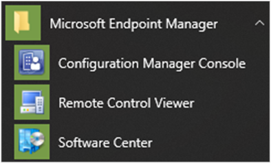
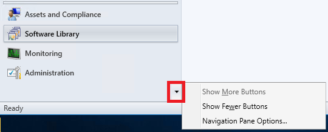
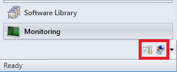
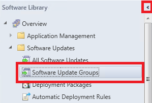
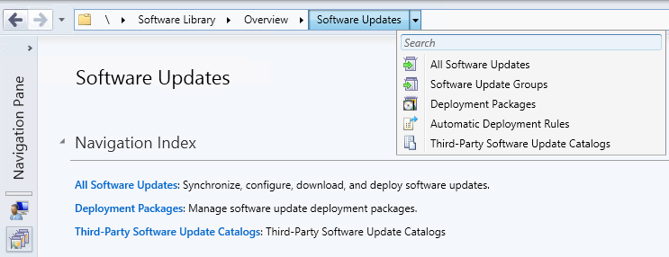
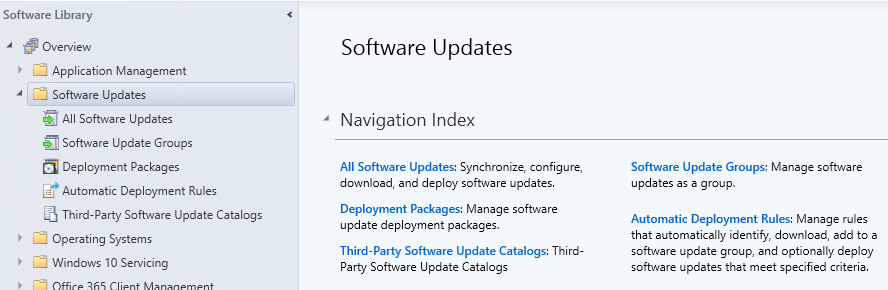
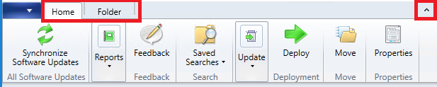
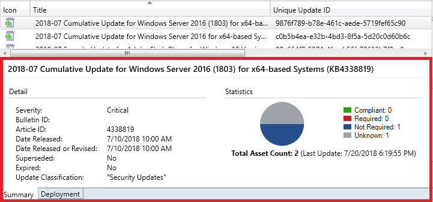
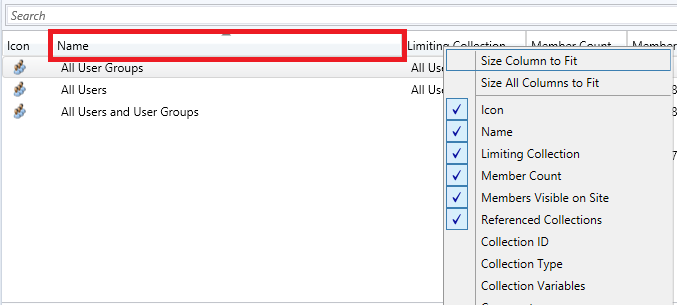
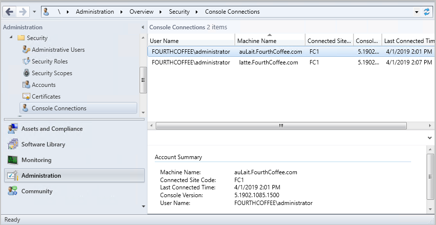

# How to use the Configuration Manager console

*Applies to: Configuration Manager (current branch)*

Administrators use the Configuration Manager console to manage the Configuration Manager environment. This article covers the fundamentals of navigating the console.  

##  Open the console

The Configuration Manager console is always installed on every site server. You can also install it on other computers. For more information, see [Install the Configuration Manager console](../deploy/install/install-consoles.md).

The simplest method to open the console on a Windows 10 computer, press **Start** and start typing `Configuration Manager console`. You may not need to type the entire string for Windows to find the best match.

If you browse the Start menu, look for the **Configuration Manager console** icon in the **Microsoft Endpoint Manager** group.

> [!NOTE]
> The Start menu path changed in version 1910. In version 1906 and earlier, the folder name is **System Center**. When you update Configuration Manager to version 1910 or later, make sure to update any internal documentation that you maintain to include this new location.

## Connect to a site server

The console connects to your central administration site server or to your primary site servers. You can't connect a Configuration Manager console to a secondary site. During installation, you specified the fully qualified domain name (FQDN) of the site server to which the console connects.

To connect to a different site server, use the following steps:

1. Select the arrow at the top of the [ribbon](#ribbon), and choose **Connect to a New Site**.  

      

2. Type in the FQDN of the site server. If you've previously connected to site server, select the server from the drop-down list.  

      

3. Select **Connect**.  

Starting in version 1810, you can specify the minimum authentication level for administrators to access Configuration Manager sites. This feature enforces administrators to sign in to Windows with the required level. For more information, see [Plan for the SMS Provider](../../plan-design/hierarchy/plan-for-the-sms-provider.md#bkmk_auth). <!--1357013-->  

## Navigation

Some areas of the console may not be visible depending on your assigned security role. For more information about roles, see [Fundamentals of role-based administration](../../understand/fundamentals-of-role-based-administration.md).

### Workspaces

The Configuration Manager console has four **workspaces**:  

- **Assets and Compliance**  

- **Software Library**  

- **Monitoring**  

- **Administration**  

  

Reorder workspace buttons by selecting the down arrow and choosing **Navigation Pane Options**. Select an item to **Move Up** or **Move Down**. Select **Reset** to restore the default button order.  

  

Minimize a workspace button by selecting **Show Fewer Buttons**. The last workspace in the list is minimized first. Select a minimized button and choose **Show More Buttons** to restore the button to its original size.

  

### Nodes

Workspaces are a collection of **nodes**. One example of a node is the **Software Update Groups** node in the **Software Library** workspace.

Once you are in the node, you can select the arrow to minimize the navigation pane.  

  

Use the **navigation bar** to move around the console when you minimize the navigation pane.  

  

In the console, nodes are sometimes organized into folders. When you select the folder, it usually displays a **navigation index** or a **dashboard**.  

  

### Ribbon

The ribbon is at the top of the Configuration Manager console. The ribbon can have more than one tab and can be minimized using the arrow on the right. The buttons on the ribbon change based on the node. Most of the buttons in the ribbon are also available on context menus.  

### Details pane

You can get additional information about items by reviewing the details pane. The details pane can have one or more tabs. The tabs vary depending on the node.  

### Columns

You can add, remove, reorder, and resize columns. These actions allow you to display the data you prefer. Available columns vary depending on the node. To add or remove a column from your view, right-click on an existing column heading and select an item. Reorder columns by dragging the column heading where you would like it to be.  

  

At the bottom of the column context menu, you can sort or group by a column. Additionally, you can sort by a column by selecting its header.  

  

##  Reclaim lock for editing objects

<!--4786915-->

If the Configuration Manager console stops responding, you can be locked out of making further changes until the lock expires after 30 minutes. This lock is part of the Configuration Manager SEDO (Serialized Editing of Distributed Objects) system. For more information, see [Configuration Manager SEDO](../../../develop/core/understand/sedo.md).

Starting in [current branch version 1906](../../plan-design/changes/whats-new-in-version-1906.md#reclaim-sedo-lock-for-task-sequences), you could clear your lock on a task sequence. Starting in version 1910, you can clear your lock on any object in the Configuration Manager console.

This action only applies to your user account that has the lock, and on the same device from which the site granted the lock. When you attempt to access a locked object, you can now **Discard Changes**, and continue editing the object. These changes would be lost anyway when the lock expired.

##  View recently connected consoles

<!--3699367-->
Starting in version 1902, you can view the most recent connections for the Configuration Manager console. The view includes active connections and those connections that recently connected. You'll always see your current console connection in the list and you only see connections from the Configuration Manager console. You won't see PowerShell or other SDK-based connections to the SMS Provider. The site removes instances from the list that are older than 30 days.

###  Prerequisites to view connected consoles

- Your account needs the **Read** permission on the **SMS_Site** object

- Configure the administration service REST API. For more information, see [What is the administration service?](../../../develop/adminservice/overview.md)

### View connected consoles

1. In the Configuration Manager console, go to the **Administration** workspace.  

2. Expand **Security** and select the **Console Connections** node.  

3. View the recent connections, with the following properties:  

    - User name
    - Machine name
    - Connected site code
    - Console version
    - Last connected time: When the user last *opened* the console
    - Starting in version 1910, the **Last Console Heartbeat** column has replaced the **Last Connected Time** column. <!--4923997-->
       - An open console in the foreground sends a heartbeat every 10 minutes.

##  Start Microsoft Teams Chat from Console Connections
<!--4923997-->
*(Introduced in version 1910)*

Starting in version 1910, you can message other Configuration Manager administrators from the **Console Connections** node using Microsoft Teams. When you choose to **Start Microsoft Teams Chat** with an administrator, Microsoft Teams is launched and a chat is opened with the user.

### Prerequisites

- For starting a chat with an administrator, the account you want to chat with needs to have been discovered with [Azure AD or AD User Discovery](../deploy/configure/about-discovery-methods.md#bkmk_aboutUser).
- Microsoft Teams installed on the device from which you run the console.
note
- All [prerequisites to view connected consoles](#bkmk_connections-prereq)

### Start Microsoft Teams Chat

1. Go to **Administration** > **Security** > **Console Connections**.
1. Right-click on a user's console connection and select **Start Microsoft Teams Chat**.
    - If the User Principal Name isn't found for the selected administrator, **Start Microsoft Teams Chat** is grayed out.
    - An error message, including a download link, appears if Microsoft Teams isn't installed on the device from which you run the console.
    - If Microsoft Teams is installed on the device from which you run the console, it will open a chat with the user.

### Known issues

The error message notifying you that Microsoft Teams isn't installed won't be displayed if the following Registry key doesn't exist:

Computer\HKEY_CURRENT_USER\SOFTWARE\Microsoft\Windows\CurrentVersion\Uninstall

To work around the issue, manually create the Registry key.

##  In-console documentation dashboard

<!--3556019 FKA 1357546-->
Starting in Configuration Manager version 1902, there's a **Documentation** node in the new **Community** workspace. This node includes up-to-date information about Configuration Manager documentation and support articles. It includes the following sections:  

### Product documentation library

- **Recommended**: a manually curated list of important articles.
- **Trending**: the most popular articles for the last month.
- **Recently updated**: articles revised in the last month.

### Support articles

- **Troubleshooting articles**: guided walkthroughs to assist with troubleshooting Configuration Manager components and features.
- **New and updated support articles**: articles that are new or updated in the last two months.

### Troubleshooting connection errors
The **Documentation** node has no explicit proxy configuration. It uses any OS-defined proxy in the **Internet Options** control panel applet. To retry after a connection error, refresh the **Documentation** node.

## Command-line options

The Configuration Manager console has the following command-line options:

|Option|Description|  
|------------|-----------------|  
|`/sms:debugview=1`|A DebugView is included in all ResultViews that specify a view. DebugView shows raw properties (names and values).|  
|`/sms:NamespaceView=1`|Shows namespace view in the console.|  
|`/sms:ResetSettings`|The console ignores user-persisted connection and view states. The window size isn't reset.|  
|`/sms:IgnoreExtensions`|Disables any Configuration Manager extensions.|  
|`/sms:NoRestore`|The console ignores previous persisted node navigation.|  
|`/server=[ServerName]`|Connect to a CAS or Primary site server by specifying the fully qualified domain name (FQDN) or server name for that site.|  

## Next steps

- [Console notifications](admin-console-notifications.md)
- [Console tips](admin-console-tips.md)
- [Accessibility features](../../understand/accessibility-features.md)
- [Task sequence editor](../../../osd/understand/task-sequence-editor.md#bkmk_conditions)
