# Changes to CMPivot

*Applies to: Configuration Manager (current branch)*

Use the following information to learn about changes made to [CMPivot](cmpivot.md) between Configuration Manager versions:

## <a name="bkmk_2107"></a> CMPivot changes for version 2107

### Simplified CMPivot permissions requirements
<!--7898885-->
We've simplified the CMPivot permissions requirements. The new permissions are applicable for CMPivot standalone and CMPivot in the on-premises console. The following changes have been made:

- CMPivot no longer requires **SMS Scripts** read permission

  - The [SMS Provider](../../plan-design/hierarchy/plan-for-the-sms-provider.md) still requires this permission if the [administration service](../../../develop/adminservice/overview.md) falls back to it due to a 503 (Service Unavailable) error, as seen in the CMPivot.log.

- The **default scope** permission isn't required.

### General improvements to CMPivot

<!--9966861-->
We've made the following improvements to CMPivot:

- Added [maxif](/azure/data-explorer/kusto/query/maxif-aggfunction) and [minif](/azure/data-explorer/kusto/query/minif-aggfunction) aggregators that can be used with the [summarize operator](cmpivot-overview.md#table-operators)
- Improvements to query autocomplete suggestions in the query editor
- Added a Key value to the [Registry entity](cmpivot-overview.md#bkmk_onprem_only)
- Added a new RegistryKey entity that returns all registry keys matching the given expression

To review the difference between the Registry and RegistryKey entities, you can use the following samples:

```kusto
// Change the path to match your desired registry hive query

Registry('hklm:\SOFTWARE\Microsoft\EnterpriseCertificates\Root\Certificates\*')
RegistryKey('hklm:\SOFTWARE\Microsoft\EnterpriseCertificates\Root\Certificates\*')

RegistryKey('hklm:\SOFTWARE\Microsoft\SMS\*')
Registry('hklm:\SOFTWARE\Microsoft\SMS\*')
```


## <a name="bkmk_2103"></a> CMPivot changes for version 2103
<!--7137169, 9442715, 9310040, 9391017-->
Starting in version 2103, the following improvements have been made for CMPivot:
- [Warning message and export CMPivot data option when results are too large](#bkmk_export)
- [Access the top queries shared in the Community hub from CMPivot](#bkmk_cmpivot_hub)

### <a name="bkmk_export"></a> Warning message and export CMPivot data option when results are too large
<!-- 9306291, 7717129, 5431427-->

When results are too large the following warning message is displayed:

**Your query returned a large number of results. Narrow the results by modifying the query, or select this banner to export the results.**

This message occurs in the following scenarios:

- When results are greater than 100,000 cells.
   - For instance, the warning threshold is reached for 10,000 devices (rows) with 10 columns of entity data.
   - In this case, you'll be given an option to export results to a `.csv` file

- When more than 128 KB of data is requested to be returned from a given device.
   - For instance, `CcmLog('ciagent', 120d)` queries log results and is likely to be over the 128 KB limit. 
   - When the results are over 128 KB, you'll get a warning, but you can't export them since they won't be returned from the client to the server.


### <a name="bkmk_cmpivot_hub"></a> Access the top queries shared in the Community hub from CMPivot
Starting in version 2103, you can access the top CMPivot queries shared in the Community hub from on-premises CMPivot. By using pre-created CMPivot queries shared by the broader community, CMPivot users gain access to a wider variety of queries. On-premises CMPivot accesses the Community hub and returns a list of the top downloaded CMPivot queries. Users can review the top queries, customize them, and then run on-demand. This improvement gives a wider selection of queries for immediate usage without having to construct them and also allows information sharing on how to build queries for future reference.

   > [!NOTE]
   > These queries are available when you run CMPivot from the Configuration Manager console. They're not yet available from [standalone CMPivot](cmpivot.md#install-cmpivot-standalone). <!--9442715, 9310040, 9391017-->

#### Prerequisites:
- Meet all of the [CMPivot prerequisites and permissions](cmpivot.md#prerequisites)
- Enable [Community hub](community-hub.md). You don't need a GitHub account to download content.
- Verify which [content categories are displayed](community-hub.md#bkmk_category) for community hub
- Install the Microsoft Edge WebView2 extension from the [Configuration Manager console notification](community-hub.md#bkmk_webview2)

#### Use CMPivot to access the top Community hub queries

1. Go to the **Assets and Compliance** workspace then select the **Device Collections** node.
1. Select a target collection, target device, or group of devices then select **Start CMPivot** in the ribbon to launch the tool.
1. Use the community hub icon on the menu.

    :::image type="content" source="./media/7137169-hub-icon.png" alt-text="Community hub icon":::

1. Review the list of top shared CMPivot queries.

    :::image type="content" source="./media/7137169-cmpivot-hub-queries.png" alt-text="Top CMPivot queries from Community hub" lightbox="./media/7137169-cmpivot-hub-queries.png":::

1. Select one of the top queries to load it into the query pane.
1. Edit the [query](cmpivot-overview.md) if needed then select **Run Query**.
1. Optionally, select the folder icon to access your favorites list. Add the original query or your edited version to your favorites list to run later. Select the community hub icon to search for another query. 
1. Keep the CMPivot window open to view results from clients. When you close the CMPivot window, the session is complete. If the query has been sent, then clients still send a state message response to the server.

## <a name="bkmk_2006"></a> CMPivot changes for version 2006
<!--6518631-->

Starting in version 2006, the following improvements have been made for CMPivot:

- [CMPivot standalone](cmpivot.md#bkmk_standalone) and CMPivot launched from the admin console have converged. When you launch CMPivot from the admin console, it uses the same underlying technology as CMPivot standalone to give you scenario parity.

- Improvements for keyboard navigation in CMPivot.

- You can run CMPivot from an individual device or multiple devices from the devices node without needing to select a device collection. This improvement makes it easier for people, such as those working as the Helpdesk persona, to create CMPivot queries for specific devices outside a pre-created collection.
   - Select an individual device or multi-select devices in a device collection or then select **Start CMPivot**.

- Upon returning devices within a query list view, you can select **Device Pivot** on one or more devices and then pivot and query on just those devices to drill in further. This change allows you to drill in without querying the larger set of devices from the original collection. **Device Pivot** replaced **Pivot to**.
   - Within an existing CMPivot operation, select an individual device or multi-select devices from the output. Right-click and pivot using the **Device Pivot** option. This action launches a separate CMPivot instance scoped to just the devices you selected. This makes it easier to pivot and just query on devices desired without needing to create a collection for them.

- When you run CMPivot for an individual device, the device name is listed at the top of the window. For multiple devices, the number of devices selected is listed at the top of the window.
- The **Create Collection** option in the Query Summary tab was removed since CMPivot no longer requires querying against a collection. Perform a **Device Pivot** to open a new instance of CMPivot scoped to just the devices you want to query on. **Create Collection** is still available on the main menu.

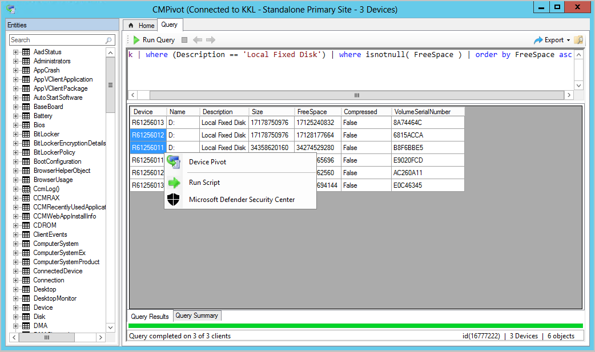


## <a name="bkmk_2002"></a> CMPivot changes for version 2002
<!--5870934-->
We've made it easier to navigate CMPivot entities. Starting in Configuration Manager version 2002, you can search CMPivot entities. New icons have also been added to easily differentiate the entities and the entity object types.

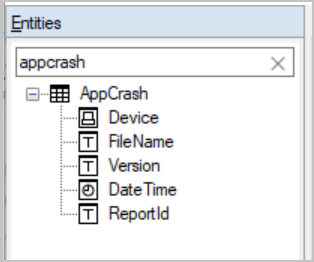


## <a name="bkmk_cmpivot1910"></a> CMPivot changes for version 1910
<!--5410930, 3197353-->
Starting in version 1910, CMPivot was significantly optimized to reduce network traffic and load on your servers. Additionally, a number of entities and entity enhancements were added to aid in troubleshooting and hunting. The following changes were introduced for CMPivot in version 1910:

- [Optimizations to the CMPivot engine](#bkmk_optimization)
- Additional entities and entity enhancements:
  - Windows event logs ([WinEvent](#bkmk_WinEvent))
  - File content ([FileContent](#bkmk_File))
  - Dlls loaded by processes ([ProcessModule](#bkmk_ProcessModule))
  - Azure Active Directory information ([AADStatus](#bkmk_AadStatus))
  - Endpoint protection status ([EPStatus](#bkmk_EPStatus))
- [Local device query evaluation using CMPivot standalone](#bkmk_local-eval)
- [Other enhancements to CMPivot](#bkmk_Other)


### <a name="bkmk_optimization"></a> Optimizations to the CMPivot engine
<!--3197353-->
To reduce network traffic and load on your servers, CMPivot was optimized in 1910. Many query operations are now performed directly on the client rather than on the servers. This change also means that some CMPivot operations return minimal data from the first query. If you decide to drill into the data for more information, a new query might run to fetch the additional data from the client. For instance, previously a large data set was returned to the server when you ran a "summarized count" query.  While returning a large data set offered immediate drill-down, many times only the summarized count was needed. In 1910 when you choose to drill into a specific client, another collection of the data occurs to return the additional data you've requested. This change brings better performance and scalability to queries against a large number of clients. <!--3197353, 5458337-->

#### Examples

The CMPivot optimizations drastically reduce the network and server CPU load needed to run CMPivot queries. With these optimizations, we can now sift through gigabytes of client data in real time. The following queries illustrate these optimizations:

- Search all event logs on all clients in your enterprise for authentication failures.

   ``` Kusto
   EventLog('Security')
   | where  EventID == 4673
   | summarize count() by Device
   | order by count_ desc
   ```

- Search for a file by hash.

   ``` Kusto
   Device
   | join kind=leftouter ( File('%windir%\\system32\\*.exe')
   | where SHA256Hash == 'A92056D772260B39A876D01552496B2F8B4610A0B1E084952FE1176784E2CE77')
   | project Device, MalwareFound = iif( isnull(FileName), 'No', 'Yes')
   ```

### <a name="bkmk_WinEvent"></a> WinEvent(\<logname>,[\<timespan>])

This entity is used to get events from event logs and event tracing log files. The entity gets data from event logs that are generated by the Windows Event Log technology. The entity also gets events in log files generated by Event Tracing for Windows (ETW). WinEvent looks at events that have occurred within the last 24 hours by default. However, the 24-hour default can be overridden by including a timespan.

``` Kusto
WinEvent('Microsoft-Windows-HelloForBusiness/Operational', 1d)
| where LevelDisplayName =='Error'
| summarize count() by Device
```

### <a name="bkmk_File"></a> FileContent(\<filename>)

FileContent is used to get the contents of a text file.

``` Kusto
FileContent('c:\\windows\\SMSCFG.ini')
| where Content startswith  'SMS Unique Identifier='
| project Device, SMSId= substring(Content,22)
```

### <a name="bkmk_ProcessModule"></a> ProcessModule(\<processname>)  

This entity is used to enumerate the modules (dlls) loaded by a given process. ProcessModule is useful when hunting for malware that hides in legitimate processes.  

``` Kusto
ProcessModule('powershell')
| summarize count() by ModuleName
| order by count_ desc
```

### <a name="bkmk_AadStatus"></a> AadStatus

This entity can be used to get the current Azure Active Directory identity information from a device.

``` Kusto
AadStatus
| project Device, IsAADJoined=iif( isnull(DeviceId),'No','Yes')
| summarize DeviceCount=count() by IsAADJoined
| render piechart
```

### <a name="bkmk_EPStatus"></a> EPStatus

EPStatus is used to get the status of antimalware software installed on the computer.

``` Kusto
EPStatus
| project Device, QuickScanAge=datetime_diff('day',now(),QuickScanEndTime)
| summarize DeviceCount=count() by QuickScanAge
| order by QuickScanAge
| render barchart
```

### <a name="bkmk_local-eval"></a> Local device query evaluation using CMPivot standalone
<!--3197353-->
When using CMPivot outside of the Configuration Manager console, you can query just the local device without the need for the Configuration Manager infrastructure. You can now leverage the CMPivot Azure Log Analytics queries to quickly view WMI information on the local device. This also enables validation and refinement of CMPivot queries, before running them in a larger environment. CMPivot standalone is only available in English. For more information about CMPivot standalone, see [CMPivot standalone](#bkmk_standalone).

#### Known issues for local device query evaluation

 - If you query on **This PC** for a WMI entity that you don't have access to, such as a locked down WMI class, you may see a crash in CMPivot. Run CMPivot using an account with elevated privileges to query those entities. <!--5753242-->
- If you query non-WMI entities on **This PC**, you'll see an **Invalid namespace** or an ambiguous exception.
- Run CMPivot standalone from the start menu shortcut, not directly from the path of the executable file. <!--5787962-->

### <a name="bkmk_Other"></a> Other enhancements

- You can do regular expression type queries using the new `like` operator. For example:<!--3056858-->
  
   ```kusto
   //Find BIOS manufacture that contains any word like Micro, such as Microsoft
   Bios
   | where Manufacturer like '%Micro%'
   ```

- We've updated the **CcmLog()** and **EventLog()** entities to only look at messages in the last 24 hours by default. This behavior can be overridden by passing in an optional timespan. For example, the following query will look at events in the last 1 hour:

   ```kusto
   CcmLog('Scripts',1h)
   ```

- The **File()** entity has been updated to collect information about Hidden and System files, and include the MD5 hash. While an MD5 hash isn't as accurate as the SHA256 hash, it tends to be the commonly reported hash in most malware bulletins.  

- You can add comments in queries.<!-- 5431463 --> This behavior is useful when sharing queries. For example:

    ``` Kusto
    //Get the top ten devices sorted by user
    Device
    | top 10 by UserName
    ```

- CMPivot automatically connects to the last site.<!-- 5420395 --> After you start CMPivot, you can connect to a new site if necessary.

- From the **Export** menu, select the new option to **Query link to clipboard**.<!-- 5431577 --> This action copies a link to the clipboard that you can share with others. For example:

    `cmpivot:Ly8gU2FtcGxlIHF1ZXJ5DQpPcGVyYXRpbmdTeXN0ZW0NCnwgc3VtbWFyaXplIGNvdW50KCkgYnkgQ2FwdGlvbg0KfCBvcmRlciBieSBjb3VudF8gYXNjDQp8IHJlbmRlciBiYXJjaGFydA==`

    This link opens CMPivot standalone with the following query:

    ``` Kusto
    // Sample query
    OperatingSystem
    | summarize count() by Caption
    | order by count_ asc
    | render barchart
    ```

    > [!TIP]
    > For this link to work, [install CMPivot standalone](#bkmk_standalone).

- In query results, if the device is enrolled in Microsoft Defender for Endpoint, right-click the device to launch the **Microsoft Defender Security Center** online portal.

### Known issues for CMPivot in version 1910

- The maximum results banner may not be displayed when the limit is reached. <!--5431427-->
  - Each client is limited to 128 KB worth of data per query.
  - Results may be truncated if the results of the query exceed 128 KB.

## <a name="bkmk_cmpivot1906"></a> CMPivot changes for version 1906

Starting in version 1906, the following items were added to CMPivot:

- [Joins, additional operators, and aggregators](#bkmk_cmpivot_joins)
- [Added CMPivot permissions to the Security Administrator role](#bkmk_cmpivot_secadmin1906)
- [CMPivot standalone](#bkmk_standalone)

### <a name="bkmk_cmpivot_joins"></a> Add joins, additional operators, and aggregators in CMPivot
<!--4054074-->
You now have additional arithmetic operators, aggregators, and the ability to add query joins such as using Registry and File together. The following items have been added:

#### Table operators

|Table operators| Description|
|-----|-----|
| [join](/azure/kusto/query/joinoperator)| Merge the rows of two tables to form a new table by matching row for the same device|
|render|Renders results as graphical output|

The render operator already exists in CMPivot. Support for multiple series and the **with** statement were added. For more information, see the [examples](#bkmk_cmpivot_examples1906) section and Kusto's [join operator](/azure/kusto/query/joinoperator) article.

#### Limitations for joins

1. The join column is always implicitly done on the **Device** field.
1. You can use a maximum of 5 joins per query.
1. You can use a maximum of 64 combined columns.

#### Scalar operators

|Operator| Description|Example|
|-----|-----|-----|
| + | Add| `2 + 1, now() + 1d`|
| - |  Subtract| `2 - 1, now() - 1d`|
| * | Multiply| `2 * 2`|
| / | Divide | `2 / 1`|
| % | Modulo | `2 % 1`

#### Aggregation functions

|Function| Description|
|-----|-----|
| percentile()| Returns an estimate for the specified nearest-rank percentile of the population defined by Expr|
| sumif() | Returns a sum of Expr for which Predicate evaluates to true|

#### Scalar functions

|Function| Description|
|-----|-----|
| case()| Evaluates a list of predicates and returns the first result expression whose predicate is satisfied |
| iff() | Evaluates the first argument and returns the value of either the second or third arguments depending on whether the predicate evaluated to true (second) or false (third)|
 | indexof() | Function reports the zero-based index of the first occurrence of a specified string within input string|
| strcat() | Concatenates between 1 and 64 arguments |
| strlen()| Returns the length, in characters, of the input string|
| substring() | Extracts a substring from a source string starting from some index to the end of the string |
| tostring() | Converts input to a string operation |

#### <a name="bkmk_cmpivot_examples1906"></a> Examples

- Show device, manufacturer, model, and OSVersion:

   ``` Kusto
   ComputerSystem
   | project Device, Manufacturer, Model
   | join (OperatingSystem | project Device, OSVersion=Caption)
   ```

- Show graph of boot times for a device:

   ``` Kusto
   SystemBootData
   | where Device == 'MyDevice'
   | project SystemStartTime, BootDuration, OSStart=EventLogStart, GPDuration, UpdateDuration
   | order by SystemStartTime desc
   | render barchart with (kind=stacked, title='Boot times for MyDevice', ytitle='Time (ms)')
   ```

   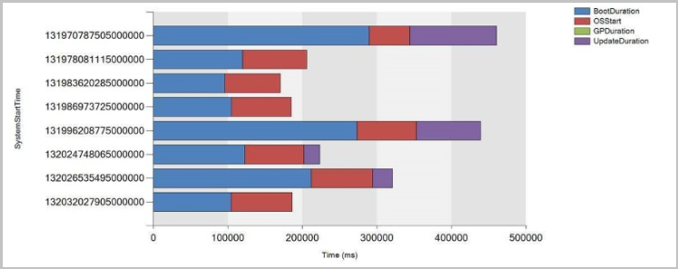

### <a name="bkmk_cmpivot_secadmin1906"></a> Added CMPivot permissions to the Security Administrator role
<!--4683130-->

Starting in version 1906, the following permissions have been added to Configuration Manager's built-in **Security Administrator** role:

 - **Read** on SMS Script
 - **Run CMPivot** on Collection
 - **Read** on Inventory Report

>[!NOTE]
> **Run Scripts** is a super set of the **Run CMPivot** permission.

### <a name="bkmk_standalone"></a> CMPivot standalone

[!INCLUDE [CMPivot standalone](includes/cmpivot-standalone.md)]

## <a name="bkmk_cmpivot1902"></a> CMPivot changes for version 1902
<!--3610960-->
Starting in Configuration Manager version 1902, you can run CMPivot from the central administration site (CAS) in a hierarchy. The primary site still handles the communication to the client. When running CMPivot from the central administration site, it communicates with the primary site over the high-speed message subscription channel. This communication doesn't rely upon standard SQL Server replication between sites.

Running CMPivot on the CAS will require additional permissions when SQL Server or the SMS Provider aren't on the same machine or in the case of SQL Server Always On availability group configuration. With these remote configurations, you have a "double hop scenario" for CMPivot.

To get CMPivot to work on the CAS in such a "double hop scenario", you can define constrained delegation. To understand the security implications of this configuration, read the [Kerberos constrained delegation](/windows-server/security/kerberos/kerberos-constrained-delegation-overview) article. Kerberos needs to work through all of the hops between the machines.<!--5746133--> If you have more than one remote configuration such as SQL Server or SMS Provider being colocated with the CAS or not, or multiple trusted forests, you may require a combination of permission settings. Below are the steps that you may need to take:

### CAS has a remote SQL Server

1. Go to each primary site's SQL Server.
   1. Add the CAS remote SQL Server and the CAS site server to the [Configmgr_DviewAccess](../../plan-design/hierarchy/accounts.md#configmgr_dviewaccess) group.
   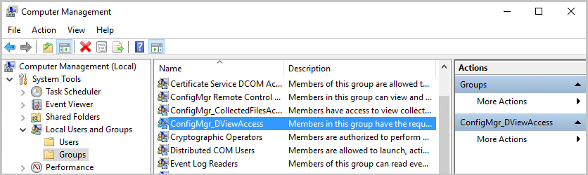
1. Go to Active Directory Users and Computers.
   1. For each primary site server, right click and select **Properties**.
      1. In the delegation tab, choose the third option, **Trust this computer for delegation to specified services only**. 
      1. Choose **Use Kerberos only**.
      1. Add the CAS's SQL Server service with port and instance.
      1. Make sure these changes align with your company security policy!
   1. For the CAS site, right click and select **Properties**.
      1. In the delegation tab, choose the third option, **Trust this computer for delegation to specified services only**. 
      1. Choose **Use Kerberos only**.
      1. Add each primary site's SQL Server service with port and instance.
      1. Make sure these changes align with your company security policy!

   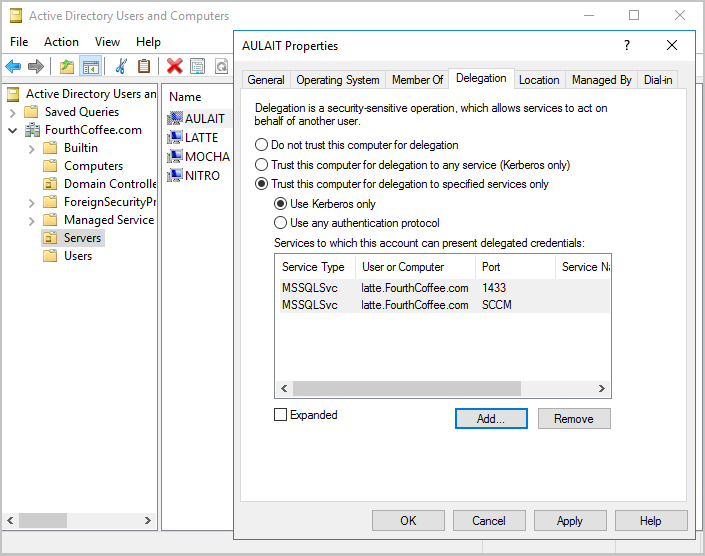

### CAS has a remote provider

1. Go to each primary site's SQL Server.
   1. Add the CAS provider machine account and the CAS site server to the [Configmgr_DviewAccess](../../plan-design/hierarchy/accounts.md#configmgr_dviewaccess) group.
1. Go to Active Directory Users and Computers.
   1. Select the CAS provider machine, right click and select **Properties**.
      1. In the delegation tab, choose the third option, **Trust this computer for delegation to specified services only**. 
      1. Choose **Use Kerberos only**.
      1. Add each primary site's SQL Server service with port and instance.
      1. Make sure these changes align with your company security policy!
   1. Select the CAS site server, right click and select **Properties**.
      1. In the delegation tab, choose the third option, **Trust this computer for delegation to specified services only**. 
      1. Choose **Use Kerberos only**.
      1. Add each primary site's SQL Server service with port and instance.
      1. Make sure these changes align with your company security policy!
1. Restart the CAS remote provider machine.

### SQL Server Always On availability groups

1. Go to each primary site's SQL Server.
   1. Add the CAS site server to the [Configmgr_DviewAccess](../../plan-design/hierarchy/accounts.md#configmgr_dviewaccess) group.
1. Go to Active Directory Users and Computers.
   1. For each primary site server, right click and select **Properties**.
      1. In the delegation tab, choose the third option, **Trust this computer for delegation to specified services only**. 
      1. Choose **Use Kerberos only**.
      1. Add the CAS's SQL Server service accounts for the SQL Server nodes with port and instance.
      1. Make sure these changes align with your company security policy!
   1. Select the CAS site server, right click and select **Properties**.
      1. In the delegation tab, choose the third option, **Trust this computer for delegation to specified services only**. 
      1. Choose **Use Kerberos only**.
      1. Add each primary site's SQL Server service with port and instance.
      1. Make sure these changes align with your company security policy!
1. Make sure the [SPN is published](/sql/database-engine/availability-groups/windows/listeners-client-connectivity-application-failover#SPNs) for the CAS listener name and each primary listener name.
1. Restart the primary SQL Server nodes.
1. Restart the CAS site server and the CAS SQL Server nodes.


## <a name="bkmk_cmpivot"></a> CMPivot changes for version 1810
<!--1359068, 3607759-->

CMPivot includes the following improvements starting in Configuration Manager version 1810:

- [CMPivot utility and performance](#bkmk_cmpivot-perf)
- [Scalar functions](#bkmk_cmpivot-functions)  
- [Rendering visualizations](#bkmk_cmpivot-charts)  
- [Hardware inventory](#bkmk_cmpivot-hinv)  
- [Scalar operators](#bkmk_cmpivot-operators)  
- [Query summary](#bkmk_cmpivot-summary)  
- [Audit status messages](#cmpivot-audit-status-messages)

### <a name="bkmk_cmpivot-perf"></a> CMPivot utility and performance

- CMPivot will return up to 100,000 cells rather than 20,000 rows.
  - If the entity has 5 properties, meaning 5 columns, up to 20,000 rows will be shown.
  - For an entity with 10 properties, up to 10,000 rows will be shown.
  - The total data shown will be less than or equal to 100,000 cells.
- On the Query Summary tab, select the count of Failed or Offline devices, and then select the option to **Create Collection**. This option makes it easy to target those devices with a remediation deployment.
   - This option was removed in version 2006 since CMPivot no longer requires querying against a collection.
- Save **Favorite** queries by clicking the folder icon.
   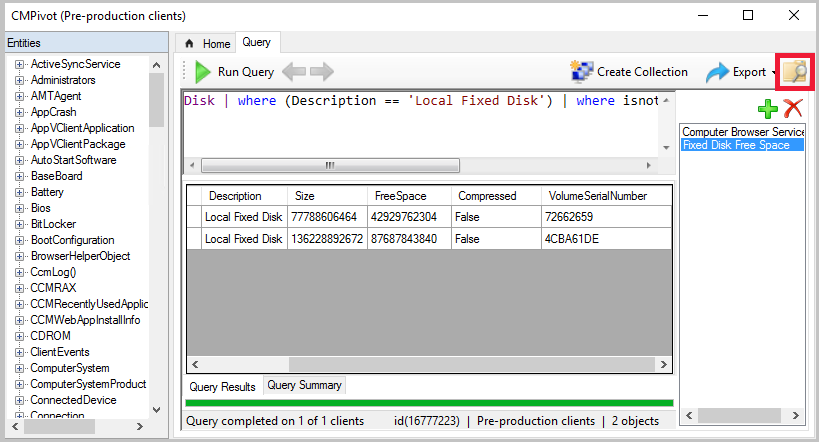

- Clients updated to the 1810 version return output less than 80 KB to the site over a fast communication channel.
  - This change increases the performance of viewing script or query output.
  - If the script or query output is greater than 80 KB, the client sends the data via a state message.
  - If the client isn't updated to the 1810 client version, it continues to use state messages.

- You may see the following error when you start CMPivot:
   **You can't use CMPivot right now due to an incompatible script version. This issue may be because the hierarchy is in the process of upgrading a site. Wait until the upgrade is complete and then try again.**

  - If you see this message, it could mean:
    - The security scope isn't set up properly.
    - There are issues with Upgrade in the process.
    - The underlying CMPivot script is incompatible.


### <a name="bkmk_cmpivot-functions"></a> Scalar functions
CMPivot supports the following scalar functions:
- **ago()**: Subtracts the given timespan from the current UTC clock time  
- **datetime_diff()**: Calculates the calendar difference between two datetime values  
- **now()**: Returns the current UTC clock time  
- **bin()**: Rounds values down to an integer multiple of a given bin size  

> [!Note]  
> The datetime data type represents an instant in time, typically expressed as a date and time of day. Time values are measured in 1-second units. A datetime value is always in the UTC time zone. Always express date time literals in ISO 8601 format, for example, `yyyy-mm-dd HH:MM:ss`  

#### Examples
- `datetime(2015-12-31 23:59:59.9)`: A specific date time literal   
- `now()`: The current time  
- `ago(1d)`: The current time minus one day  


### <a name="bkmk_cmpivot-charts"></a> Rendering visualizations

CMPivot now includes basic support for the KQL [render operator](/azure/kusto/query/renderoperator). This support includes the following types:  
- **barchart**: First column is x-axis, and can be text, datetime or numeric. The second columns must be numeric and is displayed as a horizontal strip.  
- **columnchart**: Like barchart, with vertical strips instead of horizontal strips.  
- **piechart**: First column is color-axis, second column is numeric.  
- **timechart**: Line graph. First column is x-axis, and should be datetime. Second column is y-axis.  

#### Example: bar chart
The following query renders the most recently used applications as a bar chart:

``` Kusto
CCMRecentlyUsedApplications
| summarize dcount( Device ) by ProductName
| top 10 by dcount_
| render barchart
```

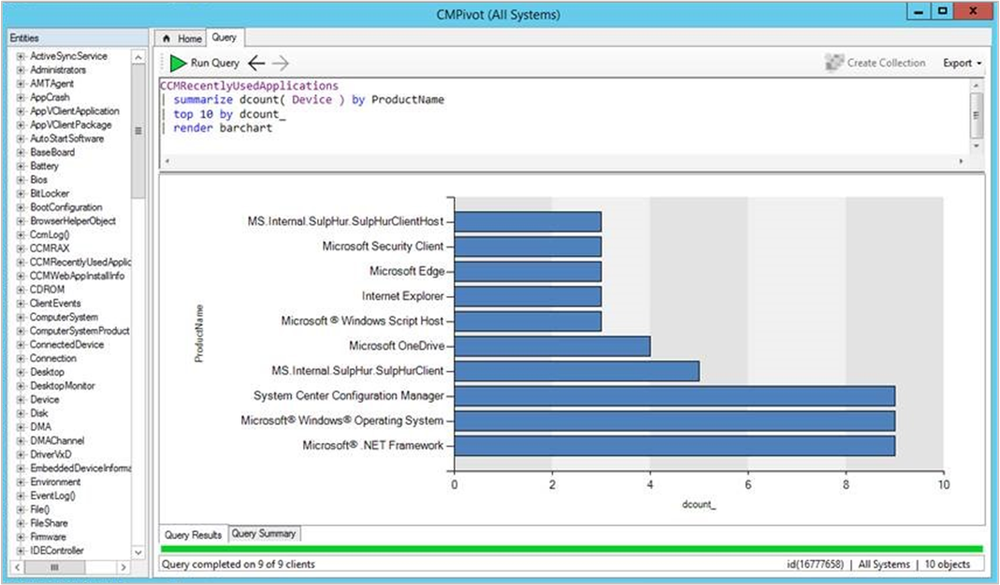

#### Example: time chart
To render time charts, use the new **bin()** operator to group events in time. The following query shows when devices have started in the last seven days:

``` Kusto
OperatingSystem
| where LastBootUpTime <= ago(7d)
| summarize count() by bin(LastBootUpTime,1d)
| render timechart
```

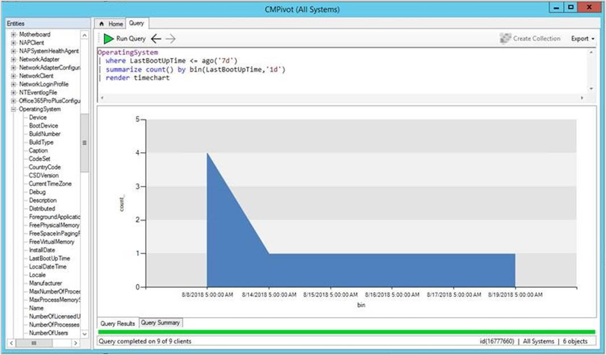

#### Example: pie chart
The following query displays all OS versions in a pie chart:

``` Kusto
OperatingSystem
| summarize count() by Caption
| render piechart
```

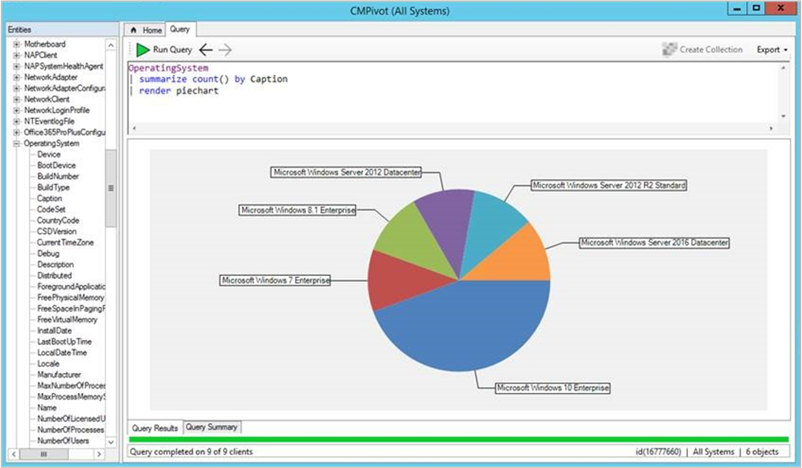


### <a name="bkmk_cmpivot-hinv"></a> Hardware inventory
Use CMPivot to query any hardware inventory class. These classes include any custom extensions you make to hardware inventory. CMPivot immediately returns cached results from the last hardware inventory scan stored in the site database. At the same time, it updates the results if necessary with live data from any online clients.

The color saturation of the data in the results table or chart indicates if the data is live or cached. For example, dark blue is real-time data from an online client. Light blue is cached data.

#### Example

``` Kusto
LogicalDisk
| summarize sum( FreeSpace ) by Device
| order by sum_ desc
| render columnchart
```

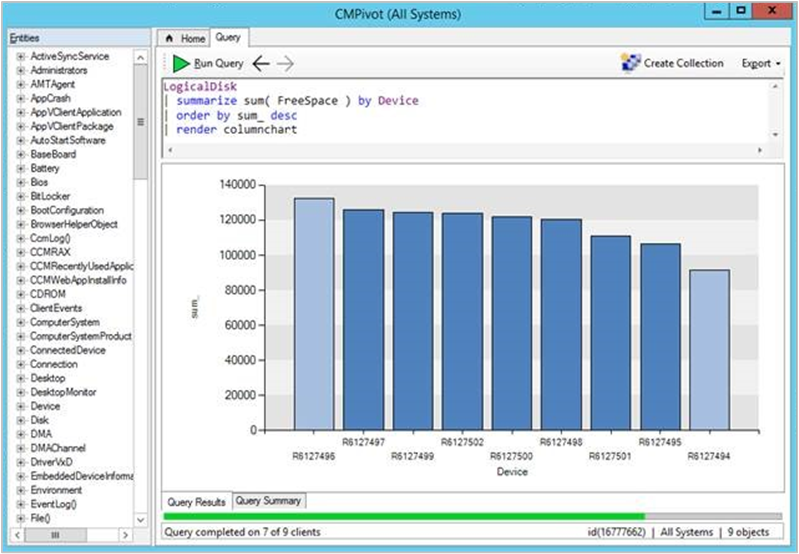

#### Limitations
- The following hardware inventory entities aren't supported:  
    - Array properties, for example IP address  
    - Real32/Real64 <!--example?-->  
    - Embedded object properties <!--example?-->  
- Inventory entity names must begin with a character
- You can't overwrite the built-in entities by creating an inventory entity of the same name  


### <a name="bkmk_cmpivot-operators"></a> Scalar operators
CMPivot includes the following scalar operators:  

> [!Note]  
> - LHS: string to the left of the operator  
> - RHS: string to the right of the operator  


|Operator|Description|Example (yields true)|
|--------|-----------|---------------------|
|==|Equals|`"aBc" == "aBc"`|
|!=|Not equals|`"abc" != "ABC"`|
|like|LHS contains a match for RHS|`"FabriKam" like "%Brik%"`|
|!like|LHS doesn't contain a match for RHS|`"Fabrikam" !like "%xyz%"`|
|contains|RHS occurs as a subsequence of LHS|`"FabriKam" contains "BRik"`|
|!contains|RHS doesn't occur in LHS|`"Fabrikam" !contains "xyz"`|
|startswith|RHS is an initial subsequence of LHS|`"Fabrikam" startswith "fab"`|
|!startswith|RHS isn't an initial subsequence of LHS|`"Fabrikam" !startswith "kam"`|
|endswith|RHS is a closing subsequence of LHS|`"Fabrikam" endswith "Kam"`|
|!endswith|RHS isn't a closing subsequence of LHS|`"Fabrikam" !endswith "brik"`|


### <a name="bkmk_cmpivot-summary"></a> Query summary

Select the **Query Summary** tab at the bottom of the CMPivot window. This status helps you identify clients that are offline, or troubleshoot errors that may occur. Select a value in the Count column to open a list of specific devices with that status. 

For example, select the count of devices with a Failure status. See the specific error message, and export a list of these devices. If the error is that a specific cmdlet isn't recognized, create a collection from the exported device list to deploy a Windows PowerShell update.  

### CMPivot audit status messages

Starting in version 1810, when you run CMPivot, an audit status message is created with **MessageID 40805**. You can view the status messages by going to **Monitoring** > **System Status** > **Status Message Queries**. You can run **All Audit status Messages for a Specific User**, **All Audit status Messages for a Specific Site**, or create your own status message query.

The following format is used for the message:

MessageId 40805: User &lt;UserName> ran script &lt;Script-Guid> with hash &lt;Script-Hash> on collection &lt;Collection-ID>.

- 7DC6B6F1-E7F6-43C1-96E0-E1D16BC25C14 is the Script-Guid for CMPivot.
- The Script-Hash can be seen in the client's scripts.log file.
- You can also see the hash stored in the client's script store. The filename on the client is &lt;Script-Guid>_&lt;Script-Hash>.
    - Example file name: C:\Windows\CCM\ScriptStore\7DC6B6F1-E7F6-43C1-96E0-E1D16BC25C14_abc1d23e45678901fabc123d456ce789fa1b2cd3e456789123fab4c56789d0123.ps
   

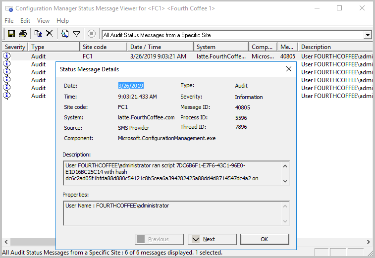

## Next steps
 
[Troubleshooting CMPivot](cmpivot-tsg.md)