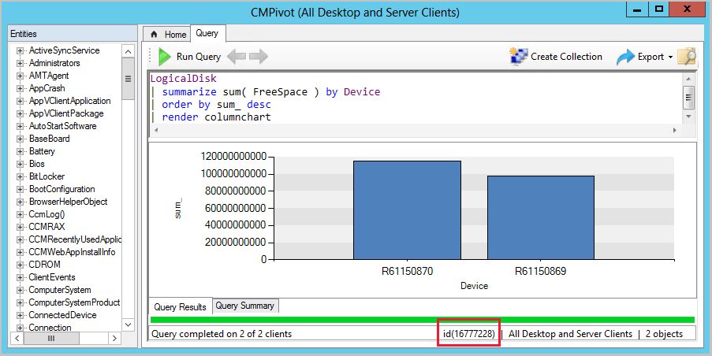
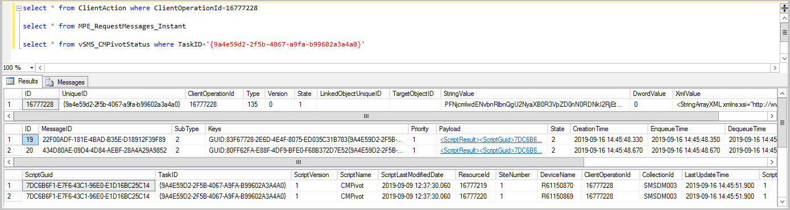
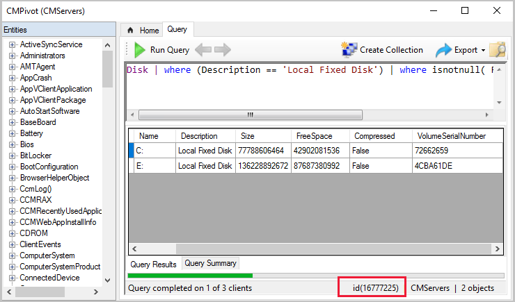

# Troubleshoot CMPivot

CMPivot is a tool that provides access to a real-time state of the devices in your environment. CMPivot runs a query on all currently connected devices in the target collection and returns the results.

Occasionally, you might need to troubleshoot CMPivot. For example, if a state message from a client to CMPivot gets corrupted, the site server can't process the message. This article helps you understand the flow of information for CMPivot.

## <a name="bkmk_CMPivot-1902"></a> Troubleshoot CMPivot in version 1902 and later

In Configuration Manager versions 1902 and later, you can run CMPivot from the central administration site (CAS) in a hierarchy. The primary site still handles the communication to the client.

When you run CMPivot from CAS, it uses the high-speed message subscription channel to communicate with the primary site. CMPivot doesn't use standard SQL Server replication between sites. If your SQL Server instance or your SMS provider is remote, or if you use a SQL Server Always On availability group, you'll have a "double hop scenario" for CMPivot. For information on how to define constrained delegation for a "double hop scenario", see [CMPivot starting in version 1902](cmpivot-changes.md#bkmk_cmpivot1902).

>[!IMPORTANT]
> When troubleshooting CMPivot, enable verbose logging on your management points (MPs) and on the site server's SMS_MESSAGE_PROCESSING_ENGINE to get more information. Also, if the client's output is larger than 80 KB, enable verbose logging on the MP and the site server's SMS_STATE_SYSTEM component. For information about how to enable verbose logging, see [Site server logging options](../../plan-design/hierarchy/about-log-files.md#site-server-logging-options).

### Get information from the site server

By default, the site server log files are located in `C:\Program Files\Microsoft Configuration Manager\logs`. This location might be different if you specified a non-default installation directory or offloaded items like the SMS Provider to another server. If you run CMPivot from the CAS, the logs are on the primary site server.

Look in `smsprov.log` for these lines:

- Configuration Manager version 1906:
  <pre><code lang="Log">Auditing: User &ltusername> initiated client operation 145 to collection &ltCollectionId>. </code></pre>

- Configuration Manager version 1902:
  <pre><code lang="Log">Type parameter is 135.
  Auditing: User &ltusername> ran script 7DC6B6F1-E7F6-43C1-96E0-E1D16BC25C14 with hash dc6c2ad05f1bfda88d880c54121c8b5cea6a394282425a88dd4d8714547dc4a2 on collection &ltCollectionId>. </code></pre>

 `7DC6B6F1-E7F6-43C1-96E0-E1D16BC25C14` is the Script-Guid for CMPivot. You can also see this GUID in [CMPivot audit status messages](cmpivot-changes.md#cmpivot-audit-status-messages).

Next, find the ID in the CMPivot window. This ID is the `ClientOperationID`.



Find the `TaskID` from the ClientAction table. The `TaskID` corresponds to the `UniqueID` in the ClientAction table.

``` SQL
select * from ClientAction where ClientOperationId=<id>
```

In `BgbServer.log`, look for the `TaskID` you gathered from SQL Server and note the `PushID`. The     `TaskID` is labeled `TaskGUID`. For example:

<pre><code lang="Log">Starting to send push task (<b>PushID: 9</b> TaskID: 12 <b>TaskGUID: 9A4E59D2-2F5B-4067-A9FA-B99602A3A4A0</b> TaskType: 15 TaskParam: PFNjcmlwdENvbnRlbnQgU2NyaXB0R3VpZD0nN0RDNkI2RjEtRTdGNi00M0MxL (truncated log entry)
Finished sending push task (<b>PushID: 9</b> TaskID: 12) to 2 clients
</code></pre>

### Client logs

After you have the information from the site server, check the client logs. By default, the client logs are located in `C:\Windows\CCM\Logs`.

In `CcmNotificationAgent.log`, look for log entries that look like the following lines:  

<pre><code lang="Log">Receive task from server with <b>pushid=9</b>, taskid=12, <b>taskguid=9A4E59D2-2F5B-4067-A9FA-B99602A3A4A0</b>, tasktype=15 and taskParam=PFNjcmlwdEhhc2ggU2NyaXB0SGF (truncated log entry)
Send Task response message &ltBgbResponseMessage TimeStamp="2019-09-13T17:29:09Z"><b>&ltPushID>5</b>&lt/PushID>&ltTaskID>4&lt/TaskID>&ltReturnCode>1&lt/ReturnCode>&lt/BgbResponseMessage> successfuly.
 </code></pre>

Check `Scripts.log` for the `TaskID`. In the following example, you see `Task ID`  `{9A4E59D2-2F5B-4067-A9FA-B99602A3A4A0}`:

<pre><code lang="Log">Sending script state message (fast): <b>{9A4E59D2-2F5B-4067-A9FA-B99602A3A4A0}</b>
Result are sent for ScriptGuid: 7DC6B6F1-E7F6-43C1-96E0-E1D16BC25C14 and <b>TaskID: {9A4E59D2-2F5B-4067-A9FA-B99602A3A4A0}</b>
</code></pre>

> [!NOTE]
> If you don't see "(fast)" in the `Scripts.log`, then the data is likely over 80 KB. In this case, the information is sent to the site server as a state message. Use client's `StateMessage.log` and the site server's `Statesys.log`.

### Review messages on the site server

When [verbose logging](../../plan-design/hierarchy/about-log-files.md#client-and-management-point-logging-options) is enabled on the management point, you can see how incoming client messages are handled. In   `MP_RelayMsgMgr.log`, look for the `TaskID`.

In the `MP_RelayMsgMgr.log` example, you can see the client's ID `(GUID:83F67728-2E6D-4E4F-8075-ED035C31B783)` and the `Task ID {9A4E59D2-2F5B-4067-A9FA-B99602A3A4A0}`. A message ID gets assigned to the client's response before it's sent to the message processing engine:

<pre><code lang="Log">MessageKey: GUID:83F67728-2E6D-4E4F-8075-ED035C31B783<b>{9A4E59D2-2F5B-4067-A9FA-B99602A3A4A0}</b>
Create message succeeded for <b>message id 22f00adf-181e-4bad-b35e-d18912f39f89</b>
Add message payload succeeded for message id 22f00adf-181e-4bad-b35e-d18912f39f89
Put message succeeded for message id 22f00adf-181e-4bad-b35e-d18912f39f89
CRelayMsgMgrHandler::HandleMessage(): ExecuteTask() succeeded
</code></pre>

When [verbose logging](../../plan-design/hierarchy/about-log-files.md#configure-logging-options) is enabled on `SMS_MESSAGE_PROCESSING_ENGINE.log`, the client results are processed. Use the message ID you found from the `MP_RelayMsgMgr.log`. The processing log entries are similar to the following example:

<pre><code lang="Log">Processing 2 messages with type Instant and IDs <b>22f00adf-181e-4bad-b35e-d18912f39f89[19]</b>, 434d80ae-09d4-4d84-aebf-28a4a29a9852[20]...
Processed 2 messages with type Instant. Failed to process 0 messages. All message IDs <b>22f00adf-181e-4bad-b35e-d18912f39f89[19]</b>, 434d80ae-09d4-4d84-aebf-28a4a29a9852[20]
</code></pre>

> [!TIP]
> If you get an exception during processing, you can review it by running the following SQL query and looking at the Exception column. After the message is processed, it will no longer be in the `MPE_RequestMessages_Instant` table.
>
> ```SQL
> select * from MPE_RequestMessages_Instant where MessageID=<ID from SMS_MESSAGE_PROCESSING_ENGINE.log>
> ```

In `BgbServer.log`, look for the `PushID` to see the number of clients that reported or failed.

<pre><code lang="Log">Generated BGB task status report c:\ConfigMgr\inboxes\bgb.box\Bgb5c1db.BTS at 09/16/2019 16:46:39. (<b>PushID: 9</b> ReportedClients: 2 FailedClients: 0)
</code></pre>

Check the monitoring view for CMPivot from SQL Server by using the `TaskID`.

``` SQL
select * from vSMS_CMPivotStatus where TaskID='{9A4E59D2-2F5B-4067-A9FA-B99602A3A4A0}'
```

[ ](media/cmpivot-sql-queries-1902.png#lightbox)

## <a name="bkmk_CMPivot-1810"></a> Troubleshoot CMPivot in 1810 and earlier

In Configuration Manager versions 1810 and earlier, your site server handles the communication to the client.

### Get information from the site server

By default, the site server log files are located in `C:\Program Files\Microsoft Configuration Manager\logs`. This location might be different if you specified a non-default installation directory or offloaded items like the SMS Provider to another server.

Look in `smsprov.log` for this line:

<pre><code lang="Log">Auditing: User &ltusername> initiated client operation 135 to collection &ltCollectionId>.
</code></pre>

Find the ID in the CMPivot window. This ID is the `ClientOperationID`.



Find the `TaskID` from the ClientAction table. The `TaskID` corresponds to the `UniqueID` in the ClientAction table.

``` SQL
select * from ClientAction where ClientOperationId=<id>
```

In `BgbServer.log`, look for the `TaskID` you gathered from SQL. It's labeled `TaskGUID`. For example:

<pre><code lang="Log">Starting to send push task (PushID: 260 TaskID: 258 TaskGUID: <b>F8C7C37F-B42B-4C0A-B050-2BB44DF1098A</b> TaskType: 15
TaskParam: PFNjcmlwdEhhc2ggU2NyaXB0SGF...truncated...to 5 clients with throttling (strategy: 1 param: 42)
Finished sending push task (PushID: 260 TaskID: 258) to 5 clients
</code></pre>

### Client logs

After you have the information from the site server, check the client logs. By default, the client logs are located in `C:\Windows\CCM\Logs`.

In `CcmNotificationAgent.log`, look for logs that are similar to the following entry:  

<pre><code lang="Log"><b>Error! Bookmark not defined.</b>+PFNjcmlwdEhhc2ggU2NyaXB0SGFzaEFsZz0nU0hBMjU2Jz42YzZmNDY0OGYzZjU3M2MyNTQyNWZiNT
g2ZDVjYTIwNzRjNmViZmQ1NTg5MDZlMWI5NDRmYTEzNmFiMDE0ZGNjPC9TY3JpcHRIYXNoPjxTY3Jp (truncated log entry)
</code></pre>

Look in `Scripts.log` for the `TaskID`. In the following example, we see `Task ID {F8C7C37F-B42B-4C0A-B050-2BB44DF1098A}`:

<pre><code lang="Log">Sending script state message: 7DC6B6F1-E7F6-43C1-96E0-E1D16BC25C14
State message: Task Id <b>{F8C7C37F-B42B-4C0A-B050-2BB44DF1098A}</b>
</code></pre>

Look in `StateMessage.log`. In the following example, you see that `TaskID` is near the bottom of the message next to `<Param>`:

``` XML
StateMessage body: <?xml version="1.0" encoding="UTF-16"?>
<Report><ReportHeader><Identification><Machine><ClientInstalled>1</ClientInstalled><ClientType>1
</ClientType><ClientID>GUID:DBAC52C9-57E6-47D7-A8D6-E0A5A64B57E6</ClientID><ClientVersion>5.00.8670.1000</ClientVersion>
<NetBIOSName>R613924</NetBIOSName><CodePage>437</CodePage>
<SystemDefaultLCID>1033</SystemDefaultLCID><Priority>0</Priority></Machine></Identification>
<ReportDetails><ReportContent>State Message Data</ReportContent><ReportType>Full</ReportType>
<Date>20180703184447.673000+000</Date><Version>1.0</Version><Format>1.0</Format>
</ReportDetails></ReportHeader><ReportBody><StateMessage MessageTime="20180703184447.517000+000"><Topic ID="7DC6B6F1-E7F6-43C1-96E0-E1D16BC25C14" Type="9003" IDType="0" User="" UserSID=""/><State ID="1" Criticality="0"/>
<StateDetails Type="1"><![CDATA["PAA/AHgAbQBsACAAdgBlAHIAcwBpAG8AbgA9ACIAMQAuADAAIgAgAGUAbgBjAG8AZABpAG4AZwA9ACIAdQB0AGYALQAxADYAIgA/AD4APAByAGUAcwB1AGwAdAAgAFIAZQBzAHUAbAB0AEMAbwBkAGUAPQAiADAAIgA+ADwAZQAgAE4AYQBtAGUAPQAiAEkAbgB0AGUAbAAoAFIAKQAgAFgAZQBvAG4AKABSACkAIABDAFAAVQAgAEUANQAtADIANgA3ADMAIAB2ADQAIABAACAAMgAuADMAMABHAEgAegAiACAATQBhAG4AdQBmAGEAYwB0AHUAcgBlAHIAPQAiAEEAbQBlAHIAaQBjAGEAbgAgAE0AZQBnAGEAdAByAGUAbgBkAHMAIABJAG4AYwAuACIAIABWAGUAcgBzAGkAbwBuAD0AIgBWAFIAVABVAEEATAAgAC0AIAA2ADAAMAAxADcAMAAyACIAIABSAGUAbABlAGEAcwBlAEQAYQB0AGUAPQAiADIAMAAxADcALQAwADYALQAwADIAIAAwADAAOgAwADAAOgAwADAAIgAgAFMAZQByAGkAYQBsAE4AdQBtAGIAZQByAD0AIgAwADAAMAAwAC0AMAAwADEAOAAtADMANgA4ADIALQA0ADcAMAA4AC0ANwA2ADQAMAAtADcANgAwADAALQAzADMAIgAgAFMATQBCAEkATwBTAEIASQBPAFMAVgBlAHIAcwBpAG8AbgA9ACIAMAA5ADAAMAAwADcAIAAiACAALwA+ADwALwByAGUAcwB1AGwAdAA+AA=="~~]]></StateDetails><UserParameters Flags="0" Count="2">
<Param>{F8C7C37F-B42B-4C0A-B050-2BB44DF1098A}</Param><Param>0</Param></UserParameters></StateMessage></ReportBody></Report>

Successfully forwarded State Messages to the MP StateMessage 7/3/2018 11:44:47 AM 5036 (0x13AC)
```

### Review messages on the site server

Open `statesys.log` to see if the message is received and processed. In the following example, you see `TaskID` near the bottom of the message next to `<Param>`. Enable [verbose logging](../../plan-design/hierarchy/about-log-files.md#configure-logging-options) on the SMS_STATE_SYSTEM component to see these log entries.

``` XML
CMessageProcessor - the cmdline to DB exec dbo.spProcessStateReport N'?<?xml version="1.0" encoding="UTF-
16"?>~~<Report><ReportHeader><Identification><Machine><ClientInstalled>1</ClientInstalled><ClientType>1
</ClientType><ClientID>GUID:DBAC52C9-57E6-47D7-A8D6-E0A5A64B57E6</ClientID><ClientVersion>5.00.8670.1000</ClientVersion>
<NetBIOSName>R613924</NetBIOSName><CodePage>437</CodePage>
<SystemDefaultLCID>1033</SystemDefaultLCID><Priority>0</Priority></Machine></Identification>
<ReportDetails><ReportContent>State Message Data</ReportContent><ReportType>Full</ReportType>
<Date>20180703184447.673000+000</Date><Version>1.0</Version><Format>1.0</Format>
</ReportDetails></ReportHeader><ReportBody><StateMessage MessageTime="20180703184447.517000+000"><Topic ID="7DC6B6F1-E7F6-43C1-96E0-E1D16BC25C14" Type="9003" IDType="0" User="" UserSID=""/><State ID="1" Criticality="0"/>
<StateDetails Type="1"><![CDATA["PAA/AHgAbQBsACAAdgBlAHIAcwBpAG8AbgA9ACIAMQAuADAAIgAgAGUAbgBjAG8AZABpAG4AZwA9ACIAdQB0AGYALQAxADYAIgA/AD4APAByAGUAcwB1AGwAdAAgAFIAZQBzAHUAbAB0AEMAbwBkAGUAPQAiADAAIgA+ADwAZQAgAE4AYQBtAGUAPQAiAEkAbgB0AGUAbAAoAFIAKQAgAFgAZQBvAG4AKABSACkAIABDAFAAVQAgAEUANQAtADIANgA3ADMAIAB2ADQAIABAACAAMgAuADMAMABHAEgAegAiACAATQBhAG4AdQBmAGEAYwB0AHUAcgBlAHIAPQAiAEEAbQBlAHIAaQBjAGEAbgAgAE0AZQBnAGEAdAByAGUAbgBkAHMAIABJAG4AYwAuACIAIABWAGUAcgBzAGkAbwBuAD0AIgBWAFIAVABVAEEATAAgAC0AIAA2ADAAMAAxADcAMAAyACIAIABSAGUAbABlAGEAcwBlAEQAYQB0AGUAPQAiADIAMAAxADcALQAwADYALQAwADIAIAAwADAAOgAwADAAOgAwADAAIgAgAFMAZQByAGkAYQBsAE4AdQBtAGIAZQByAD0AIgAwADAAMAAwAC0AMAAwADEAOAAtADMANgA4ADIALQA0ADcAMAA4AC0ANwA2ADQAMAAtADcANgAwADAALQAzADMAIgAgAFMATQBCAEkATwBTAEIASQBPAFMAVgBlAHIAcwBpAG8AbgA9ACIAMAA5ADAAMAAwADcAIAAiACAALwA+ADwALwByAGUAcwB1AGwAdAA+AA=="~~]]></StateDetails><UserParameters Flags="0" Count="2">
<Param>{F8C7C37F-B42B-4C0A-B050-2BB44DF1098A}</Param><Param>0</Param></UserParameters></StateMessage></ReportBody></Report>~~'
```

If the message hasn't been processed, check the state message inbox. The default inbox location is `C:\Program Files\Microsoft Configuration Manager\inboxes\auth\statesys.box\`. Look for the files in these locations:

- Incoming
- Corrupted
- Process

Check the monitoring view for CMPivot via the following SQL query using the `TaskID`:

``` SQL
select * from vSMS_CMPivotStatus where TaskID='{F8C7C37F-B42B-4C0A-B050-2BB44DF1098A}'
```

>[!NOTE]
>For clients that are using version 1810 or higher, state messaging isn't used unless the output is larger than 80 KB. When troubleshooting CMPivot in these cases, you can get more information when you enable verbose logging on your MPs and the site server's SMS_MESSAGE_PROCESSING_ENGINE. For information on how to enable verbose logging, see [Site server logging options](../../plan-design/hierarchy/about-log-files.md#site-server-logging-options).
>
> To troubleshoot, refer to the following logs:
>
> - `MP_Relay.log`
> - `SMS_MESSAGE_PROCESSING_ENGINE.log`

## Next steps

- [Using CMPivot](cmpivot.md)
- [Create and run PowerShell scripts](../../../apps/deploy-use/create-deploy-scripts.md)
