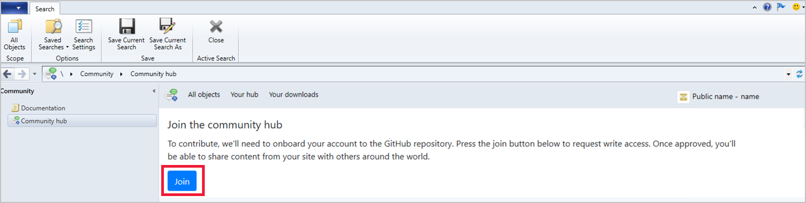
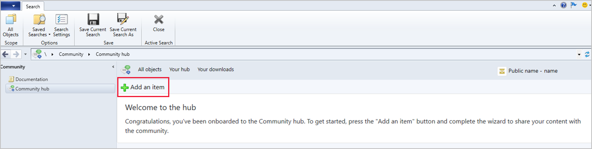
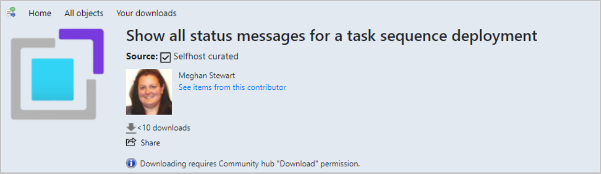
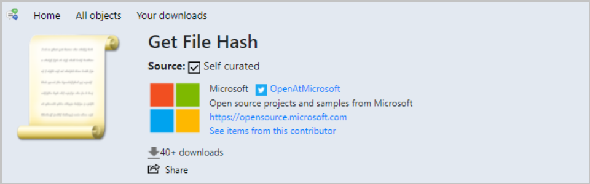
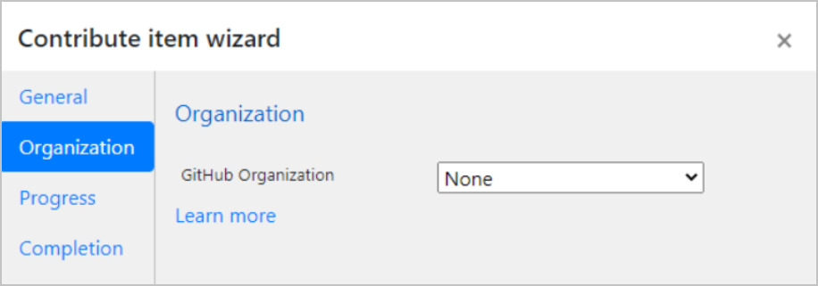

# Contribute to the Community hub
<!--3555935, 3555936-->
*Applies to: Configuration Manager (current branch)*

[Community hub](community-hub.md) fosters creativity by building on others work and having other people build on yours. GitHub already has industry-wide processes and tools built for sharing. Now, the Community hub can leverage those tools directly in the Configuration Manager console as foundational pieces for driving this new community. You can share the following objects for use by others in the Configuration Manager community:  

[!INCLUDE [Community hub object type information](includes/community-hub-object-types.md)]

## Prerequisites

- All [Community hub prerequisites and permissions](community-hub.md#prerequisites)
- Configuration Manager version 2010 or later
- Install the Microsoft Edge [WebView2 extension](community-hub.md#bkmk_webview2) for the Configuration Manager console.  <!--9598183-->
- A [GitHub](https://github.com) account
  - A GitHub account is only required to contribute and share content from the **Your hub** page.
  - If you don't already have a GitHub account, you can create one before you join.
   - If you don't wish to share, you can use contributions from others without having a GitHub account.

> [!IMPORTANT]
> Configuration Manager versions 2006 and earlier can’t sign into GitHub but can still download items. Using Community hub on Windows Server requires the WebView2 console extension and Configuration Manager version 2010 or later. <!--9082812-->

[!INCLUDE [Community hub security role information](includes/community-hub-security-roles.md)]

## Join the Community hub to contribute content

1. Go to the **Community hub** node in the **Community** workspace.
1. Select **Your hub** and you'll be prompted to sign into GitHub. If you don't have an account, you'll be redirected to GitHub where you can create one. A GitHub account is only required to contribute and share content from the **Your hub** page.
1. Once you've signed into GitHub, select the **Join** button to join the Community hub.

   

1. After joining, you'll see your membership request is pending. Your account needs approval by the Configuration Manager Content Curation team. Approvals are done once a day, so it may take up to one business day for your approval to be granted.
1. Once you're granted access, you'll get an email from GitHub. Open the link in the email to accept the invitation.
   > [!IMPORTANT]
   > You must accept the invitation sent in the email otherwise you won't be able to contribute content.

## Contribute content

Once you've accepted the invitation, you can contribute content.

1. Go to **Community** > **Community hub** > **Your hub**.
1. Select **Add an Item** to open the **Contribute item wizard**.
      
1. Specify the **Type** of object you want to share from the drop-down menu. The following object types are available:

     [!INCLUDE [Community hub object type information](includes/community-hub-object-types.md)]

1. Select **Browse** to load your environment's object list for the selected type. The object's **Name** and **Description** (if available) will automatically load in the contribution wizard.
1. Edit the following information to reflect what the community should see for your contribution:
   - **Name:** Name of your object
   - **Description:** The description of the object you're contributing.
1. On the **Organization** page, select the **GitHub Organization** to use for [organization branding](#bkmk_brand) if needed.
   - **None** is the default.
   - If your organization isn't listed, verify that the [membership visibility](https://docs.github.com/free-pro-team@latest/github/setting-up-and-managing-your-github-user-account/publicizing-or-hiding-organization-membership) is set to **Public** in your GitHub profile.
1. Select **Next** to submit the contribution.
1. Once the contribution is complete, you'll see the GitHub pull request (PR) link. The link is also emailed to you. You can paste the link into a browser to view the PR. Your PR will go though the standard GitHub merge process.
   - PRs should be submitted through the Configuration Manager console, not directly to the GitHub repository.
1. Choose **Close** to exit the contribution wizard.
1. Once the PR has been completed and merged, the new item will display in the Community hub home page for others to see.

## Update contributed content

You can update content you've contributed to the Community hub.

1. Select an item that you previously contributed. Currently, you can only edit items that you contributed.
1. In the item details, select **Push Update** to open the contribute item wizard.
1. Edit the **Description** of the item to note what changes were made.  
1. Select **Next** to upload the item.
1. Once the item is uploaded, you'll be given the pull request URL of the change for monitoring.
1. Select **Close** when you're done to exit the wizard.

##  Personalization and organization branding of contributed content
<!--8928812-->
Starting in January 2021, your contributions are personalized. By default, your contributions include your personal GitHub profile picture. The default [GitHub Identicon](https://github.blog/2013-08-14-identicons/) is used if you don't have a profile picture. All contributions you've submitted before January 2021 are automatically personalized using this default.

Community hub also allows new contributions to be branded instead of using the default personalization. You can brand a contribution to one of your organization memberships in GitHub that's publicly visible. When you choose to brand your contribution, the organization's profile picture is used rather than your personal profile picture. The organization's web page, Twitter handle, and company bio are included on the contribution. Branding to the organization identity allows for uniformity regardless of which user is submitting the contribution.

To use branding:
- The [visibility of the organization membership](https://docs.github.com/free-pro-team@latest/github/setting-up-and-managing-your-github-user-account/publicizing-or-hiding-organization-membership) must be set to **Public** from the contributor's GitHub profile.
- On the **Organization** page in the **Contribute item wizard**, select the **GitHub Organization** to use for branding. For more information, see the [Contribute content](#contribute-content) section.

##  Directly link to Community hub items
<!--4224406-->

[!INCLUDE [Community hub direct link information](includes/community-hub-links.md)]

<!--using include for shared content for 9965423-->

[!INCLUDE [Publish to Community hub from CMPivot](includes/cmpivot-publish.md)] 

## Object type information

### Configuration baselines
<!--7983121-->
When you contribute a [configuration baseline](../../../compliance/deploy-use/create-configuration-baselines.md), each of the child configuration items is verified. The verification starts at the lowest nested level. This means that configuration items that are grandchildren are verified before direct child configuration items are. You can have up to 50 child configuration items and up to 4 nested levels. The following process occurs to ensure the configuration baseline is usable and complete:

1. Check if the child configuration item is already in the Community hub. If the configuration item doesn't exist, it's created.
   - A configuration item with software updates or version-specific references will cause an error and the contribution will fail.
1. If the configuration item already exists in the Community hub, verify the contributor is the author. If the contributor isn't the author, a new configuration item is created in Community hub.
1. If the contributor is the author, check for local updates to the configuration item. If the configuration item changed, update the item in the Community hub.

### Console extensions
<!--3555909-->

You contribute extensions the same way you would any other community hub object. However, for there are additional requirements and additional information you need to supply for an extension. When you contribute a console extension to Community hub, the content must be signed. Content for console extensions isn't hosted by Microsoft. When you contribute your item, you'll be asked to provide a location to the signed `.cab` file along with other information for the extension. The following items are required for contributing extensions:  

- **Content URL**: Location for the downloadable `.cab` file
- **SHA-256 hash of the content**: SHA-256 hash of the `.cab` file
- **License URL**: URL of the license for the extension, such as [https://mit-license.org/](https://mit-license.org/)
- **Privacy statement URL**: URL of your privacy statement

## Next steps

Learn more about creating and using the following objects:

- [Create and run PowerShell scripts](../../../apps/deploy-use/create-deploy-scripts.md)
- [Introduction to reporting](introduction-to-reporting.md)
- [Create and manage task sequences](../../../osd/deploy-use/manage-task-sequences-to-automate-tasks.md)
- [Create and deploy an application](../../../apps/get-started/create-and-deploy-an-application.md)
- [Create configuration items](../../../compliance/deploy-use/create-configuration-items.md)
- [Create and contribute console extensions](../../../develop/core/servers/console/console-extension-register.md)
