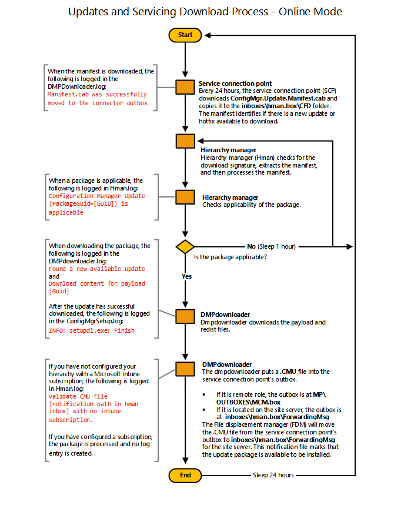

# Flowchart - Download updates for Configuration Manager

*Applies to: Configuration Manager (current branch)*

This data flow displays the process by which a site with an on-line  service connection point downloads in-console updates.  

   
