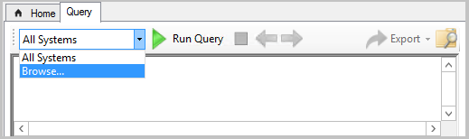

<!--This file is shared by the cmpivot.md file and the cmpivot-changes.md file and contains information on how to run CMPivot standalone. H2s or HJ3s are determined by the article for which the include file is used.-->
<!--3555890, 4619340, 4683130 -->

You can use CMPivot as a standalone app. CMPivot standalone is only available in English. Run CMPivot outside of the Configuration Manager console to view the real-time state of devices in your environment. This change enables you to use CMPivot on a device without first installing the console.

You can share the power of CMPivot with other personas, such as helpdesk or security admins, who don't have the console installed on their computer. These other personas can use CMPivot to query Configuration Manager alongside the other tools that they traditionally use. By sharing this rich management data, you can work together to proactively solve business problems that cross roles.

#### Install CMPivot standalone

1. Set up the permissions needed to run CMPivot. For more information, see [prerequisites](../cmpivot.md#prerequisites). You can also use the [Security Administrator role](../cmpivot-changes.md#bkmk_cmpivot_secadmin1906) if the permissions are appropriate for the user.
2. Find the CMPivot app installer in the following path: `<site install path>\tools\CMPivot\CMPivot.msi`. You can run it from that path, or copy it to another location.
3. When you run the CMPivot standalone app, you'll be asked to connect to a site. Specify the fully qualified domain name or computer name of either the Central Administration or primary site server.
   - Each time you open CMPivot standalone you'll be prompted to connect to a site server.
4. Browse to the collection on which you want to run CMPivot, then run your query.

   

> [!NOTE]
> - Right-click actions, such as **Run Scripts**, **Resource Explorer**, and web search aren't available in CMPivot standalone. CMPivot standalone's primary use is querying independently from the Configuration Manager infrastructure. To help security administrators, CMPivot standalone does include the ability to connect to Microsoft Defender Security Center. <!--5605358-->
> - You can do [local device query evaluation using CMPivot standalone](../cmpivot-changes.md#bkmk_local-eval). <!--3197353-->
