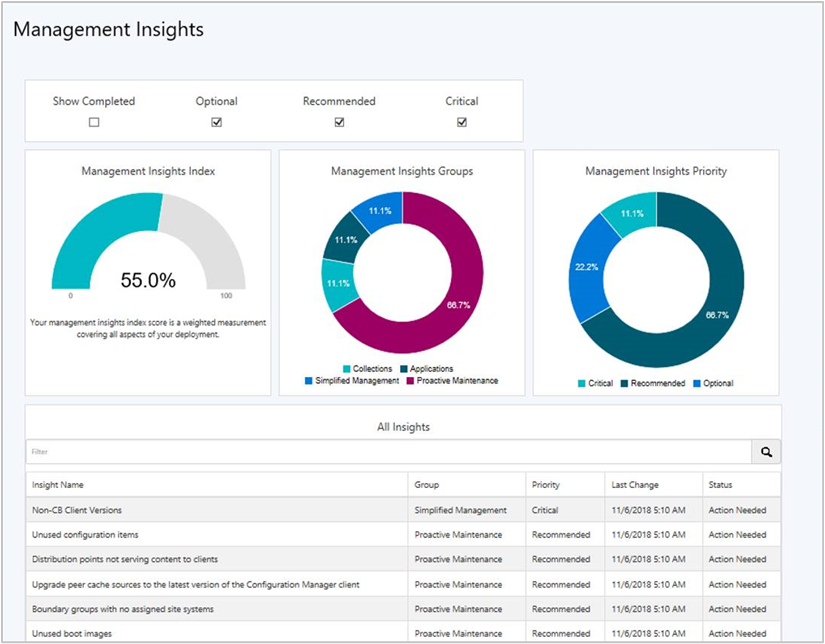

# Management insights in Configuration Manager

*Applies to: Configuration Manager (current branch)*

Management insights in Configuration Manager provide information about the current state of your environment. The information is based on analysis of data from the site database. Insights help you to better understand your environment and take action based on the insight. <!--1353967-->

## Review management insights

To view the rules, your account needs the **read** permission on the **site** object.

1. Open the Configuration Manager Console.  

2. Go to the **Administration** workspace, expand **Management Insights**, and select **All Insights**.  

    > [!Note]  
    > When you select the **Management Insights** node, it shows the [Management insights dashboard](#bkmk_insights).  

3. Open the management insights group name you want to review. Select **Show Insights** in the ribbon.  

The following four tabs are available for review:

- **All Rules**: Gives the complete list of rules for the management insight group chosen.  

- **Complete**:  Lists rules where no action is needed.  

- **In Progress**: Shows rules where some, but not all, prerequisites are complete.  

- **Action Needed**: Rules needing actions taken are listed. Select **More Details** to retrieve specific items where action is needed.  

The **Prerequisites** pane lists the required items needed to run the rule.

### All rules and prerequisites for the cloud services group

Select a rule and then select **More Details** to see the rule details.

## Operations

The management insight rules reevaluate their applicability on a weekly schedule. To reevaluate a rule on-demand, right-click the rule and select **Re-evaluate**.

The log file for management insight rules is **SMS_DataEngine.log** on the site server.

<!--1357930-->
Some rules let you take action. Select a rule, select **More Details**, and then if available select **Take action**.

Depending upon the rule, this action has one of the following behaviors:  

- Automatically navigate in the console to the node where you can take further action. For example, if the management insight recommends changing a client setting, taking action navigates to the Client Settings node. Then take further action by modifying the default or a custom client settings object.  

- Navigate to a filtered view based on a query. For example, taking action on the empty collections rule shows just these collections in the list of collections. Then take further action, such as deleting a collection or modifying its membership rules.  

##  Management insights dashboard

<!--1357979-->

The **Management Insights** node includes a graphical dashboard. This dashboard displays an overview of the rule states, which makes it easier for you to show your progress.

Use the following filters at the top of the dashboard to refine the view:

- Show Completed
- Optional
- Recommended
- Critical

The dashboard includes the following tiles:  

- **Management insights index**: Tracks overall progress on management insights rules. The index is a weighted average. Critical rules are worth the most. This index gives the least weight to optional rules.  

- **Management insights groups**: Shows percent of rules in each group, honoring the filters. Select a group to drill down to the specific rules in this group.  

- **Management insights priority**: Shows percent of rules by priority, honoring the filters.  

- **All insights**: A table of insights including priority and state. Use the **Filter** field at the top of the table to match strings in any of the available columns. The dashboard sorts the table in the following order:

  - Status: Action Needed, Completed, Unknown  
  - Priority: Critical, Recommended, Optional  
  - Last Changed: older dates on top  

## Groups and rules

Rules are organized into the following management insight groups:

- [Applications](#applications)
- [Cloud services](#cloud-services)
- [Collections](#collections)
- [Configuration Manager Assessment](#configuration-manager-assessment)
- [Proactive maintenance](#proactive-maintenance)
- [Security](#security)
- [Simplified management](#simplified-management)
- [Software Center](#software-center)
- [Windows 10](#windows-10)

### Applications

Insights for your application management.

- **Applications without deployments**: Lists the applications in your environment that don't have active deployments. This rule helps you find and delete unused applications to simplify the list of applications displayed in the console. For more information, see [Deploy applications](/sccm/apps/deploy-use/deploy-applications).  

### Cloud services

Helps you integrate with many cloud services, which enable modern management of your devices.

- **Assess co-management readiness**: Helps you understand what steps are needed to enable co-management. This rule has prerequisites. For more information, see [Co-management overview](/sccm/comanage/overview).  

- **Devices not uploaded to Azure AD**: Starting in version 2002, this rule lists devices that aren't uploaded to Azure AD because the site isn't properly configured for HTTPS.<!--6268489--> Configure [Enhanced HTTP](/configmgr/core/plan-design/hierarchy/enhanced-http), or enable at least one management point for HTTPS. If you already configured the site for HTTPS communication, this rule doesn't appear.

- **Configure Azure services for use with Configuration Manager**: This rule helps you onboard Configuration Manager to Azure AD, which enables clients to authenticate with the site using Azure AD. For more information, see [Configure Azure services](/sccm/core/servers/deploy/configure/azure-services-wizard).  

- **Enable devices to be hybrid Azure Active Directory joined**: Azure AD-joined devices allow users to sign in with their domain credentials while ensuring devices meet the organization's security and compliance standards. For more information, see [Azure AD hybrid identity design considerations](https://docs.microsoft.com/azure/active-directory/active-directory-hybrid-identity-design-considerations-overview).  

- **Sites that don't have proper HTTPS configuration**: Starting in version 2002, this rule lists sites in your hierarchy that aren't properly configured for HTTPS. This configuration prevents the site from [synchronizing collection membership results to Azure Active Directory (Azure AD) groups](/configmgr/core/clients/manage/collections/create-collections#bkmk_aadcollsync). It may cause Azure AD sync to not upload all devices. Management of these clients may not function properly.<!--6268489--> Configure [Enhanced HTTP](/configmgr/core/plan-design/hierarchy/enhanced-http), or enable at least one management point for HTTPS. If you already configured the site for HTTPS communication, this rule doesn't appear.

- **Update clients to the latest Windows 10 version**: Windows 10, version 1709 or above improves and modernizes the computing experience of your users. For more information, see [Key articles about adopting Windows as a service](/sccm/core/understand/configuration-manager-and-windows-as-service#key-articles-about-adopting-windows-as-a-service).  

### Collections

Insights that help simplify management by cleaning up and reconfiguring collections.

- **Empty Collections**: Lists collections in your environment that have no members. For more information, see [How to manage collections](/sccm/core/clients/manage/collections/manage-collections).  

Starting in version 1902, there are new rules with recommendations on managing collections.<!--3555752--> Use these insights to simplify management and improve performance:

- **Collections with no query rules and no direct members**: To simplify the list of collections in your hierarchy, delete these collections.  

- **Collections with the same re-evaluation start time**: These collections have the same re-evaluation time as other collections. Modify the re-evaluation time so they don't conflict.  

- **Collections with query time over two seconds**: Review the query rules for this collection. Consider modifying or deleting the collection.

- The following rules include configurations that potentially cause unnecessary load on the site. Review these collections, then either delete them, or disable rule evaluation:  

  - **Collections with no query rules and incremental updates enabled**  

  - **Collections with no query rules and enabled for scheduled or incremental evaluation**  

  - **Collections with no query rules and schedule full evaluation selected**  

### Configuration Manager Assessment

<!--3607758-->

Starting in version 2002, this group is courtesy of Microsoft Premier Field Engineering. These rules are a sample of the many more checks that Microsoft Premier provides in the [Services Hub](https://docs.microsoft.com/services-hub/health/getting_started_with_on_demand_assessments).

- **Active Directory Security Group Discovery is configured to run too frequently**: You typically don't need to configure Active Directory Security Group Discovery to occur more frequently than every three hours. A more frequent configuration can have a negative performance impact on Active Directory, the network, and Configuration Manager. Enable incremental synchronization instead of using a full sync schedule. For more information, see [Active Directory group discovery](/configmgr/core/servers/deploy/configure/about-discovery-methods#bkmk_aboutGroup).

- **Active Directory System Discovery is configured to run too frequently**: You typically don't need to configure Active Directory System Discovery to occur more frequently than every three hours. A more frequent configuration can have a negative performance impact on Active Directory, the network, and Configuration Manager. Enable incremental synchronization instead of using a full sync schedule. For more information, see [Active Directory system discovery](/configmgr/core/servers/deploy/configure/about-discovery-methods#bkmk_aboutSystem).

- **Active Directory User Discovery is configured to run too frequently**: You typically don't need to configure Active Directory User Discovery to occur more frequently than every three hours. A more frequent configuration can have a negative performance impact on Active Directory, the network, and Configuration Manager. Enable incremental synchronization instead of using a full sync schedule. For more information, see [Active Directory user discovery](/configmgr/core/servers/deploy/configure/about-discovery-methods#bkmk_aboutUser).

- **Collections limited to All Systems or All Users**: Review any collections that use the **All Systems** or **All Users** collections as the limiting collection. Configuration Manager updates the membership of these default collections with data from the Active Directory discovery methods. This data may not be valid information for Configuration Manager clients.

- **Heartbeat Discovery is disabled**: Heartbeat discovery requires that you install the Configuration Manager client on devices. It's the only discovery method that clients start. All other methods occur on site servers. Heartbeat discovery is essential to keep client activity status current. It makes sure that the site doesn't accidentally age out the resource records from the site database. For more information, see [Heartbeat discovery](/configmgr/core/servers/deploy/configure/about-discovery-methods#bkmk_aboutHeartbeat).

- **Long running collection queries enabled for incremental updates**: Collections with a last incremental refresh time higher than 30 seconds use site server and database resources, which could potentially impact overall Configuration Manager performance. For more information, see [Best practices for collections](/configmgr/core/clients/manage/collections/best-practices-for-collections).

- **Reduce the number of applications and packages on distribution points**: Microsoft officially supports a combined total of up to 10,000 packages and applications on a distribution point. Exceeding this total can lead to operational problems. For more information, see [Size and scale numbers - distribution point](/configmgr/core/plan-design/configs/size-and-scale-numbers#distribution-point).

- **Secondary site installation issues**: The installation status of some secondary sites is **Pending** or **Failed**. These states mean that you started the install but it didn't complete successfully. Until the secondary site install finishes, clients may not communicate properly with the primary site. Check the **Monitoring** workspace, and retry the installation. For more information, see [Retry installation of a failed update](/configmgr/core/servers/manage/install-in-console-updates#bkmk_retry).

- **Update all sites to the same version**: Use the same version of Configuration Manager in a hierarchy. This configuration makes sure all sites provide the same functionality. Sites of different versions in the same hierarchy introduce interoperability scenarios. Later versions of Configuration Manager include new features and resolve known issues. For more information, see [Interoperability between different versions](/configmgr/core/plan-design/hierarchy/interoperability-between-different-versions).

For more information on these rules, see [Remediation steps for Configuration Manager management insights](https://docs.microsoft.com/services-hub/health/remediation-steps-configmgr).

> [!TIP]
> If you're already a customer of Microsoft Unified or Microsoft Premier, sign in to the [Services Hub](https://serviceshub.microsoft.com/assessments/) for additional on-demand assessments.
>
> For more information about Microsoft Services, see [Support Solutions](https://www.microsoft.com/enterprise/services/support).

### Proactive maintenance

<!--1352184-->
The rules in this group highlight potential configuration issues to avoid through upkeep of Configuration Manager objects.

- **Boundary groups with no assigned site systems**: Without assigned site systems, boundary groups can only be used for site assignment. For more information, see [Configure boundary groups](/sccm/core/servers/deploy/configure/boundary-groups).  

- **Boundary groups with no members**: Boundary groups aren't applicable for site assignment or content lookup if they don't have any members. For more information, see [Configure boundary groups](/sccm/core/servers/deploy/configure/boundary-groups).  

- **Distribution points not serving content to clients**: Distribution points that haven't served content to clients in the past 30 days. This data is based on reports from clients of their download history. For more information, see [Install and configure distribution points](/sccm/core/servers/deploy/configure/install-and-configure-distribution-points).  

- **Enable WSUS Cleanup**: Verifies that you've enabled the option to run WSUS cleanup on the properties of the software update point component. This option helps to improve WSUS performance. For more information, see [Software update maintenance](/sccm/sum/deploy-use/software-updates-maintenance).  

- **Unused boot images**: Boot images not referenced for PXE boot or task sequence use. For more information, see [Manage boot images](/sccm/osd/get-started/manage-boot-images).  

- **Unused configuration items**: Configuration items that aren't part of a configuration baseline and are older than 30 days. For more information, see [Create configuration baselines](/sccm/compliance/deploy-use/create-configuration-baselines).  

- **Upgrade peer cache sources to the latest version of the Configuration Manager client**: Identify clients that serve as a peer cache source but haven't upgraded from a pre-1806 client version. Pre-1806 clients can't be used as a peer cache source for clients that run version 1806 or later. Select **Take action** to open a device view that displays the list of clients.<!--1358008-->  

### Security

Insights for improving the security of your infrastructure and devices.

- **NTLM fallback is enabled**:<!--4572953--> Starting in version 1906, this rule detects if you enabled the less secure NTLM authentication fallback method for the site. When using the client push method of installing the Configuration Manager client, the site can require Kerberos mutual authentication. This enhancement helps to secure the communication between the server and the client. For more information, see [How to install clients with client push](/sccm/core/clients/deploy/deploy-clients-to-windows-computers#BKMK_ClientPush).

- **Unsupported antimalware client versions**: More than 10% of clients are running versions of System Center Endpoint Protection that aren't supported. For more information, see [Endpoint Protection](/sccm/protect/deploy-use/endpoint-protection).  

### Simplified management

Insights that help you simplify the day-to-day management of your environment.

- **Connect the site to the Microsoft cloud for Configuration Manager updates**: This rule makes sure your Configuration Manager service connection point has connected to the Microsoft cloud within the past seven days. This connection is to download content for regular updates. Review DMPDownloader.log and hman.log. For more information, see [Internet access requirements](/sccm/core/plan-design/network/internet-endpoints#bkmk_scp-updates).

- **Non-CB Client Versions**: Lists all clients whose versions aren't a current branch (CB) build. For more information, see [Upgrade clients](/sccm/core/clients/manage/upgrade/upgrade-clients).  

- **Update clients to a supported Windows 10 version**: Starting in version 1902, this rule reports on clients that are running a version of Windows 10 that's no longer supported. It also includes clients with a Windows 10 version that's near end of service (three months).<!--3897268-->  

### Software Center

Insights for managing Software Center.

- **Direct users to Software Center instead of Application Catalog**: Check if users have installed or requested applications from the application catalog in the last 14 days. The primary functionality of application catalog is now included in Software Center. Support ends for the application catalog roles with version 1910. For more information, see [Deprecated features](/sccm/core/plan-design/changes/deprecated/removed-and-deprecated-cmfeatures#deprecated-features).  

- **Use the new version of Software Center**: The previous version of Software Center is no longer supported. Set up clients to use the new Software Center by enabling the client setting **Use new Software Center** in the **Computer Agent** group. For more information, see [About client settings](/sccm/core/clients/deploy/about-client-settings#use-new-software-center).  

### Software Updates

- **Client settings aren't configured to allow clients to download delta content**: Some software updates synchronized in your environment include delta content. Enable the client setting, **Allow clients to download delta content when available**. If you don't enable this setting, when you deploy these updates, client will unnecessarily download more content than they require. For more information, see [Client settings - Software updates](/sccm/core/clients/deploy/about-client-settings#software-updates).

- **Enable the software updates product category 'Windows 10, version 1903 and later'**: There's a new software updates product category for Windows 10, version 1903 and later. If you synchronize Windows 10 updates and have Windows 10, version 1903 or later clients, select the **Windows 10, version 1903 and later** product category in the software update point component properties. For more information, see[Configure classifications and products to synchronize](/sccm/sum/get-started/configure-classifications-and-products).

### Windows 10

Insights related to the deployment and servicing of Windows 10. The Windows 10 management insight group is only available when more than half of clients are running Windows 7, Windows 8, or Windows 8.1.

- **Configure Windows diagnostic data and commercial ID key**: To use data from Desktop Analytics, configure devices with a Commercial ID key and enable collection of diagnostic data. Set Windows 10 devices to **Enhanced (Limited)** level or higher. For more information, see [Enable data sharing for Desktop Analytics](/configmgr/desktop-analytics/enable-data-sharing).

#### Windows 10 management insights rules

