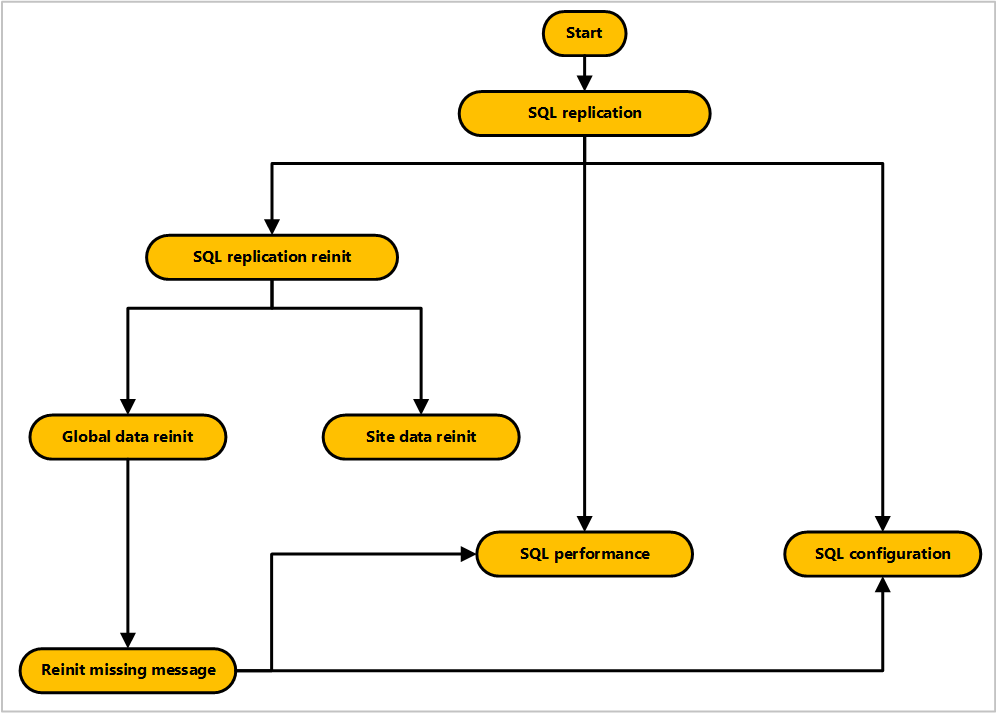

# Troubleshoot SQL Server replication

In a multi-site hierarchy, Configuration Manager uses SQL Server replication to transfer data between sites. For more information, see [Database replication](../../../plan-design/hierarchy/database-replication.md).

To better understand and help troubleshoot issues with SQL Server replication, use these diagrams.

- [SQL Server replication](sql-replication.md)
- [SQL Server configuration](sql-configuration.md)
- [SQL Server performance](sql-performance.md)
- [SQL Server replication reinitialization (reinit)](sql-replication-reinit.md)
- [Global data reinit](global-data-reinit.md)
- [Site data reinit](site-data-reinit.md)
- [Reinit missing message](reinit-missing-message.md)

These troubleshooting diagrams are interconnected. Use the following diagram to understand their relationships:

<!-- PNG used instead of SVG because of weird blankspace in the SVG. The SVG file exists in the same location. -->

For more information, see the following series of blogs from Microsoft Support:

- [ConfigMgr DRS Synchronization Internals](https://techcommunity.microsoft.com/t5/configuration-manager-archive/configmgr-drs-synchronization-internals/ba-p/1154317)
- [ConfigMgr 2012 Data Replication Service (DRS) Unleashed](https://techcommunity.microsoft.com/t5/configuration-manager-archive/configmgr-2012-data-replication-service-drs-unleashed/ba-p/339916)
- [ConfigMgr 2012 DRS – Troubleshooting FAQs](https://techcommunity.microsoft.com/t5/configuration-manager-archive/configmgr-2012-drs-troubleshooting-faqs/ba-p/339934)
- [ConfigMgr 2012 DRS Initialization Internals](https://techcommunity.microsoft.com/t5/configuration-manager-archive/configmgr-2012-drs-initialization-internals/ba-p/339948)
- [ConfigMgr 2012: DRS and SQL Server service broker certificate issues](https://techcommunity.microsoft.com/t5/configuration-manager-archive/configmgr-2012-drs-and-sql-service-broker-certificate-issues/ba-p/339910)
