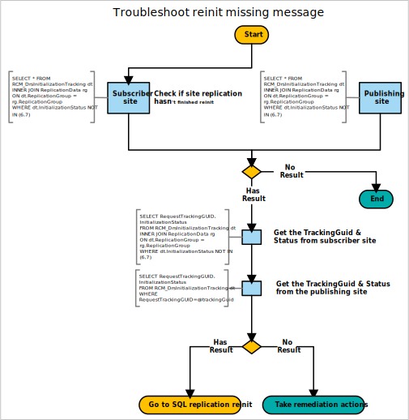

# Reinit missing message

In a multi-site hierarchy, Configuration Manager uses SQL Server replication to transfer data between sites. For more information, see [Database replication](../../../plan-design/hierarchy/database-replication.md).

Use the following diagram to start troubleshooting a missing message with SQL Server replication reinitialization (reinit):



## Queries

This diagram uses the following queries:

### Check if reinit isn't finished for site replication

```sql
SELECT * FROM RCM_DrsInitializationTracking dt
INNER JOIN ReplicationData rg
ON dt.ReplicationGroup = rg.ReplicationGroup
WHERE dt.InitializationStatus NOT IN (6,7)
```

### Get the TrackingGuid & Status from subscriber site

```sql
SELECT RequestTrackingGUID, InitializationStatus
FROM RCM_DrsInitializationTracking dt
INNER JOIN ReplicationData rg
ON dt.ReplicationGroup = rg.ReplicationGroup
WHERE dt.InitializationStatus NOT IN (6,7)
```

### Get the TrackingGuid & Status from the publishing site

```sql
SELECT RequestTrackingGUID, InitializationStatus
FROM RCM_DrsInitializationTracking dt
WHERE RequestTrackingGUID=@trackingGuid
```

## Remediation actions

### Version 1902 and later

To detect the issue and reinit, run the [Replication Link Analyzer](../monitor-replication.md#BKMK_RLA).

### Version 1810 and earlier

Run the following SQL query to get the `ReplicationGroupID`:

```sql
SELECT rd.ID AS ReplicationGroupID from ReplicationData rd
INNER JOIN RCM_DrsInitializationTracking it ON rd.ReplicationGroup = it.ReplicationGroup
WHERE it.RequestTrackingGUID=@trackingGuid
```

Then use the `InitializeData` method on the `SMS_ReplicationGroup` WMI class with the following values:

- ReplicationGroupID: from the preceding SQL query
- SiteCode1: parent site
- SiteCode2: child site

For more information, see [InitializeData method in class SMS_ReplicationGroup](../../../../develop/reference/core/servers/configure/initializedata-method-in-class-sms_replicationgroup.md).

#### Example

```PowerShell
Invoke-WmiMethod –Namespace "root\sms\site_CAS" -Class SMS_ReplicationGroup –Name InitializeData -ArgumentList "20", "CAS", "PR1"
```

## Next steps

- [SQL Server replication reinitialization (reinit)](sql-replication-reinit.md)
