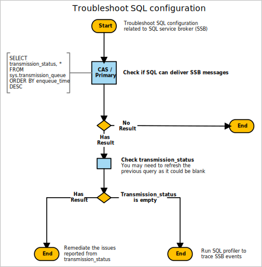

# SQL Server configuration

In a multi-site hierarchy, Configuration Manager uses SQL Server replication to transfer data between sites. For more information, see [Database replication](../../../plan-design/hierarchy/database-replication.md).

Use the following diagram to start troubleshooting SQL Server configuration related to SQL Server Service Broker:



## Queries

This diagram has the following queries and actions:

### Check if SQL Server can deliver SSB messages

```sql
SELECT transmission_status, *
FROM sys.transmission_queue
ORDER BY enqueue_time DESC
```

## Remediation actions

### Remediate the issues reported from transmission_status

Common issues:

- Firewall configuration
- Network configuration
- SSB certificate misconfigured

### Run SQL Server profiler to trace SSB events

Run SQL Server profiler on the CAS and primary site database to trace events related to the SQL Server Service Broker:

- **Audit Broker Login**
- **Audit Broker Conversation**
- Events in **Broker** category
