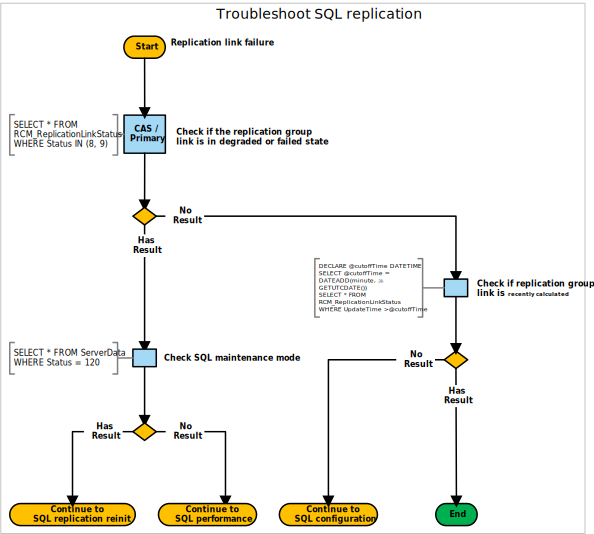

# SQL Server replication

In a multi-site hierarchy, Configuration Manager uses SQL Server replication to transfer data between sites. For more information, see [Database replication](../../../plan-design/hierarchy/database-replication.md).

Use the following diagram to start troubleshooting SQL Server replication when a link fails:



## Queries

This diagram uses the following queries:

### Check if the replication group link is in degraded or failed state

```sql
SELECT * FROM RCM_ReplicationLinkStatus
WHERE Status IN (8, 9)
```

### Check if replication group link is recently calculated

```sql
DECLARE @cutoffTime DATETIME
SELECT @cutoffTime = DATEADD(minute, -30, GETUTCDATE())
SELECT * FROM RCM_ReplicationLinkStatus
WHERE UpdateTime >@cutoffTime
```

### Check SQL Server maintenance mode

```sql
SELECT * FROM ServerData
WHERE Status = 120
```

## Next steps

- [SQL Server replication reinitialization (reinit)](sql-replication-reinit.md)
- [SQL Server performance](sql-performance.md)
- [SQL Server configuration](sql-configuration.md)
