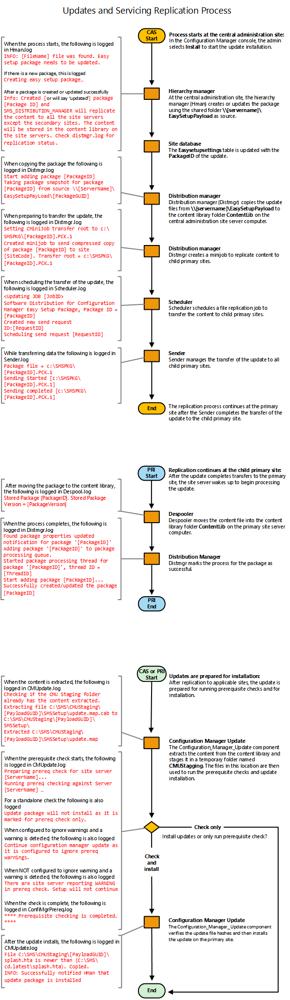

# Flowchart - Update replication for Configuration Manager

*Applies to: Configuration Manager (current branch)*

These data flows display the process by which an in-console update you  select to install replicates to additional sites. These flows also display the process of extracting the update to run prerequisite checks and to install updates at a central administration site and at primary sites.  

   
