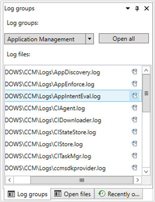

# Support Center OneTrace (Preview)

<!--3555962-->

Starting in version 1906, OneTrace is a new log viewer with Support Center. It works similarly to CMTrace, with the following improvements:

- A tabbed view
- Dockable windows
- Improved search capabilities
- Ability to enable filters without leaving the log view
- Scrollbar hints to quickly identify clusters of errors
- Fast log opening for large files

[](media/3555962-onetrace.png#lightbox)

OneTrace works with many types of log files, such as:

- Configuration Manager client logs
- Configuration Manager server logs
- Status messages
- Windows Update ETW log file on Windows 10
- Windows Update log file on Windows 7 & Windows 8.1

## Prerequisites

- .NET Framework version 4.6 or later

## Install

OneTrace installs with Support Center. Find the Support Center installer on the site server at the following path: `cd.latest\SMSSETUP\Tools\SupportCenter\SupportCenterInstaller.msi`.

By default, the OneTrace application is installed at `C:\Program Files (x86)\Configuration Manager Support Center\CMPowerLogViewer.exe`.

> [!Note]  
> Support Center and OneTrace use Windows Presentation Foundation (WPF). This component isn't available in Windows PE. Continue to use CMTrace in boot images with task sequence deployments.  

## Log groups

<!--5559993-->

Starting in version 2002, OneTrace supports customizable log groups, similar to the feature in Support Center. Log groups allow you to open all log files for a single scenario. OneTrace currently includes groups for the following scenarios:

- Application management
- Compliance settings (also referred to as Desired Configuration Management)
- Software updates

To show log groups, go to the **View** menu, and select **Log groups**.



### Customize log groups

You can customize these groups by modifying the configuration XML, which by default is in the following path: `C:\Program Files (x86)\Configuration Manager Support Center\LogGroups.xml`.

The following example is one portion of the default configuration file:

``` XML
<LogGroups>
  <LogGroup Name="Desired Configuration Management" GroupType="1" GroupFilePath="">
    <LogFile>CIAgent.log</LogFile>
    <LogFile>CIDownloader.log</LogFile>
    <LogFile>CIStateStore.log</LogFile>
    <LogFile>CIStore.log</LogFile>
    <LogFile>CITaskMgr.log</LogFile>
    <LogFile>ccmsdkprovider.log</LogFile>
    <LogFile>DCMAgent.log</LogFile>
    <LogFile>DCMReporting.log</LogFile>
    <LogFile>DcmWmiProvider.log</LogFile>
  </LogGroup>
</LogGroups>
```

The `GroupType` property accepts the following values:

- `0`: Unknown or other
- `1`: Configuration Manager client logs
- `2`: Configuration Manager server logs

The `GroupFilePath` property can include an explicit path for the log files. If it's blank, OneTrace relies upon the registry configuration for the group type. For example, if you set `GroupType=1`, by default OneTrace will automatically look in `C:\Windows\CCM\Logs` for the logs in the group. In this example, you don't need to specify `GroupFilePath`.

## See also

- [Support Center log viewer](support-center-ui-reference.md#bkmk_log-viewer)

- [CMTrace](cmtrace.md)
