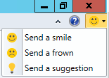
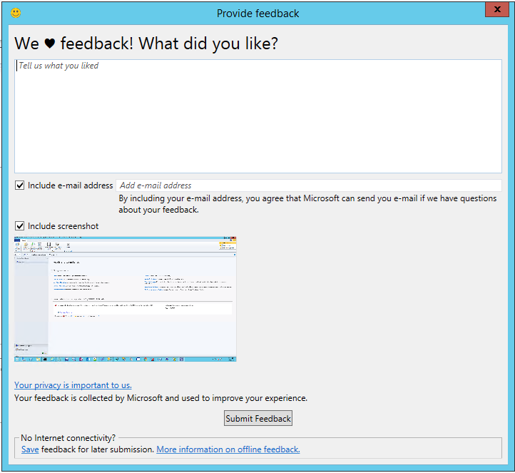
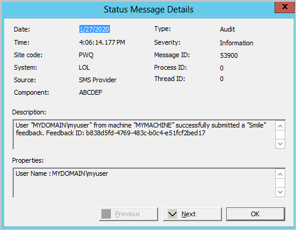
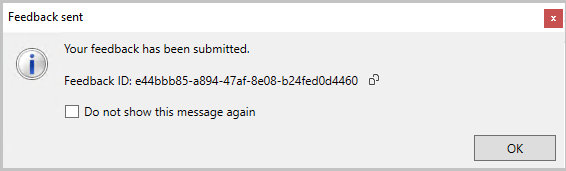
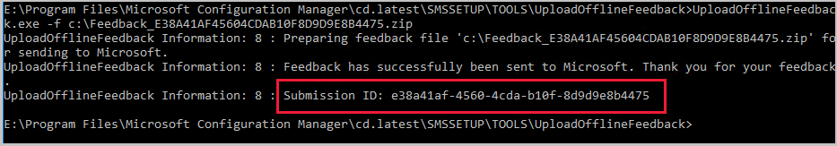

# Find help for using Configuration Manager

*Applies to: Configuration Manager (current branch)*

There are several resources that you can use to find help with Configuration Manager. Whether you're just getting started or an experienced administrator, use the following resources in this article when you need assistance:

- [Product documentation](#product-documentation)

- Send a smile or file a frown with [product feedback](#product-feedback)

- [Follow the Configuration Manager team blog](#configuration-manager-team-blog)

- [Support options and community resources](#support-options-and-community-resources)

For help with product accessibility, see [Accessibility features](accessibility-features.md).

## Product documentation

To access the most current product documentation, start at the [library index](/memdocs/configmgr/).

For tips on searching, providing feedback, and more information about using the product documentation, see [How to use the docs](../../../use-docs.md).

## Product feedback

Starting in version 2010...

### Share feedback in version 2006 and earlier

Send product feedback directly from the console. You can do the following things: <!--1357542-->

- **Send a smile**: Send feedback on what you liked.
- **Send a frown**: Send feedback on what you didn't like.
- **Send a suggestion**: Takes you to the [UserVoice website](https://configurationmanager.uservoice.com/) to share your idea.

  

### Send a smile or send a frown

To send feedback on something that you like in the product:

1. In the upper right corner of the console, click on the smiley face.
2. In the drop-down menu, select **Send a smile** or **Send a frown**.
3. Use the text box to explain what you liked or what you didn't like. 
4. Choose if you would like to share your e-mail address and a screenshot.
5. Click **Submit Feedback**
     - If you don't have internet connectivity, click on **Save** at the bottom. Follow the instructions in the [Send feedback that you saved for later submission](#BKMK_NoInternet) section to send it to Microsoft. 

#### Status messages for send a smile
<!--5891852-->
Starting in Configuration Manager 2002, when you **Send a smile** or **Send a frown**, a status message is created when the feedback is submitted. This improvement provides a record of:
- When the feedback was submitted
- Who submitted the feedback
- The feedback ID
- If the feedback submission was successful or not
   - Message ID of 53900 for a successful submission.
   - Message ID  of 53901 for a failed submission.

View status messages from **Monitoring** > **System Status** > **Status Message Queries**. Start with the **All Status Messages** query and select your time frame. When the messages load, click on the **Filter messages** button and filter for Message ID 53900 or 53901.

Status messages aren't created if you [Send feedback that you saved for later submission](find-help.md#BKMK_NoInternet).

### Send a suggestion

When you **Send a suggestion**, you're directed to [UserVoice](https://configurationmanager.uservoice.com/), a third-party website, to share your idea. The Configuration Manager product team uses the following UserVoice status values:

- **Noted** - We understand the request and it makes sense. We've added it to our backlog.
- **Planned** - We've started coding for this feature and expect it to show up in a tech preview build within the next few months.
- **Started** - The feature is now in a tech preview. Go check it out, and give us feedback. Let us know if the feature is on the right track or not. Put additional feedback in the comments section of the original request for others to see and comment on. We'll read that and use the feedback to try to improve the feature.
- **Completed** - The first version of the feature is in a production build. This status doesn't mean we're 100% done with the feature, and will no longer improve it. But it does mean that v1 of the features is in a production build, and you can start using it for real. We're marking it completed because:
  - We want you to know the feature is production ready.
  - We want to give back your UserVoice votes so you can use them on other items.
  - You can file new Design Change Requests to this feature to help us know the next most important improvement for this feature.

### Information sent with feedback

When you **Send a smile** or **Send a frown**, the following information is sent with the feedback:

- OS build information
- Configuration Manager hierarchy ID
- Product build information
- Language information
- Device identifier 
    - HKEY_LOCAL_MACHINE\SOFTWARE\Microsoft\SQMClient:MachineId

###  Send feedback that you saved for later submission

1. Click on **Save** at the bottom of the **Provide feedback** window. 
2. Save the .zip file. If the local machine doesn't have internet access,  copy the file to an internet connected machine. 
3. If needed, copy UploadOfflineFeedback folder located at `cd.latest\SMSSETUP\Tools\UploadOfflineFeedback\`
    - For more information about the cd.latest folder, see [The CD.Latest folder](../servers/manage/the-cd.latest-folder.md)

4. On an internet connected machine, open a command prompt. 
5. Run the following command: `UploadOfflineFeedback.exe -f c:\folder\location_of.zip`
    
    - Optionally, you can specify the following parameters:
        -  `-t, --timeout` Timeout in seconds for sending the data. 0 is unlimited. Default is 30.
        - `-s --silent`  No logging to console (Can't combine with `--verbose`)
        - `-v, --verbose` Output verbose logging to console (Can't combine with `--silent`)
        - `--help` Displays the help screen
    
    - Starting in version 1910, the UploadOfflineFeedback utility supports the use of a proxy server. You can specify the following parameters:
        - `-x, --proxy` Specifies a proxy server to connect internet.
        - `-o, --port` Specifies the port for the proxy server to connect internet.
        - `-u, --user` Specifies user name for the proxy server to connect internet.
        - `-w, --password` Specifies the password for the proxy server to connect internet. Type an asterisk (`*`) to produce a prompt for the password. The password isn't displayed when you type it at the password prompt. We strongly recommend using an asterisk (`*`) to produce a prompt for the password input since plain text on command line is less secure.
        - `-i` Skip Connection Check: Skips the network connection check, just uploads feedback with specified settings.

### Confirmation of console feedback

<!--3556010-->
When you send feedback through the Configuration Manager console or UploadOfflineFeedback.exe,  it shows a confirmation message. This message includes a **Feedback ID**, which you can give to Microsoft as a tracking identifier.

- To copy the **Feedback ID**, select the copy icon next to the ID, or use the **CTRL** + **C** key shortcut.
  - This ID isn't stored on your computer, so make sure to copy it before closing the window.
- Clicking on **Do not show this message again** will suppress the dialog box and prevent it from appearing in the future.

   
- The **UploadOfflineFeedback** command tool writes the **FeedbackID** to the console unless you use `--silent`.

  

## Configuration Manager team blog

The engineering and partner teams use the [Configuration Manager blog](https://techcommunity.microsoft.com/t5/Configuration-Manager-Blog/bg-p/ConfigurationManagerBlog) to provide you with technical information and other news about Configuration Manager and related technologies. Our blog posts supplement the product documentation and support information.

## Support options and community resources

The following links provide information about support options and community resources:

- [Microsoft support](https://aka.ms/cmcbsupport)

- [Configuration Manager forums on Microsoft Q&A](/answers/products/mem)

- [Configuration Manager Community: Configuration Manager (Current Branch) Survival Guide](https://social.technet.microsoft.com/wiki/contents/articles/33035.system-center-configuration-manager-current-branch-survival-guide.aspx)

## Next steps

[Accessibility features](accessibility-features.md)

[How to use the docs](../../../use-docs.md)

[How to use the console](../servers/manage/admin-console.md)

[Software Center user guide](software-center.md)
