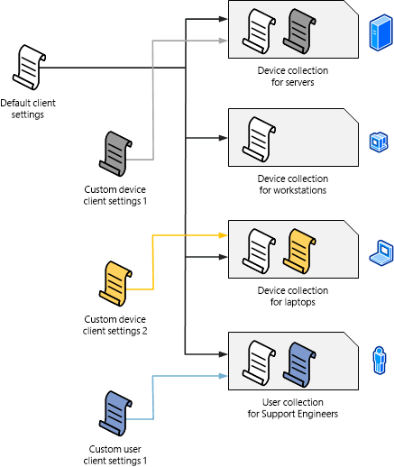

# Fundamentals of managing devices with Configuration Manager

*Applies to: Configuration Manager (current branch)*

Configuration Manager can manage two broad categories of devices:

- *Clients* are devices like workstations, laptops, servers, and mobile devices where you install the Configuration Manager client software. Some management functions, like hardware inventory, require this client software.  

- *Managed devices* can include *clients*, but typically it's a mobile device where the Configuration Manager client software isn't installed. On this kind of device, you manage by using the built-in on-premises mobile device management in Configuration Manager.

You can also group and identify devices based on the user, not just the client type.

## Managing devices with the Configuration Manager client

There are two ways to use the Configuration Manager client software to manage a device. The first way is to discover the device on your network, and then deploy the client software to that device. The other way is to manually install the client software on a new computer, and then have that computer join your site when it joins your network. To discover devices where the client software is not installed, run one or more of the built-in discovery methods. After a device is discovered, use one of several methods to install the client software. For information on using discovery, see [Run discovery for Configuration Manager](../servers/deploy/configure/run-discovery.md).  

After discovering the devices that are supported to run the Configuration Manager client software, you can use one of several methods to install the software. After the software is installed and the client is assigned to a primary site, you can begin to manage the device. Common installation methods include:

- Client push installation

- Software update-based installation

- Group policy

- Manual installation on a computer

- Including the client as part of an OS image that you deploy  

After the client is installed, you can simplify the tasks of managing devices by using collections. Collections are groups of devices or users that you create so that you can manage them as a group. For example, you might want to install a mobile device application on all mobile devices that Configuration Manager enrolls. If this is the case, you can use the All Mobile Devices collection.  

For more information, see these articles:  

- [Choose a device management solution](../plan-design/choose-a-device-management-solution.md)  

- [Client installation methods](../clients/deploy/plan/client-installation-methods.md)  

- [Introduction to collections](../clients/manage/collections/introduction-to-collections.md)  

### Client settings

When you first install Configuration Manager, all clients in the hierarchy are configured by using the default client settings that you can change. The client settings include these configuration options:

- How frequently the devices communicate with the site.

- Whether the client is set up for software updates and other management operations.

- Whether users can enroll their mobile devices so they're managed by Configuration Manager.  

You can create custom client settings and then assign them to collections. Members of the collection are configured to have the custom settings, and you can create multiple custom client settings that are applied in the order that you specify (by numerical order). If there are conflicting settings, the setting that has the lowest order number overrides the other settings.  

The following diagram shows an example of how you create and apply custom client settings.  

  

To learn more about client settings, see the following articles:

- [How to configure client settings](../clients/deploy/configure-client-settings.md)
- [About client settings](../clients/deploy/about-client-settings.md)

## Managing devices without the Configuration Manager client

Configuration Manager supports the management of some devices that have not installed the client software, and aren't managed by Intune. For more information, see [Manage mobile devices with on-premises infrastructure in Configuration Manager](../../mdm/understand/manage-mobile-devices-with-on-premises-infrastructure.md) and [Manage mobile devices with Configuration Manager and Exchange](../../mdm/deploy-use/manage-mobile-devices-with-exchange-activesync.md).  

## User-based management

Configuration Manager supports collections of Azure Active Directory and Active Directory Domain Services users. When you use a user collection, you can install software on all computers that members of the collection use. To make sure that the software you deploy only installs on the devices that are specified as a user's primary device, set up user device affinity. A user can have one or more primary devices.  

One of the ways that users can control their software deployment experience is to use the **Software Center** client interface. The **Software Center** is automatically installed on client computers and is run from the Windows **Start** menu. The **Software Center** lets users manage their own software and do the following tasks:  

- Install software  

- Schedule software to automatically install outside working hours  

- Configure when Configuration Manager can install software on a device  

- Configure the access settings for remote control, if remote control is set up in Configuration Manager  

- Configure options for power management, if an administrator sets up this option  

- Browse for, install, and request software

- Configure preference settings

- When it's set up, specify a primary device for user device affinity

For more information, see the following articles:

- [Plan for Software Center](../../apps/plan-design/plan-for-software-center.md)
- [Link users and devices with user device affinity](../../apps/deploy-use/link-users-and-devices-with-user-device-affinity.md)
- [Software Center user guide](software-center.md)
