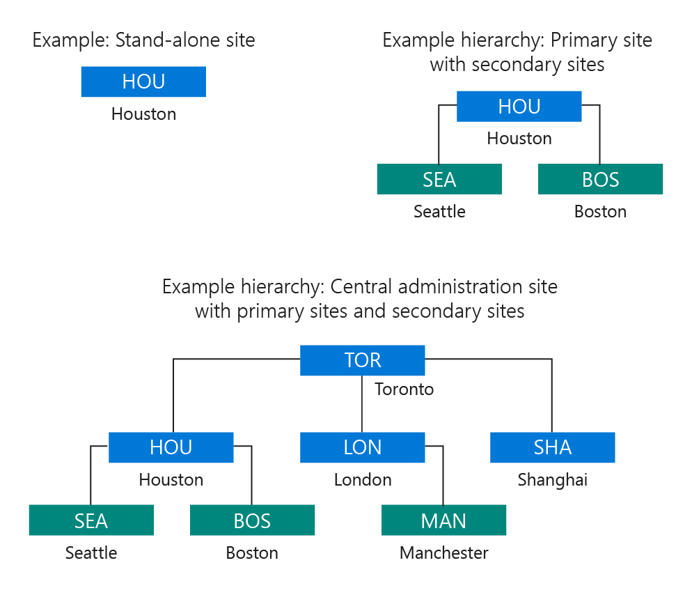

# Fundamentals of sites and hierarchies for Configuration Manager

*Applies to: Configuration Manager (current branch)*

A Configuration Manager deployment must be installed in an Active Directory domain. The foundation of this deployment includes one or more Configuration Manager sites that form a hierarchy of sites. From a single site to a multi-site hierarchy, the type and location of sites you install provide the ability to scale up (expand) your deployment when necessary, and deliver key services to managed users and devices.

## Hierarchies of sites
When you install Configuration Manager for the first time, the first Configuration Manager site that you install determines the scope of your hierarchy. The first Configuration Manager site is the foundation from which you will manage devices and users in your enterprise. This first site must be either a central administration site or a stand-alone primary site.  

 A *central administration site* is suitable for large-scale deployments, provides a central point of administration, and provides the flexibility to support devices that are distributed across a global network infrastructure. After you install a  central administration site, you will need to install one or more primary sites as child sites. This configuration is necessary because a central administration site does not directly support management of devices, which is the function of a primary site. A central administration site supports multiple child-primary sites. The child-primary sites are used to directly manage devices, and to control network bandwidth when your managed devices are in different geographical locations.  

 A *stand-alone primary site* is suitable for smaller deployments, and can be used to manage devices without having to install additional sites. Although a stand-alone primary site can limit the size of your deployment, it does support a scenario to expand your hierarchy at a later time by installing a new central administration site. With this site expansion scenario, your stand-alone primary site becomes a child-primary site, and you can then install additional child-primary sites below your new central administration site. You can then expand your initial deployment for future growth of your enterprise.  

> [!TIP]  
>  A stand-alone primary site and a child-primary site are really the same type of site: a primary site. The difference in name is based on the hierarchy relationship that is created when you also use a central administration site. This hierarchy relationship can also limit the installation of certain site system roles that extend Configuration Manager functionality. This limitation of roles occurs because certain site system roles can only be installed on the top-tier site of the hierarchy, a central administration site, or a stand-alone primary site.  

 After you install your first site, you can install additional sites. If your first site was a central administration site, then you can install one or more child-primary sites. After you install a primary site (stand-alone, or child-primary), you can then install one or more secondary sites.  

 A *secondary site* can only be installed as a child site below a primary site. This site type extends the reach of a primary site to manage devices in locations that have a slow network connection to the primary site. Even though a secondary site extends the primary site, the primary site manages all of the clients. The secondary site provides support for devices in the remote location. It provides support by compressing and then managing the transfer of information across your network that you send (deploy) to clients, and that clients send back to the site.  

 The following diagrams show some example site designs.  

   

 For more information, see the following topics:  

-   [Introduction to Configuration Manager](../../core/understand/introduction.md)  

-   [Design a hierarchy of sites for Configuration Manager](../../core/plan-design/hierarchy/design-a-hierarchy-of-sites.md)  

-   [Install Configuration Manager sites](../servers/deploy/install/installing-sites.md)  

## Site system servers and site system roles  
 Each Configuration Manager site installs *site system roles* that support management operations. The following roles are installed by default when you install a site:

-   The site server role is assigned to the computer where you install the site.

-   The site database server role is assigned to the SQL Server that hosts the site database.

Other site system roles are optional, and are only used when you want to use the functionality that is active in a site system role. Any computer that hosts a site system role is referred to as a site system server.  

 For a smaller deployment of Configuration Manager, you might initially run all of your site system roles directly on the site server computer. Then, as your managed environment and needs grow, you can install additional site system servers to host additional site system roles to improve the site's efficiency in providing services to more devices.  

 For information about the different site system roles, see [Site system roles](../../core/plan-design/hierarchy/plan-for-site-system-servers-and-site-system-roles.md#bkmk_planroles) in [Plan for site system servers and site system roles for Configuration Manager](../../core/plan-design/hierarchy/plan-for-site-system-servers-and-site-system-roles.md).

## Publishing site information to Active Directory Domain Services  
 To simplify management of Configuration Manager, you can extend the Active Directory schema to support details that are used by Configuration Manager,  and then have sites publish their key information to Active Directory Domain Services (AD DS). Then the computers that you want to manage can securely retrieve site-related information from the trusted source of AD DS. The information clients can retrieve identifies available sites, site system servers, and the services that those site system servers provide.  

 *Extending the Active Directory schema* is done only one time for each forest, and can be done before or after you install Configuration Manager.   When you  extend the schema, you must create a new Active Directory container named System Management in each domain. The container contains a Configuration Manager site that will publish data for clients to find. For more information, see [Prepare Active Directory for site publishing](../../core/plan-design/network/extend-the-active-directory-schema.md).  

 *Publishing site data* improves the security of your Configuration Manager hierarchy and reduces administrative overhead, but is not required for basic Configuration Manager functionality.  
