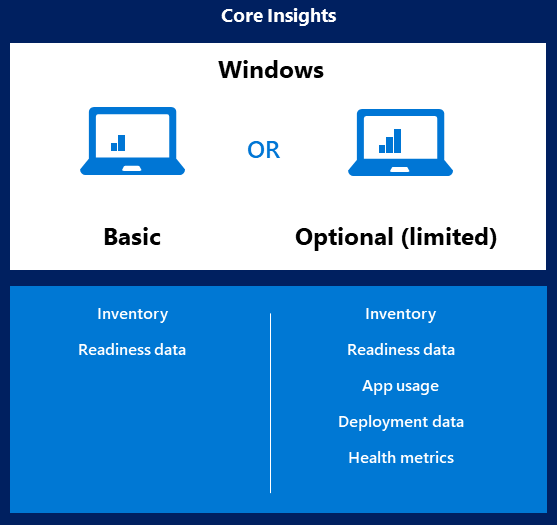

# Enable data sharing for Desktop Analytics

To enroll devices to Desktop Analytics, they need to send diagnostic data to Microsoft. If your environment uses a proxy server, use this information to help configure the proxy.

## Diagnostic data levels

When you integrate Configuration Manager with Desktop Analytics, you also use it to manage the diagnostic data level on devices. For the best experience, use Configuration Manager.

> [!Important]  
> In most circumstances, only use Configuration Manager to configure these settings. Don't also apply these settings in domain group policy objects. For more information, see [Conflict resolution](enroll-devices.md#conflict-resolution).

The basic functionality of Desktop Analytics works at the **Basic** [diagnostic data level](https://docs.microsoft.com/windows/privacy/configure-windows-diagnostic-data-in-your-organization#diagnostic-data-levels). If you don't configure the **Enhanced (Limited)** level in Configuration Manager, you won't get the following features of Desktop Analytics:

- App usage
- [Additional app insights](compat-assessment.md#additional-insights)
- Deployment status data
- Health monitoring data

Microsoft recommends that you enable the **Enhanced (Limited)** diagnostic data level with Desktop Analytics to maximize the benefits you get from it.

> [!Tip]
> The **Enhanced (Limited)** setting in Configuration Manager is the same setting as **Limit Enhanced diagnostic data to the minimum required by Windows Analytics** policy available on devices running Windows 10, version 1709 and later.
>
> Devices running Windows 10, version 1703 and earlier, Windows 8.1, or Windows 7 don't have this policy setting. When you configure the **Enhanced (Limited)** setting in Configuration Manager, these devices fall back to the **Basic** level.
>
> Devices running Windows 10, version 1709 have this policy setting. However, when you configure the **Enhanced (Limited)** setting in Configuration Manager, these devices also fall back to the **Basic** level.

For more information about diagnostic data shared with Microsoft with **Enhanced (Limited)**, see [Windows 10 enhanced diagnostic data events and fields](https://docs.microsoft.com/windows/privacy/enhanced-diagnostic-data-windows-analytics-events-and-fields).

> [!Important]
> Microsoft has a strong commitment to providing the tools and resources that put you in control of your privacy. As a result, while Desktop Analytics supports Windows 8.1 devices, Microsoft doesn't collect Windows diagnostic data from Windows 8.1 devices located in European countries (EEA and Switzerland).

For more information, see [Desktop Analytics privacy](privacy.md).

The following articles are also good resources for better understanding Windows diagnostic data levels:

- [Windows 10 and the GDPR for IT Decision Makers](https://docs.microsoft.com/windows/privacy/gdpr-it-guidance)  

- [Configure Windows diagnostic data in your organization](https://docs.microsoft.com/windows/privacy/configure-windows-diagnostic-data-in-your-organization)  

> [!Note]  
> Clients configured to Limit Enhanced diagnostic data will send approximately 2 MB of data to the Microsoft cloud on the initial full scan. The daily delta varies between 250-400 KB per day.
>
> The daily delta scan happens at 3:00 AM (device local time). Some events are sent at the first available time throughout the day. These times aren't configurable.
>
> For more information, see [Configure Windows diagnostic data in your organization](https://aka.ms/enterprisetelemetry).  

## Endpoints

To enable data sharing, configure your proxy server to allow the following internet endpoints.

> [!Important]  
> For privacy and data integrity, Windows checks for a Microsoft SSL certificate (certificate pinning) when communicating with the diagnostic data endpoints. SSL interception and inspection aren't possible. To use Desktop Analytics, exclude these endpoints from SSL inspection.<!-- BUG 4647542 -->

Starting in version 2002, if the Configuration Manager site fails to connect to required endpoints for a cloud service, it raises a critical status message ID 11488. When it can't connect to the service, the SMS_SERVICE_CONNECTOR component status changes to critical. View detailed status in the [Component Status](../core/servers/manage/use-alerts-and-the-status-system.md#BKMK_MonitorSystemStatus) node of the Configuration Manager console.<!-- 5566763 -->

> [!NOTE]
> For more information on the Microsoft IP address ranges, see [Microsoft Public IP Space](https://www.microsoft.com/download/details.aspx?id=53602). These addresses update regularly. There's no granularity by service, any IP address in these ranges could be used.

### Server connectivity endpoints

The service connection point needs to communicate with the following endpoints:

| Endpoint  | Function  |
|-----------|-----------|
| `https://aka.ms` | Used to locate the service |
| `https://graph.windows.net` | Used to automatically retrieve settings like CommercialId when attaching your hierarchy to Desktop Analytics (on Configuration Manager Server role). For more information, see [Configure the proxy for a site system server](../core/plan-design/network/proxy-server-support.md#configure-the-proxy-for-a-site-system-server). |
| `https://*.manage.microsoft.com` | Used to synch device collection memberships, deployment plans, and device readiness status with Desktop Analytics (on Configuration Manager Server role only). For more information, see [Configure the proxy for a site system server](../core/plan-design/network/proxy-server-support.md#configure-the-proxy-for-a-site-system-server). |

### User experience and diagnostic component endpoints

Client devices need to communicate with the following endpoints:

| Endpoint  | Function  |
|-----------|-----------|
| `https://v10c.events.data.microsoft.com` | Connected user experience and diagnostic component endpoint. Used by devices running Windows 10, version 1809 or later, or version 1803 with the 2018-09 cumulative update or later installed. |
| `https://v10.events.data.microsoft.com` | Connected user experience and diagnostic component endpoint. Used by devices running Windows 10, version 1803 _without_ the 2018-09 cumulative update installed. |
| `https://v10.vortex-win.data.microsoft.com` | Connected user experience and diagnostic component endpoint. Used by devices running Windows 10, version 1709 or earlier. |
| `https://vortex-win.data.microsoft.com` | Connected user experience and diagnostic component endpoint. Used by devices running Windows 7 and Windows 8.1 |

### Client connectivity endpoints

Client devices need to communicate with the following endpoints:

| Index | Endpoint  | Function  |
|-------|-----------|-----------|
| 1 | `https://settings-win.data.microsoft.com` | Enables the compatibility update to send data to Microsoft. |
| 2 | `http://adl.windows.com` | Allows the compatibility update to receive the latest compatibility data from Microsoft. |
| 3 | `https://watson.telemetry.microsoft.com` | [Windows Error Reporting (WER)](https://docs.microsoft.com/windows/win32/wer/windows-error-reporting). Required to monitor deployment health in Windows 10, version 1803 or earlier. |
| 4 | `https://umwatsonc.events.data.microsoft.com` | [Windows Error Reporting (WER)](https://docs.microsoft.com/windows/win32/wer/windows-error-reporting). Required for device health reports in Windows 10, version 1809 or later. |
| 5 | `https://ceuswatcab01.blob.core.windows.net` | [Windows Error Reporting (WER)](https://docs.microsoft.com/windows/win32/wer/windows-error-reporting). Required to monitor deployment health in Windows 10, version 1809 or later. |
| 6 | `https://ceuswatcab02.blob.core.windows.net` | [Windows Error Reporting (WER)](https://docs.microsoft.com/windows/win32/wer/windows-error-reporting). Required to monitor deployment health in Windows 10, version 1809 or later. |
| 7 | `https://eaus2watcab01.blob.core.windows.net` | [Windows Error Reporting (WER)](https://docs.microsoft.com/windows/win32/wer/windows-error-reporting). Required to monitor deployment health in Windows 10, version 1809 or later. |
| 8 | `https://eaus2watcab02.blob.core.windows.net` | [Windows Error Reporting (WER)](https://docs.microsoft.com/windows/win32/wer/windows-error-reporting). Required to monitor deployment health in Windows 10, version 1809 or later. |
| 9 | `https://weus2watcab01.blob.core.windows.net` | [Windows Error Reporting (WER)](https://docs.microsoft.com/windows/win32/wer/windows-error-reporting). Required to monitor deployment health in Windows 10, version 1809 or later. |
| 10 | `https://weus2watcab02.blob.core.windows.net` | [Windows Error Reporting (WER)](https://docs.microsoft.com/windows/win32/wer/windows-error-reporting). Required to monitor deployment health in Windows 10, version 1809 or later. |
| 11 | `https://kmwatsonc.events.data.microsoft.com` | [Online Crash Analysis (OCA)](https://docs.microsoft.com/windows/win32/dxtecharts/crash-dump-analysis). Required for device health reports in Windows 10, version 1809 or later. |
| 12 | `https://oca.telemetry.microsoft.com`  | [Online Crash Analysis (OCA)](https://docs.microsoft.com/windows/win32/dxtecharts/crash-dump-analysis). Required to monitor deployment health in Windows 10, version 1803 or earlier. |
| 13 | `https://login.live.com` | Required to provide a more reliable device identity for Desktop Analytics.    To disable end-user Microsoft account access, use policy settings instead of blocking this endpoint. For more information, see [The Microsoft account in the enterprise](https://docs.microsoft.com/windows/security/identity-protection/access-control/microsoft-accounts#block-all-consumer-microsoft-account-user-authentication). |
| 14 | `https://v20.events.data.microsoft.com` | Connected user experience and diagnostic component endpoint. |

## Proxy server authentication

If your organization uses proxy server authentication for internet access, make sure that it doesn't block the diagnostic data because of authentication. If your proxy doesn't allow devices to send this data, they won't show in Desktop Analytics.

### Bypass (recommended)

Configure your proxy servers to not require proxy authentication for traffic to the diagnostic data endpoints. This option is the most comprehensive solution. It works for all versions of Windows 10.  

### User proxy authentication

Configure devices to use the signed-in user's context for proxy authentication. This method requires the following configurations:

- Devices have the current quality update for a supported version of Windows

- Configure user-level proxy (WinINET proxy) in **Proxy settings** in the Network & Internet group of Windows Settings. You can also use the legacy Internet Options control panel.

- Make sure that the users have proxy permission to reach the diagnostic data endpoints. This option requires that the devices have console users with proxy permissions, so you can't use this method with headless devices.

> [!IMPORTANT]
> The user proxy authentication approach is incompatible with the use of Microsoft Defender Advanced Threat Protection. This behavior is because this authentication relies on the **DisableEnterpriseAuthProxy** registry key set to `0`, while Microsoft Defender ATP requires it to be set to `1`. For more information, see [Configure machine proxy and internet connectivity settings in Microsoft Defender ATP](https://docs.microsoft.com/windows/security/threat-protection/windows-defender-atp/configure-proxy-internet-windows-defender-advanced-threat-protection).

### Device proxy authentication

This approach supports the following scenarios:

- Headless devices, where no user signs in, or users of the device don't have internet access

- Authenticated proxies that don't use Windows Integrated Authentication

- If you also use Microsoft Defender Advanced Threat Protection

This approach is the most complex because it requires the following configurations:

- Make sure devices can reach the proxy server through WinHTTP in local system context. Use one of the following options to configure this behavior:

  - The command line `netsh winhttp set proxy`

  - Web proxy auto-discovery (WPAD) protocol

  - Transparent proxy

  - Configure device-wide WinINET proxy using the following group policy setting: **Make proxy settings per-machine (rather than per-user)** (ProxySettingsPerUser = `1`)

  - Routed connection, or that uses network address translation (NAT)

- Configure proxy servers to allow the computer accounts in Active Directory to access the diagnostic data endpoints. This configuration requires proxy servers to support Windows Integrated Authentication.  
