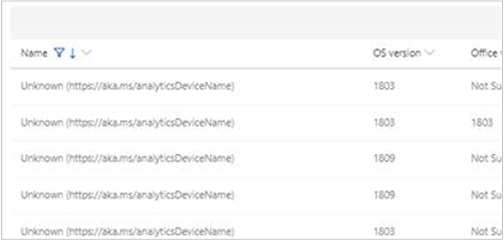

# How to enroll devices in Desktop Analytics

When you [connect Configuration Manager](connect-configmgr.md) to Desktop Analytics, you configure settings to enroll devices to Desktop Analytics. You can change these settings at any time. Also make sure the devices are up to date.

## Update devices

Desktop Analytics uses two main Windows components:

- **Compatibility component**: The compatibility component (**Appraiser**) runs diagnostics on the Windows device to evaluate its compatibility status with the latest versions of Windows 10.

- **Connected User Experiences and Telemetry service**: With Windows diagnostic data enabled, the Connected User Experience and Telemetry service (**DiagTrack**) collects system, application, and driver data. Microsoft analyzes this data, and shares it back to you via Desktop Analytics.

Install the latest version of these components to get the best experience with Desktop Analytics.

The following table lists the updates for each component on supported OS versions:

| OS version | Appraiser | DiagTrack |
| --------------| ----------------------- | -------------------|
| Windows 10 20H2 | Included [Note 1](#bkmk_note1) | [Latest cumulative update](https://support.microsoft.com/help/4581839) |
| Windows 10 2004 | Included [Note 1](#bkmk_note1) | [Latest cumulative update](https://support.microsoft.com/help/4555932) |
| Windows 10 1909 | Included [Note 1](#bkmk_note1) | [Latest cumulative update](https://support.microsoft.com/help/4529964) |
| Windows 10 1809 | Included [Note 1](#bkmk_note1) | [Latest cumulative update](https://support.microsoft.com/help/4464619) |
| Windows 10 1803 | Included [Note 1](#bkmk_note1) | [Latest cumulative update](https://support.microsoft.com/help/4099479) |
| Windows 8.1 | [KB 2976978](https://support.microsoft.com/help/2976978) [Note 2](#bkmk_note2) | [Latest monthly rollup](https://support.microsoft.com/help/4009470) |
| Windows 7 SP1 | [KB 2952664](https://support.microsoft.com/help/2952664) [Note 3](#bkmk_note3) | [Latest monthly rollup](https://support.microsoft.com/help/4009469) |

Starting in version 2010, you can use Configuration Manager to enroll Windows 10 Enterprise long-term servicing channel (LTSC) devices to Desktop Analytics.<!--6107649-->

> [!NOTE]
> Desktop Analytics only supports the Windows 10 Enterprise LTSC 2019, which is equivalent to Windows 10, version 1809. It doesn't support Windows 10 Enterprise 2015 LTSB (version 1507) or Windows 10 Enterprise 2016 LTSB (version 1607).

| OS version | Equivalent version | DiagTrack |
|---------|---------|---------|
| Windows 10 Enterprise LTSC 2019 | Windows 10, version 1809 | [Latest cumulative update](https://support.microsoft.com/help/4464619) |

<!--| Windows 10 Enterprise 2016 LTSB | Windows 10, Version 1607 | [Latest cumulative update](https://support.microsoft.com/help/4000825) |
| Windows 10 Enterprise 2015 LTSB | Windows 10, Version 1507 | [Latest cumulative update](https://support.microsoft.com/help/4000823) |-->

> [!TIP]
> Use Configuration Manager to automatically install these updates. For more information, see [Deploy software updates](../sum/deploy-use/deploy-software-updates.md).
>
> Restart devices after you install the compatibility updates for the first time.

###  Note 1: Windows 10

While Windows 10 includes these components by default, Windows 10 devices require the latest cumulative update to get the full functionality of Desktop Analytics like assessing the device for compatibility against the latest OS version.

###  Note 2: Windows 8.1

Microsoft regularly increments the updates for this component, but the associated KB number doesn't change. Make sure that you always have the latest version of the update.

This component runs diagnostics on Windows 8.1 systems that participate in the Windows Customer Experience Improvement Program. These diagnostics help determine whether you might have compatibility issues when upgrading to Windows 10.

###  Note 3: Windows 7

If your organization doesn't apply "Monthly Quality Rollup" updates to Windows 7 devices, and only applies "Security Only" updates, you'll find some "Security Only" updates in the [list of updates superseding KB 2952664](https://www.catalog.update.microsoft.com/ScopedViewInline.aspx?updateid=ad3652cd-2689-4726-b3ef-b086ded23c7c). You can install these newer updates instead of KB 2952664.

> [!NOTE]
> For Windows 8.1, Microsoft only revises KB 2976978 as part of "Monthly Quality Rollup" updates.

## Device enrollment

The Desktop Analytics service has no agents to install. Device enrollment requires configuring settings on the devices you want it to monitor. Configuration Manager provides an integrated experience for managing and deploying these settings to clients. For the best experience, use Configuration Manager.

> [!NOTE]
> If you use [Update Compliance](/windows/deployment/update/update-compliance-get-started#add-update-compliance-to-your-azure-subscription), use that same workspace for Desktop Analytics. You need to reenroll devices to Desktop Analytics that you previously enrolled in Update Compliance.
>
> You can only have one Desktop Analytics workspace per Azure AD tenant. Devices can only send diagnostic data to one workspace.

When you [connect Configuration Manager to Desktop Analytics](connect-configmgr.md#bkmk_connect), you configure the settings to enroll devices. These settings include which Desktop Analytics instance the device should send its data, and other configuration options.

To change these settings, use the following procedure:

1. In the Configuration Manager console, go to the **Administration** workspace, expand **Cloud Services**, and select the **Azure Services** node. Select the connection to Desktop Analytics, and choose **Properties** in the ribbon.

2. On the **Diagnostic Data** page, make changes as needed to the following settings:  

    - **Commercial ID**: this value should automatically populate with your organization's ID. If it doesn't, make sure your proxy server is configured to allow all required [endpoints](enable-data-sharing.md#endpoints) before continuing. You can also retrieve your Commercial ID manually from the [Desktop Analytics portal](monitor-connection-health.md#bkmk_ViewCommercialID).

    - **Windows 10 diagnostic data level**: For more information, see [Diagnostic data levels](enable-data-sharing.md#diagnostic-data-levels).  

    - **Allow Device Name in diagnostic data**: For more information, see [Device name](#device-name).  

    When you make changes to this page, the **Available functionality** page shows a preview of the Desktop Analytics functionality with the selected diagnostic data settings.  

3. On the **Desktop Analytics Connection** page, make changes as needed to the following settings:

    - **Display name**: The Desktop Analytics portal displays this Configuration Manager connection using this name.  

    - **Target collection**: This collection includes all devices that Configuration Manager configures with your commercial ID and diagnostic data settings. It's the full set of devices that Configuration Manager connects to the Desktop Analytics service.  

    - **Devices in the target collection use a user-authenticated proxy for outbound communication**: By default, this value is **No**. If needed in your environment, set to **Yes**. For more information, see [Proxy server authentication](enable-data-sharing.md#proxy-server-authentication).

    - **Select specific collections to synchronize with Desktop Analytics**: Select **Add** to include other collections from your **Target collection** hierarchy. These collections are available in the Desktop Analytics portal for grouping with deployment plans. Make sure to include pilot and pilot exclusion collections.  <!-- 4097528 -->

        > [!IMPORTANT]
        > These collections continue to sync as their membership changes. For example, your deployment plan uses a collection with a Windows 7 membership rule. As those devices upgrade to Windows 10, and Configuration Manager evaluates the collection membership, those devices drop out of the collection and deployment plan.

### Windows settings

When Configuration Manager enrolls devices into Desktop Analytics, it sets Windows policies to configure the device for Desktop Analytics. In most circumstances, only use Configuration Manager to configure these settings. Don't also apply these settings in domain group policy objects.

For more information, see [Group policy settings for Desktop Analytics](group-policy-settings.md).

### Device name

Starting in Windows 10, version 1803, the device name is no longer collected by default. Collecting the device name with the diagnostic data requires a separate opt-in. Without the device name, it's more difficult for you to identify what devices require attention while evaluating an upgrade to a new version of Windows.

If you don't send the device name, it appears in Desktop Analytics as "Unknown":

There's an option in the Configuration Manager settings for Desktop Analytics to configure this option: **Allow Device Name in diagnostic data**. This Configuration Manager setting controls the [Windows policy setting](group-policy-settings.md), **AllowDeviceNameInTelemetry**.

### Proxy settings

If your organization uses proxy server authentication for internet access, make sure to properly configure it or your devices. For more information, see [Proxy server authentication](enable-data-sharing.md#proxy-server-authentication).

## Next steps

Advance to the next article to create deployment plans in Desktop Analytics.
> [!div class="nextstepaction"]
> [Create deployment plans](create-deployment-plans.md)
