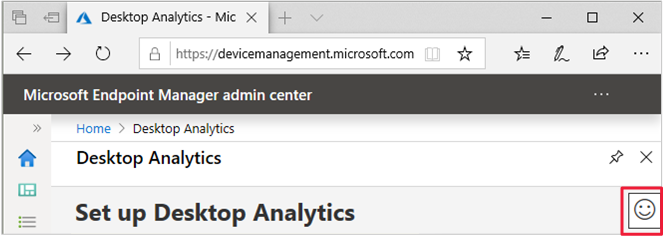

# Get support for Desktop Analytics

Microsoft provides global technical, pre-sales, billing, and subscription support for Desktop Analytics. Support is available both online and by phone for paid and trial subscriptions. Online technical support is available in English and Japanese. Phone support and online billing support are available in additional languages.

> [!TIP]
> Before contacting Microsoft Support, first review the following articles:
>
> - [Prerequisites](overview.md#prerequisites)
> - [Troubleshoot Desktop Analytics](troubleshooting.md)
> - [Frequently asked questions](faq.yml)

## Help and support

To request help for Desktop Analytics, use the **Help and Support** option in the portal under **Troubleshooting + support**. This action files an online support ticket for Desktop Analytics. To create and manage a support incident, your account must have an Azure Active Directory (Azure AD) role that includes the action **microsoft.office365.supportTickets/tickets/manage**. For more information, see [Azure AD built-in roles](/azure/active-directory/roles/permissions-reference).

If the issue is more broadly for Configuration Manager than just analytics, go to [Microsoft support](https://aka.ms/cmcbsupport) to open a new support request. Use the **Desktop Analytics** category.

##  Share product feedback

<!-- 5451636 -->

To share your feedback about Desktop Analytics, select the **Send a Smile** icon at the top of the portal on the right side.

Choose one of the following options:

- I like something
- I don't like something
- I have a suggestion
- Contact support

The first three options currently take you to the product feedback site for Configuration Manager.

The fourth option opens the **Help and Support** option in the portal.

## See also

[Find help for Configuration Manager](../core/understand/find-help.md)
