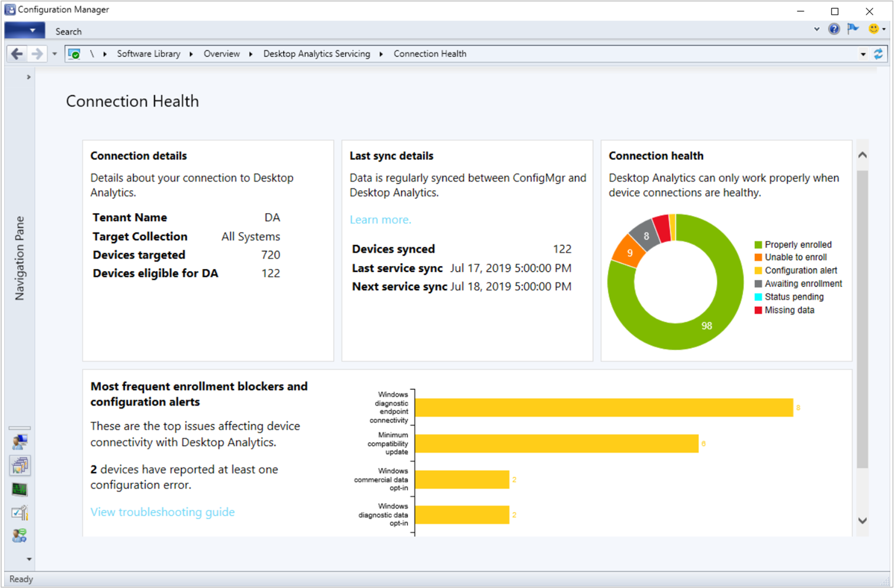
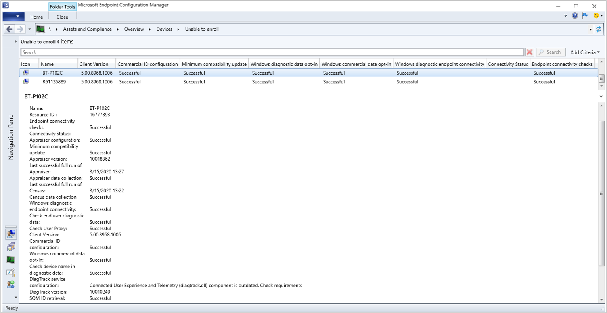
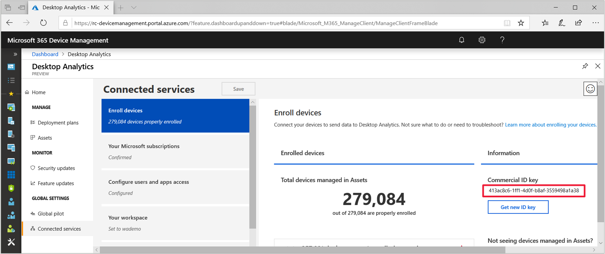

# Monitor connection health

Use the **Connection Health** dashboard in Configuration Manager to drill down into categories by device health. In the Configuration Manager console, go to the **Software Library** workspace, expand the **Desktop Analytics Servicing** node, and select the **Connection Health** dashboard.  

[](media/connection-health-dashboard.png#lightbox)

When you first set up Desktop Analytics, these charts may not show complete data. It can take 2-3 days for active devices to send diagnostic data to the Desktop Analytics service, the service to process the data, and then synchronize with your Configuration Manager site.<!-- 4098037 -->

## Connection details

This tile displays the following basic information about the connection from Configuration Manager to Desktop Analytics:

- **Tenant Name**: The name of the Desktop Analytics connection in the **Azure Services** node

- **Target Collection**: The same *target collection* you specified when connecting Configuration Manager to Desktop Analytics. This collection includes all devices that Configuration Manager configures with your commercial ID and diagnostic data settings. It's the full set of devices that Configuration Manager connects to the Desktop Analytics service.

- **Devices Targeted**: All of the devices in the target collection, minus the following types of devices:

  - Decommissioned
  - Obsolete
  - Inactive
  - Unmanaged
  - Devices running Long Term Servicing Channel (LTSC) versions of Windows 10
  - Devices running Windows Server

    For more information on these device states, see [About client status](../core/clients/manage/monitor-clients.md#bkmk_about).

    > [!Note]  
    > Configuration Manager uploads to Desktop Analytics all of the devices in the target collection minus decommissioned and obsolete clients.

- **Devices eligible for DA**: The number of devices targeted minus devices that are ineligible for Desktop Analytics. For example, devices in the target collection that run Windows Server or Windows 10 long-term servicing channel (LTSC).

## Last sync details

This tile shows when Configuration Manager syncs with the Desktop Analytics cloud service, and how many devices it syncs.

- **Devices synced**: The number of eligible devices that Configuration Manager sent to Desktop Analytics. The service includes these devices in the currently visible snapshot.

- **Last service sync**: The same as the **Last updated** time in the Desktop Analytics portal.

- **Next service sync**: When you can expect the next daily snapshot in Desktop Analytics.

> [!Note]  
> When you first enroll devices into Desktop Analytics, it can take several days for data to upload and process. During this time, the **Last sync details** tile may appear blank.
> Additionally, none of the values in this tile automatically update when you request an on-demand snapshot. For more information, see [Data latency](troubleshooting.md#data-latency).

If you think some devices aren't showing in Desktop Analytics, make sure the devices are supported by Desktop Analytics. For more information, see [Prerequisites](overview.md#prerequisites).

## Connection health

The **Connection health** chart displays the number of devices in the following health states:  

- [Properly enrolled](#properly-enrolled): The device appears in Desktop Analytics with a complete inventory
- [Unable to enroll](#unable-to-enroll): There's a blocking issue that prevents device enrollment
- [Configuration alert](#configuration-alert): The device doesn't appear in Desktop Analytics or appears with an incomplete inventory. Configuration Manager also identified an issue with device enrollment.
- [Awaiting enrollment](#awaiting-enrollment): Configuration Manager configured the device, but it doesn't yet appear in Desktop Analytics
- [Status pending](#status-pending): Configuration Manager is still configuring this device, or doesn't have enough data from the device to determine its state
- [Missing data](#missing-data): Configuration Manager configured the device, but Desktop Analytics only has partial data

<!-- 
- [Configuration issues](#configuration-issues)  
- [Client not installed](#client-not-installed)  
- [Waiting for enrollment](#waiting-for-enrollment)  
- [Missing prerequisites](#missing-prerequisites)  
 -->

The total number of devices in this chart should be the same as the **Devices eligible for DA** value in the Connection Details tile.

Select the slice in the chart to drill down to a list of devices with that state. For more information, see [Device list](#device-list).

Select the category name in the legend to remove or add it from the chart. This action helps to zoom the chart so you can see the relative sizes of smaller segments.

### Properly enrolled

The device has the following attributes:

- A Configuration Manager client version 1902 or later  
- There are no configuration errors  
- Desktop Analytics received complete diagnostic data from this device in the past 28 days  
- Desktop Analytics has a complete inventory of the device's configuration and installed apps  

### Unable to enroll

Configuration Manager detects one or more blocking issues that prevent device enrollment. For more information, see the list of [Desktop Analytics device properties in Configuration Manager](#bkmk_config-issues).  

For example, the Configuration Manager client isn't at least version 1902 (5.0.8790). Update the client to the latest version. Consider enabling automatic client upgrade for the Configuration Manager site. For more information, see [Upgrade clients](../core/clients/manage/upgrade/upgrade-clients.md#automatic-client-upgrade).  

> [!TIP]
> There's a known issue with the April 2020 extended security update (ESU) for Windows 7 that causes devices to misreport this error. For more information, see [Release notes](../core/servers/deploy/install/release-notes.md#dawin7-diagtrack).<!-- 7283186 -->

Starting in version 2002, you can more easily identify client proxy configuration issues in two areas:

- **Endpoint connectivity checks**: If clients can't reach a required endpoint, you see a configuration alert in the dashboard. Drill down into clients that are unable to enroll to see the endpoints to which clients can't connect due to proxy configuration issues. For more information, see [Endpoint connectivity checks](#endpoint-connectivity-checks).<!-- 4963230 -->

- **Connectivity status**: If your clients use a proxy server to access Desktop Analytics, Configuration Manager displays proxy authentication issues from clients. Drill down to see clients that are unable to enroll due to proxy authentication issues. For more information, see [Connectivity status](#connectivity-status).<!-- 4963383 -->

### Configuration alert

The device doesn't appear in Desktop Analytics or appears with an incomplete inventory. Configuration Manager also identified an issue with device enrollment. For more information, see the list of [Desktop Analytics device properties in Configuration Manager](#bkmk_config-issues).

For example, the device doesn't have connectivity to the service. For more information, see [Windows diagnostic endpoint connectivity](#windows-diagnostic-endpoint-connectivity).

### Awaiting enrollment

Desktop Analytics doesn't have diagnostic data for this device. This issue can be because you recently added the device to the target collection and it hasn't yet sent data. It can also mean the device isn't properly communicating with the service, and the latest diagnostic data is more than 28 days old.

Make sure the device can communicate with the service. For more information, see [Endpoints](enable-data-sharing.md#endpoints).  

### Status pending

Configuration Manager is still configuring this device, or doesn't have enough data from the device to determine its state.

### Missing data

Configuration Manager successfully configured the device, but Desktop Analytics can't create a compatibility assessment. It doesn't have a complete data set for the device's configuration (census) or installed apps (inventory).

This issue is often fixed automatically when the device retries. If it persists, make sure the device can communicate with the service. For more information, see [Endpoints](enable-data-sharing.md#endpoints).  

## Device list

To see a specific list of devices by status, start with the **Connection Health** dashboard. Select one of the segments of the **Connection health** tile and drill down to a list of devices in this state. This custom device view displays the following Desktop Analytics columns by default:

- Commercial ID configuration
- Minimum compatibility update
- Windows diagnostic data opt-in
- Windows commercial data opt-in
- Windows diagnostic endpoint connectivity
- Connectivity status (starting in version 2002)
- Endpoint connectivity checks (starting in version 2002)

These columns correspond to the key [prerequisites](overview.md#prerequisites) for devices to communicate with Desktop Analytics.

[](media/device-list-unable-to-enroll.png#lightbox)

Select a device to see the full list of available properties in the detail pane. You can also add any of these properties as columns to the device list.

## <a name="bkmk_config-issues"></a> Device properties

The following Desktop Analytics device properties are available as columns in the Configuration Manager device list:

- [Endpoint connectivity checks](#endpoint-connectivity-checks) (starting in version 2002)
- [Connectivity status](#connectivity-status) (starting in version 2002)
- [Appraiser configuration](#appraiser-configuration)  
- [Minimum compatibility update](#minimum-compatibility-update)  
- [Appraiser version](#appraiser-version)  
- [Last successful full run of Appraiser](#last-successful-full-run-of-appraiser)  
- [Appraiser data collection](#appraiser-data-collection)  
- [Last successful full run of Census](#last-successful-full-run-of-census)  
- [Census data collection](#census-data-collection)  
- [Windows diagnostic endpoint connectivity](#windows-diagnostic-endpoint-connectivity)  
- [Check end-user diagnostic data](#check-end-user-diagnostic-data)  
- [Check user proxy](#check-user-proxy)  
- [Commercial ID configuration](#commercial-id-configuration)  
- [Windows commercial data opt-in](#windows-commercial-data-opt-in)  
- [Check device name in diagnostic data](#check-device-name-in-diagnostic-data)  
- [DiagTrack service configuration](#diagtrack-service-configuration)  
- [DiagTrack version](#diagtrack-version)  
- [SQM ID retrieval](#sqm-id-retrieval)  
- [Unique device identifier retrieval](#unique-device-identifier-retrieval)  
- [Windows diagnostic data opt-in](#windows-diagnostic-data-opt-in)  

The **Most frequent enrollment blockers and configuration alerts** tile of the Connection Health dashboard displays the properties that devices most often report as an issue.

### Endpoint connectivity checks

Starting in version 2002,<!-- 4963230 --> to detect proxy authentication issues, clients perform connectivity checks against required endpoints. If a client can't reach a required endpoint, this property shows a numbered list of endpoints to which it can't connect due to proxy configuration issues. Compare this list with the published list of [required endpoints](enable-data-sharing.md#endpoints).

### Connectivity status

Starting in version 2002,<!-- 4963383 --> if your clients use a proxy server to access Desktop Analytics, this property shows proxy authentication issues. It includes the following details related to proxy authentication:

- Status code
- Return code

You'll see errors similar to the following in the log file:

`Error 407: Can't connect to Microsoft %s. Check your network/proxy settings`

Where `%s` is the URL of a required endpoint.

You may also see non-deterministic error messages that don't need attention until devices have enrollment issues. For example:

`This status is not related to proxy configuration, consider to investigate only if you are experiencing device enrollment or configuration alert issues.`

For more information on configuring proxy servers for use with Desktop Analytics, see [Proxy server authentication](enable-data-sharing.md#proxy-server-authentication).

### Appraiser configuration

<!--20,21-->
Appraiser is the Windows component that corresponds to the [compatibility updates](enroll-devices.md#update-devices). It assesses the apps and drivers on the device for compatibility with the latest version of Windows.

If this check is successful, then the appraiser component is properly configured on the device.

Otherwise, it might display one of the following errors:

- Can't configure device app compatibility data collection (SetRequestAllAppraiserVersions). Check the logs for the exception details  

- Can't configure device app compatibility data collection (SetRequestAllAppraiserVersions). Check the logs for the exception details  

- Can't write the RequestAllAppraiserVersions to registry key `HKLM:\SOFTWARE\Microsoft\Windows NT\CurrentVersion\AppCompatFlags\Appraiser`. Check permissions  

Check the permissions on this registry key. Make sure that the local System account can access this key for the Configuration Manager client to set.  

For more information, review M365AHandler.log on the client.  

### Minimum compatibility update

<!--18,19,32-->
The compatibility update (appraiser.dll) isn't installed or out of date on the device. It's older than the minimum requirement for Desktop Analytics, 10.0.17763.

Install the latest compatibility update. For more information, see [Compatibility updates](enroll-devices.md#update-devices).

### Appraiser version

This property displays the current version of the Appraiser component on the device. It shows the file version on `%windir%\System32\appraiser.dll`, without the decimal points. For example, file version 10.0.17763 displays as 10017763.

### Last successful full run of Appraiser

This property displays the date and time that the device last successfully ran Appraiser.

### Appraiser data collection

<!--Appraiser run status-->
<!--22,33-->
This property shows the latest result from Windows running the appraiser component.

If not successful, it might show one of the following errors:

- Can't collect app compatibility data (RunAppraiser). Check the logs for details  

- App compatibility data collection (CompatTelRunner.exe) ended with an error code  

For more information, review M365AHandler.log on the client.

Check for the following file: `%windir%\System32\CompatTelRunner.exe`. If it doesn't exist, reinstall the required [compatibility updates](enroll-devices.md#update-devices). Make sure no other system component is removing this file, such as group policy or an antimalware service.

If the M365AHandler.log file on the client includes one of the following errors:

``` Log
RunAppraiser failed. CompatTelRunner.exe exited with last error code: 0x800703F1
RunAppraiser failed. CompatTelRunner.exe exited with last error code: 0x80070005
RunAppraiser failed. CompatTelRunner.exe exited with last error code: 0x80080005
```

To help remediate these errors, run the following commands from an elevated Windows PowerShell console on the affected client:

```PowerShell
# stop associated services
Stop-Service -Name diagtrack #Connected User Experiences and Telemetry
Stop-Service -Name pcasvc #Program Compatibility Assistant Service
Stop-Service -Name dps #Diagnostic Policy Service

# regenerate diagnostic data cache
Remove-Item -Path $Env:WinDir\appcompat\programs\amcache.hve
Remove-ItemProperty -Path "HKLM:\SOFTWARE\Microsoft\Windows NT\CurrentVersion\AppCompatFlags" -Name AmiHivePermissionsCorrect -Force

# set ASL logging level to output log files in %windir%\temp
New-ItemProperty -Path "HKLM:\SOFTWARE\Microsoft\Windows NT\CurrentVersion\AppCompatFlags" -Name LogFlags -Value 4 -PropertyType DWord -Force

# restart services
Start-Service -Name diagtrack
Start-Service -Name pcasvc
Start-Service -Name dps
```

### Last successful full run of Census

This property displays the date and time that the device last successfully ran Census.

### Census data collection

<!-- Census run status -->
<!--51,52-->
Census is the Windows component that inventories the device. This inventory data is used to understand the device and its configuration.

This property shows the latest result from Windows running the census component.

If not successful, it might show one of the following errors:

- Can't collect data about the device and its configuration (RunCensus). Check the logs for the exception details  

- Device and configuration data collection tool (devicecensus.exe) not found  

For more information, review M365AHandler.log on the client.

Check for the following file: `%windir%\System32\DeviceCensus.exe`. If it doesn't exist, reinstall the required [compatibility updates](enroll-devices.md#update-devices). Make sure no other system component is removing this file, such as group policy or an antimalware service.

### Windows diagnostic endpoint connectivity

<!--12,15-->
If this check is successful, then the device can connect to the Connected User Experience and Telemetry endpoint (Vortex).

Otherwise, it may show one of the following errors:  

- Can't connect to the connected user experience and telemetry endpoint (Vortex). Check your network/proxy settings  

- Can't check connectivity to the connected user experience and telemetry endpoint (CheckVortexConnectivity). Check the logs for the exception details  

Devices verify connectivity with a GET request to the following endpoint based on OS version:

| OS version | Endpoint |
|------------|----------|
| - Windows 10, version 1809 or later<br/>- Windows 10, version 1803 with the 2018-09 cumulative update or later | `https://v10c.events.data.microsoft.com/health/keepalive` |
| Windows 10, version 1803 *without* the 2018-09 or later cumulative update | `https://v10.events.data.microsoft.com/health/keepalive` |
| Windows 10, version 1709 or earlier | `https://v10.vortex-win.data.microsoft.com/health/keepalive` |
| Windows 7 or Windows 8.1 | `https://vortex-win.data.microsoft.com/health/keepalive` |

Make sure the device can communicate with the service. This check validates some but not all of the required endpoints. For more information, see [Endpoints](enable-data-sharing.md#endpoints).  

For more information, review M365AHandler.log on the client.  

### Check end-user diagnostic data

<!--1004-->
If this check isn't successful, a user selected a lower Windows diagnostic data on the device. It can also be caused by a conflicting group policy object. For more information, see [Windows settings](enroll-devices.md#windows-settings).

Depending upon your business requirements, you can disable user choice via group policy. Use the setting to **Configure telemetry opt-in setting user interface**. For more information, see [Configure Windows diagnostic data in your organization](https://docs.microsoft.com/windows/privacy/configure-windows-diagnostic-data-in-your-organization#enterprise-management).

### Check user proxy

<!--30,35-->
The DisableEnterpriseAuthProxy setting is enabled by default for Windows 7. For Windows 8.1 computers, Configuration Manager sets the DisableEnterpriseAuthProxy setting to 0 (not disabled).

This property may display the following errors:

- Authentication proxy is enabled. Set DisableEnterpriseAuthProxy to 0 in `HKLM:\Software\Policies\Microsoft\Windows\DataCollection`

- Can't check for the Authentication proxy status. Check the logs for the exception details

For more information, review M365AHandler.log on the client.  

Check the permissions on this registry key. Make sure that the local System account can access this key for the Configuration Manager client to set. It can also be caused by a conflicting group policy object. For more information, see [Windows settings](enroll-devices.md#windows-settings).  

### Commercial ID configuration

<!--9, 11, 53-->
Microsoft uses a unique commercial ID to map information from devices to your Desktop Analytics workspace. When you integrate Configuration Manager with Desktop Analytics, it automatically queries the service for this ID. Configuration Manager should automatically apply this ID to clients to which you target Desktop Analytics settings.

If this check is successful, then the device is properly configured with a commercial ID.

Otherwise, it may show one of the following errors:

- Can't write the CommercialId to registry key `HKLM:\SOFTWARE\Microsoft\Windows\CurrentVersion\Policies\DataCollection`. Check permissions  

- Can't update the CommercialId in registry key `HKLM:\SOFTWARE\Microsoft\Windows\CurrentVersion\Policies\DataCollection`. Check the logs for the exception details  

- Provide the correct CommercialId value at `HKLM:\SOFTWARE\Policies\Microsoft\Windows\DataCollection`  

For more information, review M365AHandler.log on the client.  

Check the permissions on this registry key. Make sure that the local System account can access this key for the Configuration Manager client to set. It can also be caused by a conflicting group policy object. For more information, see [Windows settings](enroll-devices.md#windows-settings).  

There's a different ID for the device. This registry key is used by group policy. It takes precedence over the ID provided by Configuration Manager.  

<a name="bkmk_ViewCommercialID"></a> To view the commercial ID in the Desktop Analytics portal, use the following procedure:

1. Go to the Desktop Analytics portal, and select **Connected services** in the Global Settings group.  

2. In the **Connected services** pane, the **Enroll devices** pane is selected by default. In the Enroll devices pane, the Information section displays your Commercial ID key.  

[](media/commercial-id.png#lightbox)

> [!Important]  
> Only **Get new ID key** when you can't use the current one. If you regenerate the commercial ID, [re-enroll your devices with the new Id](enroll-devices.md#device-enrollment). This process might result in loss of diagnostic data during the transition.  

### Windows commercial data opt-in

<!--64-->
This property is specific to devices running Windows 7 or Windows 8.1. It runs similar tests as [Windows diagnostic data opt-in](#windows-diagnostic-data-opt-in), except for the CommercialDataOptIn value.

### Check device name in diagnostic data

<!--56,58-->
If this check is successful, then the device is properly configured to share the device name.

Otherwise, it may show one of the following errors:

- Can't check for the device name to be sent to Microsoft as part of the Windows diagnostic data. Check the logs for the exception details  

- Can't write AllowDeviceNameInTelemetry to registry key `HKLM:\SOFTWARE\Policies\Microsoft\Windows\DataCollection`. Check permissions  

For more information, review M365AHandler.log on the client.  

Check the permissions on this registry key. Make sure that the local System account can access this key for the Configuration Manager client to set. It can also be caused by a conflicting group policy object. For more information, see [Windows settings](enroll-devices.md#windows-settings).  

Make sure that another policy mechanism, such as group policy, isn't disabling this setting.

### DiagTrack service configuration

<!--44,45,50-->
If this check is successful, then the DiagTrack component is properly configured on the device. The minimum version required by Desktop Analytics is 10010586 (10.0.10586).

Otherwise, it might display one of the following errors:

- Connected User Experience and Telemetry (diagtrack.dll) component is outdated. Check requirements  

    > [!TIP]
    > There's a known issue with the April 2020 extended security update (ESU) for Windows 7 that causes devices to misreport this error. For more information, see [Release notes](../core/servers/deploy/install/release-notes.md#dawin7-diagtrack).<!-- 7283186 -->

- Can't find the Connected User Experience and telemetry (diagtrack.dll) component. Check requirements  

- Enable and start the Connected User Experiences and Telemetry service to send data to Microsoft  

<!--
 - An updated Connected User Experience and Telemetry (diagtrack.dll) component is available. Check requirements - this is for the newer version that improves performance
 -->

<!--include something about diagtrack perf update https://go.microsoft.com/fwlink/?linkid=2011593-->

Install the latest updates. For more information, see [Device updates](enroll-devices.md#update-devices).

Make sure that the **Connected User Experiences and Telemetry** service on the device is running.

### DiagTrack version

This property displays the current version of the Connected User Experience and Telemetry component on the device. It shows the file version on `%windir%\System32\diagtrack.dll`, without the decimal points. For example, file version 10.0.10586 displays as 10010586.

### SQM ID retrieval

<!--38-->
This property is primarily for Windows 7 devices. It may be used by later OS versions as a fallback identifier for the device.

If not successful, it may display the following error:

- Can't retrieve the legacy device telemetry identifier (SQM ID)

For more information, review M365AHandler.log on the client.  

Make sure you don't have duplicate IDs in your environment. For example, if devices were deployed with an OS image that wasn't generalized.

### Unique device identifier retrieval

<!--54-->
Desktop Analytics uses the Microsoft Account service for a more reliable device identity.

Make sure the **Microsoft Account Sign-In Assistant** service isn't disabled. The startup type should be **Manual (Trigger Start)**.

To disable end-user Microsoft account access, use policy settings instead of blocking this endpoint. For more information, see [The Microsoft account in the enterprise](https://docs.microsoft.com/windows/security/identity-protection/access-control/microsoft-accounts#block-all-consumer-microsoft-account-user-authentication).

### Windows diagnostic data opt-in

<!--8,40,55,62-->
This property checks that Windows is properly configured to allow diagnostic data. It checks the AllowTelemetry value in the following registry keys:

- `HKLM:\SOFTWARE\Microsoft\Windows\CurrentVersion\Policies\DataCollection`
- `HKLM:\SOFTWARE\Policies\Microsoft\Windows\DataCollection`

Check the permissions on these registry keys. Make sure that the local System account can access these keys for the Configuration Manager client to set. It can also be caused by a conflicting group policy object. For more information, see [Windows settings](enroll-devices.md#windows-settings).  

For more information, review M365AHandler.log on the client.  

## See also

[Troubleshoot Desktop Analytics](troubleshooting.md)
