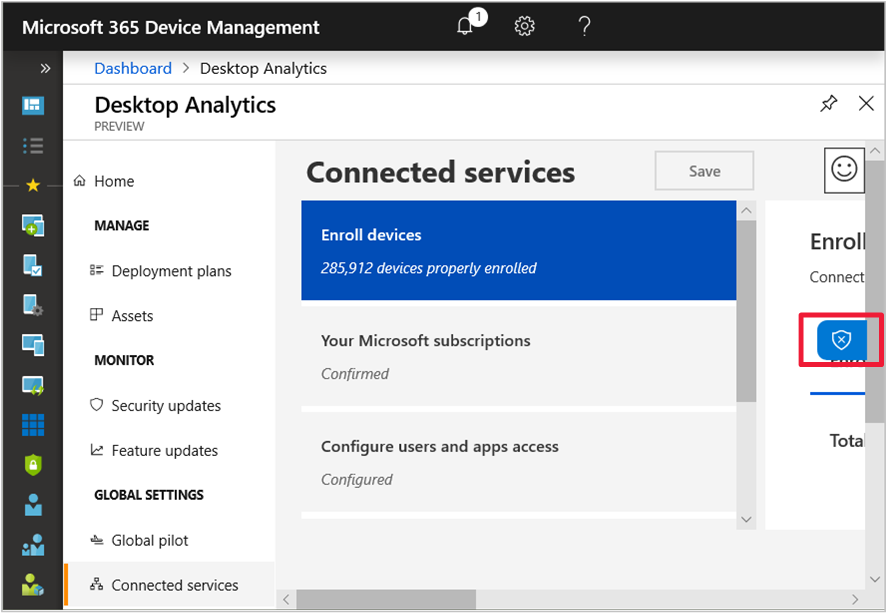
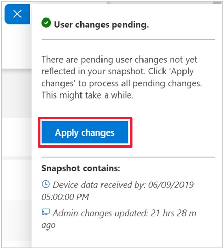

# Troubleshoot Desktop Analytics

Use the details in this article to help you troubleshoot issues with Desktop Analytics integrated with Configuration Manager.

## Confirm prerequisites

Many common issues are caused by missing prerequisites. First confirm the following configurations:

- [Prerequisites](overview.md#prerequisites)  

- [Windows component updates](enroll-devices.md#update-devices)  

- [How to enable data sharing](enable-data-sharing.md), which covers the following topics:  

  - Internet endpoints to which clients need to connect  

  - Proxy server authentication  

  - Diagnostic data levels  

## Monitor connection health

Use the **Connection Health** dashboard in Configuration Manager to drill down into categories by device health. In the Configuration Manager console, go to the **Software Library** workspace, expand the **Desktop Analytics Servicing** node, and select the **Connection Health** dashboard.  

For more information, see [Monitor connection health](monitor-connection-health.md).

> [!NOTE]
> The Configuration Manager connection to Desktop Analytics relies upon the service connection point. Any changes to this site system role may impact synchronization with the cloud service. For more information, see [About the service connection point](../core/servers/deploy/configure/about-the-service-connection-point.md#bkmk_move).

Starting in version 2002, if the Configuration Manager site fails to connect to required endpoints for a cloud service, it raises a critical status message ID 11488. When it can't connect to the service, the SMS_SERVICE_CONNECTOR component status changes to critical. View detailed status in the [Component Status](../core/servers/manage/use-status-system.md#monitor-the-status-system) node of the Configuration Manager console.<!-- 5566763 -->

## Log files

For more information, see [Log files for Desktop Analytics](../core/plan-design/hierarchy/log-files.md#desktop-analytics)

To help troubleshoot Desktop Analytics, use the **DesktopAnalyticsLogsCollector.ps1** tool from the Configuration Manager install directory. It runs some basic troubleshooting steps and collects the relevant logs into a single working directory. For more information, see [Logs collector](log-collector.md).

### Enable verbose logging

1. On the service connection point, go to the following registry key: `HKLM\Software\Microsoft\SMS\Tracing\SMS_SERVICE_CONNECTOR`  
2. Set the **LoggingLevel** value to `0`  

##  Azure AD applications

Desktop Analytics adds the following applications to your Azure AD:

- **Configuration Manager Microservice**: Connects Configuration Manager with Desktop Analytics. This app has no access requirements.  

- **MALogAnalyticsReader**: Monitors your Azure Log Analytics workspace to ensure the daily snapshot has been copied successfully. For more information, see [MALogAnalyticsReader application role](#bkmk_MALogAnalyticsReader).  

- **Desktop Analytics**: Enables Configuration Manager retrieval of deployment plan information and device readiness status from Desktop Analytics.

If you need to provision these apps after completing setup, go to the **Connected services** pane. Select **Configure users and apps access**, and provision the apps.  

- **Azure AD app for Configuration Manager**. If you need to provision or troubleshoot connection issues after completing setup, see [Create and import app for Configuration Manager](#create-and-import-app-for-configuration-manager). This app requires  **Write CM Collection Data** and **Read CM Collection Data** on the **Configuration Manager Service** API.  

    > [!NOTE]
    > Desktop Analytics supports multiple Configuration Manager hierarchies reporting to a single Azure AD tenant.<!-- 4814075 --> If you have multiple hierarchies in your environment configured with the same commercial ID, to share the Azure AD tenant and Desktop Analytics instance use [different apps](connect-configmgr.md#bkmk_connect) for each hierarchy.

### Create and import app for Configuration Manager

If you can't create the Azure AD app for Configuration Manager from the Configure Azure Services wizard, or if you want to reuse an existing app, you need to manually create and import it. After completing the [Initial onboarding](set-up.md#initial-onboarding) on the Desktop Analytics portal, use the following steps:

#### Create app in Azure AD

> [!TIP]
> During this process, you'll need to note several values to use later. Open an app like Windows Notepad to paste in the values that you'll copy from the Azure Portal.

1. Open the [Azure portal](https://portal.azure.com) as a user with *Global Admin* permissions, go to **Azure Active Directory**, and select **App registrations**. Then select **New registration**.

1. In the _Register an application_ pane, configure the following settings:

    - **Name**: A unique name that identifies the app, for example: `Desktop-Analytics-Connection`

    - **Supported account types**: Leave this setting as the default option, **Accounts in this organizational directory only**

    - **Redirect URI (optional)**: Leave this optional value blank.
  
    Select **Register** to create the app.

1. In the properties of the new app, copy the **Application (client) ID** and **Directory (tenant) ID**. The values are GUIDs that are used to configure the Configuration Manager connection.

1. In the menu of the app properties, select **Certificates & secrets**, then select **New client secret**.

    - **Description**: You can use any name for the secret or leave it blank.
    - **Expires**: Specify an expiration duration that meets your business requirements.

    Select **Add**. Immediately copy the client secret string **Value** and **Expires**. If you leave this pane, you can't retrieve the same secret again. You'll use these values later to configure the Configuration Manager connection.

    > [!TIP]
    > Take note of the expiration date and make sure to [Renew the secret key](../core/servers/deploy/configure/azure-services-wizard.md#bkmk_renew) before its expiration. Secret key expiration can cause an interruption in access to the service.

1. In the menu of the app properties, select **API permissions**.

    1. On the **API permissions** panel, select **Add a permission**.

    1. In the **Request API permissions** panel, switch to **APIs my organization uses**.

    1. Search for and select the **Configuration Manager Microservice** API.

    1. Select the **Application permissions** type. Expand **CmCollectionData**, and select both of the following permissions: **CMCollectionData.read** and **CMCollectionData.write**.  

    1. Select **Add permissions**.

1. On the **API permissions** panel, select **Grant admin consent for...**, and then select **Yes**.

#### Import app in Configuration Manager

1. In the Configuration Manager console, go to the **Administration** workspace, expand **Cloud Services**, and select the **Azure Services** node. Select **Configure Azure Services** in the ribbon.  

2. On the **Azure Services** page of the Azure Services Wizard, configure the following settings:  

    - Specify a **Name** for the object in Configuration Manager.  

    - Specify an optional **Description** to help you identify the service.  

    - Select **Desktop Analytics** from the list of available services.  
  
   Select **Next**.  

3. On the **App** page, select the appropriate **Azure environment**. Then select **Import** for the web app. Configure the following settings in the **Import Apps** window:  

    - **Azure AD Tenant Name**: This name is how it's named in Configuration Manager  

    - **Azure AD Tenant ID**: The **Directory ID** you copied from Azure AD  

    - **Client ID**: The **Application ID** you copied from the Azure AD app  

    - **Secret Key**: The key **Value** you copied from the Azure AD app  

    - **Secret Key Expiry**: The same expiration date of the key  

    - **App ID URI**: This setting should automatically populate with the following value: `https://cmmicrosvc.manage.microsoft.com/`  
  
   Select **Verify**, and then select **OK** to close the Import Apps window. Select **Next** on the App page of the Azure Services Wizard.  

To continue the rest of the wizard on the **Diagnostic Data** page, see [Connect to the service](connect-configmgr.md#bkmk_connect).

#### Troubleshoot app in Configuration Manager

If you're having problems creating or importing the app, first check **SMSAdminUI.log** for the specific error. Then check the following configurations:

- You've successfully enrolled the tenant to the Desktop Analytics service. For more information, see [How to set up Desktop Analytics](set-up.md).

- All required endpoints are accessible. For more information, see [Endpoints](enable-data-sharing.md#endpoints).

- Make sure the user who signs in has the correct permissions. For more information, see [Prerequisites](overview.md#prerequisites).

- Make sure that the user can sign in to Azure in general. This action determines if there are any general Azure AD authentication issues.

- Check status messages for the **SMS_SERVICE_CONNECTOR** component regarding the *Desktop Analytics worker*.

###  MALogAnalyticsReader application role

When you set up Desktop Analytics, you consent on behalf of your organization. This consent is to assign the MALogAnalyticsReader application the Log Analytics Reader role for the workspace. This application role is required by Desktop Analytics.

If there's a problem with this process during setup, use the following process to manually add this permission:

1. Go to the [Azure portal](https://portal.azure.com), and select **All resources**. Select the workspace of type **Log Analytics**.

1. In the workspace menu, select **Access control (IAM)**, select **Add**, and then select **Add role assignment**.

1. In the **Add role assignment** panel, configure the following settings:

    - **Role**: **Reader**

    - **Assign access to**: **User, group, or service principal**

    - **Select**: **MALogAnalyticsReader**

1. Select **Save**.

The portal shows a notification that it added the role assignment.

## Data latency

<!-- 3846531 -->
When you first setup Desktop Analytics, enroll new clients, or configure new deployment plans, the reports in Configuration Manager and the Desktop Analytics portal may not show complete data right away. It can take 2-3 days for the following steps to occur:

- Active devices send diagnostic data to the Desktop Analytics service
- The service processes the data
- The service synchronizes with your Configuration Manager site

When syncing device collections from your Configuration Manager hierarchy to Desktop Analytics, it can take up to one hour for those collections to appear in the Desktop Analytics portal. Similarly, when you create a deployment plan in Desktop Analytics, it can take up to one hour for the new collections associated with the deployment plan to appear in your Configuration Manager hierarchy. The primary sites create the collections, and the central administration site synchronizes with Desktop Analytics. Configuration Manager can take up to 24 hours to evaluate and update collection membership. To speed up this process, manually update the collection membership.<!-- 4984639 -->

> [!Note]
> For manual collection updates to reflect changes, the SMS_SERVICE_CONNECTOR_M365ADeploymentPlanWorker component first needs to synchronize. It can take up to one hour for this process to run. For more information, see the **M365ADeploymentPlanWorker.log**.

Within the Desktop Analytics portal, there are two types of data: **Administrator data** and **diagnostic data**:

- **Administrator data** refers to any changes you make to your workspace configuration. For example, when you change an asset's **Upgrade Decision** or **Importance** you're changing administrator data. These changes often have a compounding effect, as they can alter the readiness state of a device with the asset in question installed.

- **Diagnostic data** refers to the system metadata uploaded from client devices to Microsoft. This data powers Desktop Analytics. It includes attributes such as device inventory, and feature update status.

By default, all data in the Desktop Analytics portal is automatically refreshed daily. This refresh includes changes in diagnostics data from two days ago and any changes that you make to the configuration (administrator data). It should be visible in your Desktop Analytics portal by 08:00 AM UTC each day.

When you make changes to administrator data, you can trigger an on-demand refresh of the administrator data in your workspace. From any page in the Desktop Analytics portal, open the data currency flyout:

Then select **Apply changes**:

This process generally takes between 15-60 minutes. The timing depends on the size of your workspace and the scope of the changes that need processes. When you request an on-demand data refresh, it doesn't result in any changes to diagnostic data. This option isn't available during service deployments. For more information, see the [Desktop Analytics FAQ](faq.yml#can-i-reduce-the-amount-of-time-it-takes-for-data-to-refresh-in-my-desktop-analytics-portal-).

If you aren't seeing changes updated within the time frames indicated above, wait another 24 hours for the next daily refresh. If you see longer delays, check the service health dashboard. If the service reports as healthy, contact Microsoft support.<!-- 3896921 -->

## Service notifications

<!-- 4982509 -->

The Desktop Analytics portal can display notification banners to administrators. These notifications allow Microsoft to communicate with you about important events and issues. The following sections detail the notifications that you might see.

### See what's new this month in Desktop Analytics

This informational notification makes you aware of changes to the service. For more information, see [What's new in Desktop Analytics](whats-new.md) (`https://aka.ms/danews`).

### There are new prerequisites. To continue using Desktop Analytics, review the new requirements

This informational notification makes you aware of changes to the prerequisites. For example, a new internet endpoint or software update. For more information, see [Prerequisites](overview.md#prerequisites) (`https://aka.ms/daprereqs`).

### We're investigating an issue that impacts Desktop Analytics

This warning notification indicates that Microsoft is aware of an issue that impacts the Desktop Analytics service. The issue is typically with generating snapshots. When you see this notification, Microsoft is investigating the issue to determine the scope and source of impact. You don't need to contact Microsoft Support. For more information, see [Data flow](privacy.md#data-flow).

### We're investigating an issue with data latency. If you enrolled new devices or changed any assets in the last 24 hours, they may not appear right away

This warning notification indicates that Microsoft is aware of an issue that impacts the Desktop Analytics service. Microsoft continuously monitors the service to confirm that all components update snapshots at the correct times. During this monitoring, one of these components didn't complete as expected. When you see this notification, Microsoft is investigating the issue. You don't need to contact Microsoft Support. For more information, see [Data flow](privacy.md#data-flow).

If you recently [enrolled devices](enroll-devices.md) or changed [assets](about-assets.md), wait until Microsoft resolves the issue. You don't need to repeat any actions.

### We've resolved a temporary issue with data latency. Daily refresh of portal data is delayed

This notification lets you know that there was an issue with data latency. The service is still processing the snapshot, and the refresh of data is delayed. For more information, see [Data latency](#data-latency).

### We've resolved an issue with data latency. If you enrolled new devices or changed any assets in the last 24 hours, they may not appear right away

This notification lets you know that Microsoft resolved a previously reported issue with data latency. You may see stale data for tomorrow's snapshot. If you [enrolled devices](enroll-devices.md) or made device configuration changes in the last 24 hours, you won't see them right away in the portal. You can continue to use Desktop Analytics to categorize [assets](about-assets.md) and prepare [deployment plans](about-deployment-plans.md). These actions can use data from the previous snapshot.

### We've resolved an issue with Desktop Analytics. Daily refresh of the portal data is on track

This notification lets you know that Microsoft identified a snapshot component that stopped working during processing. Microsoft restarted the component, which will take time to process the snapshot. Microsoft continuously monitors the service to confirm that all components update snapshots at the correct times.
