# Application approval process

One of the important scenarios for application management is providing a controlled installation and uninstallation process for software that requires approval. To reduce the overall load on the Configuration Manager infrastructure and improve performance, the workflow doesn't require creating individual collections to manage installations and uninstallations for each application.

## Scenario 1: Applications must be approved before they're installed

The IT administrator at Contoso uses Software Center to make software available to the users. These applications must be approved before they're installed. The admin deploys an application to all users and configures it to require approval.

The user browses the list of applications in Software Center but can't install the application until the request is approved. The user submits the request from Software Center and specifies the reason for the request. If the option, **Approve application requests for users per device** is enabled, the user has to request approval from every device where they want to install the application. The admin then approves or denies the request for each of the user's devices where requests were made.

> [!NOTE]
> Configuration Manager doesn't enable this feature by default. Before using it, enable the optional feature **Approve application requests for users per device**. For more information, see [Enable optional features from updates](../../core/servers/manage/optional-features.md).

Software Center requires the user to submit the request for the application from their device. The user sees this message in Software Center:

[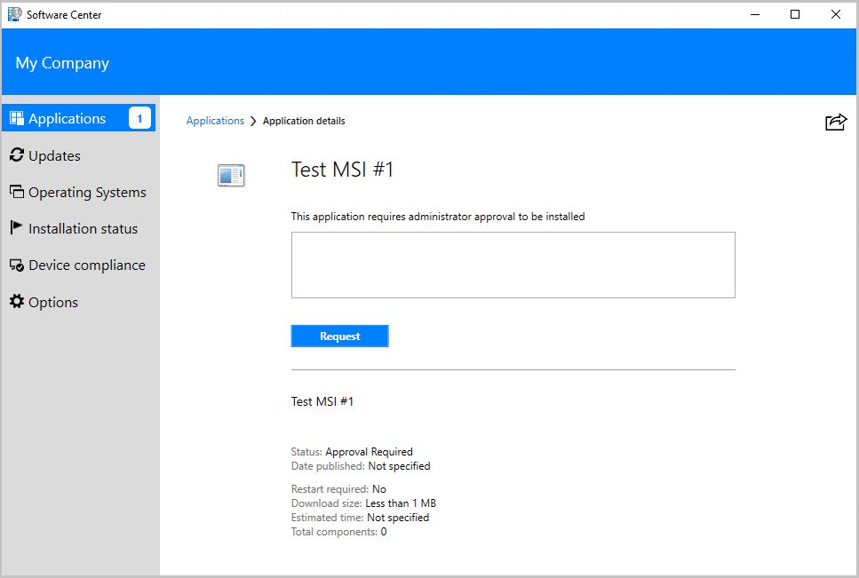](media/user-requests-approval-software-center.png#lightbox)

The user specifies why they want the application and submits the approval request:

[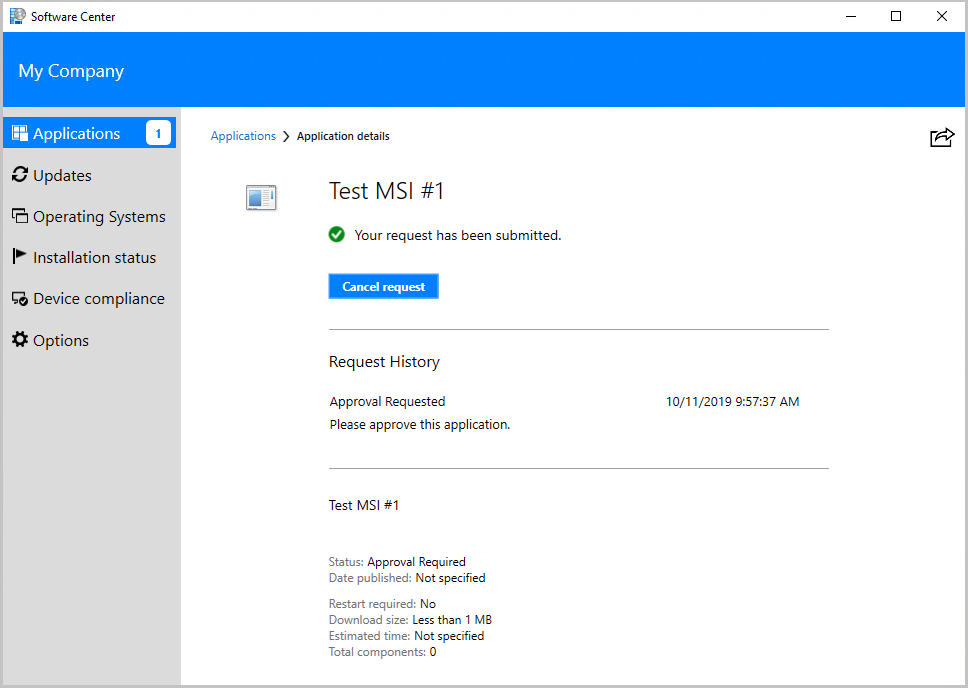](media/user-request-submitted-software-center.png#lightbox)

Once the admin approves the request, the user can install the application on their device. If the user takes no action, the application is automatically installed for the user during non-business hours.

[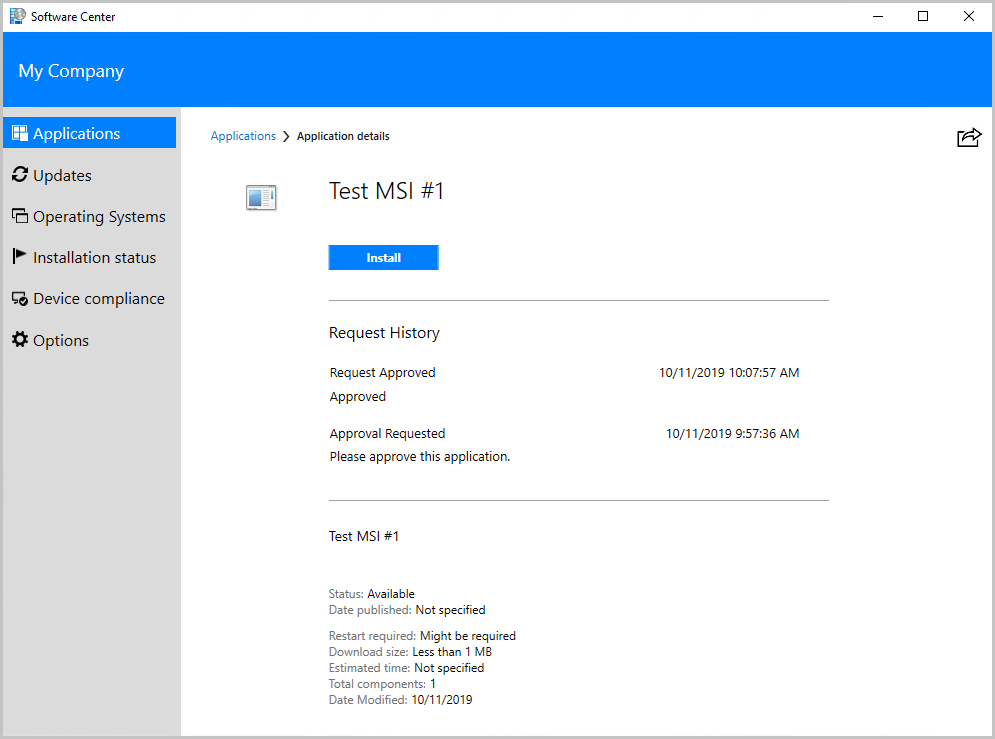](media/users-request-approved-software-center.png#lightbox)

## Scenario 2: Integrate an application approval system

The Northwind Traders has an existing application approval system, and the admin wants to integrate the approval system with Configuration Manager.

The admin deploys an application to all users and configures it to require approval. Then, the admin enables the Software Center client setting to **Hide unapproved applications in Software Center**.

[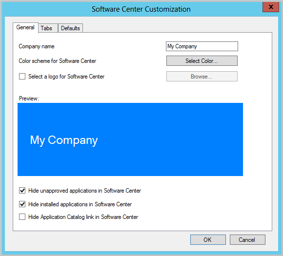](media/admin-hides-unapproved-applications.png#lightbox)

With this option, the user doesn't see the application in Software Center until the application request is approved for installation on the device. When approval is granted via the organization's approval system, the orchestration system can make an approved request for the user and their device in Configuration Manager. The orchestration systems used the `CreateApprovedRequest` WMI method in Configuration Manager. This method then uses the existing Configuration Manager application deployment mechanism. It doesn't modify collection memberships, and it takes effect immediately. The application is now available to the user in Software Center.

The admin can also configure the automation to automatically install the application on the user's device. No other users will see the application as available in Software Center until the approval is granted. This solution provides per-user and per-device control of the software without the need to create separate collections.

The WMI method `CreateApprovedRequest` in the `SMS_UserApplicationRequest` class has the following input parameters:

### Required parameters

- `ClientGUID` - Unique identifier of the client
- `Username` - Unique username of the user
- `ApplicationID` - Model name of the application

The ApplicationID is the ModelName property of the SMS_Application instance. This value is the unique ID of the application without the version. For example, `ScopeId_21A9ED3B-D8C6-49DC-87A6-01F296182F14/Application_40243740-01f2-48db-abf0-c95259986d94`.

### Optional parameters

- `Comments` - Comments for the approved request to be displayed in the Software Center. By default, it specifies an empty string.
- `AutoInstall` - Install the application immediately after the request is approved. By default, this parameter is true.

    > [!NOTE]
    > In version 2006 and earlier, you could only call this method once for a specific app. Starting in version 2010, you can call this method more than once. If the **AutoInstall** parameter is `$true`, the client tries to install the app again.<!-- 7353824 -->

The following code sample is a Windows PowerShell script that shows how to invoke the WMI method for a specific user, machine, and application:

```powershell
$machinename = $args[0]
$username = $args[1]
$appid = $args[2]
$autoInstall = $args[3]
$comments = $args[4]

$scObj=Get-WmiObject -Namespace root\sms -Query 'select SiteCode from sms_providerlocation'
$sitecode = $scObj.SiteCode
$namespace ="root\sms\site_" + $sitecode
$machine = Get-WmiObject -Namespace $namespace -Query "SELECT * FROM SMS_R_SYSTEM WHERE Name = '$machinename'"
$clientGuid = $machine.SMSUniqueIdentifier
Invoke-WmiMethod -Path "SMS_UserApplicationRequest" -Namespace $namespace -Name CreateApprovedRequest -ArgumentList @($appid, $autoInstall, $clientGuid, $comments, $username)
```

The following command line runs the sample script:

```powershell
.\CreateApprovedRequest.ps1 "MachineName" "Domain\User" "ScopeId_2E4DAE44-C9A0-4694-8B7A-474424C080D4/Application_88808a3a-86e4-4820-be59-aa7d61cb8c33 "true" "Application has been approved"
```

The admin can still see the approved requests in the Configuration Manager console from **Software Library** > **Application Management** > **Approval Requests**.

[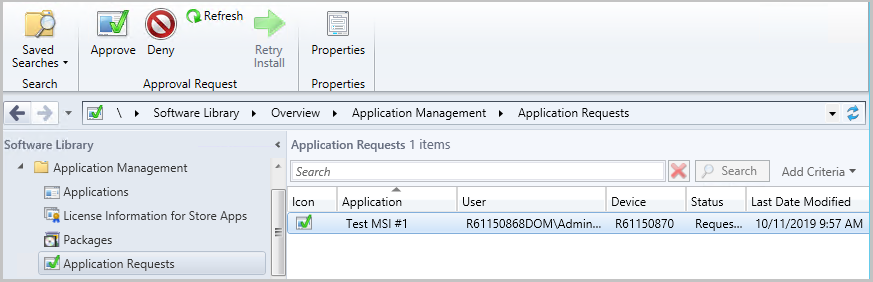](media/approval-requests-console.png#lightbox)

### Limitations

The current version of this application approval WMI method has the following limitations:

1. The `CreateApprovedRequest` method can be called only once for a unique machine ID, application ID, and username combination. It returns an error if the method is called with the same parameters more than once. The details about this error are in `SMSProv.log`.
1. To enable the automatic install of the application, deploy the application to a collection of users or user groups before calling the WMI method. If you create the deployment after calling the WMI method, the application is made available to the user for install and won't be automatically installed.

## Scenario 3: Revoke application approval

If the admin revokes the approval, or the application is no longer in use, uninstall the application.

The admin revokes the approval of the application using the Configuration Manager console, a PowerShell script, or WMI. Even if the application was already approved, the admin can use the Deny option. Revoking the approval prevents the user from installing the application on their device. The same action also causes uninstallation of the application on the user's device if the application was previously installed.

Learn more about the [Deny-CMApprovalRequest](/powershell/module/configurationmanager/Deny-CMApprovalRequest) cmdlet.

### Prerequisites to revoke app approvals

1. Set the [Select these new settings to specify company information](../../core/clients/deploy/about-client-settings.md#software-center) client setting to **Yes**.
1. Enable the optional feature **Approve application requests for users per device**. For more information, see [Enable optional features from updates](../../core/servers/manage/optional-features.md).

## Scenario 4: Machine-based pre-approved requests

 You can use the `CreateApprovedRequest` API to create a pre-approved request for a device with no user required. This action allows you to install and uninstall applications in real time.  Currently this functionality is only available in the SDK. For machine-based pre-approved requests to work, you must also enable the optional feature **Approve application requests for users per device**. For more information, see [Enable optional features from updates](../../core/servers/manage/optional-features.md).

Administrators can create a machine-available deployment that requires approval using the [New-CMApplicationDeployment](/powershell/module/configurationmanager/new-cmapplicationdeployment) cmdlet. Here's an example:

```powershell
New-CMApplicationDeployment -CollectionName "All Systems" -Name "Test app" -DeployAction Install -DeployPurpose Available -ApprovalRequired $true -DistributionPointName 'DistributionPoint.domain.com" -DistributeContent
```

A deployment created with the `requires approval` flag set to `true` stays on the server and can be used with larger collections. The user-request flow isn't yet available for machine-targeted deployments that require approval. So, the application isn't visible in Software Center until you create a pre-approved request to the individual device.

The following Windows PowerShell sample script shows how to invoke the WMI method for a machine and application to create a pre-approved request:

```powershell
$machinename = $args[0]
$appid = $args[1]
$autoInstall = $args[2]
$comments = $args[3]

$scObj=Get-WmiObject -Namespace root\sms -Query 'select SiteCode from sms_providerlocation'
$sitecode = $scObj.SiteCode
$namespace ="root\sms\site_" + $sitecode
$machine = Get-WmiObject -Namespace $namespace -Query "SELECT * FROM SMS_R_SYSTEM WHERE Name = '$machinename'"
$clientGuid = $machine.SMSUniqueIdentifier
Invoke-WmiMethod -Path "SMS_ApplicationRequest" -Namespace $namespace -Name CreateApprovedRequest -ArgumentList @($appid, $autoInstall, $clientGuid, $comments)
```

The following command line runs the sample script:

```powershell
.\CreateApprovedRequestForMachine.ps1 "MachineName" "ScopeId_2E4DAE44-C9A0-4694-8B7A-474424C080D4/Application_88808a3a-86e4-4820-be59-aa7d61cb8c33 "true" "Application has been approved"
```

Setting the `autoInstall` parameter to `false` has no effect in Configuration Manger for machine-based pre-approved request. As soon as the pre-approved request is created on the site, the device will attempt to install the application. You can deny the approval request to remove the application from the device.

[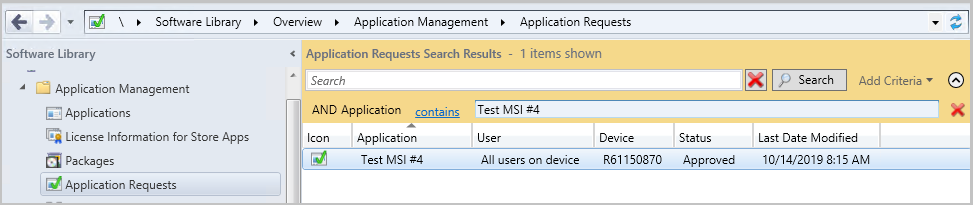](media/approved-for-device-console.png#lightbox)

## Scenario 5: Reapprove a previously denied application request

You can reapprove an application request that was previously denied. Reapproval is available only through the SDK API. The following PowerShell sample script demonstrates approving a request after it has been denied:

```powershell
$machinename = $args[0]
$username = $args[1]
$appid = $args[2]

$scObj=Get-WmiObject -Namespace root\sms -Query 'select SiteCode from sms_providerlocation'
$sitecode = $scObj.SiteCode
$namespace ="root\sms\site_" + $sitecode
$reqObj = Get-WmiObject -Namespace $namespace -Class SMS_UserApplicationRequest | Where {$_.ModelName -eq $appid -and $_.RequestedMachine -eq $machinename -and $_.User -eq $username }
$reqObjPath = $reqObj.__PATH
Invoke-WmiMethod -Path $reqObjPath -Name Approve
```

The following command line runs the sample script:

```powershell
.\ReapproveRequest.ps1 "MachineName" "DomainName\Username" "ScopeId_2E4DAE44-C9A0-4694-8B7A-474424C080D4/Application_88808a3a-86e4-4820-be59-aa7d61cb8c33"
```

## Scenario 6: Email notifications for application approval requests

Administrators can configure email notifications for application approval requests. You can specify application approvers during the application deployment. All approvers receive an email notification when a user requests an application and can approve or deny the request using the links provided in the email. You can also configure the cloud management gateway to enable approving application requests outside of the internal network.

### Prerequisites for email notifications

- Starting in version 2107, the SMS Provider requires .NET version 4.6.2, and version 4.8 is recommended.<!--10402814--> In version 2103 and earlier, this role requires .NET 4.5 or later. For more information, [Site and site system prerequisites](../../core/plan-design/configs/site-and-site-system-prerequisites.md#net-version-requirements).

- Enable the optional feature **Approve application requests for users per device**. For more information, see [Enable optional features from updates](../../core/servers/manage/optional-features.md).

- If PKI certificate infrastructure isn't set up, enable [Enhanced HTTP](../../core/plan-design/hierarchy/enhanced-http.md).

   > [!NOTE]
   > The configuration for Enhanced HTTP is per primary site. If you enable it on _any_ of the primary sites in a hierarchy, then Configuration Manager uses self-signed certificates on all providers. This behavior includes the CAS and other primary sites.

### Configure email notifications

1. In the Configuration Manager console, go to **Administration** > **Site Configuration** -> **Sites**.
1. Select the top-level site in your hierarchy and select **Configure Site Components** in the ribbon.
1. Select **Email Notification** to open the **Properties** dialog.
1. Check **Enable email notification for alerts** and specify the port of your SMTP server. If you're using Microsoft 365, you can use the [Microsoft 365 SMTP server](/Exchange/mail-flow-best-practices/how-to-set-up-a-multifunction-device-or-application-to-send-email-using-microsoft-365-or-office-365).
1. Enter the FQDN or IP address of the SMTP server.
1. Select to **Specify an account**, select **Set**, then select **New Account**.
1. Provide a username and password for the new account and click **OK**.
1. Enter the **Sender address for email alerts**.
1. Click **Apply**.
1. You can test the SMTP server by sending an email sample. Select **Test SMTP Server** in the Email Notification Properties dialog.
   - Review errors in `NotiCtlr.log`.
   - It's recommended to configure SSL with a PKI certificate on the SMS Provider to successfully approve or deny the request in the internal network when cloud management gateway isn't set up. Otherwise, you'll see the page containing the warning "There is a problem with this security certificate".

[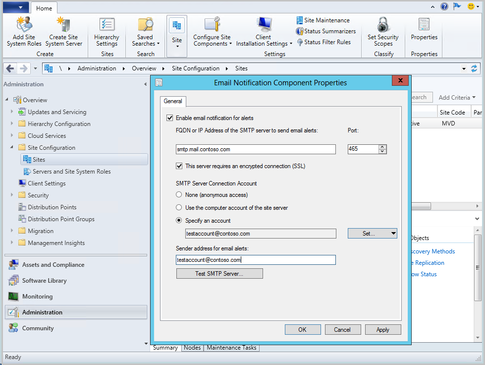](media/email-notification-component-properties.png#lightbox)

### Approve application requests outside of the internal network

To approve application requests outside of the internal network, additional settings are required:

1. Enable Allow Configuration Manager cloud management gateway traffic in **Administration** > **Site Configuration** > **Servers and Site Systems Roles** > **SMS Provider** > **Properties**.
1. Configure the [cloud management gateway](../../core/clients/manage/cmg/overview.md).
1. Enable [Azure AD User Discovery](../../core/servers/deploy/configure/configure-discovery-methods.md#azureaadisc).
1. Configure the following settings for this native app (client app) in Azure AD. These settings should be configured manually in the [Azure portal](https://portal.azure.com/).
   - **Redirect URI**: `https://<CMG FQDN>/CCM_Proxy_ServerAuth/ImplicitAuth`. Use the fully qualified domain name of the cloud management gateway (CMG) service, for example, GraniteFalls.Contoso.com.
    [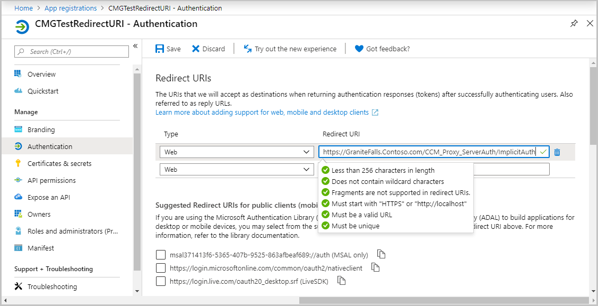](media/client-app-redirect-uri.png#lightbox)
  
   - **Manifest**: Set **oauth2AllowImplicitFlow** to **true**. For example: `"oauth2AllowImplicitFlow": true,`
    [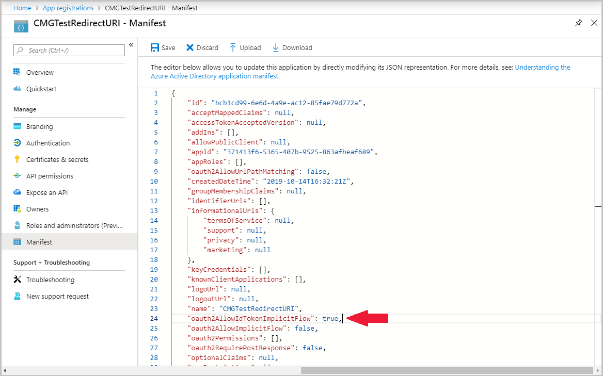](media/client-app-manifest.png#lightbox)

### Test the email approval process

Let's walk through the end-to-end scenario:

1. You deploy an application as available to a user collection. On the **Deployment Settings** page, enable it for approval. Also, you enter a few email addresses to receive notification about application requests.

    [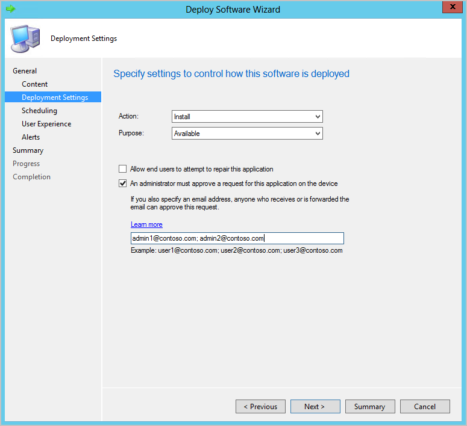](media/approval-email-specify-admins.png#lightbox)

1. The user sees the new application in Software Center and sends the request for it. The site sends the email notification within five minutes to the addresses specified in the application deployment.

    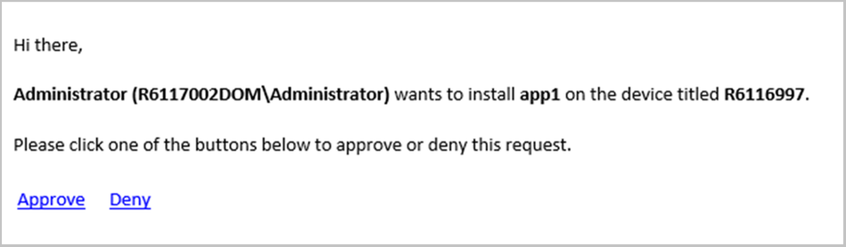

1. An email receiver chooses **Approve** or **Deny**. A success message is shown in the browser if the site successfully processed the application request.

   - If an application request is approved or denied via email, the links expire and can't be used by anyone else.

### Known issues

1. A 404 error is shown after `Approve` or `Deny` links clicked.
   - There isn't a certificate bound to the Admin Service. Check if the Configuration Manager-generated certificates feature is enabled. Otherwise, set up your own PKI certificates infrastructure.
   - Check `SMS_REST_PROVIDER.log` for any errors.
1. `There is a problem with this security certificate` warning after `Approve` or `Deny` links are clicked.
   - Configuration Manager-generated certificate isn't trusted by the web browser on the client. It's recommended to set up PKI certificates infrastructure when links are used in the internal network.
1. `Service is unavailable, HTTP Error 503` message.
   - Check if the Admin Service is running. On a provider machine, go to **Task Manager** > **Details**. Make sure there's an active process called `sccmprovidergraph.exe`
   - Open the Configuration Manager Console, **Administration** > **Site Configuration** > **Servers and Site Systems Roles** > **SMS Provider**.  Right click on **Properties**. Make sure that `Allow Configuration Manager cloud management gateway traffic.` is checked when email approval feature is intended to use with Cloud Management Gateway; and not checked when the feature is used to approve or deny requests in the internal network.
1. Links to approve or deny request through Cloud Management Gateway don't work.
   - Verify that Azure AD User Discovery is enabled.
   - Make sure that e-mail address specified during application deployment belongs to your organization.
1. Email isn't sent when a user requested an application.
   - Verify the email address is correct.
   - Make sure email notifications for alerts are configured.
   - Check `NotiCtrl.log` for errors.
1. Error in the **Create Application Deployment** wizard.
   - Make sure you have rights to create a subscription. The subscription will be automatically created during application deployment.
