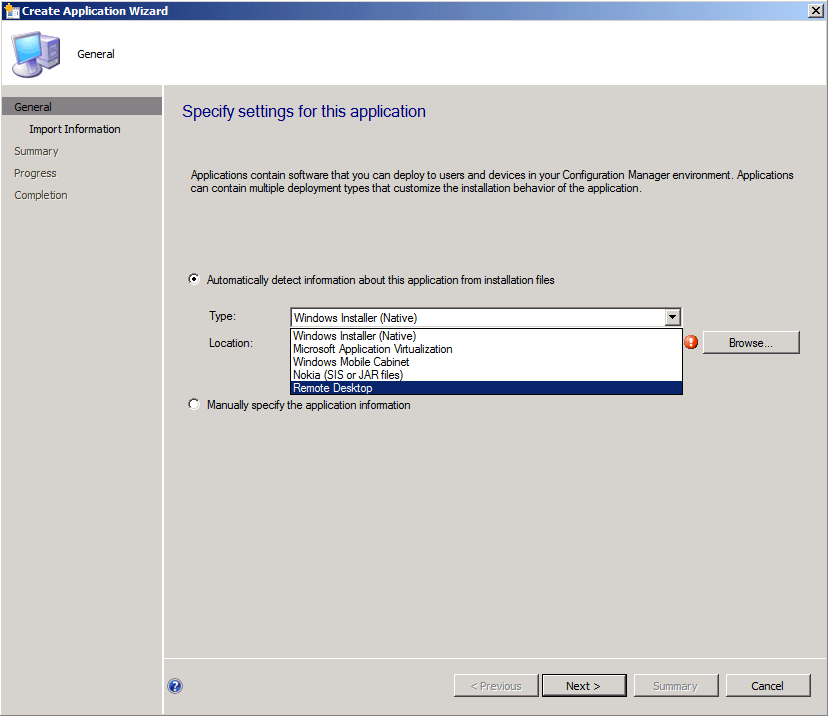

# Verifying the Application Management Extension
## Server  

#### Verify the new Deployment Type is available in the console  

1.  In the Configuration Manager console, click **Software Library**.  

2.  In the **Software Library** workspace, expand **Application Management**, and then click **Applications**.  

3.  On the **Home** tab, in the **Create** group, click **Create Application**.  

4.  In the **Type** field, verify that the new deployment type is available in the pull-down menu.  

     The image below shows an example from the RDP sample project.  

       

> [!TIP]
> For more information on using the Create Application Wizard, see [Create applications](../../apps/deploy-use/create-applications.md).  

#### Create an application using the Create Application Wizard  

1.  In the Configuration Manager console, click **Software Library**.  

2.  In the **Software Library** workspace, expand **Application Management**, and then click **Applications**.  

3.  On the **Home** tab, in the **Create** group, click **Create Application**.  

4.  In the **Type** field, select the new deployment type from the pull-down menu.  

5.  Continue through the wizard until successful completion.  

> [!TIP]
> For more information on using the Create Application Wizard, see [Create applications](../../apps/deploy-use/create-applications.md).  

#### Create a deployment type using the Create Deployment Type Wizard  

1.  In the Configuration Manager console, click **Software Library**.  

2.  In the **Software Library** workspace, expand **Application Management**, and then click **Applications**.  

3.  Select an application and then, on the **Home** tab, in the **Application** group, click **Create Deployment Type** to create a new deployment type for this application.  

4.  In the **Type** field, select the new deployment type from the pull-down menu.  

5.  Continue through the wizard until successful completion.  

> [!TIP]
> For more information on using the Create Application Wizard, see [Create applications](../../apps/deploy-use/create-applications.md).  

#### Check the Deployment Type Properties  

1.  In the Configuration Manager console, click **Software Library**.  

2.  In the **Software Library** workspace, expand **Application Management**, and then click **Applications**.  

3.  Select an application and then select the **Deployment Type** tab, in the **Summary** group.  

4.  Select a deployment type and then select the **Deployment Type** tab, and then click **Properties** in the **Properties** group to display the deployment type properties.  

#### Verify the corresponding SMS_Application instance was created for the application  

1.  Load Windows Management Instrumentation Tester (WBEMTEST.EXE).  

2.  Connect to the root\sms\site_\<*sitecode*> namespace.  

3.  Click **Query**, and then enter the below query:  

    ```  
    SELECT * FROM SMS_Application WHERE LocalizedDisplayName = '<NameofApplication>'  
    ```  

4.  The results should appear similar to the below list:  

     SMS_Application.CI_ID=\<*Number*>  

#### Verify the digest associated with the Deployment Type contains the properties from the new technology  

1.  Connect to the CM_\<*sitecode*> database.  

2.  Load Microsoft SQL Server Management Studio, and click **New Query**.  

3.  Enter the below SQL query:  

    ```  
    SELECT SDMPackageDigest   
    FROM CI_ConfigurationItems ci  
    JOIN CI_LocalizedProperties lp ON (lp.CI_ID = ci.CI_ID)   
    WHERE ci.CIType_ID = 21 AND lp.DisplayName = '<NameofApplication>'  
    ```  

4.  The results should appear similar to the below list:  

```text
     <AppMgmtDigest xmlns="http://schemas.microsoft.com/SystemCenterConfigurationManager/...
```

5.  Double-click the result value to view the digest.  

## Client  

#### Deploy application to client using the corresponding Deployment Type  

1.  In the Configuration Manager console, click **Software Library**.  

2.  In the **Software Library** workspace, expand **Application Management**, and then click **Applications**.  

3.  In the **Applications** list, right-click the application you want to deploy and click **Deploy**.  

4.  Continue through the wizard until successful completion.  

#### Force user and device policy to be retrieved on the client  

1.  On the client, in **Control Panel**, double-click the Configuration Manager icon, and then select the **Actions** tab.  

2.  Select **Machine Policy Retrieval & Evaluation Cycle**, and then click **Run Now**.  

3.  Select **User Policy Retrieval & Evaluation Cycle**, and then click **Run Now**.  

#### Verify that synclets are distributed and compiled on the client (they will be stored in root\ccm\cimodels namespace)  

1. Load Windows Management Instrumentation Tester (WBEMTEST.EXE).  

2. Connect to the root\ccm\cimodels namespace.  

3. Click **Query**, and then enter the below query:  

   ```  
   select * from ccm_handlersynclet  
   ```  

4. The results should appear similar to the below list:  

    \<*Technology*>*Detect_Synclet.ActionType="Detect",AppDeliveryTypeId="ScopeId\\* ...

    \<*Technology*>*Install_Synclet.ActionType="Install" ,AppDeliveryTypeId="ScopeId\\* ...

    \<*Technology*>_Uninstall_Synclet.ActionType="Uninstall" ,AppDeliveryTypeId="ScopeId_ ...

#### Ensure that each action performs as expected on the client  

1.  Verify that the deployment action performs correctly.  

> [!NOTE]
>  The deployment settings will impact validation of each action on the client.  
> 
> - **Available** - If the application is deployed to a user, the user sees the published application in the Application Catalog and can request it on demand. If the application is deployed to a device, the user will see it in the Software Center and can install it on demand.  
>   -   **Required** - The application is deployed automatically, according to the configured schedule. However, a user can track the application deployment status and install the application before the deadline by using the Software Center.  

## See Also  
 [Configuration Manager Reference](../../develop/reference/configuration-manager-reference.md)
